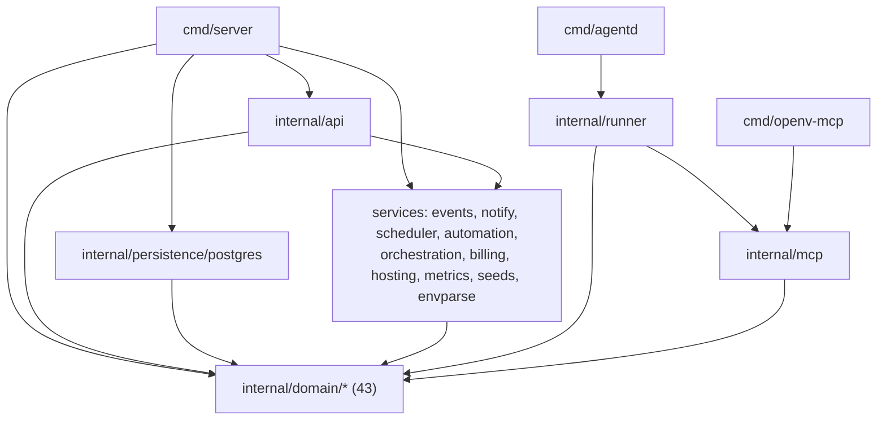

# OpenV Architecture

How the code is laid out today and how a request, a run and a deployment
move through it. The package graph below is the one `go list` and the
architecture tests see (`internal/archtest`, whose `ratchets.json` freezes
every import edge); the areas are those of the area index,
[`areas.json`](areas.json). Where this page and the code disagree, the code
wins: the archtest, the route goldens and the boot goldens are what a pull
request is held to. How the code is changing, and why, is the refactor plan,
[`plans/codebase-refactor.md`](plans/codebase-refactor.md).

## System at a glance

```
 Browser ── React SPA (frontend/, served by nginx; /api/ proxied to the API)
    │  HTTP, session cookie + X-Org-ID     ▲ SSE: notifications, run logs,
    ▼                                      │ guided chat, interviews
 cmd/server ── one gorilla/mux router, one middleware chain
    │          internal/api: area handler files, authz, respond/httperr
    ▼
 internal/domain/* ── services and their repository interfaces
    ▼
 internal/persistence/postgres ── repositories, numbered migrations
    ▼
 PostgreSQL (pg_trgm, optional pgvector)   UPLOADS_DIR (attachment files)

 Agent work: a run is a row in agent_runs. The server never calls a model
 provider. A runner, cmd/agentd (internal/runner), polls the queue over
 HTTP with a runner key, runs the operator's vendor CLI (Claude Code, Codex,
 Gemini, Antigravity) and hands it cmd/openv-mcp, whose tools (internal/mcp)
 call the API back with the run's token. Runners run on a member's machine
 (the Agent Connector, cmd/openv-connector), in a hosted container the API
 provisions over Docker (internal/hosting), or as a leased node of the
 transient pool.
```

## Programs

| Package | Program | What it is |
|---|---|---|
| `cmd/server` | API server | The HTTP API, background loops and the release announcer, in one process. |
| `cmd/agentd` | runner | Polls for runs and runs the vendor CLIs; also a pool node (`-pool-key`). |
| `cmd/openv-mcp` | MCP server | The tools an agent calls, over stdio; authenticates with a run token or a runner key. |
| `cmd/openv-connector` | Agent Connector | A member's one-file runner: pairs with the app and starts `agentd`. |
| `cmd/openv-vapid` | key tool | Makes a web push VAPID key pair. |
| `.` (`release_notes.go`) | – | Embeds `RELEASE_NOTES.md`, which the server announces. |

Every environment variable these read is in [env-vars.md](env-vars.md).

## Areas

The area index gives every tracked file one of twelve areas, a slice of the
product through every layer; `go run ./internal/tools/areas which <path>`
answers for a path, and `internal/tools/areas` and
`frontend/src/arch/areas.test.ts` keep the index complete.

| Area | Holds |
|---|---|
| `requirements-core` | projects, artifacts, links and link rules, attributes, quality rules, reference parties, product profile, notes and mentions, the board, search and duplicates |
| `verification` | verification methods, test runs and results, coverage and gaps, the matrix, change impact, evidence bundles |
| `documents` | exports and imports, downloads, PDF, Word and V&V reports, baselines and their comparison, templates, attachments and figures |
| `tenancy-identity` | accounts, sign-in, sessions, verification and resets, workspaces, members, people-teams, invitations, plan limits, project access, `authz.go` |
| `agent-suite` | agents, runs and orchestration, crews, automations, proposals, providers, repository connections, the guided wizard, interviews, the AI map, the MCP server's core |
| `runner-fleet` | the runner and its worker protocol, runner keys, hosted runners, the transient pool, the Agent Connector |
| `events-notifications` | the event bus and domain events, the activity log, the SSE hub, notifications by app, mail and web push, announcements |
| `community` | share links, the open-source showcase, the community pool of demo products |
| `billing` | the billing service, its Stripe client, prices, checkout, seats, reconciliation |
| `platform-http` | the composition root, the router, handler deps, HTTP plumbing, health, the database connection and migration ledger, env parsing, metrics, the release and feature gates |
| `frontend-shell` | `App.tsx`, the API client barrel, state, hooks, the UI kit, navigation, the public site and manual, the test mock, the build and nginx files |
| `tooling` | scripts, CI and release workflows, Dockerfiles, the refactor tools and architecture guards, repository docs |

## Backend packages

74 packages: the five programs, the root package, 43 domain packages, the
API, the persistence layer, 11 service packages, the runner and the MCP
package, and the tools and guards
(`internal/tools/*`, `internal/archtest`, `internal/vocabparity`), which
ship nothing. Their production imports are 233 edges, every one listed in
`internal/archtest/ratchets.json` (`import_edges`), so a new one is a
decision made in review.



The layering (K7), which `internal/archtest` enforces on every pull request:

- a package under `internal/domain` imports only other domain packages
  (and the types-only leaves, of which there are none yet), so no domain
  rule depends on the API, the database code or the composition root;
- `internal/persistence/postgres` imports only the domain;
- `internal/api` never imports the persistence layer;
- the client programs link as little of the domain as they can: `agentd`
  links eight domain packages, `openv-mcp` one (`artifacts`), and the
  connector and the VAPID tool none (`client_domain_deps`).

A domain package declares what it needs as an interface, a port, and
`cmd/server` wires the implementation (as `artifacts` does with
`LinkSuspector`, which `links` implements).

| Layer | Packages | Role |
|---|---|---|
| Composition root | `cmd/server` | builds everything, in a fixed order, and serves |
| API | `internal/api` | routes, middleware, authorization, request and response shapes |
| Domain | `internal/domain/*` | entities, rules, `Service` and `Repository` interfaces, mostly a `DefaultService` each |
| Persistence | `internal/persistence/postgres` | one repository per aggregate, the schema and its migrations |
| Services | `internal/events` (the bus), `notify` (mail, push, announcements, the stable scheduler), `scheduler` (cron automations), `automation` (event triggers), `orchestration` (crew hooks), `billing` and `billing/stripe`, `hosting` (Docker provisioner), `metrics`, `seeds`, `envparse` (how a setting is read) | the work that is not a request |
| Agent execution | `internal/runner`, `internal/mcp` | the runner's adapters, pool and worker client; the MCP tool table and its API client |

### Composition root: `cmd/server`

`main()` (`main.go`, about 60 lines) creates one `app` (`app.go`), whose
fields are the values more than one stage shares, and calls the stages in a
fixed order, then serves until a signal and drains for up to 15 seconds.
Each stage is a method in a `wire_*.go` file and wires one concern:

| Stage | File | Wires |
|---|---|---|
| `signals`, `config` | `wire_config.go` | the signal context; the database URL, port and directories, `WORKER_API_KEY`, the plan and limit settings |
| `connect`, `storage` | `wire_storage.go` | the pool (whose close `main` defers); `MigrateAndBackfill` under the boot lock; every repository and the event bus |
| `core` | `wire_core.go` | artifacts, links, embeddings, projects, attachments, baselines, chatter, exports, reports, downloads, templates |
| `workspace`, `runners` | `wire_workspace.go` | users, members, workspaces and the tiers, invitations, runner keys, hosted runners, the transient pool; the legacy key |
| `projects` | `wire_projects.go` | attributes, V&V and evidence, work items, the product profile, project settings, guided sessions, interviews, share links, the community pool |
| `agents` | `wire_agents.go` | agents, runs and their retry policy, automations, repository connections, providers and their sign-ins, crews, proposals |
| `realtime` | `wire_realtime.go` | the metrics collector, the SSE hub and the orchestration hooks, subscribed to runs and the bus |
| `notify`, `release` | `wire_notify.go` | mail, sign-up verification, the session and registration policies, notifications, web push, the minutes monitor; the running release, its announcer and the stable scheduler |
| `jobs` | `wire_jobs.go` | the budget guard, trigger matcher, scheduler, workspace purge and reaper loops |
| `sso` | `wire_sso.go` | Google and OIDC sign-in |
| `billing`, `handlers`, `server` | `wire_http.go` | billing; `api.NewHandler` with every dependency, the proposal appliers; the HTTP server |

Beside them: `config.go` holds the env getters, `http.go` builds the
middleware chain (`buildHTTPHandler`) and the server, `jobs.go` the reaper,
purge and hosted-runner reconcile loops, `lookups.go` the closures that join
two domains (a project's workspace, the budget guard), and `logging.go` the
log setup. `cmd/server/testdata/boot_steps.txt` (S4) pins the order of
every call `main()` makes; new wiring goes in the stage that owns its
concern.

### API layer: `internal/api`

- `handlers.go` holds only the dependencies: `HandlerDeps`, `Handler` and
  `NewHandler`, which builds the rate limiters and reads the per-request
  settings once at boot.
- `routes.go` is `RegisterRoutes`, the ordered list of registrar calls.
  gorilla/mux serves the first route that matches, so that order is the
  contract, pinned by `testdata/route_handlers.txt`; `agent_handlers.go`,
  `org_handlers.go` and `suite_handlers.go` hold only the ordered
  sub-registrar lists of their surfaces.
- 70 area files, `<area>_handlers.go`, each with its `register<Area>Routes`
  and its handlers: 19 for requirements-core, 17 for agent-suite (with
  `proposal_appliers.go`, `ai_map.go` and the guided outline), 19 for
  tenancy-identity (with `authz.go`, `authmiddleware.go`, `cookies.go`,
  `limits.go` and `registration_policy.go`), 8 for documents, 7 for
  runner-fleet, and the rest for verification, events, community and
  billing. `go run ./internal/tools/areas which <file>` names a file's area.
- Shared homes (K3), so a helper is found where its kind lives:
  `respond.go` (JSON out), `httperr.go` (error writers; internals go to the
  log, a fixed message to the client), `authz.go` (every `require*` guard),
  `limits.go` (the plan read-only gate and counts), `publish.go` (domain
  events), `sse.go` (the SSE hub), and the `middleware_*.go`,
  `compression.go`, `ratelimit.go`, `requestlog.go` and
  `security_headers.go` plumbing.

The route inventory, `testdata/routes.txt`, lists every method and path
(341); `docs/api-spec.md` documents them, and an archtest ratchet counts the
ones it does not.

### Domain: `internal/domain/*`

One package per concept, most with an entity, a `Service` interface, a
`DefaultService` and a `Repository` interface that the persistence layer
implements. Packages that grew several concerns split them into narrow
interfaces (`orgs.Service` is `Workspaces`, `Membership`, `BillingStore`,
`ChannelSettings` and `Alerts`). The busiest dependencies inside the
domain: `artifacts` (nine other domain packages import it), `exports` (the project
snapshot that reports, baselines, templates, downloads, quality and V&V
read),
`events` and `agentruns`.

### Persistence: `internal/persistence/postgres`

A repository file per aggregate (`<thing>_repository.go`, the workspace's
split by concern), `db.go` and the frozen `schema_*.go` baseline, and the
migration ledger: `migrations.go` registers every numbered migration in
order, and each lives in its own `migration_NNNN_<name>.go`. The `app`'s
`storage` stage runs `MigrateAndBackfill` before anything reads the
database. [data-model.md](data-model.md) describes the tables; the S3
goldens under `testdata/` (`schema/`, `freeze/`, `purge/`) are the exact
schema, ledger and purge catalogue, checked against a real server.

### Agent execution: `cmd/agentd`, `internal/runner`, `internal/mcp`

`internal/runner` holds one adapter per vendor CLI (`claudecode.go`,
`codexcli.go`, `geminicli.go`, `antigravity.go`) with its detection probe
and sign-in flows, the worker loop and API client, the pool node
(`pool.go`), and `childEnv`, through which every process it starts gets its
environment, less the runner's own credentials. `internal/mcp` is the tool
table (`Tools()` in `tools.go`, built from one constructor per area in the
`tools_<area>.go` files and filtered by `OPENV_MCP_TOOLS`) and the client
that calls the API; `openv-mcp` serves it over stdio, the runner configures it for
each run, and `internal/seeds` reads its tool names for the default agents.
The API's side of the wire is `worker_protocol_handlers.go` and the runner
key, session and status handler files.

## Frontend: `frontend/src`

- `App.tsx` is the router; `views/` holds the pages, with the module view's
  panes in `views/moduleView/` and the project settings' tabs in
  `views/projectSettings/`; `components/` holds the rest of the UI, the
  guided wizard's modules in `components/wizard/`.
- `api/client.ts` is a barrel: it re-exports the area modules `api/<area>.ts`
  and their types `api/types/<area>.ts`; `api/http.ts` holds the one axios
  instance and its two interceptors (the active workspace header; the
  sign-in and verify-email redirects). Code outside `src/api` imports only
  `api/client` (K12).
- `state/` holds the zustand store and the active-workspace storage;
  `hooks/` the shared hooks (`useFeature` reads the feature gates).
- `test/mockApi.ts` is the auto-stubbing mock of the client that view tests
  use (F2): every method of every `*API` object becomes a `vi.fn`, and an
  override naming a method the client lacks throws.
- `arch/` holds the frontend's architecture tests: the area index, the
  client's surface and routes, CSS order and size budgets, deep links, SSE
  listeners, error chains and vocabulary parity with Go.

## Request path

```
SecurityHeaders → BodyLimit → CORS → Compression → RequestLog → metrics
  → Auth → router (ContentTypeMiddleware) → handler
```

`buildHTTPHandler` (`cmd/server/http.go`) builds that chain, outermost
first, and `http_test.go` pins it. `AuthMiddleware` resolves the caller (a
session, a run token, a runner key or the pool key) and the active
workspace before the router sees the request, so an unknown protected path
answers 401. A handler then decodes the body, asks its guard in `authz.go`
(`requireProjectRole`, `requireOrgRole` and the rest; a write also takes the
plan gate, `requireWritable`), calls a domain service, and answers through
`respond.go` or `httperr.go`. The service validates, writes through its
repository, and the handler publishes a domain event (`publish.go`): the
bus persists it and hands it to its subscribers, the notifier, the budget
monitor, the automation trigger matcher and the orchestration hooks.

Errors: a repository returns the domain's sentinel errors (`ErrNotFound`
and its kin); a handler maps them to a status, and `respondError` and
`respondInternal` log the error and answer a fixed public message, so SQL
text and paths never reach a client.

## State

- **Backend.** No application cache: each request reads the database. Two
  things live in the process: the event bus with the SSE hub
  (`internal/events`, `internal/api/sse.go`) and the rate limiters' token
  buckets (`internal/api/ratelimit.go`). Both assume a single API instance.
- **Frontend.** Server data is fetched per view through the API client; the
  zustand store (`state/store.ts`) holds what crosses views, such as the
  signed-in user and the active workspace, which is also kept in local
  storage for the `X-Org-ID` header.

## Testing

- **Go.** `go test . ./cmd/... ./internal/...`; the Postgres tests run when
  `OPENV_TEST_DATABASE_URL` names a server and skip otherwise. API tests
  build their handler with `newTestHandler(t, opts...)` and the shared fakes
  in `internal/api/testkit_test.go`. Goldens pin what must not change: the
  routes and their guards (`internal/api/testdata/`), the schema and stored
  data (`internal/persistence/postgres/testdata/`), the boot and its order
  (`cmd/server/testdata/boot*`), an end-to-end API tour per area
  (`cmd/server/testdata/tour/`) and the env var inventory
  (`internal/archtest/testdata/`).
- **Architecture.** `internal/archtest` (import edges, layering, size
  budgets, bans and count ratchets; see its README) and `frontend/src/arch`.
- **Frontend.** vitest with `test/mockApi.ts`; `tsc`, eslint, the build and
  the bundle check.
- **End to end.** Playwright specs under `e2e/tests/`.

`make check-fast` runs the gates for what a branch changed, `make check`
all of them; `CONTRIBUTING.md` says what a pull request needs.

## Deployment topology

### Development (Docker Compose)
```
Your Machine
├── Frontend (React dev server, port 3000)
├── API (Go, port 8080)
└── PostgreSQL (port 5432)
```

### Production (Docker Compose overlay)
Production runs the same stack with `docker-compose.prod.yml` layered on top
(`make prod-up`): the frontend is a static nginx build, healthchecks and
memory limits are added, secrets come from `.env`, and Postgres stops
publishing its port. Full runbook, backup and restore included, in
[operations.md](operations.md); the hosted service runs on Railway
([railway.md](railway.md)).
```
Host
├── Frontend (nginx static build, host port 80, /api/ proxied to the API)
├── API (Go, port 8080, X-Forwarded-For aware behind a proxy)
├── PostgreSQL (internal only)
└── (optional) agentd worker(s), a transient runner pool, hosted-runner
    containers
```
Put a reverse proxy (Caddy, Traefik, nginx) in front for TLS. Kubernetes and
Helm remain a roadmap item.

---

## Multi-tenancy

Every tenant is an **organization** ("workspace"). Data is scoped to an org via
an `org_id` column on `projects`, `agents`, `agent_teams`, `automations`,
`agent_runs`, `guided_sessions`, `domain_events`, `provider_settings`,
`provider_logins`, and `templates` (`schema_orgs.go`).

- **Organizations** — `company` or `personal` (a personal org is auto-created
  at signup). Carry a `plan`, a `limits` JSONB, and an optional
  `monthly_budget_usd` spend cap (warn-only by default; soft-blocks launches at
  100% when `OPENV_BUDGET_ENFORCE=true`).
- **org_members** — `admin` / `member` roles.
- **org_teams / org_team_members** — people-teams within a workspace (distinct
  from agent "crews").
- **project_members** and **project_team_access** — direct and people-team
  grants of the project role ladder (`owner`/`editor`/`viewer`); a user's
  effective role is the highest of the two.
- **worker_keys** — org-scoped runner credentials (workspace, per-member, or
  bound to a transient runner lease via `session_id`).
- **runner_pool_nodes / runner_sessions** — the transient runner pool and the
  leases members hold over it: one node serves one member at a time, and its
  state is wiped between leases.

A boot-time idempotent backfill (`BackfillOrgs` → `PromoteOrgColumns`) creates
personal orgs and promotes the `org_id` columns to `NOT NULL` on databases that
predate multi-tenancy.

### The one deliberate exception: `shared_products`

The community pool of joke demo products (`internal/domain/sharedproducts`,
rolled by the new-project wizard's testing mode) is global on purpose: every
workspace reads and writes the same rows, so the roll list grows as people
share what their agents invent. It is the only table without a visibility
`org_id` — `created_by_org` is moderation metadata, never a filter, and is
never served to clients.

Because it is the one place where text authored in one tenant reaches
another, the containment lives outside the org scoping:

- **On write** — an invention is published automatically, by the member's
  browser under their own session; agent-run tokens and worker keys are
  refused, so every row is attributable to an account and counts against that
  workspace's daily cap. Nobody reviews an entry first, which is a deliberate
  trade for a pool that grows without chores — the removal path below is what
  answers for it. Each entry is flattened to inert single-line text: no line
  breaks, backticks, angle brackets, links, or `openv-suggestion` markers,
  with per-field length caps, name deduplication, a per-workspace daily cap
  and a global pool ceiling.
- **On read** — a rolled product seeds the guided wizard, whose copilot
  prompt therefore states up front that the profile, wizard state and
  transcript are content and never instructions, and fences the state block
  (`buildGuidedCopilotPrompt`). That prompt runs on the member's own machine
  with their credentials, and its replies become one-click Apply buttons, so
  the framing is the control that keeps a stranger's sentence from reading as
  an order.
- **On removal** — three distinct reporters hide an entry automatically
  (repeat clicks by one account do nothing), and a platform admin can delete
  it outright.
- **On ranking** — votes (the roller's "top 5 all time" / "top 5 this week"
  filters) are stored per `(product, user)` for the same reason reports are,
  so a count is of people rather than clicks, and are never served back as
  identity. `shared_products.votes` is a denormalised all-time count written
  in the same transaction as the vote row; the weekly figure is counted from
  `shared_product_votes` over a rolling seven-day window, because it changes
  as time passes rather than only as votes arrive. A hidden entry is neither
  listed nor votable.

Anything else that ever needs to be shared across tenants should copy this
shape rather than dropping the `org_id` filter.
---

## Observability

- **Structured logging** — the process installs a `slog` text handler
  (`OPENV_LOG_LEVEL` sets the level). `RequestLogMiddleware` logs one line per
  request, annotated by the auth middleware with the resolved org/user/actor.
- **Metrics** — a Prometheus registry (`internal/metrics`) is exposed at
  `/metrics` (optionally gated by `OPENV_METRICS_TOKEN`, never behind session
  auth). It records HTTP request counts/latency by method + route template +
  status, agent-run lifecycle counters/gauges (subscribing to run events), and
  live SSE connection counts. Cardinality is deliberately bounded — no
  per-project/user/agent labels.
- **Error responses** are sanitized (`httperr.go`): internals reach the log,
  not the client.
---

## Schema migration ledger

At startup the composition root's `storage` stage
(`cmd/server/wire_storage.go`) calls `postgres.MigrateAndBackfill`
(`migrations.go`), which advances the database through a numbered migration
ledger (`schema_migrations` table) under a boot advisory lock. Migration
0001, the frozen "baseline", wraps the legacy idempotent init chain and
re-runs on every boot; every schema change since is an append-only numbered
migration (0002 on), in a file of its own (`migration_NNNN_<name>.go`),
applied exactly once inside its own transaction (DDL and ledger row commit
together). New schema changes are **never** added to `InitSchema` or the
`schema_*.go` files: a new migration file, appended to the registry in
`migrations.go`.

---

## Security Considerations

Authentication and authorization are enforced on every request; the details
below are generated from `internal/api/authmiddleware.go` and
`internal/api/authz.go`. See `docs/api-spec.md` for the per-route matrix.

### Authentication (`authmiddleware.go`)
Every API request authenticates as one of four principals; only `/health`,
`/metrics`, `/api/v1/auth/*`, and `/api/v1/public/*` are open:

- **Human users** — an `openv_session` HttpOnly cookie (SameSite=Lax, `Secure`
  when `SECURE_COOKIES=true`). Sign-in is email/password by default, with
  optional **Google OIDC** when `GOOGLE_CLIENT_ID`/`GOOGLE_CLIENT_SECRET` are
  set. The first user ever registered becomes the platform admin. Where the
  server can send mail, a password account must confirm an emailed link
  before the middleware serves it anything beyond the auth routes
  (`403 email_unverified`); SSO accounts are verified by their provider.
- **Active workspace (`X-Org-ID`)** — each session request runs in one
  organization ("workspace"). The header selects it; the middleware validates
  membership and falls back to the session's stored active org, then the
  user's personal org. An invalid header degrades to the fallback rather than
  failing the request.
- **Agent runs** — a single-run Bearer token (stored hashed), minted per run,
  scoping a worker's callbacks to that run and its own project.
- **Workers** — org-scoped Bearer worker keys (`worker_keys`, stored hashed):
  workspace keys minted by org admins, per-member personal runner keys, or
  short-lived session keys bound to a transient runner lease. Pool nodes
  present the deployment's `RUNNER_POOL_KEY` instead, which carries no
  workspace identity at all and reaches only the pool endpoints. The
  legacy `WORKER_API_KEY` env value is registered as the bootstrap org's
  workspace key `env-bootstrap` at startup, and accepted directly only while
  no key row holds it: revoked, that row refuses the value, however long the
  environment keeps it, and a restart does not restore it.

### Authorization (`authz.go`)
- **Platform admin** (`users.is_admin`, the first user) passes every check,
  in a project or workspace that exists (one no row has is `404`).
- **Org roles** — `admin` and `member` (`org_members`). Org admins act as
  owners of every project in their org.
- **Project roles** — `owner` > `editor` > `viewer`. A member's effective role
  is the highest of their direct grant (`project_members`) and any people-team
  grant (`org_teams` via `project_team_access`).
- Agent runs count as editor within their own project, except that they never
  approve or reject a proposal, and create no project; workers pass for any
  project in their org, a workspace key as an editor, a personal key only
  where its holder would, reads included. A personal runner claims its
  holder's runs and the ownerless ones its holder could see, and reads a
  claimed run's repository connections with the run's token.

### Transport & hardening
- **CORS** is restricted to the configured frontend origin (`CORS_ORIGIN`),
  with credentials. The API refuses to start when the value is a wildcard or
  empty (`api.CORSMiddleware`): reflecting any origin together with
  credentials would let any site drive the API with a member's cookie.
- **Browser hardening headers** on every API response
  (`internal/api/security_headers.go`): `X-Content-Type-Options: nosniff`,
  `X-Frame-Options: DENY`, a referrer policy and a `default-src 'none'`
  content security policy, plus HSTS when `SECURE_COOKIES` or
  `CROSS_SITE_COOKIES` declares a TLS-only deployment. The frontend's nginx
  serves its own set from `frontend/security-headers.conf`, included in every
  location block (nginx drops inherited `add_header` directives wherever a
  location adds its own), with a CSP that allows scripts from the app's
  origin only and, by default, its own origin as the sole connect source:
  nginx proxies `/api/` to the API (`API_UPSTREAM`), so the browser sees one
  origin and the session cookie is a first-party `SameSite=Lax` cookie. That
  is what makes sign-in work on Safari and iOS, which refuse third-party
  cookies; the split topology (`REACT_APP_API_URL` + `CROSS_SITE_COOKIES`,
  cookies `SameSite=None; Partitioned`) remains supported for other clients.
- **Rate limiting** (`internal/api/ratelimit.go`), in-memory token buckets:
  the public (token-only) interview endpoints per invite and per IP, so a
  leaked invite token cannot become unbounded provider spend; and the
  credential endpoints — every sign-in attempt per client address, failed
  sign-ins per account, registrations per address, and SSO starts and
  callbacks per address (`OPENV_AUTH_*`, `OPENV_REGISTER_*`, `OPENV_SSO_*`;
  every bucket and its default is in [env-vars.md](env-vars.md)).
  Behind a proxy, set `OPENV_CLIENT_IP_HEADER` (e.g. `CF-Connecting-IP`) or
  `OPENV_TRUSTED_PROXY_HOPS=<n>` so limits key on the real client IP; the hop
  count reads `X-Forwarded-For` from the right, so a client-prepended entry
  cannot choose its own bucket. `OPENV_TRUST_PROXY=1` remains a one-hop alias.
- **Request and upload caps**: every JSON body is capped at
  `OPENV_MAX_BODY_MB` (32 MB). A **file upload is exempt from that cap and
  bounded by its own handler** — nesting one `MaxBytesReader` inside another
  enforces the tighter of the two, so the API-wide number would otherwise
  override whatever an upload asked for. A figure is capped by the
  **workspace limit `max_upload_mb`** (free 128 MB, Business Lite 512 MB,
  Business 1 GB, self-hosted and enterprise unrestricted), which
  `OPENV_MAX_UPLOAD_MB` still overrides where an operator sets it; the bytes
  are streamed to disk rather than buffered, and only the leading 512 bytes
  are read for the format check. An upload's
  bytes must sniff as the image type the uploader declared
  (`internal/api/attachment_safety.go`), and an SVG — a document that can
  carry script — is always served as a download inside a sandboxing CSP
  rather than rendered inline on the API origin.
- **Provider key variables** come from a fixed catalog
  (`providers.AllowedAPIKeyEnvs`): a workspace setting can only name the
  variables the vendors' own tools read, so a runner can never be made to
  hand an unrelated host secret to an agent.
- **Log redaction**: the request log replaces the invite-token segment of
  public interview paths with `[token]`.
- **Sanitized error responses** (`internal/api/httperr.go`): clients get a
  stable public message while SQL text, file paths, and upstream details go
  only to the server log.
- **TLS in transit** is terminated by a reverse proxy in front of the stack
  (see operations.md); the compose overlay itself serves plain HTTP.

### Roadmap
- Encryption at rest
- Audit-log export and retention policy
- SSO/SAML beyond Google OIDC
- Multi-region / multi-instance isolation (today's deployment assumes a single
  API instance for the in-process event bus and rate limiter)
---

## Multi-agent suite

OpenV's agent suite turns the platform into a queue-and-review system for
AI-assisted requirements work. The moving parts:

### Event bus
A lightweight in-process bus (`internal/events`) persists domain events
(artifact changes, test results, work-item moves, chatter) and fans them out to
its subscribers: the notifier (`internal/notify`, which stores a notification
and pushes it to the recipient's SSE stream, mail and devices), the budget
monitor, the orchestration hooks and the automation trigger matcher. Live
run updates reach the SSE hub through the run service's own subscribers.

### agent_runs as a queue + host worker topology
Agent work is expressed as rows in `agent_runs` (status, priority, prompt,
heartbeat). The server never executes model calls itself. A host-side worker
(`cmd/agentd`) polls the queue over HTTP, launches the operator's vendor CLI
(claude/codex/gemini) for each run, and heartbeats progress back; a reaper
fails runs whose heartbeat goes stale. This keeps subscriptions and credentials
on the operator's machine.

### MCP tool surface
`cmd/openv-mcp` is an MCP server the vendor CLI attaches to. It exposes typed
tools for reading projects/artifacts/links, drafting artifacts, creating links,
recording test results, and recording candidate needs during interviews. Run
prompts carry identifiers only (lean-context rule); the agent pulls content
through these tools at run time, so authorization is enforced per call.

### Proposal review
Agents with `write_mode: proposal` (the default) never write directly. Each
intended write becomes a proposal row; approved proposals are applied through
the real domain services via the handler's appliers
(`internal/api/proposal_appliers.go`), which the composition root's
`handlers` stage hands the proposal service (`cmd/server/wire_http.go`), so
validation and eventing behave exactly as for human edits.

### Crews (agent org charts)
Agents can be arranged in **crews** — org charts with a typed edge set
(`delegates-to`, `hands-off-to`, `reviews`; the DB tables keep the historical
`agent_team*` prefix, and `/api/v1/teams*` routes remain as deprecated
aliases). Orchestration hooks route follow-up runs along the graph (a lead
delegates to members), enabling multi-step flows like draft-then-review. Crews
are either project-pinned or workspace-wide.

### Automations
Unattended launch rules (`automations`) fire a run of an agent or crew. Three
kinds: `manual` (run-now), `scheduled` (cron, with catch-up), and `triggered`
(matched against the persisted `domain_events` stream, with per-rule cooldown
and hourly caps). Kanban cards can also enqueue runs by moving into an agent
column.

### Interviews
Stakeholder elicitation via shareable links. An interview has
token-authenticated invites; each participant chats with an interviewer agent
over public (token-only) endpoints, and the agent records candidate needs
through the MCP tools. These public endpoints are the ones the rate limiter
guards.

### Guided wizard + copilot
A guided requirements session (`guided_sessions`) walks a user through product
definition step by step, materializing draft artifacts that become real on
commit. A copilot chat runs alongside it: each message launches a short agent
run (linked via `agent_runs.guided_session_id`) whose reply streams back over
SSE.

### Auth model
Runs, workers, and users are resolved by a single auth middleware; see
[Security Considerations](#security-considerations) above for the full model
(session cookies + optional Google OIDC, org/project RBAC, org-scoped worker
keys, per-run tokens, and public interview invite tokens).
