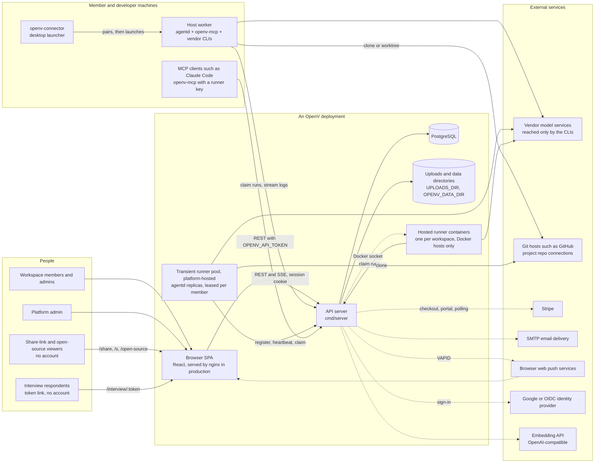
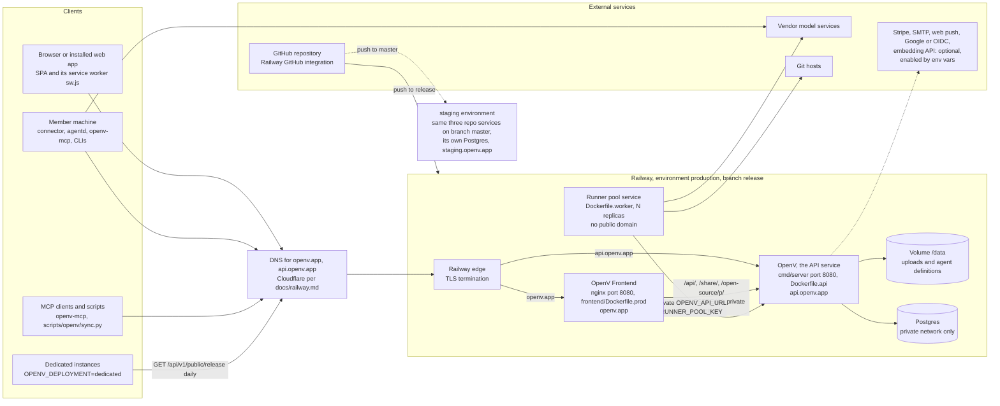
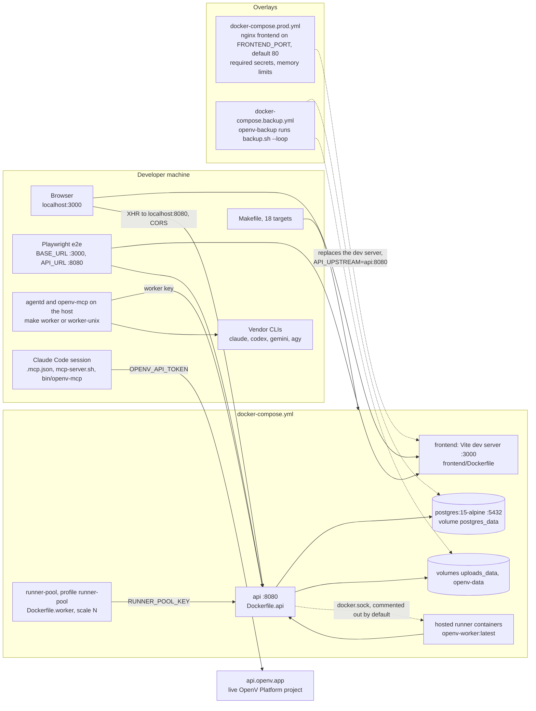
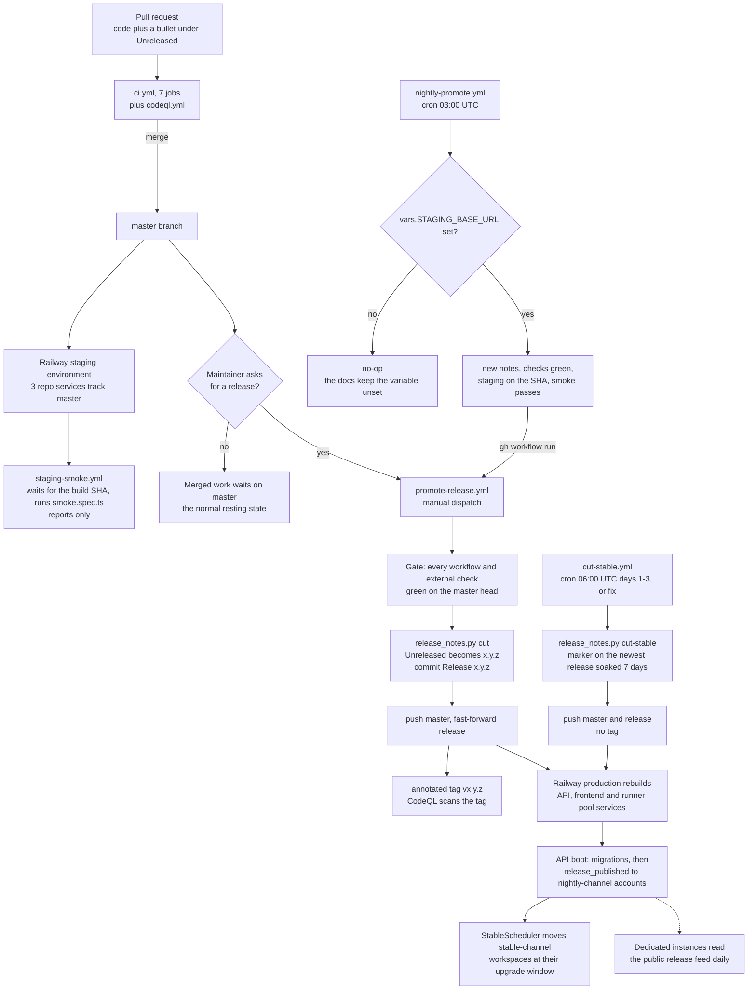
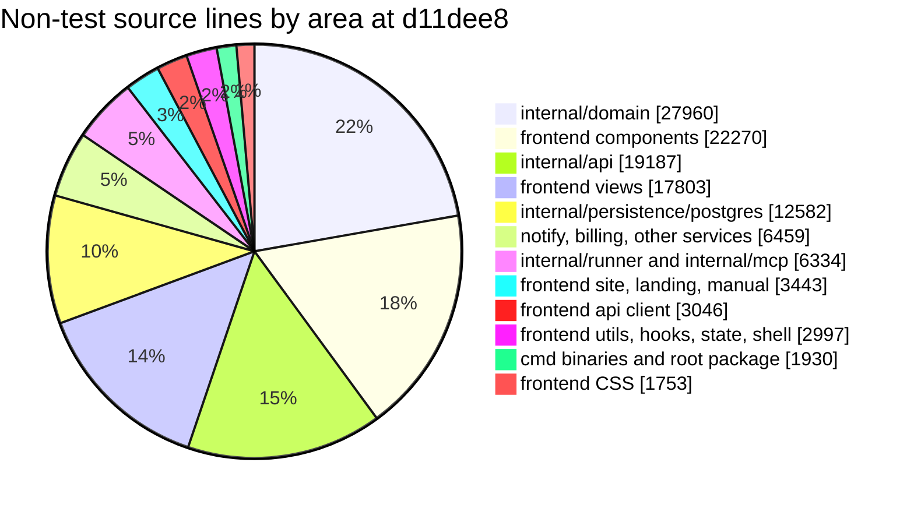

# OpenV — codebase architecture analysis (2026-09-25)

Scope: the whole repository at `master` `d11dee8` (release 0.15.0) — the Go
API server and its packages, the runner and MCP binaries, the React
frontend, the build, CI and release tooling, and the docs. Prompted by the
maintainer's wish to clean the codebase up without changing anything users
can see: this analysis describes how the code works today and where it is
hard to edit; the companion [refactor plan](../../plans/codebase-refactor.md)
says how to fix that, step by step.

Method: thirteen analysts each mapped one subsystem (composition root, three
slices of the API layer, two of the domain layer, persistence, agent
execution, background services, three of the frontend, tooling) from the
code, citing `file:line` for every claim; an independent verifier then tried
to refute every pain point each analyst reported, corrected the evidence
where it was overstated, and added what the analyst missed. Of 205 pain
points put to verification, one was refuted; the verifiers added 80, so the
[register](pain-points.md) holds **284 verified pain points — 58 high, 155
medium, 71 low**. Seven cross-cutting studies ran alongside: the Go import
graph, end-to-end traces of eleven request flows (two studies, one for the
core flows and one for the agent suite), the test safety net
(including a local run of every suite), duplication and Go–TypeScript
contract drift, configuration and deployment, and change amplification
(how many files one change has to touch) measured over the full commit
history. The sections below were then written
against the code and every figure in them re-measured at `d11dee8`.

## Contents

| File | Sections |
|---|---|
| This file | [1 The system at a glance](#1-the-system-at-a-glance) · [2 Runtime and deployment topology](#2-runtime-and-deployment-topology) · [3 Size and shape](#3-size-and-shape) |
| [backend.md](backend.md) | 4 Backend architecture: 4.1 Composition root · 4.2 Package layering and the import graph · 4.3 API layer · 4.4 Domain layer · 4.5 Persistence · 4.6 Background and cross-cutting services · 4.7 Agent execution |
| [flows.md](flows.md) | 5 Key flows: 5.1 Sign-in and workspace selection · 5.2 Editing an artifact and linking it · 5.3 Recording a test run and V&V coverage · 5.4 Reports, export and import · 5.5 Inviting a member · 5.6 Agent run lifecycle and proposals · 5.7 Crews, delegation and automations · 5.8 Runner pool leases and hosted workers · 5.9 Notification fan-out · 5.10 Billing webhook to plan limits |
| [frontend-data-tooling.md](frontend-data-tooling.md) | 6 Frontend architecture · 7 Data model overview · 8 Tooling, CI and release process |
| [assessment.md](assessment.md) | 9 Where editing is hard today · 10 What already works well · Appendix A Environment variable inventory · Appendix B Glossary |
| [pain-points.md](pain-points.md) | The register of all 284 verified pain points with stable IDs, which the refactor plan cites |

Section numbers are global, so "§4.3" means the same place from any file.
Readers new to the product vocabulary (artifact, suspect link, baseline,
proposal, crew, runner lease) or to the code and process terms used here
(composition root, hub file, plumbing, golden file, SSE, MCP, promotion)
should start with [Appendix B](assessment.md#appendix-b-glossary) in
[assessment.md](assessment.md).

## Headline findings

The evidence is in §9 ([assessment.md](assessment.md)); in short:

1. **Crossing the HTTP boundary is what costs.** A feature-gated endpoint
   with UI touches 17–25 files in 11–14 layers; 40–50% of those files are
   plumbing carrying 5–10% of the changed lines (§9.1).
2. **Five hub files absorb unrelated work.** 53% of source-changing commits
   edit `internal/api/handlers.go`, `cmd/server/main.go`,
   `internal/persistence/postgres/migrations.go`,
   `frontend/src/api/client.ts` or `frontend/src/App.tsx` (§9.2).
3. **Two monoliths sit on every request path.** `internal/api` is one
   package whose `Handler` type has 76 fields and 498 methods;
   `client.ts` is 2,880 lines with 145 types, mocked whole by 27 test files
   (§9.3).
4. **Wiring and business rules hide in the composition root.** `main()` is
   853 lines of configuration reads, setter wiring, package globals and
   boot-time jobs whose order is enforced only by statement position (§4.1,
   §9.3).
5. **Contracts are copied by hand** between Go and TypeScript — fifteen
   vocabularies, one parity test (a test that checks the two copies agree)
   (§9.4).
6. **The tests are broad but pin few user-facing contracts.** The route
   list is the only golden file; JSON shapes, roles per route, MCP tool
   schemas, env var names, SSE event names and UI routes are unpinned
   (§9.5).

[Index](README.md) · [4 Backend](backend.md) · [5 Key flows](flows.md) · [6–8 Frontend, data, tooling](frontend-data-tooling.md) · [9–10 Assessment](assessment.md) · [Pain-point register](pain-points.md) · [Refactor plan](../../plans/codebase-refactor.md)

## 1. The system at a glance

OpenV is a requirements management and verification-and-validation (V&V)
platform with a multi-agent development suite built into it. Workspace
members write requirements and the artifacts around them (user needs,
personas, test cases, hazards, design items), link them into a traceability
graph, freeze baselines, record test evidence, and download the result as
specifications and V&V reports. AI agents work inside the same projects:
they draft, review, interview stakeholders and run V&V chores, and their
writes land as proposals a person approves. The server never runs an agent
model itself; the only model it can call is an optional embedding API for
semantic search (§2.1). Agents run on **runners**, worker processes that
drive the vendor's own CLI (Claude Code, Codex, Gemini, Antigravity) with
the member's subscription or the workspace's API keys, and hand it OpenV's
tools through `openv-mcp`, a Model Context Protocol (MCP) server
(`docs/agents.md:3-14`; Antigravity at `:217`). That is the "bring your own
AI" model.

The same code serves three deployment shapes: the shared multi-tenant
service at `openv.app`, self-hosted installs (`OPENV_SELF_HOSTED=true`,
`cmd/server/main.go:152`), and dedicated single-customer instances pinned to
a stable release (`OPENV_DEPLOYMENT=dedicated`, `docs/railway.md`,
"Dedicated instances"). The shared service is sold in four tiers (Single
User, Business Lite, Business, Enterprise; `README.md:38-50`), and every
workspace is on a release channel, nightly or stable
(`docs/release-policy.md`).

### 1.1 What the platform is made of

| Part | Technology | Where |
|---|---|---|
| API server | Go 1.25.14, gorilla/mux, lib/pq, one binary | `cmd/server`, `internal/` |
| Database | PostgreSQL (15 in compose and CI), 47 numbered migrations applied at boot, optional `pg_trgm` (trigram text search) and `vector` (pgvector, semantic search) extensions | `internal/persistence/postgres/migrations.go` |
| Web app | React 18, TypeScript, Vite 8, react-router 7, zustand 4, axios; one single-page app (SPA) that also carries the public site and the manual | `frontend/src` |
| Runners | `agentd` plus `openv-mcp` plus vendor CLIs | `cmd/agentd`, `cmd/openv-mcp`, `internal/runner`, `internal/mcp`, `Dockerfile.worker` |
| Hosting | Railway (production and staging), docker compose (development and self-hosting) | `docs/railway.md`, `docker-compose*.yml` |
| Delivery | GitHub Actions: CI, CodeQL, promotion, nightly promotion, stable cut, staging smoke | `.github/workflows/` |

Multi-tenancy is by **workspace** (an organization, `org` in code): tenant
data belongs to a workspace either directly, through an `org_id` column
(projects, agents, crews, automations, agent runs and a few more), or
through its project (artifacts carry only a `project_id`). Each user gets a
personal workspace at sign-up, and company workspaces add members,
people-teams and per-project roles (`docs/architecture.md:163-188`;
`internal/domain/orgs/orgs.go:21-22`). The one deliberate exception is the
community demo-product pool, `shared_products`, which every workspace shares
(`docs/architecture.md:190`).

### 1.2 Product areas

The table groups what a workspace member can do into areas, with the backend
packages and frontend views that implement each. §4 and §6 describe the
packages; §5 traces the main flows through them.

| Area | What a user does | Main backend packages (`internal/...`) | Main frontend views (`frontend/src/...`) |
|---|---|---|---|
| Requirements management | Projects and modules; artifacts of nine types (`internal/domain/artifacts/types.go:21-29`); typed links such as `verifies`, `satisfies`, `mitigates`, `derives-from`, `validates` (`internal/domain/links/validation.go`); baselines and baseline compare; custom attributes; quality rules; review queue; comments, mentions and activity; attachments; templates | `domain/artifacts`, `links`, `projects`, `baselines`, `attributes`, `quality`, `chatter`, `mentions`, `attachments`, `templates` | `components/ProjectList.tsx`, `views/ModuleView.tsx`, `BaselineCompare.tsx`, `ReviewQueue.tsx`, `ActivityLog.tsx`, `ProjectSettings.tsx` |
| Verification and validation | Test runs and results, coverage and gap analysis with flow-down from parent to child projects (`docs/flow-down.md`), traceability matrix, change impact, evidence bundles | `domain/vv`, `evidence` | `views/VVDashboard.tsx`, `TestRunView.tsx`, `TraceabilityMatrix.tsx`, `ImpactView.tsx`, `EvidenceView.tsx` |
| Documents and data | Download JSON, CSV, Excel, ReqIF (the Requirements Interchange Format), PDF specification, Word document, V&V status PDF; import JSON and ReqIF | `domain/exports`, `reports`, `downloads` | `components/DownloadWizard.tsx` |
| Product discovery | Product profile, personas and user needs, the guided definition wizard, stakeholder interviews over a shareable link | `domain/products`, `guided`, `interviews` | `views/ProductOverview.tsx`, `GuidedWizard.tsx`, `InterviewsPage.tsx`, `InterviewChat.tsx` |
| Agent suite | Agent definitions, agent runs and live logs, crews (agent teams) and delegation, automations (manual, cron, event), kanban board and to-dos, proposals awaiting approval | `domain/agents`, `agentruns`, `teams`, `crewtemplates`, `automations`, `workitems`, `proposals`; `orchestration`, `automation`, `scheduler` | `views/AgentsPage.tsx`, `AgentRunsPage.tsx`, `CrewBuilder.tsx`, `AutomationsPage.tsx`, `KanbanBoard.tsx`, `TodoList.tsx` |
| Runners | Pair a personal runner through the Agent Connector, lease a transient cloud runner, provision a hosted runner, sign vendor CLIs in from the browser, connect git repositories | `domain/workerkeys`, `runnersessions`, `hostedworkers`, `providers`, `repoconns`; `hosting`, `runner`, `mcp` | `components/org/MyRunnerCard.tsx`, `CloudRunnerCard.tsx`, `HostedRunnerCard.tsx`, `components/RunnerConnectPrompt.tsx` |
| Workspaces and accounts | Sign-in (password, Google, generic OpenID Connect (OIDC)), email verification, workspaces, members, people-teams, invitations, plans, limits and billing, release channel and upgrade window, platform administration | `domain/users`, `orgs`, `members`, `invitations`, `settings`, `release`; `billing` | `views/Login.tsx`, `VerifyEmail.tsx`, `ResetPassword.tsx`, `OrgSettings.tsx`, `WhatsNew.tsx`, `PlatformAdmin.tsx` |
| Sharing and publishing | Public and reviewer share links, open-source project publishing (`docs/sharing.md`) | `domain/sharelinks` | `views/SharedProjectView.tsx`, `site/OpenSourceProjects.tsx` |
| Notifications | In-app inbox, live updates over SSE, email, web push | `domain/notifications`, `pushsubs`; `notify`, `events` | `components/NotificationBell.tsx`, `push/webPush.ts` |
| Public site and manual | Landing page, pricing, storefront pages, the user manual | (static; `/api/v1/public/*` for plans and release) | `views/Landing.tsx`, `site/*`, `manual/*`, `views/ManualView.tsx` |

### 1.3 System context

The diagram shows who and what talks to an OpenV deployment. Solid arrows
are the core paths; dashed arrows are optional integrations that stay off
unless configured: environment variables switch on Stripe, email, web push,
single sign-on and embeddings (§2.1), and hosted runners need a Docker
socket. The runner tiers are optional too (§2.3). Share-link viewers and interview respondents need no
account: they reach public routes (`/share/:token`, `/s/:token`,
`/open-source/:id`, `/interview/:token`; `frontend/src/App.tsx:198-205`)
backed by `/api/v1/public/*` endpoints that the auth middleware leaves open.
(In the production image nginx answers `/share/<token>` and
`/open-source/p/<id>` with the API's link-preview page, which then sends the
browser on into the SPA; `frontend/nginx.conf:141-166`.)
A platform admin is an ordinary user with a platform-wide flag who sees the
`/admin` page (`internal/api/admin_handlers.go:28`).

Three properties of this picture shape most of the code:

- **The API is the only writer to the database.** Runners, the MCP server,
  the connector and scripts all go through the REST API
  (`POST /api/v1/agent-runs/claim`, then `/{id}/start`, `/{id}/logs` and
  `/{id}/finish` for runners; §4.7, §5.6). No other binary links the
  persistence package or opens a database connection; only
  `scripts/backup.sh` and `make restore` touch Postgres directly.
- **Credentials decide scope.** A browser holds a session cookie; a runner
  holds a worker key (personal, workspace or lease-bound); a vendor CLI's
  `openv-mcp` holds a per-run token scoped to its project and write mode; a
  developer's MCP session holds a workspace runner key
  (`docs/agents.md:17-23`; `internal/api/authmiddleware.go:85-178`, §4.3).
- **The server stores no model credentials.** Consumer subscriptions stay
  on the machine running the CLI. A workspace admin supplies provider API
  keys when provisioning a hosted runner; the API passes them into that
  container's environment without storing them (`docs/agents.md:99-127`;
  `internal/api/org_handlers.go:984`, `:1019`).

### 1.4 Deployables and binaries

The Go module builds five binaries; the repository also defines four
container images and one compose sidecar. Line counts are non-test source at
`d11dee8` (§3 has the method).

| Deployable | Source (lines) | Built by | Runs where | What it is for |
|---|---|---|---|---|
| `server` (the API) | `cmd/server/main.go` (983) plus 56 linked internal packages and `release_notes.go` | `Dockerfile.api:28` (`go build ... cmd/server/main.go`, a file path) | Railway service **OpenV**; compose `api` | HTTP API (341 method-and-path pairs pinned in `internal/api/testdata/routes.txt`, plus `/metrics`), migrations at boot, background loops, connector downloads, the embedded release notes (§4.1) |
| `agentd` | `cmd/agentd` (149) plus `internal/runner` (4,979) | `Dockerfile.worker:25`; `make worker`, `make worker-unix`; embedded in the connector | Member machines, pool nodes, hosted runner containers | Runner worker: claims queued runs, drives a vendor CLI, pushes logs; pool-node mode when `RUNNER_POOL_KEY` or `--pool-key` is set (`cmd/agentd/main.go:111-114`) |
| `openv-mcp` | `cmd/openv-mcp` (41) plus `internal/mcp` (1,355) | `Dockerfile.worker:26`; `make mcp`; `scripts/openv/mcp-server.sh` | Spawned by the vendor CLI for each run; started by `.mcp.json` in developer sessions | stdio JSON-RPC MCP server exposing 31 `openv` tools, each a REST call (§4.7) |
| `openv-connector` | `cmd/openv-connector` (8 files, 708) | `Dockerfile.api:36-43` with `-tags embedpayload`; `make connector-dist` | Member desktop (Windows, Linux; no macOS build) | Handles `openv-connector://pair`, `start` and `open` links, stores pairings, unpacks the embedded `agentd` and `openv-mcp`, launches the worker; served at `GET /api/v1/public/connector/download` |
| `openv-vapid` | `cmd/openv-vapid` (36) | `go run ./cmd/openv-vapid`, `make vapid-keys` | Operator's shell | Prints a VAPID key pair (the deployment's identity toward browser push services) for web push as three dotenv lines |
| API image | `Dockerfile.api` (66) | Railway, compose, CI `Docker builds` job | Railway **OpenV**; compose `api` | alpine runtime in `/root` with `server`, `examples/` and `dist/` connector bundles; port 8080 |
| Frontend production image | `frontend/Dockerfile.prod` (108), `frontend/nginx.conf` (192), 3 entrypoint scripts | `frontend/railway.json`; `docker-compose.prod.yml` | Railway **OpenV Frontend**; compose prod overlay | nginx on 8080 serving the built SPA; proxies `/api/`, `/share/` and `/open-source/p/` to `API_UPSTREAM`; serves `/build.json`; answers `/health` itself |
| Frontend dev image | `frontend/Dockerfile` (25) | compose `frontend` | Developer machine | Vite dev server on 3000 |
| Worker image `openv-worker:latest` | `Dockerfile.worker` (117) | Railway; compose `runner-pool`; `make worker-image`; `internal/hosting` (`RUNNER_IMAGE`) | Pool nodes and hosted runner containers | `agentd`, `openv-mcp`, the claude, codex and gemini CLIs and `agy` (the Antigravity CLI), pinned by version and SHA-512; user `worker` (uid 1000); entrypoint `agentd --workspaces /data/workspaces` |
| Backup sidecar | `docker-compose.backup.yml` (64), `scripts/backup.sh` (128) | compose overlay | Self-hosted compose | `pg_dump` plus volume tarballs on a loop, the same recipe as `make backup` |

The root package `openv` (`release_notes.go`, 13 lines) is not a binary but
matters to the build: it embeds `RELEASE_NOTES.md` into the server
(`release_notes.go:12-13`), which is how a running API knows its version and
what to announce (§8).

### 1.5 How this analysis is organised

| § | Covers | Read it when |
|---|---|---|
| 1-3 | What the system is, where it runs, how big each part is | Orienting |
| 4 | Backend: composition root, package layering, API, domain, persistence, services, agent execution | Changing Go code |
| 5 | Ten end-to-end flows with sequence diagrams and `file:line` hops | Changing behaviour that crosses layers |
| 6 | Frontend: shell and routing, API client, state, views, styling, tests | Changing the SPA |
| 7 | Data model | Adding or changing tables |
| 8 | Tooling, CI and the release process | Changing workflows, scripts or release notes |
| 9 | Where editing is hard: change amplification, hotspots, pain points, duplication, the safety net | Planning a refactor |
| 10 | What already works well | Deciding what to keep |
| A, B | Environment variable inventory; glossary | Configuring a deployment; decoding a term |

The refactor sequence built on this analysis is in
[the refactor plan](../../plans/codebase-refactor.md).

#### Editing notes

- **What the platform must do is defined in the live OpenV Platform
  project, not in the repository** (`CLAUDE.md`, "Source of truth"). A
  change that alters behaviour updates that project's requirements, links
  and V&V evidence in the same piece of work.
- **Do not take structure from `README.md`.** Its project tree
  (`README.md:122-149`), endpoint list (`:151-168`) and data model
  (`:170-201`) describe the MVP; its "What's next" (`:32-36`) lists web push,
  which has shipped; its prerequisites say Go 1.21+ where `go.mod:3` pins
  1.25.14; and its public demo URL (`README.md:5`) is a generated Railway
  hostname, not the `openv.app` domain `docs/railway.md` prescribes (§2.1).
  `docs/architecture.md` is partly stale in the same way. §8.7 gives the
  status of every document and §9.3.11 groups the stale ones.

## 2. Runtime and deployment topology

This section says where each deployable from §1.4 runs. The shared service
runs on Railway: one project with a production environment that deploys the
`release` branch and a staging environment that deploys `master`. The same
images run locally under docker compose, which is also the self-hosting
path and the stack CI's end-to-end tests boot. Agent runs execute outside
the API process in one of three runner tiers. Code reaches production when
the maintainer starts the promotion workflow, or when the monthly stable
cut designates a stable release, which also pushes the master head to
`release` (§2.4).

§2.1 describes the setup `docs/railway.md` prescribes; it does not record
the live project's settings, which belong to operations, not to this
analysis.

### 2.1 Production on Railway

Railway builds each service from this repository with a Dockerfile and
redeploys it on every push to the service's connected branch. The browser
only ever talks to the frontend origin: nginx serves the SPA and proxies
`/api/` to the API over Railway's private network, so the session cookie is
first-party (`docs/railway.md`, section 3). The API's own public domain
exists for machine clients.

**Services** (as `docs/railway.md` sets them up):

| Service | Built from | Production | Staging | Storage and health |
|---|---|---|---|---|
| **OpenV** (API) | `Dockerfile.api`, set on the service (there is deliberately no root `railway.json`, `docs/railway.md` section 2) | branch `release`; `api.openv.app` plus its generated `*.up.railway.app` domain | branch `master`; generated domain only, no custom domain by design | volume at `/data`; healthcheck `/health`, 120 s |
| **OpenV Frontend** | root directory `frontend`, `frontend/railway.json` selects `Dockerfile.prod` | branch `release`; `openv.app` | branch `master`; `staging.openv.app` | no volume; healthcheck `/health`, 60 s, answered by nginx itself (`frontend/nginx.conf:62-66`) |
| **Runner pool** (`docs/railway.md` section 4) | `Dockerfile.worker` | branch `release`; one replica per concurrent lease (the guide starts at 2); no domain, outbound only | branch `master`; one replica is enough | no volume; per-lease HOME under `RUNNER_SESSION_ROOT`, wiped at lease end |
| **Postgres** | Railway managed | private network | its own instance, no production data | Railway backups |

`docs/railway.md` ("Staging") requires Railway's "Wait for CI"
(`checkSuites`) to stay off on staging: the staging smoke check waits for
staging to deploy, so the two would deadlock. The variables each service
needs are listed in `docs/railway.md`; Appendix A has every variable the
code reads.

Consequences worth knowing:

- **Email, web push, billing, single sign-on (SSO) and semantic embeddings
  are optional.** Each is switched on by its own variables
  (`OPENV_SMTP_HOST`, `OPENV_VAPID_*`, `STRIPE_SECRET_KEY` with
  `OPENV_STRIPE_*` and `OPENV_BILLING_*`, `GOOGLE_CLIENT_ID`,
  `OPENV_OIDC_ISSUER`, `OPENV_EMBEDDING_API_KEY`); when they are unset,
  boot leaves the feature off with a disabled implementation or none at all
  (billing and sign-in providers stay nil; §4.1, §4.6), so those paths run
  only where configured and in unit tests.
- **Hosted runner containers need a Docker socket.** The API provisions
  them through a Docker client built from the environment, normally the
  mounted socket (`internal/hosting/docker.go:39`), and switches the
  feature off when no daemon answers (`internal/hosting/provisioner.go:74-86`).
  A Railway service has none, so on Railway members use the runner pool or
  their own machines instead.
- **Uploads and agent definitions share the one volume** (`/data`, with
  `UPLOADS_DIR` inside it). Railway allows one volume per service.
- **The API migrates on boot**, serialized by a Postgres advisory lock (a
  lock held in the database, so two processes booting together cannot
  migrate at once;
  `cmd/server/main.go:188`), and all boot work finishes before it listens.
  The 120 s healthcheck is the budget for that.
- **The running commit is observable** at `/api/v1/public/build` on the API
  (`internal/api/release_handlers.go:20`) and `/build.json` on the frontend
  (`frontend/Dockerfile.prod:88-91`), both from `RAILWAY_GIT_COMMIT_SHA`
  (the API also accepts `OPENV_BUILD_SHA` as an override,
  `cmd/server/main.go:621`). The staging gate relies on both.
- **Dedicated instances** poll the shared service's public release feed,
  `OPENV_RELEASE_FEED_URL` (default
  `https://api.openv.app/api/v1/public/release`,
  `cmd/server/main.go:615-616`), to warn admins as their support window
  closes.

### 2.2 Local development and self-hosting with docker compose

Three compose files layer on each other. `docker-compose.yml` is the
development stack and the base; `docker-compose.prod.yml` turns it into a
self-hosted production install; `docker-compose.backup.yml` adds a backup
sidecar. The Makefile wraps them (`make up`, `make prod-up`, `make backup`,
`make restore`). CI's `E2E smoke (Playwright)` job boots the development
stack with `docker compose up -d --build` (`.github/workflows/ci.yml:276-334`).

| File | Services (container name, port) | Notes |
|---|---|---|
| `docker-compose.yml` (138) | `postgres` (`openv-postgres`, 5432), `api` (`openv-api`, 8080), `runner-pool` (profile `runner-pool`, no container name so it can scale), `frontend` (`openv-frontend`, 3000) | Development defaults, including a fixed, publicly known development `WORKER_API_KEY` (the prod overlay makes it required) and `CORS_ORIGIN` for `localhost:3000`. Many variables are passed as empty strings, which the code reading them treats as unset. The Docker socket mount that enables hosted runners is commented out (`docker-compose.yml:87`). The browser calls the API directly on 8080 (`REACT_APP_API_URL=http://localhost:8080`), so the browser's cross-origin (CORS) checks apply here but not in production. |
| `docker-compose.prod.yml` (114) | overrides `postgres` (port hidden, 1 GB), `api` (required `POSTGRES_PASSWORD`, `CORS_ORIGIN`, `WORKER_API_KEY`; `/health` check; 1 GB), `frontend` (`Dockerfile.prod`, `${FRONTEND_PORT:-80}:8080`, `API_UPSTREAM=api:8080`, 256 MB) | Adds the `openv-runners` network so hosted runner containers reach the API but not Postgres. Topology then matches production: one origin, `/api/` proxied. |
| `docker-compose.backup.yml` (64) | `backup` (`openv-backup`, `postgres:15-alpine`) | Runs `scripts/backup.sh --loop` against the same volumes. The script names the data directory `DATA_DIR`, not the API's `OPENV_DATA_DIR`. |

Without Docker, the API runs with `go run cmd/server/main.go` against a
local Postgres and the SPA with `npm start` in `frontend/` (`README.md:90-120`).
Named volumes, container names and the `runner-pool` profile are part of the
operator contract: `make restore` and the backup overlay depend on them.

### 2.3 Where agent runs execute

The API keeps a queue of runs; runners pull from it. Every tier runs the same
`agentd`, which polls `POST /api/v1/agent-runs/claim`, prepares a workspace
directory, starts a vendor CLI with `openv-mcp` attached (passing
`OPENV_API_URL`, `OPENV_RUN_TOKEN` and `OPENV_MCP_TOOLS`), and posts logs and
the result back. What differs is where it runs and whose credentials it uses
(`docs/agents.md`, "Runner tiers"). §4.7 describes the runner internals; §5.6
and §5.8 trace a run and a lease.

| Tier | Where `agentd` runs | Credential it holds | What it claims | How it starts |
|---|---|---|---|---|
| Personal runner (host worker) | The member's own machine, signed in with the member's vendor subscriptions | Personal runner key | Only runs that member launched; repo-access runs allowed | `openv-connector://pair` link from the UI: the connector exchanges a one-time code (`POST /api/v1/public/connector/pair`) for a key, stores it, and launches the embedded `agentd`. Or by hand: `make worker` / `make worker-unix`, then `agentd --worker-key` |
| Transient runner (pool node) | A replica of the runner pool service (Railway) or the compose `runner-pool` profile | `RUNNER_POOL_KEY` for the node; a key bound to the lease while one member holds it | That member's runs for the lease (lifetime and idle window come from the workspace's plan limits, falling back to 60 and 15 minutes; `internal/domain/runnersessions/runnersessions.go:61-66`) | `agentd --pool-key`; the member presses *Start a cloud runner* and signs the CLIs in from the browser; the lease's HOME is deleted when it ends |
| Hosted runner | A container per workspace that the API creates over the Docker socket (`internal/hosting`, image `RUNNER_IMAGE`, default `openv-worker:latest`) | Workspace worker key plus the workspace's provider API keys in the container environment | Ownerless runs (automations, cron and event triggers) and overflow (runs whose launcher has no runner online); no repo access, no CLI sign-in | A workspace admin provisions it in settings; unavailable where there is no Docker daemon, including Railway |

The legacy shared `WORKER_API_KEY` still works and is registered at boot as a
workspace key for the earliest user's personal workspace
(`cmd/server/main.go:350-371`). Outside platform runs, the same `openv-mcp`
binary serves developer sessions in this repository: `.mcp.json` starts
`scripts/openv/mcp-server.sh` with `OPENV_API_URL` defaulting to
`https://api.openv.app` and a workspace runner key in `OPENV_API_TOKEN`;
the script rebuilds `bin/openv-mcp` when its sources change.

The connector bundles are built into the API image. `Dockerfile.api:36-43`
cross-compiles `agentd` and `openv-mcp`, embeds them into
`dist/openv-connector-windows.exe` and `dist/openv-connector-linux`, and the
API serves them from `CONNECTOR_DIST_DIR` (default `./dist`,
`cmd/server/main.go:854`). `make connector-dist` repeats the same recipe.

### 2.4 Release pipeline

A merge to `master` deploys staging and nothing else. Production normally
moves when the maintainer runs **Promote to release**, which cuts the
release notes into a numbered version, fast-forwards the `release` branch
and tags it; Railway deploys that push. Once a month **Cut stable release**
designates a soaked release (one that has served the nightly channel for at
least seven days) as the stable one for stable-channel workspaces; when it
designates one it pushes the master head to both `master` and `release`, so
that run also ships whatever is on `master` (`cut-stable.yml:90-94`). A
nightly automatic promotion exists but stays unarmed until a repository
variable is set, which the docs say to leave unset. `docs/railway.md` ("Release pipeline", "Staging") and
`docs/release-policy.md` are the authoritative descriptions; §8 covers the
workflows and `scripts/release_notes.py` in detail.

| Workflow | File (lines) | Trigger | What it does | State at `d11dee8` |
|---|---|---|---|---|
| CI | `ci.yml` (334) | every PR; push to `master` | Seven jobs: Backend (gofmt, `go vet`, `go test` against Postgres 15), Frontend (tsc, eslint, vitest, vite build), Release notes (the script's self-test, `release_notes.py check` and `check-pr`), Vulnerability scan (govulncheck, npm audit), Secret scan (gitleaks), Docker builds (all three images), E2E smoke (Playwright against the compose dev stack) | active |
| CodeQL | `codeql.yml` (101) | PRs to `master`, `master` pushes, `v*` tags, Mondays 04:27 UTC | Go and TypeScript static analysis | active |
| Staging smoke | `staging-smoke.yml` (158) | every push to `master`; manual | Waits up to 15 minutes for staging's `/api/v1/public/build` and `/build.json` to report the merged SHA, checks the smoke credentials against the registration policy, runs `smoke.spec.ts` on chromium; never promotes | active once the repository variable `STAGING_URL` is set (otherwise it notes that staging does not exist and skips the rest, `:46-56`); a staging with sign-up closed also needs the variable `SMOKE_EMAIL` and the secret `SMOKE_PASSWORD` (`docs/railway.md`, "Staging") |
| Promote to release | `promote-release.yml` (170) | manual only (input `major`), or dispatched by nightly promotion | Green gate on the master head (`:47`); cut the notes and commit `Release <version>` (`:119`); push `master`, then `release` (`:135-138`); annotated tag `v<version>` (`:148-168`) | the only normal path to production; run only when the maintainer asks (`CLAUDE.md`, "Deployment") |
| Cut stable release | `cut-stable.yml` (94) | cron `0 6 1-3 * *` (with weekend and same-month guards); manual with `fix` | Cut any Unreleased notes, add the stable marker line to the newest release that has soaked 7 days, push `master` and `release`; no tag | active; no release carries the marker yet |
| Nightly promotion | `nightly-promote.yml` (150) | cron `0 3 * * *`; manual | If `STAGING_BASE_URL` is set: check for new notes, green checks, staging on the SHA and a passing smoke, then `gh workflow run promote-release.yml` (`:150`) | unarmed by design: every step after the check at `:40-50` is skipped while `STAGING_BASE_URL` is unset, and `docs/railway.md` ("Staging") says to keep it unset until the maintainer wants automatic promotion |

At `d11dee8` (the commit titled `Release 0.15.0`), `RELEASE_NOTES.md` holds
31 numbered releases, from `0.1.0` (2026-09-13) to `0.15.0` (2026-09-22),
plus three date-only sections from before versioning. The version is derived
from the notes: anything under *New features* is a minor bump, maintenance
and fixes alone a patch. A *New features* bullet also registers a feature
key in `internal/domain/release/features.go` so stable-channel workspaces
wait for it. Rollback is a force-push of a known-good commit to `release`;
migrations are forward-only, so that is safe only across releases that
added none (`docs/railway.md`, "Release pipeline").

### 2.5 Editing notes

Where changes in this area go:

- A new environment variable: read it in `cmd/server/main.go` (or the owning
  package, as today; §4.1 and Appendix A), add it to the compose file if
  development needs a value, and document it in `docs/operations.md` or
  `docs/railway.md`. Setting it on Railway is an operator step, not a code
  change.
- A new runtime file the server reads from the repository (like
  `examples/`): add a `COPY` to both stages of `Dockerfile.api`. There is no
  root `.dockerignore`; instead the build stage copies only an allow-list of
  paths (`Dockerfile.api:17-22`) and the runtime stage only `server`,
  `examples/` and `dist/` (`:52-55`).
- A deployment-visible change: a customer-facing bullet under
  `## Unreleased` in `RELEASE_NOTES.md`, and nothing else. Promotion is the
  maintainer's call.

Traps a refactor or feature change must respect:

- **The API image builds `cmd/server/main.go` by file path**
  (`Dockerfile.api:28`). Splitting `main.go` into several files of package
  `main` breaks the image unless the build switches to `./cmd/server`. The
  CI `Docker builds` job catches it; the Go jobs do not.
- **Never add a `railway.json` at the repository root.** It would override
  the build settings of every service built from the root, so the Runner
  Pool would silently build `Dockerfile.api` (`docs/railway.md`, section 2).
- **Boot must stay inside the 120 s healthcheck.** Migrations, seeding for
  every workspace and the scheduler's catch-up all run before the server
  listens. Adding or serializing boot work can fail deploys (§4.1).
- **Empty means unset.** The compose files pass many variables as empty
  strings, and every reader treats `""` as unset. A configuration loader that
  distinguishes set-but-empty changes the development and CI stacks. Each
  variable also has its own parsing rule; see Appendix A and §9.3.
- **The frontend origin answers `/health` itself.** Anything that needs the
  API's health or commit from `openv.app` must use `/api/v1/public/build`,
  as the staging gate does.
- **Pool replicas are a write load even when idle.** Each node heartbeats
  every 5 s, and each beat is a database write (`docs/railway.md`, "Notes
  and limitations"). Size the pool to real concurrent use.
- **Staging must never point at production data.** A forked Railway
  environment copies variables verbatim, and the API migrates on boot
  (`docs/railway.md`, "Staging").
- **The runner wire contract spans separately deployed binaries.** An
  `agentd` installed through the connector on a member's machine can be
  older than the API, and during a deploy the pool and the API rebuild
  independently. Changes to `/api/v1/agent-runs/*` or to the JSON of the
  types `agentd` decodes must stay backward compatible (§4.7, §9.4).
- **Two stale operator instructions to not copy:** `docs/railway.md:544`
  tells host workers to set `RUNNER_API_URL`, but `agentd` reads
  `OPENV_API_URL` or `--api` (`cmd/agentd/main.go:94`); `RUNNER_API_URL` is
  the API-side hosted-runner setting (`internal/hosting/docker.go:53`).
  `docker-compose.prod.yml:55` says the hosted-runner PID limit defaults to
  256; the code default is 1024 (`internal/hosting/docker.go:73`; §9.3).

## 3. Size and shape

This section measures the codebase so the rest of the document can be read
in proportion. The product is about 126,000 lines of non-test source: 59%
Go, 41% TypeScript and CSS. Two areas dominate. The domain layer (43
packages) and the HTTP layer (one package of 47 files) hold 63% of the Go,
and the frontend's views and components hold 81% of its TypeScript.

Method: every figure counts files tracked by git at `d11dee8` (so
`node_modules/` and build output are excluded) with `wc -l`, which counts
all lines, including comments and blank lines. Test files are `*_test.go`,
`*.test.ts`, `*.test.tsx`, `*.spec.ts` and `*_test.py`; everything else is
source.
Package counts come from `go list`.

### 3.1 Lines by area

| Area | Source files | Source lines | Test files | Test lines | Test lines per source line |
|---|---:|---:|---:|---:|---:|
| `cmd/server` | 1 | 983 | 0 | 0 | 0 |
| `cmd/agentd` | 1 | 149 | 0 | 0 | 0 |
| `cmd/openv-mcp` | 1 | 41 | 1 | 24 | 0.59 |
| `cmd/openv-connector` | 8 | 708 | 4 | 350 | 0.49 |
| `cmd/openv-vapid` | 1 | 36 | 0 | 0 | 0 |
| module root (`release_notes.go`) | 1 | 13 | 0 | 0 | 0 |
| `internal/api` | 47 | 19,187 | 73 | 16,439 | 0.86 |
| `internal/domain` (43 packages) | 84 | 27,960 | 68 | 15,519 | 0.56 |
| `internal/persistence/postgres` | 46 | 12,582 | 42 | 8,726 | 0.69 |
| `internal/runner` | 18 | 4,979 | 15 | 3,249 | 0.65 |
| `internal/mcp` | 2 | 1,355 | 8 | 2,098 | 1.55 |
| `internal/notify` | 11 | 2,247 | 10 | 2,195 | 0.98 |
| `internal/billing` (with `billing/stripe`) | 8 | 1,812 | 5 | 1,386 | 0.76 |
| other `internal/`: `orchestration` 543, `seeds` 771, `hosting` 367, `metrics` 284, `scheduler` 170, `automation` 159, `events` 106 | 10 | 2,400 | 9 | 2,886 | 1.20 |
| **Go total** | **239** | **74,452** | **235** | **52,872** | **0.71** |
| `frontend/src/views` | 31 | 17,803 | 11 | 2,173 | 0.12 |
| `frontend/src/components` (including `ui`, `org`, `wizard`, `agents`, `crews`, `kanban`) | 86 | 22,270 | 38 | 5,911 | 0.27 |
| `frontend/src/api` | 4 | 3,046 | 4 | 258 | 0.08 |
| `frontend/src/{utils,hooks,state,config,push}` | 21 | 2,530 | 13 | 1,902 | 0.75 |
| `frontend/src` root (`App.tsx`, `index.tsx`, `appShortcuts.ts`, `theme.ts`) | 4 | 467 | 1 | 62 | 0.13 |
| `frontend/src/{site,landing,manual}` (public pages and copy) | 26 | 3,443 | 0 | 0 | 0 |
| `frontend/src` CSS | 7 | 1,753 | - | - | - |
| **Frontend total** (`frontend/src`) | **179** | **51,312** | **67** | **10,306** | **0.21** (TypeScript only) |
| Frontend build and serving config (Dockerfiles, `nginx.conf`, entrypoint scripts, `vite.config.ts`, `index.html`, `railway.json`, lint and TS config) | 14 | 673 | - | - | - |
| `e2e/` (support: `helpers.ts`, `playwright.config.ts`, `tools/phone-audit.js`; tests: 8 specs, 40 tests plus 1 skipped) | 3 | 882 | 8 | 1,185 | - |
| `scripts/` (`release_notes.py` 457, `openv/sync.py` 490, `backup.sh` 128, `openv/mcp-server.sh` 38) | 4 | 1,113 | 1 | 261 | 0.23 |
| CI and build (`.github/workflows/` 6 files 1,007; `Makefile` 154; `Dockerfile.api` 66; `Dockerfile.worker` 117; compose files 316) | 12 | 1,660 | - | - | - |
| `docs/` reference and guides (15 Markdown files plus `connector-readme.txt`) | 16 | 6,121 | - | - | - |
| `docs/assessments/` and `docs/plans/` | 7 | 1,856 | - | - | - |
| `docs/exports/` (committed JSON project snapshots, 3.1 MB) | 4 | 64,355 | - | - | - |
| Root documents (`README.md` 319, `CONTRIBUTING.md` 91, `CLAUDE.md` 95, `RELEASE_NOTES.md` 686) | 4 | 1,191 | - | - | - |
| `examples/` (template and seed JSON, PowerShell loaders) | 6 | 2,093 | - | - | - |

Reading the table:

- **Go is well tested by volume; the frontend is not.** Go has 0.71 test
  lines per source line (1,260 `Test` functions). The frontend has 0.21, and
  the two largest frontend areas, views and components, have 0.12 and 0.27.
  The API client has 0.08. Pure helpers in `utils/` and `hooks/` are the
  exception. §6.6 and §9.5 cover what these tests do and do not pin.
- **The composition root and the worker entry point have no tests.**
  `cmd/server` and `cmd/agentd` together are 1,132 lines with none. Only the
  compose-based E2E job and the staging smoke boot the real wiring (§4.1,
  §9.5).
- **`internal/api` is larger than the persistence and runner packages
  combined.** It is one Go package of 47 files, 19,187 lines, with 76 fields
  on its `Handler` type (§4.3).
- **`docs/exports/` is data, not documentation.** Its 64,355 lines are four
  snapshots of the live requirements project, committed as off-instance
  backups (`docs/requirements-maintenance.md:141-142`). They dwarf the prose
  documentation, and a repository-wide text search matches them.

### 3.2 The fifteen largest source files

Fifteen Go and TypeScript source files exceed 1,000 lines. Together they hold
26,374 lines, 21% of all non-test Go and TypeScript. The next is
`cmd/server/main.go` at 983. Of the 412 Go and TypeScript source files
(counting `frontend/vite.config.ts`), 44 are between 500 and 999 lines, 146
between 200 and 499, and 207 under 200.

| # | File | Lines | What it holds |
|---:|---|---:|---|
| 1 | `internal/api/handlers.go` | 3,369 | `HandlerDeps` (63 fields), `Handler` (76 fields), `NewHandler`, the master `RegisterRoutes`, `/health`, and the artifact, link, project, template, baseline, attachment, export and import handlers (§4.3) |
| 2 | `frontend/src/api/client.ts` | 2,880 | The one hand-written API client: axios instance and interceptors, 145 exported payload types, 54 exported `*API` objects of endpoint wrappers (§6.2) |
| 3 | `internal/api/agent_handlers.go` | 2,270 | 81 routes: agent definitions, agent runs and their SSE tail, the worker run protocol `agentd` speaks, delegation, automations, proposals, repo connections, provider sign-in |
| 4 | `frontend/src/views/ModuleView.tsx` | 2,205 | The requirements module page: loading, selection, artifact and link CRUD, ordering, search and filters, keyboard and swipe stepping, responsive layouts |
| 5 | `internal/api/suite_handlers.go` | 2,095 | 54 routes: product profile and parties, V&V runs, coverage, matrix, gaps and report with flow-down, change impact, quality lint, work items, stakeholder interviews (including the public token routes), guided wizard and its assistant chat |
| 6 | `frontend/src/views/GuidedWizard.tsx` | 1,858 | The 8-step guided product definition wizard with its session lifecycle and assistant dock |
| 7 | `internal/persistence/postgres/migrations.go` | 1,800 | The numbered migration ledger (47 migrations), boot advisory lock and guarded extensions (§4.5) |
| 8 | `frontend/src/views/ProjectSettings.tsx` | 1,585 | Project settings in one component: 7 tabs (General, Access, Repositories, Agents, Attributes, Quality rules, Danger Zone), 42 `useState` calls |
| 9 | `internal/api/org_handlers.go` | 1,411 | 43 routes (44 method-and-path pairs; the connector download answers GET and HEAD): workspaces, plans, logo, limits, members, people-teams, worker keys, hosted runners, usage, connector pairing and download |
| 10 | `internal/domain/reports/pdf_report.go` | 1,330 | The gofpdf renderer for the PDF specification |
| 11 | `internal/domain/agentruns/agentruns.go` | 1,224 | The run queue and lifecycle: launch, claim, logs, finish, retry, cancel, stale reaping, spend roll-ups (§4.4, §5.6) |
| 12 | `internal/mcp/tools.go` | 1,165 | The MCP client, tool allow-list and the 31 `openv` tools, defined inline in one 718-line `Tools()` function, plus the JSON-RPC loop |
| 13 | `frontend/src/components/ProjectList.tsx` | 1,093 | The `/projects` page: list, create, import, templates, random and agent-invented products, shared-product voting, downloads |
| 14 | `internal/domain/reports/docx_report.go` | 1,085 | The hand-written Office Open XML (OOXML) renderer for the Word document |
| 15 | `internal/domain/reports/report.go` | 1,004 | Live-or-baseline snapshot loading and the report model the PDF and Word renderers share |

Five are the HTTP surface seen from one side or the other (1, 2, 3, 5, 9),
four are page components (4, 6, 8, 13), three are the document reports
(the PDF and Word renderers, 10 and 14, and the model they share, 15), and
the rest are the migration ledger (7), the run lifecycle (11) and the MCP
tool table (12). §9.2 covers how often each changes.

### 3.3 Other shape measures

| Measure | Value | Source |
|---|---:|---|
| Go packages (5 `cmd`, the module root, 57 `internal`) | 63 | `go list . ./cmd/... ./internal/...` |
| of which `internal/domain` | 43 | `go list ./internal/domain/...` |
| Internal import edges between them | 227 | `go list -f '{{.Imports}}'` (§4.2) |
| Internal packages linked into `server` / `agentd` / `openv-mcp` / `openv-connector` / `openv-vapid` | 56 / 10 / 2 / 0 / 0 | `go list -deps ./cmd/<name>` |
| Direct Go module dependencies | 19 | `go.mod` |
| HTTP method-and-path pairs pinned by the route inventory | 341 (plus `/metrics`) | `internal/api/testdata/routes.txt` |
| Database migrations | 47 | `internal/persistence/postgres/migrations.go` |
| MCP tools | 31 | `internal/mcp/tools.go` |
| Page components in `frontend/src/views` (non-test `.tsx`) | 29 | plus 2 helper `.ts` files; routes also render `components/ProjectList.tsx`, `ProjectLayout.tsx` and `site/*` (§6.1) |
| Playwright tests | 40, plus 1 skipped | `e2e/tests/*.spec.ts` |
| Numbered releases in `RELEASE_NOTES.md` | 31 (`0.1.0` to `0.15.0`) | `RELEASE_NOTES.md` |

`agentd` links 8 server domain packages, directly or transitively
(`agentruns`, `agents`, `artifacts`, `events`, `providers`, `repoconns`,
`runnersessions`, `users`), through `internal/runner` and `internal/mcp`,
mainly to reuse their types. A change to one of those domain packages can
therefore change the worker binary and the JSON it decodes (§4.2, §4.7).

#### Editing notes

- **Re-measure before quoting.** These numbers are for `d11dee8`. The
  commands in the method paragraph and in §3.3 reproduce them.
- **Size alone is not the problem to fix.** The large files in §3.2 are
  large because each concentrates many unrelated concerns behind one type or
  component. Splitting them is behaviour-preserving only when the pieces keep
  their order-dependent wiring and public contracts (§4.1, §4.3, §6.2);
  §9 and [the refactor plan](../../plans/codebase-refactor.md) sequence that
  work.

[Index](README.md) · [4 Backend](backend.md) · [5 Key flows](flows.md) · [6–8 Frontend, data, tooling](frontend-data-tooling.md) · [9–10 Assessment](assessment.md) · [Pain-point register](pain-points.md) · [Refactor plan](../../plans/codebase-refactor.md)
