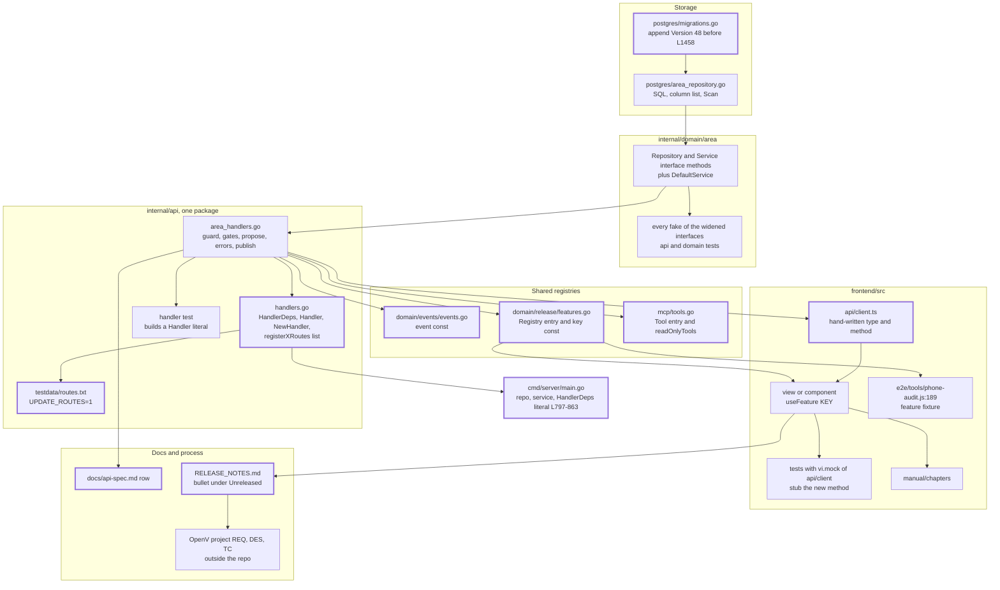
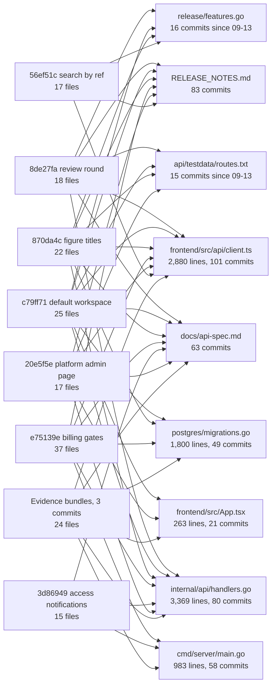
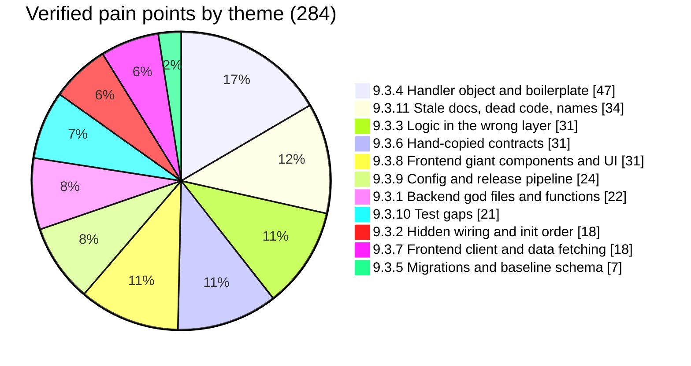
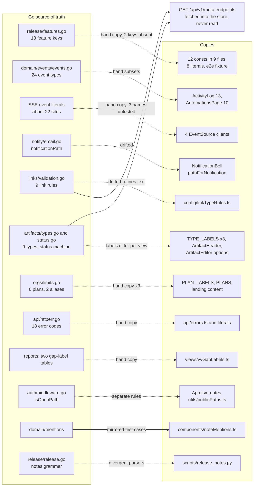
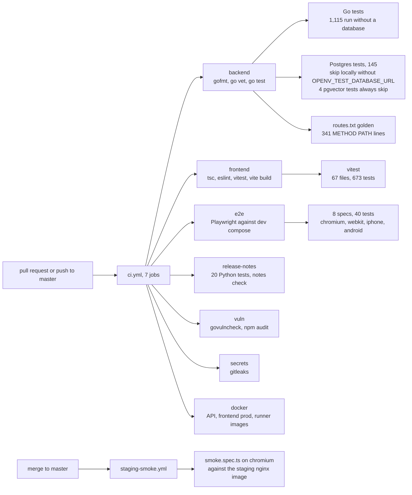
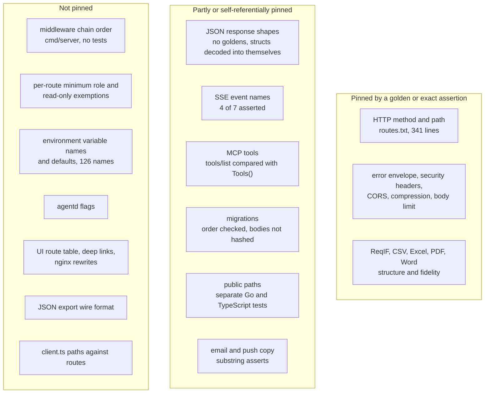
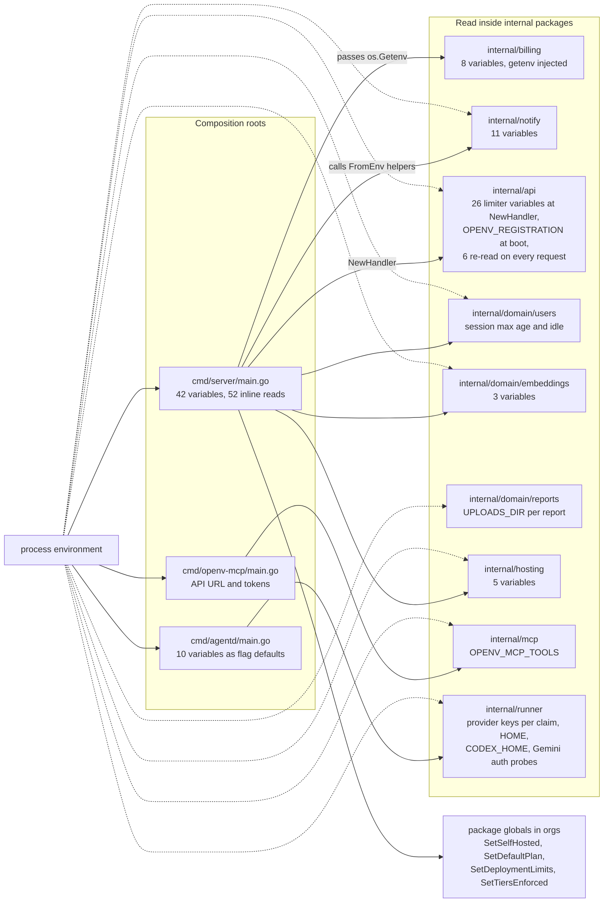

# OpenV codebase architecture analysis — 9–10. Assessment and appendices

Part of the [2026-09-25 codebase architecture analysis](README.md) (commit `d11dee8`).

[Index](README.md) · [4 Backend](backend.md) · [5 Key flows](flows.md) · [6–8 Frontend, data, tooling](frontend-data-tooling.md) · [9–10 Assessment](assessment.md) · [Pain-point register](pain-points.md) · [Refactor plan](../../plans/codebase-refactor.md)

## 9. Where editing is hard today

This section collects the measured evidence of what makes a change to OpenV
expensive or risky: how many files and layers a typical change touches
(§9.1), which files every change ends up editing (§9.2), the 284 verified
pain points grouped into eleven themes (§9.3), the knowledge that is copied
between Go and TypeScript by hand (§9.4), and what the tests would and would
not catch if the structure changed (§9.5). It describes the code as it is at
`d11dee8`. Terms such as hub file, plumbing, golden file and god object are
defined in Appendix B. The steps that fix it are in
[the refactor plan](../../plans/codebase-refactor.md), which cites the
pain-point IDs used here; the full register is
[pain-points.md](pain-points.md).

Method. File and line figures were re-measured at `d11dee8` with `wc -l`,
`grep -c` and `go list`. Commit statistics come from a full clone of
`origin/master` (623 commits, 395 of them non-merge, 2026-02-14 to
2026-09-22), because the working copy is a shallow clone of 116 commits; the
"last 400 non-merge commits" used below are therefore the whole non-merge
history. Churn counts follow renames (`git log --follow`).

**Headline.** Six findings matter most for anyone editing the code:

1. **Crossing the HTTP boundary is what costs.** A feature-gated endpoint
   with UI touches 17 to 25 files in 11 to 14 layers, and 40 to 50% of those
   files are plumbing that carries only 5 to 10% of the changed lines;
   changes that stay inside MCP, the domain or the UI touch 5 or 6 files
   (§9.1).
2. **Five hub files absorb unrelated work.** 152 of the 285 commits that
   change non-test Go or frontend source (53%) edit `internal/api/handlers.go`,
   `cmd/server/main.go`, `internal/persistence/postgres/migrations.go`,
   `frontend/src/api/client.ts` or `frontend/src/App.tsx`; 46 edit three or
   more, and the single migration slice has forced at least nine
   renumbering merges (§9.2).
3. **Two monoliths sit on every request path.** `internal/api` is one Go
   package of 47 files and 19,187 lines whose one `Handler` type has 76
   fields and 498 methods; `client.ts` is 2,880 lines with 145 exported
   types, imported by 127 files and mocked whole by 27 test files (§9.3.1,
   §9.3.4, §9.3.7).
4. **Wiring and business rules hide in the composition root.** `main()` is
   853 lines that read 42 environment variables, make 37 setter calls after
   construction (23 plain calls and 14 chained notify setters) and set 4
   package-level globals in `orgs`, so start-up order is enforced only by
   statement position (§9.3.2, §9.3.3).
5. **Contracts are copied by hand.** Fifteen vocabularies exist in both Go
   and TypeScript (feature keys, event types, link rules, plans, error
   codes, notification deep links, SSE event names and more); only the
   mention-handle pair has a parity test, and the notification deep links
   have already drifted (§9.4).
6. **The tests are broad but pin few user-facing contracts.** The suite has
   1,260 top-level Go tests (with a database, 1,255 pass and 5 skip) and 673
   vitest tests, green apart from one known flaky test, but the only golden
   file is `internal/api/testdata/routes.txt` (341 method-and-path lines). JSON
   shapes, per-route roles, MCP tool schemas, environment variable names,
   SSE event names and UI routes are unpinned, and about 210 of the 325
   HTTP handler methods are never called by name from a test (§9.5).

### 9.1 Change amplification and today's recipes

Change amplification is the number of places one logical change has to
touch. It matters here because most of those places are shared by every
feature (§9.2), so a larger count means more merge conflicts, more
reviewer attention spent on plumbing, and more ways to forget a step that no
test checks. The figures below come from classifying every file a commit
touched into one layer: migration or schema, repository, domain, handler,
the `handlers.go` hub, route inventory, feature registry, event registry,
server wiring, notify, MCP; API client and types, view or component, app
routes, navigation, manual copy, CSS; tests, docs and release notes.
"Plumbing" means lines that carry no new behaviour: they register, wire,
forward, re-declare a contract by hand, or update a fixture or fake so it
still compiles.

#### Sampled commits

| Commit | Change | Kind | Files | Lines changed | Layers | Test lines | Plumbing |
|---|---|---|---:|---:|---:|---:|---|
| `8de27fa` | Send a whole project for review | endpoint, UI, MCP tool, event, feature gate | 18 | 1,133 | 13 | 650 | 8 files, about 71 lines: route line, `routes.txt`, `features.go`, `events.go`, interface method, sentinel error, `client.ts` type and method, MCP passthrough. The logic is 3 files, 333 lines |
| `56ef51c` | Find an artifact by its ref | behaviour across repository, API, UI, MCP | 17 | 624 | 11 | 377 | `features.go`, `client.ts`, MCP schema text, interface method |
| `c79ff71` | Default workspace at sign-in | new column end to end | 25 | 746 | 14 | 431 | 12 files, about 82 lines, including three Go fakes, one `vi.mock` line and the e2e fixture |
| `870da4c` | Rename a figure | new column, endpoint, UI | 22 | 865 | 13 | 447 | route inventory, feature key, `client.ts`, props drilled `ModuleView` to `ArtifactEditor` to `ImageGallery`; the 95-line handler went into the `handlers.go` hub |
| `e75139e` | Billing phase 4 | plan gates, read-only over plan, minutes | 37 | 1,410 | 14 | 578 | gate check pasted into 6 handler files; error code declared in `httperr.go` and `errors.ts`; 33 lines in `main.go` |
| `27f725e` | Gate flow-down and owners on the release channel | retro-fitted feature gate | 9 | 85 | 4 | 0 | all 9 files: registry, gate helper, `handlers.go`, `suite_handlers.go`, 5 components each adding a `useFeature('<literal>')` |
| `3d86949` | Notify on access changes | notification type | 15 | 731 | 10 | 283 | event consts, notification consts, email opt-in list, notifier hook, `main.go` setters, publish helpers, bell link mapping; the logic is `notify/membership.go` |
| `be1bf4f` | MCP tool `confirm_link` | MCP tool over an existing endpoint | 6 | 46 | 4 | 19 | `mcp/tools.go` and the read-only test's prefix list |
| `20e5f5e` | Platform admin page | UI page and admin endpoints | 17 | 794 | 11 | 219 | route line, inventory, `App.tsx`, `UserMenu.tsx`, manual index, `client.ts` |
| `98b6351` | Entitlement plumbing, migration 45 | migration and a field rename | 21 | 1,067 | 6 | 464 | 13 files with edits of 8 lines or fewer, all from renaming `Org.Plan` to `BilledPlan` while its JSON tag stays `"plan"` |
| `8a4748d` | Stale ref prefix on retype | bug fix | 6 | 196 | 4 | 147 | none |
| `5b78a9c`, `de15cc3`, `0847f29` | Evidence bundles | new domain area, 3 commits | 24 | 3,592 | 12 | 953 | `main.go`, 4 edits in `handlers.go`, `App.tsx`, `ProjectLayout.tsx`, 97 lines of hand-copied types in `client.ts`, hooks into `orgs/limits.go` and `vv` |
| `5989efb` | Notes tab becomes History | UI only (control) | 5 | 258 | 4 | 140 | none |

Across the code-changing, non-release commits since 2026-09-13, when the
route inventory and the feature registry arrived and today's process
started, the median commit touches **13 files in 6.5 layers and about 508
changed lines** (42 commits in this re-count; the change-amplification study
counted 44 with the same medians). Tests are consistently 45 to 60% of the
changed lines, which is healthy and is the raw material for the safety net
in §9.5. The three control commits (`be1bf4f`, `8a4748d`, `5989efb`) show
where the cost comes from: **amplification comes from crossing the HTTP
boundary and from the shared registries, not from domain code.**

#### Recipe (a): add a REST endpoint end to end

This is the most common change, modelled on `8de27fa`. The diagram shows
the layers in the order a contributor meets them; thick-bordered nodes are
files every feature shares.

1. **Domain.** Add the method to the area's `Service` interface and
   `DefaultService` in `internal/domain/<area>/<area>.go`, with request and
   result types and sentinel errors (for `8de27fa`,
   `internal/domain/artifacts/artifact.go` and `types.go`).
2. **Storage, if needed.** Add a `Repository` method in the same file and
   implement it in `internal/persistence/postgres/<area>_repository.go`.
3. **Schema, if needed.** Append `{Version: 48, Name: ..., Run: ...}` to
   `var migrations` (`migrations.go:63-1458`). Never edit `InitSchema`
   (`db.go:35`) or `schema_*.go`; they run on every boot (§9.3.5).
4. **Fix every implementation of a widened interface.** `SetDefaultOrg`, for
   example, has five: `users.go:908`, `user_repository.go:142` and three
   test fakes. In `orgs`, 20 of the 38 `DefaultService` methods are one-line
   `return s.repo.X(...)` passthroughs.
5. **Handler** in `internal/api/<area>_handlers.go`, choosing each helper
   deliberately:
   - authorization: `requireProjectRole` (`authz.go:25`) or
     `requireOrgRole` (`authz.go:97`), which also apply the plan read-only
     gate through `requireWritable` (`limits.go:131`);
   - agent writes in proposal mode: `maybePropose` (`authz.go:209`) or an
     explicit refusal;
   - release-channel gate: `projectFeatureEnabled`
     (`feature_handlers.go:104`) with `featureGateMessage` (`:117`);
   - plan flag: `checkFlag` (`limits.go:74`) and `writeLimitError`
     (`limits.go:222`);
   - errors: `writeJSONError`, `respondError`, `respondInternal`
     (`httperr.go:73`, `:85`, `:110`);
   - events: `h.publish` (`handlers.go:384`).
6. **Route.** Register it in the area's `registerXRoutes`, or inline in
   `RegisterRoutes` (`handlers.go:421-512`). A new handler file also needs
   its `h.registerXRoutes(router)` call among the 22 in `RegisterRoutes`.
   Wrap it with `alwaysWritable` (`limits.go:112`) if it must work over
   plan; an unauthenticated route must sit under a prefix `isOpenPath`
   accepts (`authmiddleware.go:85`).
7. **Route inventory.** Regenerate `internal/api/testdata/routes.txt` with
   `UPDATE_ROUTES=1 go test ./internal/api -run TestRouteInventory`.
8. **Event, if any.** Add a constant to `internal/domain/events/events.go`;
   if users should filter on it, also to the hand-kept lists in
   `views/ActivityLog.tsx:9` and `views/AutomationsPage.tsx:15`.
9. **Feature gate.** Add a `Registry` entry (`release/features.go:30`) and
   a key constant (`:56-122`).
10. **New service dependency.** Four edits in two hub files: a
    `HandlerDeps` field (`handlers.go:65-170`), a `Handler` field
    (`:173-284`), a copy in `NewHandler` (`:287-379`), and the repository,
    service and `api.HandlerDeps{...}` literal in `cmd/server/main.go`
    (`:797-863`).
11. **Handler test.** Tests build `&Handler{privateField: ...}` directly:
    137 literals in 60 test files.
12. **Frontend client.** A hand-written TypeScript interface and a method on
    the area's API object in `frontend/src/api/client.ts` (for example
    `reviewAPI` at `:519`).
13. **Frontend UI.** The view calls the method and gates on
    `useFeature(KEY)`, with `KEY` exported from the component (for example
    `REVIEW_ROUND_FEATURE`, `views/ReviewQueue.tsx:28`). If the call runs on
    mount, the test files that `vi.mock('../api/client')` need the method
    stubbed.
14. **Fixtures.** Add the key to the feature map in
    `e2e/tools/phone-audit.js:189` and any mocked responses.
15. **Manual copy** in `frontend/src/manual/chapters/`.
16. **MCP, optional.** A `Tool{}` in `Tools()` (`internal/mcp/tools.go:314-1031`),
    an entry in `readOnlyTools` (`:168-186`) if it only reads, and tests.
17. **Docs.** A row in `docs/api-spec.md`; `docs/data-model.md` if the
    schema changed.
18. **Release note.** A bullet under `## Unreleased` in `RELEASE_NOTES.md`
    (CI-gated).
19. **Outside the repository.** The OpenV Platform artifacts and links
    (CLAUDE.md, "Keeping the requirements project current").

The recipe alone comes to **14 to 20 files for a gated endpoint with UI**;
the sampled commits above, with their tests, touched 17 to 25. Five of them
hold hand-written copies of the same contract: the route line,
`routes.txt`, the `client.ts` type, the MCP path string and the
`api-spec.md` row.

#### Recipe (b): add a field to an existing entity

Modelled on `c79ff71` and `870da4c`, with the spots for `Artifact`:

1. **Migration**: `ALTER TABLE ... ADD COLUMN` appended to `migrations.go`.
2. **Domain struct field and `json` tag** (`artifacts.Artifact`,
   `artifact.go:19`). The tag is at once the REST response shape, the event
   payload, the project export JSON (`exports.ProjectExport` embeds
   `[]*artifacts.Artifact`, `export.go:54`) and the baseline snapshot
   format.
3. **Request structs** `CreateArtifactRequest` (`artifact.go:92`) and
   `UpdateArtifactRequest` (`artifact.go:172`) and the service's copy logic.
4. **Repository.** `artifact_repository.go` repeats the 15-column list in 6
   `SELECT`s (`:137`, `:185`, `:206`, `:230`, `:251`, `:516`) and 2
   `INSERT`s (`:48`, `:369`), with 2 `Scan` sites: about 10 edits.
   `user_repository.go` has a `userColumns` constant and `scanUser`, so 2.
   Only 18 of the 38 repository files define a columns constant.
5. **API**: `CreateArtifact` (`handlers.go:535`), `UpdateArtifact` (`:753`),
   the user-visible change summary `buildChangesList` (`:1092`) and the
   proposal appliers (`proposal_appliers.go`).
6. **Import and export.** JSON import rebuilds artifacts field by field
   (`export.go:677-686`), so a field not added there is **silently dropped
   on import**; CSV `csvRow` (`export.go:399`), Excel, ReqIF, PDF and Word,
   and baseline compare (`baselines/diff.go`) each enumerate fields
   separately.
7. **MCP**: the input schema and argument mapping of `create_artifact`
   (`tools.go:468`) and `update_artifact` (`tools.go:511`).
8. **Frontend**: `interface Artifact` (`client.ts:114`) and the editor and
   detail components, with props drilled through `ModuleView`.
9. **Fixtures**: the e2e audit fixtures, TypeScript test data, Go fakes.
10. **Docs, release note and a feature key** if the change is visible.

A rename is worse than an addition: `98b6351` renamed `Org.Plan` to
`BilledPlan` and touched 13 files in 5 packages, because the domain struct
is also the wire type everywhere.

#### Recipe (c): add a domain area

Modelled on Evidence bundles (3 commits, 24 files, 3,592 lines):

1. `internal/domain/<area>/<area>.go`: entity, `Repository`, `Service`,
   `DefaultService`, `NewDefaultService`.
2. `internal/persistence/postgres/<area>_repository.go` and a Postgres test.
   These tests skip without `OPENV_TEST_DATABASE_URL`, so a local run stays
   green and only CI finds the problem (`4d40e06`).
3. A new-table migration.
4. `cmd/server/main.go`: repository, service, `HandlerDeps` field.
5. `internal/api/handlers.go`: four separate edits (`HandlerDeps`,
   `Handler`, `NewHandler`, the `registerXRoutes` call).
6. `internal/api/<area>_handlers.go` with its `registerXRoutes`. Shared
   helpers can end up here too: `respondJSON` is defined in
   `evidence_handlers.go:51`.
7. `routes.txt`.
8. Cross-area hooks: plan limits (`orgs/limits.go`), other domains (`vv`),
   events and notifications, export, import and baseline decisions, and the
   org purge list (`org_repository.go:601-624`, §9.3.5).
9. Frontend: `client.ts` types and API object, the view, a lazy import and
   `<Route>` in `App.tsx`, `navSections` in `ProjectLayout.tsx:46`, a help
   topic in `helpTopics.ts` (skipped for Evidence: there is no `evidence`
   topic), a manual chapter and its entry in `manual/index.ts`.
10. `docs/api-spec.md`, `docs/operations.md`, the release note, the feature
    key and MCP tools if agents need them.

#### Recipe (d): add an MCP tool

1. If the endpoint does not exist, recipe (a) first.
2. A `Tool{Name, Description, InputSchema, Handler}` in the one slice
   returned by `Tools()` (`internal/mcp/tools.go:314-1031`). The handler
   calls `c.request(METHOD, "/api/v1/...")` with a hard-coded path; nothing
   checks it against `routes.txt`.
3. If the tool only reads, an entry in `readOnlyTools` (`tools.go:168-186`).
   The list is separate from the definition, and a tool left out of it is
   treated as a writer.
4. Tests: `tools_more_test.go` (a fake server asserting method, path and
   body) and `readonly_test.go` (the `writerPrefixes` list).
5. For proposal-mode writes: the operation constant
   (`proposals/proposals.go`), an applier (`api/proposal_appliers.go`) and
   `maybePropose` in the handler.
6. Seeded agent allowlists in `internal/seeds/seeds.go` if a seeded agent
   should get the tool.
7. Agent guidance in `docs/requirements-maintenance.md`, `CLAUDE.md` and
   `.claude/settings.json`; the release note.

`be1bf4f` did this in 6 files and 46 lines: the cheapest cross-surface
change in the sample.

#### Recipe (e): add a UI page

1. `frontend/src/views/<Page>.tsx`.
2. `frontend/src/App.tsx`: a `lazy()` import (`:34-83`) and a `<Route>` in
   the right branch of the tree (`:194-256`: public, signed-in top level,
   or project children).
3. Navigation: `navSections` in `components/ProjectLayout.tsx:46` for
   project pages (optionally with a `feature`), or `components/UserMenu.tsx`
   for top-level pages (`/admin` at `:171`).
4. A public page also goes in `PUBLIC_SEGMENTS`
   (`utils/publicPaths.ts:10`), which duplicates the public routes of
   `App.tsx`.
5. `client.ts` types and API object.
6. A feature key: a constant exported from the view (for example
   `TODO_LIST_FEATURE`, `views/TodoList.tsx:22`), the Go `Registry`, and the
   e2e fixture.
7. A help topic in `components/helpTopics.ts` (`HELP_TOPICS`, `:43`, keyed
   by path segment); `evidence`, `review`, `todos` and `impact` have none.
8. A manual chapter and its place in `manual/index.ts`.
9. `<Page>.test.tsx` with `vi.mock('../api/client')`.
10. The release note and docs.

No page registry exists, so steps 2 to 7 are parallel lists that drift
independently (`fe-shell-6`, `fe-requirements-17`).

#### Editing notes

- **Follow the recipe for the change type, then run the route inventory
  test.** It is the only automated check that catches a forgotten step
  (a removed route); every other list above is checked by nothing.
- **Put a new handler in the area file that owns its URL**, not in
  `handlers.go`; the hub already mixes seven feature areas (§9.3.1).
- **Budget for the fakes.** A new method on a wide `Service` or
  `Repository` interface breaks every hand-written fake that does not embed
  the interface; 120 `fake*`, `mem*`, `stub*` or `mock*` types exist in Go
  tests and 55 of them embed no interface, so each of those has to gain the
  new method by hand.
- **When a change stays out of the HTTP boundary, keep it there.** MCP-only,
  domain-only and UI-only changes are the cheap ones.

### 9.2 Churn and merge-conflict hotspots

Churn is how often a file changes. A file that many unrelated features must
edit is where parallel work collides, and where a reviewer has to separate a
feature from the registration noise around it. The tables below list the
most-changed files over the whole non-merge history (395 commits) and how
the edits to the hub files are distributed.

| File | Commits (of 395) | Churn (lines) | Lines now | Commits since 2026-09-01 (of 221) |
|---|---:|---:|---:|---:|
| `frontend/src/api/client.ts` | **101** | 3,343 | 2,880 | 51 |
| `RELEASE_NOTES.md` | 83 (33 of them release cuts) | 721 | 686 | 83 |
| `internal/api/handlers.go` | **80** | 4,333 | 3,369 | 37 |
| `docs/api-spec.md` | 63 | 1,985 | 1,151 | 56 |
| `cmd/server/main.go` | **58** | 1,619 | 983 | 27 |
| `frontend/src/views/ModuleView.tsx` | 54 | 3,551 | 2,205 | 25 |
| `internal/persistence/postgres/migrations.go` | **49** | 1,939 | 1,800 | 28 |
| `docs/operations.md` | 36 | 1,089 | 869 | 29 |
| `docs/agents.md` | 33 | 1,361 | 1,052 | 19 |
| `frontend/src/components/ProjectLayout.tsx` | 31 | 1,071 | 567 | 15 |
| `internal/api/agent_handlers.go` | 30 | 2,813 | 2,270 | 6 |
| `frontend/src/components/ProjectList.tsx` | 30 | 1,797 | 1,093 | 9 |
| `internal/api/org_handlers.go` | 26 | 1,665 | 1,411 | 15 |
| `internal/api/suite_handlers.go` | 24 | 2,595 | 2,095 | 9 |
| `frontend/src/components/ArtifactDetails.tsx` | 24 | 1,231 | 697 | 5 |
| `internal/domain/artifacts/artifact.go` | 23 | 778 | 630 | 6 |
| `frontend/src/components/ArtifactEditor.tsx` | 22 | 966 | 646 | 9 |
| `frontend/src/App.tsx` | **21** | 377 | 263 | 10 |
| `internal/mcp/tools.go` | 20 | 1,259 | 1,165 | 13 |
| `internal/domain/reports/report.go` | 20 | 4,320 | 1,004 | 7 |
| `internal/domain/release/features.go` | 16 (created 2026-09-13) | n/a | 161 | 16 |
| `internal/api/testdata/routes.txt` | 15 (created 2026-09-13) | n/a | 341 | 15 |

Bold counts mark the five hubs. Most edits to the hubs and registries are
small registrations made on behalf of unrelated features:

| File | Commits | Edits of 3 lines or fewer | 4 to 15 lines | More than 15 lines |
|---|---:|---:|---:|---:|
| `internal/api/handlers.go` | 80 | 11 | 28 | 41 |
| `cmd/server/main.go` | 58 | 7 | 26 | 25 |
| `internal/persistence/postgres/migrations.go` | 49 | 0 | 14 | 35 |
| `frontend/src/api/client.ts` | 101 | 7 | 39 | 55 |
| `internal/domain/release/features.go` (registry) | 16 | 1 | 14 | 1 |

**Hub statistics.** Of the 285 commits that change non-test Go or frontend
source, **152 (53%) touch at least one hub, 87 (31%) touch two or more, and
46 touch three or more.** The study that first measured this (284 commits by
its own filter) found 54% and 31%, and 56% and 37% over the most recent 120
commits: the concentration is not falling. Features that met in
`handlers.go` since 2026-09-01 include billing phases 2 and 4, staging build
SHA, review rounds, figure formats, to-dos, the duplicated-artifact feed,
password reset, figure titles and default workspace; in `main.go`, billing
four times, staging, share links, the support window, stable releases,
feature gates, release announcements and baselines.

#### Recorded conflict evidence

| Hotspot | What happened | Commits |
|---|---|---|
| Migration registry | At least nine merges renumbered or re-ordered migrations; one merge message says the registry "was the only code conflict" | `c148814` ("renumber artifact status migration to 0004 after #157 took 0003"), `e839299`, `ad508b8`, `742fab3`, `ebd9eb2`, `ddce691`, `eedd985`, `d99fc18`, `ebfde60` |
| Migration order | Migration 0022 was inserted above 0021; every Postgres test failed in CI while local runs, which skip without a database, stayed green | `4d40e06` |
| Frozen baseline schema | Edited in 6 feature commits after the ledger was introduced (`a06c1cd`); one edit crash-looped release 0.8.0 on every existing database | broke: `61d5915`; fix: `888dc64` |
| `RELEASE_NOTES.md` | One insertion point under `## Unreleased`; all 4 merge messages that keep a `# Conflicts:` list name this file | `12c60cb`, `8dfdde3`, `f21edd9`, `88f6272` |
| `client.ts`, feature registry, attachment domain | Merge messages describe hand-merged "additive on both sides" conflicts, and a whole-module `vi.mock` of the API client that broke when a component started calling a new method on mount | `c517ebf`, `d99fc18` |

#### Editing notes

- **Expect to rebase on the hubs.** A branch that adds a migration, a
  handler dependency, a client method and a release note will conflict with
  almost any parallel branch; take the next migration version only after
  rebasing, and re-run the Postgres tests with a database before merging.
- **Keep hub edits minimal and in place.** Append to the end of lists, do
  not re-sort or re-align neighbouring lines (`8de27fa` spent 6 of its 17
  `events.go` lines on gofmt re-alignment), and put logic in the area file.

### 9.3 Pain points by theme

Thirteen subsystem analyses produced 284 pain points that survived
adversarial verification: 58 high, 155 medium and 71 low. Each has a stable
ID (`boot-1`, `fe-shell-v3`; a `v` marks one the verifier added) and a full
row in the [pain-point register](pain-points.md), with its category,
evidence and verdict. This section groups them by the editing problem they
cause, so that one remedy can be seen to address many rows. Every pain point
is in exactly one theme; each theme lists its high-severity rows in full and
its medium and low rows by ID.

| # | Theme | High | Medium | Low | Total |
|---|---|---:|---:|---:|---:|
| 9.3.1 | God files and god functions (backend) | 9 | 9 | 4 | 22 |
| 9.3.2 | Hidden wiring: the composition root, init order, setters and globals | 6 | 11 | 1 | 18 |
| 9.3.3 | Logic in the wrong layer | 9 | 20 | 2 | 31 |
| 9.3.4 | The `Handler` god object and repeated boilerplate | 6 | 30 | 11 | 47 |
| 9.3.5 | The migration ledger and the frozen baseline schema | 3 | 2 | 2 | 7 |
| 9.3.6 | Hand-copied contracts across languages and binaries | 4 | 22 | 5 | 31 |
| 9.3.7 | Frontend: the monolithic API client and hand-rolled data fetching | 4 | 11 | 3 | 18 |
| 9.3.8 | Frontend: giant components, page registration and ad hoc UI | 5 | 18 | 8 | 31 |
| 9.3.9 | Configuration and release-pipeline sprawl | 2 | 15 | 7 | 24 |
| 9.3.10 | Test gaps | 9 | 10 | 2 | 21 |
| 9.3.11 | Stale docs, dead code and confusing names | 1 | 7 | 26 | 34 |
| | **Total** | **58** | **155** | **71** | **284** |

Read the counts with the severities: the stale-docs theme is large but
mostly low, while the wiring, wrong-layer and test-gap themes carry 24 of
the 58 high-severity rows between them.

#### 9.3.1 God files and god functions (backend)

A handful of backend files and functions each own many unrelated concerns
(god files and god functions, Appendix B).
They are where edits and merge conflicts concentrate (§9.2), where a reader
has to hold the most context, and, as §9.5 shows, where test coverage is
thinnest. Splitting them is mostly a matter of moving code between files of
the same package, but each carries ordering or wiring that a move has to
keep ([§4.3](backend.md) lists it for `internal/api`).

| ID | Finding | Evidence |
|---|---|---|
| `api-core-1` | `handlers.go` is a 3,369-line hub that mixes the constructor, routing, event publishing, a middleware and seven feature areas | `internal/api/handlers.go`, 68 functions: construction (`HandlerDeps`, `Handler`, `NewHandler`) at `:65-379`, `RegisterRoutes` `:421-512`, artifacts `:535-1297`, links `:1298-1591`, attachments `:2308-2865`, chatter `:3197-3369` |
| `api-requirements-1` | The same file, seen from the requirements handlers: package composition root, route table and nine feature areas | `RegisterRoutes` mixes inline routes with 22 `registerXRoutes` calls (`handlers.go:421-512`); org event helpers (`:404-419`) and `ContentTypeMiddleware` (`:1594`) sit beside artifact code |
| `api-suite-org-1` | Three more god files, each mixing 8 to 11 unrelated resource families | `agent_handlers.go` 2,270 lines, 81 routes (agents, runs, worker protocol, delegation, automations, proposals, repo connections, provider sign-in, crews, domain events); `suite_handlers.go` 2,095 lines, 54 routes; `org_handlers.go` 1,411 lines, 43 routes |
| `domain-requirements-3` | `exports` is a god package: snapshot model, four renderers, two importers and download selection | `internal/domain/exports`, 3,155 non-test lines; `buildReqIF` is 359 lines (`reqif.go:317`); `ProjectExport` (`export.go:43`) is imported by six packages purely as the snapshot type |
| `domain-requirements-5` | `reports` holds three large renderers plus a legacy V&V PDF that duplicates the new renderer's machinery | `pdf_report.go` 1,330, `docx_report.go` 1,085, `report.go` 1,004 lines; `buildVVReportPDF` (`vv_report.go:91`, 213 lines) re-implements fonts, page breaks and truncation differently from `pdfRenderer` |
| `domain-platform-1` | `orgs` is a god package: one 38-method `Service` and a wide `Org` struct for tenancy, membership, billing, budget, logo and release channels | 2,054 non-test lines; `Service` 38 methods (`orgs.go:243-329`), `Repository` 37 (`orgs.go:140-240`); 20 of the 38 `DefaultService` methods are one-line passthroughs |
| `persistence-3` | `OrgRepository` is a 784-line, 45-method repository spanning six concerns | `org_repository.go`: org CRUD, release channel, alert claims, billing (`:263-405`), membership, purge, people-teams (`:670-784`); touches 27 tables |
| `agent-exec-1` | `mcp.Tools()` is a 718-line function holding all 31 tools inline | `internal/mcp/tools.go:314-1031`; `readOnlyTools` kept apart at `:168-186`; run statuses hard-coded at `:1004-1018` instead of the `agentruns` constants |
| `agent-exec-2` | `Worker.execute` is a 261-line lifecycle function mixing policy, secrets, workspace preparation, streaming and result mapping | `internal/runner/worker.go:266-526`; eight near-identical failure-finish blocks (`:311`, `:325`, `:341`, `:367`, `:380`, `:404`, `:414`, `:457`) |

Medium (9): `api-core-11`, `api-core-v1`, `api-requirements-5`,
`domain-platform-7`, `domain-platform-8`, `agent-exec-11`, `agent-exec-12`,
`agent-exec-v4`, `services-6`. Low (4): `api-requirements-12`,
`api-suite-org-13`, `api-suite-org-16`, `services-13`. They add the
75-line `AuthMiddleware.Wrap` closure, the 1,224-line `agentruns.go`, the
eight concerns of `users.go`, the orchestration `Hooks` type, the 168-line
process harness, and route registrations that follow neither the URL nor
the file name (`/api/v1/projects/*` routes are registered from 8 files).

#### 9.3.2 Hidden wiring: the composition root, init order, setters and globals

The server's object graph is built in one 853-line function, and much of its
correctness depends on the order of the statements in it: setters called
after construction, four package-level variables in `orgs` set before
anything reads them, background loops started before the last setter has
run, and bus subscribers dispatched in the order they subscribed. None of
this is visible in a constructor signature, and none of it is tested:
`cmd/server` has no test file. [§4.1](backend.md) walks through the
wiring.

| ID | Finding | Evidence |
|---|---|---|
| `boot-1` | `main()` is an 853-line god function that every feature edits | `cmd/server/main.go:118-970` (853 of 983 lines): about 20 phases in one scope, 115 top-level assignments, 10 `fatal` exits, 4 goroutines; 58 commits have touched the file |
| `services-1` | Background-service composition, lifecycle and business rules live in the same `main()` | it is the only place any notifier, monitor, scheduler or billing loop is built or started; the hosted-runner reconcile (`main.go:320-347`) and the budget guard (`:656-671`) are inline closures |
| `boot-5` | Hidden init order: mutable package globals and 37 post-construction setters (23 plain, 14 chained notify setters) | `orgs` globals set at `main.go:153`, `:161`, `:170` and `:292`; `SetTiersEnforced(true)` must follow `GrandfatherBefore` (`:283-292`); the agent file sync must precede org seeding, enforced only by a comment (`:437-441`) |
| `domain-platform-2` | The `orgs` globals drive entity behaviour and depend on boot order | `selfHosted`, `tiersEnforced`, `defaultPlan`, `deploymentLimits` (`limiterror.go:23-30`, `limits.go:379-385`, `:511-524`, `:540-553`) are read by `Org.EffectiveLimits` (`limits.go:598-631`) and by API code; tests reset them with `t.Cleanup` and so cannot run in parallel |
| `domain-requirements-2` | `links` reaches `artifacts` through `interface{}`, reflection and a JSON round-trip | `SetArtifactService(interface{})` is part of the `links.Service` interface (`link.go:97`); `reflect.ValueOf(...).MethodByName("GetArtifact")` at `link.go:171` is the only production use of `reflect` |
| `services-3` | The single-goroutine bus serialises every subscriber, and SMTP sends run on it | `internal/events/bus.go:88-106`; the queue holds 256 events and drops for every subscriber when full (`:59-73`); `notifier.go:228` sends email inline; subscriber order is statement order in `main` (`:530`, `:576-591`, `:595-598`, `:675`) |

Medium (11): `boot-8`, `boot-9`, `boot-11`, `boot-v1`, `boot-v2`,
`boot-v3`, `api-suite-org-4`, `domain-requirements-7`, `agent-exec-9`,
`services-9`, `services-11`. Low (1): `domain-platform-15`. They cover the
three construction cycles (proposal appliers, guided nudge launcher, and
`NewHandler` rebinding billing after `billing.Start` has launched its
goroutines), the six repeated `SetEmailDispatcher`/`SetPushDispatcher`
pairs, five different background-loop start styles with no shutdown drain,
side effects (seeding, Docker, run launches) interleaved with construction,
the runner pool rewriting `HOME` per lease, and the trap that
`Dockerfile.api` builds `cmd/server/main.go` by file path, so splitting the
file breaks the image.

#### 9.3.3 Logic in the wrong layer

Several use cases are implemented in HTTP handlers or in closures in
`main()` rather than in the domain services that own the data
([§5.2](flows.md) traces the artifact edit through them). The
consequences are concrete. The same operation has several write paths that
already behave differently (events, validation, feature gates); the MCP
server and the document renderers cannot reuse the logic without going
through HTTP; and moving a handler moves business rules with it. The
reverse also happens: domain packages read environment variables and files
(`domain-requirements-12`, and §9.3.9).

| ID | Finding | Evidence |
|---|---|---|
| `domain-requirements-1` | Artifact and link write use cases are orchestrated in HTTP handlers and re-implemented in the proposal appliers | `UpdateArtifact` (`handlers.go:753-905`) does attribute validation, managed link edits, snapshot assembly, change summary and auto-versioning around one service call; `proposal_appliers.go:57-197` re-implements create, update and delete, and skips attribute validation |
| `api-requirements-2` | Link edits, link snapshots, auto-versioning and change-summary text are implemented in `handlers.go` | `processManagedLinkChanges` `:2985-3114`, `autoVersionLinkedArtifacts` `:3117-3194` (assumes the new version is `Version + 1`), `buildChangesList` `:1092-1195`, `buildChangesSummary` `:2866-2955` |
| `api-requirements-3` | Three divergent write paths for the same artifact and link operations | `CreateLink` publishes `link.created` (`handlers.go:1393`); managed link edits publish neither `link.created` nor `link.deleted` (`:3023`, `:3094`); the `artifact.created` payload differs between the handler and the applier (`handlers.go:594-597`, `proposal_appliers.go:69-73`) |
| `domain-requirements-v1` | Four link-write paths enforce different rules and emit different events | `POST /links` answers 400 for a bad type and gates `refines` on `FeatureFlowDown` (`handlers.go:1332-1373`); the managed path logs and skips, then answers 200 (`:3056-3082`); `PUT /links/{id}` validates nothing and clears omitted fields (`links/link.go:230-231`); import accepts any type (`exports/export.go:630-642`) |
| `api-suite-org-3` | Application logic and orchestration live in HTTP handlers | the guided-copilot park-and-take protocol (`suite_handlers.go:1217-1287`), interview turns (`:1776-1837`), V&V flow-down recursion (`:553-584`), the multi-step hosted-runner provisioning that undoes earlier steps when a later one fails (`org_handlers.go:970-1045`) |
| `api-core-4` | Business rules live in the HTTP layer, and domain services call back into the handler | `limits.go` counts seats, projects and hosted minutes and applies the read-only decision (`:85-106`, `:131-157`, `:271-351`), with thresholds from `orgs`; `feature_handlers.go:44-71` decides channel gating; `billing.SetSeatCounter(h.countOrgSeats)` (`handlers.go:373-377`) and `SetAppliers(handler.ProposalAppliers())` (`main.go:868`) |
| `api-suite-org-v1` | Authorization helpers silently double as plan read-only enforcement | `requireProjectRole` calls `requireWritable` for mutating methods (`authz.go:25-36`), `requireOrgRole` always (`:97-102`); bulk proposal review reports "no access" in an over-plan workspace while a single approval answers `plan_read_only` |
| `boot-4` | Business logic, user-facing copy and raw SQL live in the composition root | the event org-backfill SQL (`main.go:229-235`), the `bootstrapOrgID` SQL (`:351-363`), the Docker state mapping (`:320-345`), the budget refusal text (`:656-671`) |
| `domain-platform-4` | Domain policy lives in `cmd/server` closures and API handlers | the runner routing policy with an uncatalogued `runner_grace_seconds` limit (`main.go:452-466`), the budget guard (`:657-670`), the crew-member validator (`:484-487`), seat counting (`api/limits.go:271-322`) |

Medium (20): `boot-6`, `api-core-v4`, `api-requirements-7`,
`api-requirements-9`, `api-requirements-v1`, `api-requirements-v2`,
`api-requirements-v3`, `api-requirements-v4`, `api-requirements-v5`,
`api-suite-org-9`, `domain-requirements-6`, `domain-requirements-12`,
`domain-requirements-v2`, `domain-platform-5`, `domain-platform-v1`,
`domain-platform-v2`, `persistence-8`, `persistence-9`, `services-5`,
`services-v2`. Low (2): `api-requirements-8`, `domain-platform-13`. Among
them: five project-creation paths with different limits and auth, handlers
that store uploaded files themselves under four naming schemes, a
proposal-mode policy that diverts some routes and silently allows others,
the baseline snapshot format decided in a handler and decoded in seven
places, domain rules re-implemented in SQL string literals, automation
launch logic written three times, and the hosted-runner lifecycle split
across handlers, `main()` and `internal/hosting`.

#### 9.3.4 The `Handler` god object and repeated boilerplate

Every handler reaches every service through one struct. The transport code
each handler repeats (decode, guard, map errors, encode) is written by hand
at each site in slightly different ways; persistence repeats scanning,
not-found and transaction code per repository; and several service-level
sequences are copied between producers. Each copy is a place a change must
be repeated, and the differences between copies are observable (status
codes, headers, messages), so consolidating them has to keep each one
(§9.4 has the options and their rules).

| ID | Finding | Evidence |
|---|---|---|
| `api-core-2` | `Handler` is a god object: 76 private fields copied from a 63-field `HandlerDeps`, reachable from every handler file | `HandlerDeps` `handlers.go:65-170`, `Handler` `:173-284` (45 services, 13 rate limiters), `NewHandler` `:287-379`; 137 `&Handler{...}` literals in 60 test files set 61 distinct private fields |
| `api-suite-org-2` | The same object seen from the suite handlers: 498 methods, and tests coupled to its private fields | 498 methods on `*Handler` across 36 files; `suite_handlers.go` alone uses 20 services; `guidedRunnerOnline` (`suite_handlers.go:1058`) reaches into `workerKeyService` |
| `api-core-3` | No single response writer; 145 handler functions encode JSON without setting `Content-Type` | 249 `json.NewEncoder(w).Encode` calls against 92 explicit `application/json` headers; such a response goes out as `text/plain`, or with no `Content-Type` once gzip applies (about 1,400 bytes or more), although `docs/api-spec.md:9-12` promises JSON |
| `domain-requirements-4` | Loading a live project or a baseline as a `ProjectExport` is re-implemented at least 7 times, each via a JSON round-trip | for example `suite_handlers.go:106-128`, `reports/report.go:72-100`, `reports/vv_report.go:29-53`, `baseline_diff_handlers.go:41-72`, `ai_map_handlers.go:35-59` |
| `services-2` | The notification delivery sequence and the admin fan-out are copied across six producers | store, SSE broadcast, email and push repeated 7 times (`notifier.go:217-232`, `budgets.go:160-172`, `minutes.go:112-121`, `release.go:93-103`, `stable.go:169-179` and `:195-204`, `dedicated.go:181-189`); the copies already differ in logging and in skipping the actor |
| `agent-exec-3` | Provider-specific knowledge is spread across many files; the `Adapter` interface covers only `Name`, `Detect` and `Start` | `adapter.go:176-180`; a sign-in switch in `login.go:53-95`; the repo-access gate hard-codes Claude Code (`worker.go:340`); a Gemini tool map in the shared allowlist file (`toolallow.go:110-123`); capability comments and docs omit `antigravity-cli` |

Medium (30): `boot-7`, `api-core-5`, `api-core-6`, `api-core-v2`,
`api-core-v3`, `api-core-v5`, `api-requirements-4`, `api-requirements-6`,
`api-requirements-11`, `api-requirements-14`, `api-suite-org-5`,
`api-suite-org-6`, `api-suite-org-7`, `api-suite-org-8`,
`api-suite-org-10`, `api-suite-org-v3`, `domain-requirements-10`,
`domain-requirements-11`, `domain-requirements-13`, `domain-platform-10`,
`persistence-5`, `persistence-6`, `persistence-7`, `persistence-10`,
`persistence-v3`, `persistence-v4`, `agent-exec-4`, `agent-exec-5`,
`services-8`, `services-v1`. Low (11): `boot-v4`, `api-core-v6`,
`api-suite-org-12`, `api-suite-org-v5`, `api-suite-org-v6`,
`domain-requirements-v5`, `domain-platform-v6`, `persistence-v5`,
`agent-exec-13`, `agent-exec-15`, `services-12`. They include five identity
guard idioms, error-to-status mapping written per call site, rate-limit
buckets silently shared between unrelated endpoints, three not-found
conventions in persistence, copy-pasted scan loops with several scanner
signatures, no shared transaction or context plumbing, and four sign-in drivers
that each re-implement the same loop.

#### 9.3.5 The migration ledger and the frozen baseline schema

Schema changes go through a numbered, append-only ledger that works well at
run time ([§4.5](backend.md), §10.3) but is hard to edit. All 47 migrations
are inline closures in one slice, so every schema change appends at the
same line. The legacy baseline schema that `docs/DEVELOPMENT.md:64,73`
calls frozen is re-run on every boot before the ledger, and it has been
edited anyway. Code that must know every table, such as the workspace
purge, is a hand-kept list. The 0.8.0 outage came from this theme.

| ID | Finding | Evidence |
|---|---|---|
| `persistence-1` | `migrations.go` is a 1,800-line file whose registry is one 1,396-line slice literal | `migrations.go:63-1458` holds 47 inline closures; versions 36 and 37 are both named `release_schedule`; `organizations` is created in the baseline and altered by 8 migrations (11, 19, 22, 31, 35, 36, 45, 47), so no single place shows its current shape |
| `persistence-v1` | The every-boot baseline runs before the numbered migrations and silently co-evolves with them | `runMigrations` applies version 1 (`applyEveryBoot`, re-running `InitSchema` and the `schema_*.go` chain) before versions 2 to 47 on every boot (`migrations.go:1707-1732`); a baseline edit crash-looped 0.8.0 on existing databases (fixed in `888dc64`) |
| `persistence-4` | `PurgeOrg`'s hand-maintained delete list silently drifts from the schema | 22 literal `DELETE`s ordered by hand (`org_repository.go:601-624`); `attachment_figure_counters` is missing, so a purge leaves orphan rows; 65 tables exist and nothing ties a new one to the list |

Medium (2): `persistence-2`, `persistence-v2`. Low (2): `persistence-13`,
`persistence-v6`. The baseline is a chain of idempotent `Init*` functions,
four of them 234 to 361 lines long; the schema a database ends up with depends on its boot
history (tests never reach the production shape); and `BackfillOrgs` is a
133-line, non-transactional boot function that also moves files.

#### 9.3.6 Hand-copied contracts across languages and binaries

The frontend, the worker binaries, the MCP server and the release scripts
all depend on names and shapes the Go server defines, and they get them by
copying: TypeScript interfaces and constants, anonymous structs on both
sides of the runner protocol, a second release-notes parser in Python.
Domain structs double as wire DTOs (Appendix B), so a field rename in Go is a wire change
(recipe (b) in §9.1). §9.4 lists every pair and what, if anything, keeps it
in sync.

| ID | Finding | Evidence |
|---|---|---|
| `fe-requirements-4` | Domain vocabularies are hand-copied from Go while the server's own copies go unused | `config/linkTypeRules.ts:11-86` duplicates `links/validation.go:17-95`; `App.tsx:178` loads `/api/v1/meta/link-types` and `/meta/artifact-types` into `store.meta`, which no component reads; artifact types are hard-coded at `ArtifactEditor.tsx:384-396` |
| `fe-suite-org-4` | Untyped wizard answers and the assistant protocol are string contracts shared with Go and the LLM prompt | answers are `Record<string, any>` (`GuidedWizard.tsx:493-523`) with keys `step_1` to `step_7`, `section_ids` and `copilot_applied` stored as data; the same keys are described to the model at `suite_handlers.go:1983`; step labels are copied into Go at `:1093-1097` |
| `agent-exec-7` | The worker-API wire contract is implicit: anonymous structs on both sides, and domain JSON tags shared with deployed runners | the claim request is a map in the runner (`client.go:123-128`) and an anonymous struct in the API (`agent_handlers.go:638-643`); the claim response is a typed struct in one and a `map[string]interface{}` in the other (`agent_handlers.go:687-733`) |
| `tooling-2` | The `RELEASE_NOTES.md` grammar is implemented twice, in Python and Go, with no shared fixtures | `scripts/release_notes.py:61-87` against `internal/domain/release/release.go:28-66` and `stable.go:27-29`; measured divergences in continuation lines, bullet markers and ungrouped bullets; `docs/railway.md:352-354` calls the Python one "the one implementation" |

Medium (22): `api-core-7`, `api-requirements-10`, `api-suite-org-11`,
`api-suite-org-v2`, `domain-requirements-8`, `domain-requirements-9`,
`domain-requirements-v3`, `domain-requirements-v4`, `domain-platform-3`,
`domain-platform-6`, `domain-platform-11`, `agent-exec-8`,
`agent-exec-10`, `agent-exec-v3`, `agent-exec-v6`, `services-7`,
`services-10`, `fe-shell-5`, `fe-shell-8`, `fe-shell-v2`,
`fe-requirements-5`, `fe-suite-org-11`. Low (5): `boot-12`, `api-core-13`,
`domain-platform-14`, `services-16`, `fe-shell-14`. They include the plan
catalogue spread over 9 Go and 2 TypeScript sites, the citation grammar
(`#REQ-12`, `##REQ-12`) implemented six times in two languages, actor
strings that act as event-loop guards, retry policy derived from substring
matches on error text, and notification deep links that already differ
between Go and TypeScript.

#### 9.3.7 Frontend: the monolithic API client and hand-rolled data fetching

The SPA (the single-page React app, Appendix B) reaches the server through one 2,880-line module, and every view
fetches, caches or not, cancels or not, and reports errors on its own. The
active workspace, which decides what every request returns, travels through
browser storage and an axios interceptor rather than through React state.
[§6.2 and §6.3](frontend-data-tooling.md) describe the client and the
state.

| ID | Finding | Evidence |
|---|---|---|
| `fe-shell-1` | `api/client.ts` is a 2,880-line module mixing transport, 145 wire types, 291 endpoint methods, DOM side effects and UI constants | the axios instance and interceptors (`client.ts:15-110`), two blob-download implementations (`:537-546`, `:2178-2191`), presentation data such as `PLANS` (`:2861-2868`); 127 importing files (92 source, 35 tests), 27 whole-module `vi.mock`s, 101 commits |
| `fe-shell-2` | The active workspace travels from the store to browser storage to the axios interceptor through a repeated magic key | `openv_active_org` is written at `state/store.ts:74-75`, re-read on every request to set `X-Org-ID` (`client.ts:29-30`) and read again at boot (`App.tsx:141-142`) |
| `fe-shell-3` | No data-fetching abstraction: every view hand-rolls fetch, loading, error, cancellation and polling | 159 `useEffect` calls in 79 files, 26 loading and 56 error state pairs, 31 `let cancelled` flags, no `AbortController`, 14 `setInterval` pollers in 11 files; the only cache is a module-level `Map` (`hooks/useUploadLimit.ts:24`) |
| `fe-requirements-3` | Every view re-fetches the same project data with ad hoc loading, error and race handling | the whole-project `artifactAPI.list` is called from 10 files and `projectAPI.get` from 3; the `params.projectId \|\| storeProjectId` resolution is repeated in 16 views; `TraceabilityMatrix.tsx:70-112` and `VVDashboard.tsx:90-125` keep whichever response lands last |

Medium (11): `fe-shell-4`, `fe-shell-9`, `fe-shell-10`, `fe-shell-v1`,
`fe-requirements-9`, `fe-requirements-11`, `fe-requirements-v4`,
`fe-requirements-v5`, `fe-suite-org-5`, `fe-suite-org-7`, `fe-suite-org-8`.
Low (3): `fe-shell-v6`, `fe-suite-org-15`, `fe-suite-org-v7`. They add the
inline error-extraction chains beside `apiErrorMessage`, four hand-rolled
`EventSource` clients with different reconnect rules, an API layer that
imports UI utilities, authentication decided by the 401 interceptor plus a
hand-kept public-path list, and refetch rules hidden in suppressed hook
dependencies.

#### 9.3.8 Frontend: giant components, page registration and ad hoc UI

Four page components hold much of the product's UI logic in single
functions (`ModuleView`, `GuidedWizard`, `ProjectSettings`,
`ProjectList`), with the state and fetches of unrelated concerns side by
side, pure functions defined inside render bodies, and props drilled
several levels down. Styling is mostly inline (2,403 `style={{` against 590
`className=`), the shared UI primitives exist but are bypassed, and adding
a page means editing several parallel lists (recipe (e) in §9.1).

| ID | Finding | Evidence |
|---|---|---|
| `fe-requirements-1` | `ModuleView` is a single 2,161-line component owning a dozen concerns | `views/ModuleView.tsx:43-2203`: 42 `useState`, 9 `useEffect`; loaders, selection, attachment and artifact CRUD, baselines, ordering, a search and filter engine, stepping and a context menu in one function; `ArtifactEditor` receives about 20 props; the filter functions are defined in the render body and cannot be unit-tested |
| `fe-requirements-2` | `ProjectSettings` puts seven tabs and eight data loads in one component | `views/ProjectSettings.tsx:87-1585`: 42 `useState`, 131 inline style objects; the mount effect loads every tab's data whatever the tab (`:401-412`); one shared error state shows a members failure on every tab |
| `fe-suite-org-1` | `GuidedWizard` is a 1,769-line component with 26 state variables and a 596-line render switch | `views/GuidedWizard.tsx:90-1858`; `renderStepContent` `:1117-1712`; `handleNext` is 225 lines (`:685-909`) |
| `fe-suite-org-2` | `handleNext` repeats the materialise-and-persist block five times with subtle per-step differences | `GuidedWizard.tsx:706-870`: step 6 writes no `step_6_ids`; NFR titles are cut at 100 characters and others at 120; step numbers are magic literals throughout |
| `fe-suite-org-3` | Artifact templates and section headings exist twice, despite a module written to prevent that drift | `SECTION_SPECS` (`GuidedWizard.tsx:63-70`) and `SECTION_TITLES` (`components/wizard/suggestionDrafts.ts:290-297`); body templates at `GuidedWizard.tsx:716-850` and `suggestionDrafts.ts:142-211` |

Medium (18): `fe-shell-6`, `fe-shell-7`, `fe-shell-v3`, `fe-shell-v4`,
`fe-requirements-6`, `fe-requirements-7`, `fe-requirements-8`,
`fe-requirements-10`, `fe-requirements-12`, `fe-requirements-15`,
`fe-requirements-v2`, `fe-requirements-v3`, `fe-suite-org-6`,
`fe-suite-org-9`, `fe-suite-org-10`, `fe-suite-org-v1`, `fe-suite-org-v2`,
`fe-suite-org-v3`. Low (8): `fe-shell-13`, `fe-shell-v5`,
`fe-requirements-13`, `fe-requirements-17`, `fe-requirements-v6`,
`fe-suite-org-v4`, `fe-suite-org-v5`, `fe-suite-org-v6`. They include the
1,093-line `ProjectList`, route knowledge spread over about eight places
with 23 hand-built project URLs, labels and status colours re-implemented
per view, sibling ordering with three different comparators, overlay
detection by a global DOM query, two apply-suggestion orchestrators with
different gating, and breakpoints defined twice with different values.

#### 9.3.9 Configuration and release-pipeline sprawl

There is no typed configuration. The server and its binaries read 126
distinct environment variables, 42 of them inline in `main()` and the rest
inside packages, some on every request, each with its own parsing rule
(Appendix A). The same variable can resolve differently at different call
sites: `FRONTEND_URL` has two fallback chains. The release pipeline has the
same shape: its gate logic is written three ways in three workflows.

| ID | Finding | Evidence |
|---|---|---|
| `boot-2` | Configuration is read ad hoc from the environment in many places, with inconsistent parsing | `main.go` reads 42 distinct variables inline; `PUBLIC_URL` is read 5 times and `FRONTEND_URL` 4 times; three integer parsers and five boolean conventions; packages read the environment directly (`notify/email.go:56-62`, `api/ratelimit.go:356-359` on every request, `domain/users/session_policy.go:74`, `domain/embeddings/provider.go:42-47`) |
| `tooling-1` | Three drifted copies of the "master CI is green" gate | `promote-release.yml:48-111` (workflow runs plus non-Actions check runs, `per_page=100`, excludes itself by path), `cut-stable.yml:43-60` (check runs only, default page size, excludes itself by name), `nightly-promote.yml:74-85` (no self-exclusion, so once armed it would likely refuse itself) |

Medium (15): `boot-3`, `api-core-8`, `domain-platform-v3`,
`agent-exec-v5`, `tooling-3`, `tooling-4`, `tooling-8`, `tooling-9`,
`tooling-10`, `tooling-11`, `tooling-14`, `tooling-v1`, `tooling-v2`,
`tooling-v3`, `tooling-v5`. Low (7): `boot-15`, `boot-v5`,
`api-suite-org-17`, `domain-platform-v4`, `services-14`, `tooling-13`,
`tooling-v7`. They include adding a rate limit taking four edits, nil
services doubling as deployment feature flags, one environment map serving
as both the CLI and the MCP environment of a run, release logic in inline
YAML shell and heredoc Python, a hidden rule that a released note may not
contain "pull request", bot pushes that trigger no workflows, workflow file
names used as load-bearing strings, and `.claude/settings.json`
pre-approving every Railway MCP tool.

#### 9.3.10 Test gaps

The high-severity gaps sit where a refactor would cut: the composition root,
the big handler files, the repositories without a test, the runner and the
scheduler. §9.5 has the full inventory and the contracts that are and are
not pinned.

| ID | Finding | Evidence |
|---|---|---|
| `boot-10` | The composition root and the middleware order have no automated test | no test file in `cmd/server`; the chain is assembled only at `main.go:875-921`; `/metrics` is registered outside `RegisterRoutes` (`:883`) and is absent from `routes.txt`; only the compose e2e job and the staging smoke boot the real wiring |
| `api-requirements-15` | Large untested surface in the handlers most likely to be refactored | `internal/api` 47.3% statement coverage; 40 of the 68 functions in `handlers.go` at 0% (attachments, project CRUD, baselines, chatter, templates); every evidence handler and every `Download*` handler at 0% |
| `api-suite-org-15` | Test gaps and brittle scaffolding in the agent, suite and org handlers | 134 of 224 exported handlers in scope are never named in a test (for example `LaunchAgentRun`, `RunAutomationNow`, `CreateHostedRunner`); 47 hand-written fakes against wide interfaces; no test asserts `Content-Type` or full JSON key sets |
| `persistence-11` | Integration tests run only with Postgres; 15 repositories and the vector path are untested in CI | without `OPENV_TEST_DATABASE_URL`, 144 of the package's 145 tests skip; no test constructs 15 of the repositories; CI's `postgres:15` image has no pgvector, so the 4 embedding tests never run |
| `agent-exec-6` | The runner is half tested | `internal/runner` 52.3% and `cmd/agentd` 0% covered; pool nodes, the claim loop, sign-in orchestration and the client's wire calls at 0%; no e2e test drives a real `agentd` |
| `agent-exec-v1` | MCP tool and worker-client routes are never exercised against the real API router | MCP tests pin path literals against a capture server (`tools_more_test.go:23-43`); the 31 `c.request` call sites, about 20 method-and-path shapes, are never checked against `routes.txt` |
| `services-4` | The scheduler and automation packages have no tests; tenancy in trigger matching is unpinned | `internal/scheduler` and `internal/automation` have no test files; the matcher checks project scope only when an automation has one (`triggers.go:51-53`) and loads enabled triggered automations from every workspace (`automation_repository.go:248-254`) |
| `fe-requirements-16` | Large stateful components lack component tests, and existing tests mock module shapes | no test for `ProjectSettings`, `ProjectLayout`, `ArtifactDetails`, `ArtifactEditor`, `LinkPanel`, `VVDashboard`, `TestRunView`, `EvidenceView`, `KanbanBoard` and others; `ModuleView.navigation.test.tsx` covers stepping only |
| `tooling-v4` | The compatibility promise covers more than its tests pin | `docs/release-policy.md:23-27` promises a compatible HTTP API, MCP tools, export formats and runner protocol between stable releases; only the route list is pinned, and the MCP tool surface is guarded by `len(tools) < 21` (`tools_more_test.go:760-761`) |

Medium (10): `api-core-9`, `api-core-10`, `api-core-v7`,
`api-suite-org-v4`, `domain-requirements-15`, `domain-platform-12`,
`agent-exec-v2`, `fe-shell-12`, `fe-suite-org-12`, `tooling-12`. Low (2):
`api-requirements-v6`, `domain-requirements-v6`. They include test setup
that depends on private fields and context keys, route decorators and
handler bindings invisible to the route inventory, an untested interviewer
prompt, untested vendor stream-parser branches, no unit tests for the
frontend shell, and an untyped 609-line e2e audit script.

#### 9.3.11 Stale docs, dead code and confusing names

The code is the source of truth for how the platform works, and several
documents describe an earlier or an aspirational design. A contributor,
human or agent, who trusts them will copy wiring that no longer exists or
set a variable that does nothing. Overlapping names add to the cost: teams,
crews and people-teams; org and workspace; worker and runner; two Go
packages called `events`.

| ID | Finding | Evidence |
|---|---|---|
| `tooling-5` | `docs/architecture.md` describes an aspirational skeleton, not the code | `:103` "V&V Service (future)" and `:126` "ProjectRepository (future)" both exist; `:268-273` shows `api.NewHandler(artifactService, linkService)`, where the real constructor takes a 63-field `HandlerDeps`; `:276-281` claims "No global state"; its testing example uses testify, which is not in `go.mod` |

Medium (7): `api-suite-org-14`, `domain-platform-9`, `services-v3`,
`fe-requirements-v1`, `tooling-6`, `tooling-7`, `tooling-15`. Low (26):
`boot-14`, `api-core-12`, `api-core-14`, `api-requirements-13`,
`api-suite-org-18`, `domain-requirements-14`, `domain-requirements-16`,
`domain-platform-16`, `domain-platform-v5`, `persistence-12`,
`persistence-14`, `persistence-15`, `agent-exec-14`, `services-15`,
`services-v4`, `services-v5`, `fe-shell-11`, `fe-shell-15`, `fe-shell-v7`,
`fe-requirements-14`, `fe-requirements-18`, `fe-suite-org-13`,
`fe-suite-org-14`, `fe-suite-org-16`, `tooling-16`, `tooling-v6`.

The documents that disagree with the code today, where the code is right
and the document should change:

| Document | Says | The code |
|---|---|---|
| `docs/architecture.md` | the skeleton above; a "Dashboard" view (`:55`); a two-service domain layer (`:97-126`) | 43 domain packages; no Dashboard view (only `VVDashboard`) |
| `docs/DEVELOPMENT.md:64,73` | the baseline schema is frozen | edited in 6 feature commits after the ledger arrived; no guard test (§9.3.5) |
| `docs/DEVELOPMENT.md:141-142` | `make connector-dist` produces `dist/*.zip` | it produces `dist/openv-connector-windows.exe` and `dist/openv-connector-linux` (`Makefile:141-150`) |
| `docs/api-spec.md` | a route inventory of 296 method-and-path rows; "all responses use `application/json`" (`:9-12`) | 341 registered pairs, 46 of them missing from the doc (for example `GET /api/v1/search` and the project download routes); about 145 handler functions set no content type |
| `docs/operations.md:467` | `OPENV_MAX_UPLOAD_MB` defaults to 25 | 128 or the plan's limit (`internal/api/attachment_safety.go:47`); `:588` of the same file is right |
| `docs/operations.md:446` | the nginx body cap matches `OPENV_MAX_BODY_MB` | `frontend/nginx.conf:128` sets `client_max_body_size 0` |
| `docs/operations.md:99,113-126`, `docker-compose.yml:56` | four email and push notification types | seven (`internal/notify/email.go:148-160`) |
| `docker-compose.prod.yml:55` | the hosted-runner PID limit defaults to 256 | 1024 (`internal/hosting/docker.go:73`) |
| `docs/railway.md:544` | host workers set `RUNNER_API_URL` | `agentd` reads `OPENV_API_URL` or `--api` (`cmd/agentd/main.go:94`) |
| `docs/railway.md:352-354` | `scripts/release_notes.py` is the one implementation of the notes rules | Go parses the same file (`internal/domain/release/release.go`) |
| `docs/release-policy.md:80` | compatibility is "Enforced" | only the route list is pinned (§9.5) |
| `README.md:9-15` | "MVP (v0.1.0)"; link types such as `implements` | 31 numbered releases; `implements` and `depends-on` are not link types |
| `Dockerfile.api:59-65` | 6 runtime variables | the server reads about 100 (Appendix A) |
| `.github/workflows/ci.yml:309` | "the CRA dev server" | Vite |
| `internal/domain/embeddings/provider.go:39` | documents `OPENV_EMBEDDING_PROVIDER` | nothing reads it |

#### Editing notes

- **A fix for one high-severity row usually fixes several medium ones.**
  Moving the artifact and link write use cases into the domain
  (`domain-requirements-1`) also removes `api-requirements-2`,
  `api-requirements-3` and `domain-requirements-v1`, and the four copies
  of the managed-link rules; the refactor plan is organised that way.
- **Some rows describe behaviour to keep, not to fix.** The divergent
  write paths, the missing `Content-Type`, the per-view label variants and
  the two `FRONTEND_URL` chains are observable today. Unifying them is a
  product change with its own release note, not part of a
  behaviour-preserving pass.
- **Cite the register ID** in a commit or pull request that resolves a
  pain point, so the register and the plan can be kept current.

### 9.4 Duplication and Go-TypeScript contract drift

Duplication here means the same rule, shape or sequence written out more
than once by hand. It is the mechanism behind much of §9.1 (each copy is one
more file to edit) and behind the drift in §9.3.6 (copies that were
supposed to agree and no longer do). This subsection measures the repeated
code, ranks the consolidation opportunities, and lists every Go constant set
that TypeScript (or Python) copies. Counts are non-test code at `d11dee8`.

#### How much is repeated

| Area | Measure | Count |
|---|---|---|
| Handler JSON output | `json.NewEncoder(w).Encode` calls in `internal/api`; explicit `Content-Type: application/json` headers | 249; 92 |
| Handler JSON input | `json.NewDecoder(r.Body).Decode` calls; the literal `"invalid request body"` (plus one `"Invalid request body"`) | 109; 106 + 1 |
| Error helpers | occurrences of `writeJSONError`, `respondInternal`, `respondError`, `writeJSONErrorCode`; per-feature error writers | 500, 271, 78, 20; 8 |
| JSON helper in the wrong file | `respondJSON`, defined at `evidence_handlers.go:51` and also called from `billing_handlers.go`, `limits.go` and `org_handlers.go` | 18 occurrences in 4 files |
| Guards | `require*` guard functions; the files they are spread over | 15; 8 |
| Path parameters | `mux.Vars(r)` lookups; distinct path-parameter names in `routes.txt`, 8 of them spellings of an id (`{id}`, `{userId}`, `{projectID}`, `{artifactID}` and others) | 216; 11 |
| Row scanning | `.Scan(` calls; `rows.Next()` loops; repository files with a columns constant | 125; 81; 18 of 38 |
| Frontend fetching | `useEffect` calls; `let cancelled` flags; `AbortController` | 159 in 79 files; 31; 0 |
| Frontend errors | `apiErrorMessage(` calls; inline `response?.data?.error` chains | 156; 54 in 19 files |
| Frontend styling | `style={{` against `className=` | 2,403 against 590 |

#### Ranked consolidation opportunities

From the duplication study, ranked by value for editing. "Risk" is the risk
to user-facing behaviour if the rule in the last column is followed.

| Rank | Opportunity | Estimated lines saved | Risk | Rule that keeps it behaviour-preserving |
|---:|---|---|---|---|
| 1 | Persistence kit: `queryAll[T]` and `queryOne[T]` over one row-scanner interface, one `scanX` and one columns constant per entity, `withTx`, shared null and JSONB helpers | 450 to 600 | Low | keep nil versus empty results per method (JSON `null` versus `[]`), SQL text and `COALESCE` defaults; one repository per pull request |
| 2 | Handler I/O helpers: `writeJSON`, `decodeJSON`, `pathID`; retire `respondJSON` | 250 to 350 | Low; the header is observable | keep the `"invalid request body"` text and its one capitalised variant; either keep today's missing `Content-Type` or ship the header fix as a separate, release-noted change |
| 3 | Declarative error table per domain (sentinel, status, message or passthrough, code), replacing the 8 bespoke writers and inline `errors.Is` ladders | 250 to 400 | Medium | golden status-and-body tests first; keep `err.Error()` passthrough where used today; keep the blanket-404 sites as explicit rules |
| 4 | Handler construction: `Handler` embeds `HandlerDeps`; limiters and billing grouped in sub-structs | 150 to 180 | Low | internal only; the route inventory pins the surface |
| 5 | Cross-language contract: emit the Go catalogues (link rules, types, statuses, feature keys, events, plans, error codes, gap labels, providers) to a generated TypeScript module with a CI drift check; one Go gap-label table | 150 to 250 of hand copies | Low | generate values byte-identical to today's TypeScript; keep per-view label variants as named overrides; keep the TypeScript `refines` tooltip text |
| 6 | Guard consolidation: every `require*` in `authz.go`; one `requirePlatformAdmin(w, r, msg, anonStatus)` | 60 to 100 | Low | keep each site's message and its 401-versus-403 choice (`shared_product_handlers.go:203-207` answers 403 to anonymous callers) |
| 7 | Not-found normalisation: repositories return domain sentinels with identical text | 0 to 60 | Low to medium | same `Error()` strings; the only status change is a race path (500 becomes 404), to be released as a bug fix |
| 8 | Split `client.ts` into per-area modules and type files behind a re-exporting barrel module (one file that re-exports them all); one download helper; one stream-URL builder | 20 to 40 (editability, not size) | Low | the barrel keeps all 127 importing files and 27 `vi.mock` targets working |
| 9 | `useApiResource` and `useEventStream` hooks; inline error extraction through `apiErrorMessage` | 250 to 400 | Medium | keep each view's loading and fallback copy and `RunDetailPanel`'s `after_seq` resume; decide explicitly on string-body messages, which `apiErrorMessage` renders differently |
| 10 | UI primitives: muted-text and utility classes, an `Overlay` primitive with z-index tokens, defined `.btn*` classes | 150 to 250 of style noise | Medium | reproduce the effective cascade (`ProjectList.css` overrides `index.css` app-wide); no new Escape or focus handling in the same step; visual diff per screen |
| 11 | Typed DI: replace the reflection in `links` with a typed port; constructor options where no cycle exists | 30 to 60 | Low | internal only |
| 12 | One `parseLimit(q, policy)` for the seven pagination parsers | 30 to 50 | Medium | the policy table must encode today's seven behaviours (clamp, pass-through, 400) |
| 13 | One environment helper package for the three `envOr` copies and their variants | 30 to 50 | Low | keep names, defaults and each variable's parse rule (Appendix A) |
| 14 | Shared upload helper for the multipart handlers | 40 to 80 | Medium | keep the buffered or streamed choice per route, size limits, error text and stored file-name patterns |

The study's suggested order: safety nets first (§9.5), then 4, 2, 6 and 1
(mechanical and low risk), then 7 and 3, then 5, then 8, and 9 and 10 last.

#### Constants and vocabularies held in both Go and TypeScript

Fifteen vocabularies exist in both languages, and the release-notes grammar
exists in Go and Python. Only one pair has an automated parity check.

| Concept | Go source | Copies | What keeps them in sync | Drift today |
|---|---|---|---|---|
| Feature keys (18) | `internal/domain/release/features.go:30-53` (registry), `:56-122` (keys) | 12 `*_FEATURE` constants in 9 files, 8 `useFeature('<literal>')` calls, `e2e/tools/phone-audit.js:189`, release-note prose | nothing | `password-reset` and `antigravity-cli` are registered but not gated in TypeScript (by design for password reset) |
| Domain event types (24) | `internal/domain/events/events.go:10-67` | `views/ActivityLog.tsx:9-23` (13), `views/AutomationsPage.tsx:15-26` (10) | a comment | the two lists are UI subsets that differ from each other; saved automations filter on these strings |
| SSE event names (7: `log`, `partial`, `status`, `message`, `assistant_partial`, `notification`, `error`) | string literals at about 22 sites (`api/sse.go:40,49,57`, `agent_handlers.go:571,575`, `suite_handlers.go`, `notify/*.go`, `orchestration/hooks.go`) | `RunDetailPanel.tsx:262-285`, `GuidedChatPanel.tsx`, `NotificationBell.tsx`, `InterviewChat.tsx:56,64` | nothing; `log`, `partial` and `status` are asserted by no test | none known |
| Notification deep links | `internal/notify/email.go:253-276` `notificationPath`, reused for web push (`push.go:393`) | `components/NotificationBell.tsx:31-61` `pathForNotification` | nothing; the TypeScript function is not exported or tested | **drifted**: the bell handles `release`, `support_window`, `membership` and `project_membership`; email and push fall back to `/projects` |
| Link type rules (9) | `internal/domain/links/validation.go:17-95`, also served at `/api/v1/meta/link-types` | `config/linkTypeRules.ts:11-86`; `LinkTypeRule` declared twice (`client.ts:916` and `linkTypeRules.ts`) | a comment; the meta endpoint is fetched into `store.meta` (`App.tsx:178`) and never read | **drifted**: the `refines` description differs; the TypeScript text shows as a tooltip |
| Artifact types (9) and labels | `internal/domain/artifacts/types.go:31-41`, also served at `/api/v1/meta/artifact-types` | `ARTIFACT_TYPES` (`wizard/suggestionDrafts.ts:34`), three `TYPE_LABELS` maps, `<option>`s at `ArtifactEditor.tsx:384-396`, `QUALITY_LINTED_TYPES` | nothing | labels differ per view ("User Need" and "User need"); this is UI copy, so each variant is kept |
| Artifact status machine | `internal/domain/artifacts/status.go:14-42` | `components/ArtifactHeader.tsx:10-29`; the `ArtifactStatus` type in `client.ts` | a comment | none |
| Plans (6 plus 2 aliases) | `internal/domain/orgs/limits.go:45-67`; also a plan list inside a message in `org_handlers.go` | `PLAN_LABELS` (`components/org/OrgBillingTab.tsx:20`), `PLANS` (`client.ts:2861`), `landing/content.ts` | a comment | the two label maps cover different aliases |
| Error codes (18) | `internal/api/httperr.go:15-61` | `api/errors.ts`, `client.ts:102`, `views/ResetPassword.tsx:70` | nothing | none |
| V&V gap labels (7) | two Go copies: `reports/vv_report.go:232-238`, `reports/report.go:996-1002` | `views/vvGapLabels.ts:11-19` | a comment | identical today |
| Agent providers | `internal/domain/providers/providers.go:13-21`; the provider-to-key-variable map is itself in 3 Go places | `components/agents/AgentEditor.tsx` `FALLBACK_PROVIDERS`, a colour switch in `AgentsPage.tsx` | a comment | none |
| Upload extensions | `internal/domain/attachments/kind.go` | `attachmentKinds.ts:104-110` | a comment | none |
| Public (unauthenticated) paths | `isOpenPath` (`internal/api/authmiddleware.go:85-102`) | public routes in `App.tsx` and `PUBLIC_SEGMENTS` (`utils/publicPaths.ts:10`) | each list tested on its own; no cross-check | none known |
| Guided wizard steps and answer keys | `guidedStepLabels` (`suite_handlers.go:1093-1097`) and the prompt legend (`:1983`) | `STEP_LABELS` (`GuidedWizard.tsx:72-81`) and the stored answer keys | a comment | none known |
| Mention handles | `internal/domain/mentions` | `components/noteMentions.ts` | **mirrored test cases** (`mentions_test.go:60`, `noteMentions.test.ts:21`) | none; the only pair with a parity check |
| Release-notes grammar (Go and Python) | `internal/domain/release/release.go:28-66`, `stable.go:27-29` | `scripts/release_notes.py:61-87` | `TestEmbeddedNotesParse` parses the committed file only | continuation lines, bullet markers and ungrouped bullets are parsed differently (`tooling-2`) |

Beyond the constants, the **wire types** are copied too: `client.ts` holds
145 hand-written exported types. A tag-by-tag comparison of 40 name-matched
Go struct and TypeScript interface pairs found the TypeScript side almost
always a strict subset (for example `AgentRun` omits 11 Go fields) and no
field that exists only in TypeScript except those added by API-layer
wrappers. There is no live field drift today, but nothing would catch one:
no OpenAPI document, no code generation and no JSON golden exists. The
runner protocol is the same problem across binaries (`agent-exec-7`), with
the added constraint that an installed `agentd` may be older than the API.

#### Editing notes

- **When you add a feature key, event type, plan, error code, link type,
  artifact type or notification kind, edit every copy in the table above
  in the same change.** Nothing will tell you if you miss one.
- **Do not "fix" a copy to match Go during a refactor.** The TypeScript
  `refines` tooltip, the per-view type labels, the bell's deep links and the
  UI subsets of event types are what users see today; changing them is a
  product decision with its own release note.
- **A consolidation step is behaviour-preserving only if it keeps the
  bytes.** The rules column of the ranking table lists what each step must
  keep; land the matching golden test first (§9.5).

### 9.5 The safety net today

A behaviour-preserving refactor is only as safe as the tests that would fail
if behaviour changed. This subsection lists what tests exist, what they
produced on a clean checkout, which user-facing contracts they pin, and
where the live OpenV Platform project records verification. The short
answer: the suite is broad and green, but most user-facing contracts are
pinned only indirectly, or by tests that compare the code with itself, and
the code a refactor would split first has the thinnest coverage.

#### Test inventory

| Layer | Where | Files | Tests | Runs in | Notes |
|---|---|---:|---:|---|---|
| Go unit and handler tests | `cmd/`, `internal/` | 235 test files (52,872 lines) for 239 source files (74,452 lines) | 1,260 top-level `Test` functions | CI `backend` job | handler tests call `h.X(rec, req)` directly with fakes; 73 files and 345 tests are in `internal/api` |
| Postgres integration | `internal/persistence/postgres` | 42 test files | 145 | CI `backend` job with a `postgres:15` service | skip unless `OPENV_TEST_DATABASE_URL` is set (`testdb_test.go:19`); each test creates and drops its own database |
| Route golden | `internal/api/testdata/routes.txt` | 1 | 2 (`route_inventory_test.go`) | CI | 341 `METHOD PATH` lines from `mux.Router.Walk`; a removal fails; regenerate with `UPDATE_ROUTES=1` |
| Frontend unit and component | `frontend/src/**/*.test.ts(x)` | 67 files (10,306 lines) | 673 | CI `frontend` job | jsdom, `createRoot` and `act`; 27 files `vi.mock` the whole API client; no coverage tooling installed |
| End to end | `e2e/tests/*.spec.ts` | 8 specs | 40 active, 1 skipped | CI `e2e` job | runs against the development compose stack (Vite dev server), not the nginx production image; Chromium, WebKit, iPhone and Android projects |
| Staging smoke | `.github/workflows/staging-smoke.yml` | reuses `smoke.spec.ts` | 8 | every push to master, Chromium only | against the real staging deployment and its nginx image |
| Scripts | `scripts/release_notes_test.py` | 1 | 20 | CI `release-notes` job | `scripts/openv/sync.py` (490 lines) has no tests |
| Other gates | `.github/workflows/ci.yml`, `codeql.yml` | | | CI | gofmt, go vet, govulncheck, npm audit, gitleaks, three Docker builds, CodeQL |

Fourteen Go packages, 2,956 lines, have no test file. The largest are
`cmd/server` (983 lines), `internal/domain/workitems` (389),
`internal/domain/notifications` (227), `internal/domain/repoconns` (210),
`internal/scheduler` (170), `internal/automation` (159) and `cmd/agentd`
(149). On the frontend, about 23,000 lines of views and components (60 to
70 files, depending on whether a test that only imports a component counts)
have no test file of their own; the largest are `GuidedWizard.tsx` (1,858), `ProjectSettings.tsx`
(1,585), `CrewBuilder.tsx` (849), `ArtifactDetails.tsx` (697),
`ArtifactEditor.tsx` (646) and `KanbanBoard.tsx` (645).

#### Local baseline at `d11dee8`

Two runs on the same commit: the safety-net study's (Go 1.25.14, Node
22.22.2 where CI uses 24, Postgres 16 where CI uses 15) and a re-run for
this document on the same machine. Times are wall clock with a warm cache.

| Command | Safety-net study | Re-run for this document |
|---|---|---|
| `go build . ./cmd/... ./internal/...` | ok, 4 s | ok, 2 s |
| `go vet . ./cmd/... ./internal/...` | ok, no findings, 3 s | ok, no findings, 1 s |
| `gofmt -l ./cmd ./internal` | clean | not re-run |
| `go test . ./cmd/... ./internal/...` without a database | 1,114 pass, 145 skip, **1 fail** (the flaky test below), 36 s | 1,115 pass, 145 skip, 0 fail (subtests: 885 pass, 4 skip) |
| the same with `OPENV_TEST_DATABASE_URL` (scratch Postgres 16) | 1,255 pass, 5 skip, 0 fail, 101 s | not re-run |
| `go test -race` on `api`, `notify`, `orchestration`, `events`, `mcp`, `runner` | clean, 73 s | not re-run |
| `go test -cover -coverpkg=./...` with a database | 58.0% of 25,787 statements, 114 s | not re-run |
| `npx tsc --noEmit` | ok, 16 s | ok, 12 s |
| `npm run lint` | ok, no findings, 9 s | ok, no findings, 7 s |
| `npx vitest run` | 67 files, 673 tests pass, 36 s | 67 files, 673 tests pass, 24 s |
| `vite build` (output outside the repository) | ok, chunk-size warning only | ok, chunk-size warning only, 3 s |
| `release_notes_test.py` and `release_notes.py check` | 20 ok, notes ok | not re-run |
| Playwright e2e | not run: no Docker daemon | not run: no Docker daemon |

Skips, explained: without a database, 144 Postgres tests, one runner test
that needs a real vendor CLI (`TestPTYRelayAgainstRealCLI`) and 4 by-design
subtests of `TestValidateLinkTypeRules`. With a database, the 4 pgvector
tests (`TestNearestByEmbedding`, `TestDuplicateCandidates`,
`TestEmbeddingRepositoryUpsert`,
`TestVectorReconcileCreatesWhenExtensionAppears`) still skip because the
`vector` extension is absent; CI's `postgres:15` image lacks it too, so
**those 4 never run anywhere**.

**The pre-existing flaky test.**
`TestReInvitingResendsWhenTheFirstMailNeverLanded` fails with
`registration_invitation_test.go:1600: a delivered link left no
last_emailed_at behind` in one of the study's two full runs, and in 1 of
400 runs under `-count=200 -cpu 1,2`; it passed in this document's re-run. The
cause is in the test double: the fake mailer signals `sent` inside `Send`
(`email_verification_handlers_test.go:82-89`), the handler's goroutine
calls `MarkEmailed` only after `Send` returns (`invitation_handlers.go:323-331`),
and the test reads the stamp immediately after `<-mailer.sent`
(`registration_invitation_test.go:1598-1601`). The fix is test-only: poll
with a deadline, or have the fake `MarkEmailed` signal its own channel.
Until then, a red run of this one test on a refactor pull request says
nothing about the refactor.

#### Coverage where the refactor will cut

Merged statement coverage with a database (safety-net study):

| File or package | Statement coverage | HTTP handlers never called by name from a test |
|---|---|---|
| `cmd/server/main.go` | 0% | n/a |
| `internal/api` (whole package) | 47.3% | about 210 of 325 |
| `internal/api/handlers.go` | 34.9% of 1,463 | 33 |
| `internal/api/agent_handlers.go` | 29.0% of 1,233 | 55 |
| `internal/api/suite_handlers.go` | 32.8% of 1,098 | 43 |
| `internal/api/org_handlers.go` | 28.4% of 744 | 31 |
| `internal/api/evidence_handlers.go` | 13.0% of 270 | 12 |
| `internal/api/download_handlers.go` | the `Download*` handlers at 0% | 7 (every `Download*`) |
| `internal/persistence/postgres` | 47.9% | n/a |
| team, work-item, project, agent and member repositories | 0% | n/a |
| `vv_repository.go`; `automation_repository.go` | 10.0% of 80; 12.4% of 89 | n/a |
| `internal/runner` | 52.3% | n/a |

The untested handlers include core CRUD: project create, read, update and
delete; baselines; link read, update and delete; every attachment handler;
work items; test runs; automations; `LaunchAgentRun`; and the V&V
coverage, gap and matrix endpoints. The count of never-named handlers
depends on how a reference is matched: 213 in the safety-net study, 204 to
214 in re-counts for this document.

#### Which user-facing contracts are pinned

| Contract | Status | Pinned by | Gap |
|---|---|---|---|
| HTTP route table (method and path) | **pinned** | `route_inventory_test.go` and `testdata/routes.txt` | `/metrics` is registered in `main.go:883`, outside the golden; the golden does not record the handler bound to a route, its minimum role, the 9 `alwaysWritable` read-only exemptions, or registration order (the delegate-before-`{id}` rule) |
| Error envelope `{error, code}` | pinned | `httperr_test.go`; `errorBody` decoded 15 times in tests | |
| Security headers, CORS, body limit, compression, session cookie | pinned per middleware | `security_headers_test.go`, `compression_test.go`, `session_cookie_test.go` | the assembled chain order (`main.go:875-921`) is untested; the cookie name is asserted against its own constant |
| Public (unauthenticated) paths | partial | Go `isOpenPath` and TypeScript `PUBLIC_SEGMENTS`, each tested separately | no cross-check between the two lists |
| Per-route authorization | **not pinned** | `TestRequireProjectRole` tests only the helper | the 184 inline `h.requireProjectRole` and `h.requireOrgRole` calls can change silently |
| Read-only over plan (REQ-177) | partial | `plan_gates_test.go` | the set of 9 exempt routes is not snapshotted |
| JSON response shapes | **partial, mostly self-referential** | field-level asserts; many tests decode into the same Go structs they check, so a renamed `json:` tag round-trips and passes | no JSON golden anywhere; 145 hand-written TypeScript types depend on these shapes |
| Status codes | partial | about 420 `w.Code` and `rec.Code` comparisons | only for tested handlers |
| SSE event names | partial | `notification`, `message`, `assistant_partial` and `error` asserted in Go | `log`, `partial` and `status` (the agent-run stream) are asserted nowhere, and `RunDetailPanel.tsx` has no test |
| Domain event types | weak | constants in `internal/domain/events` | only 3 literals asserted; the TypeScript lists are unchecked |
| MCP tool names and schemas (31 tools) | **self-referential** | `stdio_test.go:220-243` compares `tools/list` with `Tools()` itself | a rename or schema change passes; the broader test only checks `len(tools) < 21` |
| Migrations | partial | ordering, duplicate and once-only checks (`TestRegistryIsOrderedWithoutDB`), fresh, pre-ledger and concurrent-boot tests | applied migration bodies are not checksummed and there is no schema snapshot |
| Export formats | structural | ReqIF round trip, CSV, Excel, PDF and Word fidelity tests | JSON export is checked by round trip only; the 4 real exports in `docs/exports/*.json` are used by no test |
| Report downloads | weak | `report_format_test.go` (content type) | the 7 `Download*` handlers are not exercised |
| Environment variable names and defaults | **not pinned** | 43 `t.Setenv` calls spot-check a few | 126 names read (Appendix A); none inventoried |
| `agentd` flags, `openv-vapid` output | **not pinned** | | 12 flags, 10 of them with environment fallbacks (`cmd/agentd/main.go:94-105`) |
| UI routes | **not pinned** | `publicPaths.test.ts`, `navSections.test.ts` | no route-table snapshot; the backend builds deep links (`/verify-email?token=`, `/reset-password?token=`, `/login?invite=`, `/s/<token>`, notification links) and nginx rewrites `/share/` and `/open-source/p/` to API pages; nothing checks either against the router |
| Frontend client against backend routes | **not pinned** | | a prototype matched 278 of 282 literal `client.ts` call sites to `routes.txt`; the 4 misses were template noise |
| Email and web-push copy | partial | substring asserts | no golden |
| nginx production config and headers | staging only | `staging-smoke.yml` | CI's e2e job uses the Vite dev image |

#### Verification in the OpenV Platform project

The live requirements project records which requirements have verification
evidence. The safety-net study read it (read-only) at `d11dee8`:

| Measure | Value |
|---|---|
| Artifacts | 422: 179 requirements, 104 test cases, 72 design items, 20 headings, 18 needs, 16 hazards, 9 descriptions, 4 personas |
| Links | 500 |
| Requirement rollup (`get_vv_coverage`) | 139 pass, 14 verified manually, 23 uncovered, 1 blocked (REQ-123 Workspace limits), 1 unrun (REQ-93 Upload limits), 1 with no method (REQ-132 Baseline capture) |
| With evidence | 153 of 179 (85%); recorded test evidence for 139 (78%) |
| Gaps (`get_vv_gaps`) | 4 requirements with no test case (REQ-104, REQ-106, REQ-107, REQ-142); 19 unverified by demonstration, analysis or inspection; 0 failing; 0 orphan test cases; 1 need without a requirement (NEED-18); 2 unmitigated hazards (HAZ-12 unencrypted backups, HAZ-14 open metrics endpoint) |

The manually verified and uncovered requirements line up with the code gaps
above. REQ-23 (unified kanban) rests on a domain package with no tests and a
repository at 0%; REQ-24 (automation) on two packages with no tests;
REQ-13 (test run recording) on untested handlers and a repository at 10%;
REQ-4, REQ-5 and REQ-6 (version history, baselines, downloads in every
format) on untested handlers. REQ-89 (forward-only schema migration),
REQ-18 (authentication) and REQ-113 (export and import independent of plan)
have no verification evidence at all. The two contract suites that exist
already have homes: TC-74 carries the route inventory (REQ-143) and TC-47
the migration ledger (REQ-89). New contract suites belong to those
requirements (and to REQ-114 and REQ-18) as `verifies` links, recorded in
the same piece of work (CLAUDE.md).

#### Editing notes

The safety-net study recommends characterization tests (Appendix B), in this order,
before any restructuring; the refactor plan schedules them:

| Step | Test | Pins | Effort |
|---|---|---|---|
| R0 | Fix the flaky invitation test; use a pgvector Postgres image in CI | a trustworthy green | 0.5 d |
| R1 | Route-to-handler-and-guard snapshot beside `routes.txt` (a prototype resolved 331 of the 340 route registrations, which yield the 341 lines of `routes.txt`, to a named method; the other 9 are the `alwaysWritable` closures) | handler binding, minimum role, read-only exemptions | 1.5 d |
| R2 | Black-box API tour: run the server binary on a throwaway database, drive every endpoint group, store normalised status, headers and JSON as goldens | JSON shapes, status codes, wiring | 3 to 5 d |
| R3 | Boot and middleware smoke (the first slice of R2) | the `main.go` chain order | 1 d |
| R4 | MCP tool golden (names, descriptions, schemas, and the method and path each tool calls) | MCP contract | 0.5 d |
| R5 | Export fixtures from `docs/exports/*.json` (a prototype round-tripped all 4 with no key path lost) and byte goldens | export and import formats | 1 d |
| R6 | Shared SSE event list checked from Go and from TypeScript | the 7 event names | 1 d |
| R7 | Environment variable and CLI inventory | Appendix A | 1 d |
| R8 | Frontend route tree snapshot, deep-link and client-to-route checks | UI routes, cross-layer links | 1.5 d |
| R9 | Migration body hashes and a schema snapshot | stored data | 1 d |
| R10 | Per-view characterization just before each view is refactored | screens and copy | 3 to 5 d |
| R11 | CI rule: a pull request labelled `refactor` may not change golden files | "no user-facing change" | 0.25 d |

- **Before touching Go structure:** R0, R1, R3, R4, R5, R6, R7 and R11
  (about 6 days). **Before splitting the four big handler files or
  `main.go`:** R2. **Before restructuring `frontend/src`:** R8, and R10 per
  view.
- **Run the Postgres tests locally** with `OPENV_TEST_DATABASE_URL` for any
  change that touches persistence or migrations; without it, 144 tests skip
  and the run is green regardless.
- **Treat a golden-file diff in a refactor as a finding**, not as a file to
  regenerate.

## 10. What already works well

Much of the codebase is in good shape, and a refactor should spread these
patterns rather than replace them. Each entry names where the pattern lives
today, so a change can copy it. Several of the remedies in the refactor plan
are these patterns applied to the parts of the code that do not yet use
them.

### 10.1 Compatibility pins and guard tests

| Pattern | Where | Spread it to |
|---|---|---|
| The route inventory pins the public HTTP surface as a golden file and fails on an accidental removal, with the regeneration command in the test comment | `internal/api/route_inventory_test.go:15-60`, `testdata/routes.txt` (REQ-143) | handler binding and guards (R1), JSON shapes (R2), MCP tools (R4) |
| The embedded release notes must parse, or CI fails | `TestEmbeddedNotesParse` (`internal/domain/release/release_test.go`) | the Python parser, through shared fixtures |
| Migration order is checked without a database | `TestRegistryIsOrderedWithoutDB` (`internal/persistence/postgres/migrations_test.go`) | migration body hashes (R9) |
| A compile-time check ties the vector column width to the embedding model | `internal/persistence/postgres/embedding_dim_check.go` | other schema-to-code invariants |
| Mirrored test cases keep the Go and TypeScript mention handles identical | `internal/domain/mentions/mentions_test.go:60`, `frontend/src/components/noteMentions.test.ts:21` | every pair in §9.4 |

### 10.2 Backend structure

| Pattern | Where | Spread it to |
|---|---|---|
| Explicit constructor injection, no DI framework and no reflection (with one exception, `domain-requirements-2`); every dependency visible in `main()` | `cmd/server/main.go:193-863` | keep it when `main()` is split into files |
| One package shape across the domain: entity, `Repository` and `Service` interfaces, `DefaultService`; no domain package imports `database/sql`, the router or the API and persistence packages | `internal/domain/*` ([§4.4](backend.md)) | `embeddings`, the one concrete-struct outlier |
| Consumers declare narrow interfaces, which breaks import cycles and keeps fakes small | `invitations.Workspaces` (3 methods), `notify.Broadcaster` and `orchestration.SessionBroadcaster` implemented by `*api.SSEHub`, `runnersessions.KeyMinter` | handlers, which today see all 76 `Handler` fields |
| Pure functions over a snapshot DTO, tested without a database | `vv.ComputeCoverage`, `BuildMatrix`, `GapAnalysis`, `ComputeImpact`; `quality.LintProject` | the artifact and link write rules now in handlers (§9.3.3) |
| Catalogues as data served to clients | `artifacts.TypeCatalog` at `/api/v1/meta/artifact-types`, link rules at `/meta/link-types`, the `orgs` limit catalogue driving the limits endpoint, docs and settings panel | the frontend, which fetches the meta endpoints but reads its own copies (§9.4) |
| One error envelope with stable machine-readable codes the SPA branches on | `internal/api/httperr.go:9-61`; typed readers in `frontend/src/api/errors.ts` | the 8 bespoke error writers (§9.4, rank 3) |
| Load-and-authorize helpers that answer 404 for both missing and forbidden, so existence does not leak | `evidenceBundleChecked` (`evidence_handlers.go`), `getGuidedSessionChecked`, `hostedRunnerChecked` | new resource handlers |
| Per-feature `registerXRoutes` beside the handlers, with `alwaysWritable` applied declaratively at registration | 23 area files, `limits.go:112` | the inline routes in `handlers.go` |
| Thin handlers over real domain services where it was done | `download_handlers.go` (`serveDownload`, pure `selectionFromQuery`), `review_round_handlers.go` | the three big handler files |

### 10.3 Persistence, concurrency and background work

| Pattern | Where | Spread it to |
|---|---|---|
| Append-only numbered ledger: each migration once, in its own transaction with its ledger row, serialised across replicas by a Postgres advisory lock | `internal/persistence/postgres/migrations.go` | one file per migration, same mechanism |
| Extension-guarded migrations (`pg_trgm`, `vector`) use a savepoint, so boot never fails on a managed Postgres | migrations 0009 and 0016; `reconcileGuardedExtensions` | |
| A columns constant plus one `scanX(row)` per entity | `user_repository.go` (`userColumns`, `scanUser`), agent, org, worker key, invitation, proposal repositories | the 20 repositories without a columns constant, artifacts first |
| Exactly-once work across replicas through atomic, conditional database claims instead of locks | `ClaimBudgetAlert`, `ClaimMinutesAlert`, `ClaimReleaseAnnouncement`, run claims decided by `RowsAffected` | new background producers |
| Keyset pagination (each page continues after the last `(created_at, id)` seen instead of skipping rows), documented against `OFFSET` drift | notifications and domain events | the seven ad hoc `limit` parsers |
| A database per test, dropped with `WITH (FORCE)`, migrated by the real `Migrate`, skipped cleanly without a database | `testdb_test.go` | the 15 repositories with no test |
| Nil-safe optional collaborators, so a deployment without SMTP, push, billing or embeddings wires a no-op | `EmailDispatcher.Dispatch`, `PushDispatcher`, `MinutesMonitor.Check`, `billing.Service.Enabled`, `rateLimiter.allow` | |
| Bounded concurrency with counted drops, and panic isolation per bus subscriber | `PushDispatcher` (8 workers, 1,024 queue, 10 s timeout); `internal/events/bus.go:94-104` | the email path, which still sends inline on the bus |
| Injectable clocks and transports for deterministic tests | `now func()` in every monitor and in billing; `SMTPMailer.send`; `stripe.WithBaseURL` | |
| One configuration loader that takes `getenv` as a parameter, validates, and is fatal on a typo but inert when absent | `billing.ConfigFromEnv(getenv)` (`internal/billing/billing.go:272`) | every other configuration read (Appendix A) |

### 10.4 Agent execution

| Pattern | Where |
|---|---|
| Each vendor is argv, config and a stream parser behind one `Adapter`, over one shared process harness | `internal/runner/adapter.go:176-180`, `process.go` |
| argv builders are pure, separately tested functions | `buildClaudeArgs` (`claudecode.go:208`), `codexArgs` (`codexcli.go:116`), `buildGeminiArgs` (`geminicli.go:253`) |
| One error-classification table with a table test decides what is retryable | `internal/runner/classify.go`, `TestClassifySite` |
| Policy wording has one source, reused by API validation, the worker and the adapters | `agents.AllowedToolsRequired`, `agents.RepoAccessUnsupported` |
| Version-skew tolerance between the API and older runners | the latched legacy log-body fallback (`client.go:164-189`) paired with the API's dual decoder |
| The MCP transport is separate from the tool table, with table-driven handler tests over `httptest` | `internal/mcp/tools.go:1057-1063`, `tools_more_test.go` |

### 10.5 Security conventions

| Pattern | Where |
|---|---|
| Credentials are random, shown once and stored as SHA-256 hashes: sessions, run tokens, worker keys, pairing codes, invitations | `internal/domain/users`, `workerkeys`, `invitations`, `runnersessions` |
| Shared keys compared in constant time; tokens redacted from the access log | `internal/api/authmiddleware.go`, `requestlog.go` |
| A wildcard `CORS_ORIGIN` is refused at start-up | `cmd/server/main.go:909` via `api.CORSMiddleware` |
| Secrets stay out of argv and world-readable files: prompts over stdin, environment forwarded by name | `internal/runner/codexcli.go:95-135`, `geminicli.go` |
| Credentials only in POST bodies for invitation preview and acceptance and email verification, with `requireJSONBody` | `email_verification_handlers.go`, `invitation_handlers.go` |

### 10.6 Frontend

| Pattern | Where | Spread it to |
|---|---|---|
| Pure logic in plain modules with thorough tests, and thin React wrappers | `hooks/viewport.ts` with `useViewport.ts`, `hooks/swipe.ts`, `utils/downloadSelection.ts`, `components/wizard/wizardEntries.ts` | the filter engine and loaders inside `ModuleView`, the step logic in `GuidedWizard` |
| A promise-based `DialogProvider` replaces every native `confirm`, `alert` and `prompt` | `components/ui/DialogProvider.tsx` (`useConfirm`, `usePrompt`, `useAlert`) | the ad hoc fixed overlays |
| One import point for shared primitives | `components/ui/index.ts` (`Modal`, `Sheet`, `SegmentedControl`, `ErrorBanner` and others) | |
| Route-level code splitting for heavy dependencies, each split explained | `App.tsx:28-83` (`React.lazy` for ag-grid, cytoscape, react-markdown) | |
| Server-authoritative feature gates that answer false until loaded, so gated UI never flashes on | `hooks/useFeature.ts` | |
| Typed error readers keyed on stable server codes, not message text | `api/errors.ts` (`apiErrorCode`, `limitRefusal`, `isPlanReadOnlyError`, `retryAfterSeconds`) | the 54 inline error chains |
| A single vocabulary module shared by several views | `components/kanban/columns.ts` (board columns for `KanbanBoard`, `TodoList`, `NoteTodo`) | labels and status colours re-implemented per view |
| URL as state for shareable views | `?artifact=` in `ModuleView`, `?tab=` in `ProjectSettings` and org settings, `?run=` in `AgentRunsPage` | |
| Every browser-storage access wrapped in `try`/`catch` with a fallback | `theme.ts`, `navSections.ts`, `state/store.ts` | |
| Copy kept in content modules, so tests assert the same words the page renders | `landing/content.ts`, `site/content.ts`, `manual/chapters/*`, `components/helpTopics.ts` | |
| Theme tokens as CSS custom properties, used even in inline styles | `var(--accent)`, `var(--surface)`, `public/theme-init.js` | makes a mechanical move from inline styles to classes safe |
| A lint gate that makes `react-hooks/exhaustive-deps` and unused variables errors | `frontend/eslint.config.js:34`, `:42` | extracted hooks get dependency checking for free |

### 10.7 Process, tooling and documentation in code

| Pattern | Where |
|---|---|
| Rationale comments cite the requirement, hazard or issue behind a rule, so the intended behaviour can be recovered during a refactor | throughout, for example `invitations.go:1-19`, `agentruns.go:207-231`, `client.ts:49-76`, `main.go` wiring comments (REQ-95, REQ-99, REQ-109) |
| A stdlib-only release-notes CLI with subcommands, clear exit codes and 20 unit tests that CI runs before using it | `scripts/release_notes.py`, `release_notes_test.py` |
| Safe promotion: fast-forward-only pushes, an idempotent tag after the push, a refusal when there is nothing new | `.github/workflows/promote-release.yml` |
| Arming is separated: the report-only staging smoke reads `STAGING_URL`, automatic promotion needs `STAGING_BASE_URL`, so one cannot switch on the other | `staging-smoke.yml`, `nightly-promote.yml` |
| Tool versions pinned and cross-referenced between the Makefile and CI | `GOVULNCHECK_VERSION`, `GITLEAKS_VERSION` (`Makefile:11`, `:15`, and `ci.yml`) |
| End-to-end runs never collide: random run ids, a fresh user per run, selectors by role, label and visible text | `e2e/tests/helpers.ts` |
| Repository tooling prefers a scoped, revocable workspace runner key and fails early with an actionable message | `scripts/openv/sync.py`, `scripts/openv/mcp-server.sh` |
| Plans and superseded documents carry status headers | `docs/plans/*.md`, `docs/billing-odoo.md` |
| Behaviour-named tests that read as specifications | `TestBudgetAlertEscalatesTo100`, `TestPushDispatcherDoesNotBlockOnAStalledPushService`; `agentruns/service_test.go` with in-memory fakes |

## Appendix A. Environment variable inventory

This appendix lists every environment variable the code in this repository
reads: where it is read, the default the code applies when it is unset or
empty, what it controls, and whether the operator documentation mentions
it. Defaults are the ones written in the code; no value from any real
deployment is recorded here ([§2.1](README.md) says which services exist and
[docs/railway.md](../../railway.md) how they are configured). The inventory
was derived from the configuration study's full per-variable table, then
every row of A.1 and a sample of the other tables were re-read in the code
at `d11dee8`.

Totals: non-test Go code reads **126 distinct names** (83 of them
`OPENV_*`), through 77 direct `os.Getenv`, `os.LookupEnv` or `os.Environ`
calls in 27 files and a set of wrappers (`envOr`, defined three times;
`envInt`; `envIntOr`; `envDurationOr`; `envDefault`; `envDuration`;
`typeListFromEnv`; `newRateLimiterFromEnv`; and the `getenv` parameter of
`billing.ConfigFromEnv`). 42 are read inline in `cmd/server/main.go`. 54 of
the 126 are named in neither `docs/operations.md` nor `docs/railway.md`, and
21 OpenV-owned variables are named in no operator or developer document
(two appear only in an earlier assessment or in exported project snapshots
under `docs/`): the six
`OPENV_OIDC_*`, three `OPENV_EMBEDDING_*`, six `OPENV_INTERVIEW_*`,
`OPENV_RUN_MAX_ATTEMPTS`, `OPENV_RUN_AUTO_RETRY`, `OPENV_BUILD_SHA`,
`AGENT_CONCURRENCY`, `AGENT_CHILD_CONCURRENCY` and
`AGENT_WORKSPACE_RETENTION`. Sections A.1 to A.6 cover those 126; A.7 to
A.9 cover the frontend, compose, scripts and CI.

In the "Documented" column, *ops* is `docs/operations.md`, *rail* is
`docs/railway.md`, another file name means only that file mentions it, and
*none* means no document does.

Solid arrows are reads at a composition root or values passed down from
one; dotted arrows are reads from inside a package.

### A.1 API server: read in `cmd/server/main.go`

| Variable | Read at (`cmd/server/main.go`) | Default in code | Used by | Documented |
|---|---|---|---|---|
| `OPENV_LOG_LEVEL` | `:96`, `:107` | `info`; an unknown value logs a warning | log level | `architecture.md` |
| `DATABASE_URL` | `:128` | unset: DSN built from `DB_*` | Postgres connection, used verbatim when set | rail |
| `DB_HOST`, `DB_PORT`, `DB_USER`, `DB_PASSWORD`, `DB_NAME` | `:134-135` | `localhost`, `5432`, `postgres`, `postgres`, `openv` | Postgres DSN when `DATABASE_URL` is unset; always `sslmode=disable` | `README.md`, `DEVELOPMENT.md` |
| `PORT` | `:138` | `8080` | listen port; also the default `PUBLIC_URL` | rail |
| `UPLOADS_DIR` | `:139`; also `internal/domain/reports/report.go:733` on every report | `./uploads`; in reports, none (used only when set) | attachment storage | ops, rail |
| `OPENV_DATA_DIR` | `:140` | `./data` | data volume root | rail |
| `AGENTS_DIR` | `:141` | `$OPENV_DATA_DIR/agents` | agent definition files | `agents.md`, `DEVELOPMENT.md`, `data-model.md` |
| `WORKER_API_KEY` | `:144`; also `agentd` | empty (compose sets a development key) | legacy shared worker key, registered as a workspace key at boot | ops, rail |
| `OPENV_SELF_HOSTED` | `:152` | false; only exactly `true` enables | self-hosted deployment; sets an `orgs` global | ops |
| `OPENV_PLAN_DEFAULT` | `:154` | `single`, or `self_host` when self-hosted | plan of new workspaces; sets an `orgs` global | ops |
| `OPENV_LIMITS` | `:166` | none (JSON) | deployment-wide limit overrides; fatal when malformed; sets an `orgs` global | ops |
| `OPENV_BILLING_GRANDFATHER_BEFORE` | `:283` | unset | RFC 3339 cut-off for grandfathered workspaces; fatal when malformed; ignored when self-hosted | ops |
| `RUNNER_POOL_KEY` | `:308`; also `agentd` | empty: runner pool off | shared secret of pool nodes | ops, rail |
| `OPENV_SHARED_PRODUCT_DAILY_LIMIT` | `:385` | 20 | community product pool: publishes per workspace per day | `api-spec.md` |
| `OPENV_SHARED_PRODUCT_POOL_LIMIT` | `:386` | 5000 | community product pool size | `api-spec.md` |
| `OPENV_RUN_MAX_ATTEMPTS` | `:473` | 3 | attempts per agent run, retries included | none |
| `OPENV_RUN_AUTO_RETRY` | `:476` | on; only `false` (any case) disables | automatic retry of failed runs | none |
| `FRONTEND_URL` | `:539`, `:825`; `:739`, `:761` | at `:539` and `:825`: `PUBLIC_URL`, then `http://localhost:3000`; at `:739` (Google) and `:761` (OIDC): `http://localhost:3000` directly | email and in-app links, billing return fallback; SSO post-login redirects | ops, rail |
| `PUBLIC_URL` | `:539`, `:734`, `:748`, `:825`, `:853` | `http://localhost:$PORT` at `:734`, `:748` and `:853`; `http://localhost:3000` at `:539` and `:825`, where it is the `FRONTEND_URL` fallback | the API's public URL (OAuth callbacks, connector); the `FRONTEND_URL` fallback | ops, rail |
| `OPENV_DEPLOYMENT` | `:615` | `shared` | `dedicated` starts the support-window watcher | ops, rail |
| `OPENV_RELEASE_FEED_URL` | `:616` | `https://api.openv.app/api/v1/public/release` | release feed a dedicated instance polls | ops, rail |
| `OPENV_BUILD_SHA` | `:621` | `RAILWAY_GIT_COMMIT_SHA` | commit shown at `/health` and `/api/v1/public/build` | none |
| `RAILWAY_GIT_COMMIT_SHA` | `:621` | empty | set by the platform | rail |
| `OPENV_BUDGET_ENFORCE` | `:656` | false; only exactly `true` enables | refuse runs over the monthly budget | `architecture.md`, `data-model.md` |
| `GOOGLE_CLIENT_ID`, `GOOGLE_CLIENT_SECRET` | `:733`, `:737` | empty: Google sign-in off | Google OAuth | ops, rail |
| `OPENV_OIDC_ISSUER` | `:747` | empty: OIDC sign-in off | generic OIDC SSO | none |
| `OPENV_OIDC_REDIRECT_URL` | `:749` | `$PUBLIC_URL/api/v1/auth/oidc/callback` | OIDC callback | none |
| `OPENV_OIDC_SCOPES` | `:751` | `openid`, `email`, `profile` | OIDC scopes | none |
| `OPENV_OIDC_CLIENT_ID`, `OPENV_OIDC_CLIENT_SECRET` | `:756-757` | empty | OIDC client | none |
| `OPENV_OIDC_NAME` | `:760` | `SSO` | sign-in button label | none |
| `SECURE_COOKIES` | `:851`, `:917` | false; only exactly `true` enables | `Secure` cookies; also turns on HSTS (the `Strict-Transport-Security` header) | ops, rail |
| `CROSS_SITE_COOKIES` | `:852`, `:917` | false; only exactly `true` enables | `SameSite=None`, which implies `Secure`; also turns on HSTS | ops, rail |
| `CONNECTOR_DIST_DIR` | `:854` | `./dist` | Agent Connector downloads | rail |
| `OPENV_METRICS_TOKEN` | `:883` | empty: `/metrics` open | bearer token for `/metrics` | ops, rail |
| `CORS_ORIGIN` | `:909` | `http://localhost:3000` | the one allowed browser origin; `*` or `null` is fatal at start-up | ops, rail |
| `OPENV_MAX_BODY_MB` | `:977` (`maxRequestBodyBytes`) | 32 | request body cap in MB | ops |

### A.2 API server: read inside internal packages at boot

| Variable | Read at | Default in code | Used by | Documented |
|---|---|---|---|---|
| `STRIPE_SECRET_KEY` | `internal/billing/billing.go:274` (via `ConfigFromEnv(os.Getenv)`, `main.go:775`) | empty: billing off | Stripe | ops |
| `OPENV_STRIPE_API_VERSION` | `billing.go:275` | empty | pinned Stripe API version | ops |
| `OPENV_BILLING_RETURN_URL` | `billing.go:277` | empty: the frontend URL | checkout and portal return | ops |
| `OPENV_BILLING_PORTAL_CONFIG` | `billing.go:278` | empty | Stripe portal configuration | ops |
| `OPENV_BILLING_MAX_SEATS` | `billing.go:282` | 500 | seat cap; fatal when not a whole number of at least 1 | ops |
| `OPENV_BILLING_TRIAL_DAYS` | `billing.go:289` | 14 | trial length; fatal when not a whole number | ops |
| `OPENV_STRIPE_PRICES` | `billing.go:296` | empty (JSON) | plan-to-price map; fatal when malformed | ops |
| `OPENV_BILLING_RECONCILE_MINUTES` | `billing.go:301` | 5 | reconcile loop interval | ops |
| `OPENV_SMTP_HOST` | `internal/notify/email.go:56` | empty: email off | SMTP | ops |
| `OPENV_SMTP_PORT` | `email.go:59` | 587 | SMTP | ops |
| `OPENV_SMTP_USER`, `OPENV_SMTP_PASSWORD` | `email.go:60-61` | empty: no authentication | SMTP | ops |
| `OPENV_SMTP_FROM` | `email.go:62` | `OPENV_SMTP_USER` | sender | ops |
| `OPENV_EMAIL_NOTIFICATION_TYPES` | `email.go:166-175` | the 7 default types (`email.go:148-160`) | which notifications are emailed | ops (lists 4, stale) |
| `OPENV_EMAIL_VERIFICATION` | `internal/notify/verification.go:34` | on when email works; only `off` (any case) disables | email verification wall | ops, rail |
| `OPENV_VAPID_PUBLIC_KEY`, `OPENV_VAPID_PRIVATE_KEY`, `OPENV_VAPID_SUBJECT` | `internal/notify/push.go:105-107` | empty: web push off; the subject must be `mailto:` or `https:` | web push | ops, rail |
| `OPENV_PUSH_NOTIFICATION_TYPES` | `push.go:131` | the same 7 types | which notifications are pushed | ops |
| `OPENV_REGISTRATION` | `internal/api/registration_policy.go:27` | open; `closed` requires an invitation | self-registration | ops, rail |
| `OPENV_SESSION_MAX_AGE`, `OPENV_SESSION_IDLE` | `internal/domain/users/session_policy.go:65-66` | 720h and 168h, which are also the ceilings | session lifetime | ops, rail |
| `OPENV_EMBEDDING_API_KEY` | `internal/domain/embeddings/provider.go:42` | empty: semantic search off | embeddings | none |
| `OPENV_EMBEDDING_BASE_URL` | `provider.go:43` | `https://api.openai.com/v1` | embeddings | none |
| `OPENV_EMBEDDING_MODEL` | `provider.go:47` | `text-embedding-3-small` | embeddings | none |
| `HOSTED_RUNNERS` | `internal/hosting/provisioner.go:75` | on; only `off` (any case) disables | hosted runner containers | ops, rail |
| `RUNNER_IMAGE` | `internal/hosting/docker.go:51` | `openv-worker:latest` | hosted runner image | `agents.md`, `DEVELOPMENT.md` |
| `RUNNER_NETWORK` | `docker.go:52` | empty: the default bridge | hosted runner network | ops |
| `RUNNER_API_URL` | `docker.go:53` | `http://api:8080` | API URL given to hosted runner containers (not read by `agentd`) | rail |
| `HOSTED_RUNNER_PIDS_LIMIT` | `docker.go:80`, on each provision | 1024 (`docker.go:73`) | container PID limit | ops |

`OPENV_EMBEDDING_PROVIDER` is described in a comment (`provider.go:39`) but
never read. The Docker client also honours `DOCKER_HOST`,
`DOCKER_API_VERSION`, `DOCKER_CERT_PATH` and `DOCKER_TLS_VERIFY` implicitly
through `client.FromEnv` (`docker.go:39`); they are not counted above.

### A.3 API server: re-read on every request

These are read from the environment each time they are used, not once at
boot.

| Variable | Read at | Default in code | Used by | Documented |
|---|---|---|---|---|
| `OPENV_MAX_UPLOAD_MB` | `internal/api/attachment_safety.go:59` (called at `:74`, `:104`) | unset: the workspace plan's `max_upload_mb`, else 128 | attachment upload cap | ops (`:467` says 25, stale) |
| `OPENV_MAX_EVIDENCE_MB` | `internal/api/evidence_handlers.go:86` (per upload) | 200 | evidence file cap | ops |
| `OPENV_PUSH_ENDPOINT_HOSTS` | `internal/api/push_handlers.go:249` (per subscription) | the built-in list at `push_handlers.go:49` | extra allowed web-push hosts | ops |
| `OPENV_CLIENT_IP_HEADER` | `internal/api/ratelimit.go:356` (every `clientIP` call) | empty | proxy-set header naming the client | ops, rail |
| `OPENV_TRUSTED_PROXY_HOPS` | `ratelimit.go:357` | 0 | trusted proxy hops for the client address | ops, rail |
| `OPENV_TRUST_PROXY` | `ratelimit.go:359` | unset; only exactly `1` counts, as one hop (legacy) | the same | ops, rail |

`UPLOADS_DIR` (reports, A.1), `HOSTED_RUNNER_PIDS_LIMIT` (per provision,
A.2) and the provider keys (per claim, A.5) are also re-read at use.

### A.4 API server: rate limits

`NewHandler` builds 13 token buckets from 26 variables
(`internal/api/handlers.go:350-364`, through `newRateLimiterFromEnv`,
`ratelimit.go:196`). The burst must be an integer above 0 and the refill a
number above 0 per hour; anything else keeps the default. Some buckets are
spent by more than one endpoint (`api-core-v2`).

| Bucket | Variables (`_BURST`, `_REFILL_PER_HOUR`) | Default burst, refill per hour | Documented |
|---|---|---|---|
| interview messages | `OPENV_INTERVIEW_MSG_*` | 5, 20 | none |
| interview per address | `OPENV_INTERVIEW_IP_*` | 20, 60 | none |
| interview streams | `OPENV_INTERVIEW_STREAM_*` | 30, 120 | none |
| sign-in per address | `OPENV_AUTH_IP_*` | 30, 120 | ops, rail |
| sign-in per account | `OPENV_AUTH_ACCOUNT_*` | 5, 20 | ops, rail |
| registration per address | `OPENV_REGISTER_IP_*` | 5, 10 | ops |
| SSO per address | `OPENV_SSO_IP_*` | 20, 60 | ops |
| verification resend | `OPENV_VERIFY_RESEND_*` | 3, 6 | ops, rail |
| password reset | `OPENV_PASSWORD_RESET_*` | 3, 6 | ops, rail |
| invitation preview | `OPENV_INVITE_PREVIEW_*` | 60, 240 | ops |
| invitations sent | `OPENV_INVITE_*` | 20, 60 | ops |
| billing refresh | `OPENV_BILLING_REFRESH_*` | 10, 120 | ops |
| billing writes | `OPENV_BILLING_WRITE_*` | 5, 20 | ops |

Where the docs cover a bucket, some refill variables appear only in a
shorthand (`..._REFILL_PER_HOUR`) rather than by full name.

### A.5 Runner: `agentd` and `internal/runner`

| Variable | Read at | Default in code | Used by | Documented |
|---|---|---|---|---|
| `OPENV_API_URL` | `cmd/agentd/main.go:94` (flag `--api`) | `http://localhost:8080` | API base URL | rail (`railway.md:544` wrongly names `RUNNER_API_URL`) |
| `WORKER_API_KEY` | `:95` (`--worker-key`) | empty; required unless the node is a pool node | worker credential | ops, rail |
| `AGENT_CONCURRENCY` | `:96` (`--concurrency`) | 1; any integer is accepted, including 0 and negatives | concurrent normal runs | none |
| `AGENT_CHILD_CONCURRENCY` | `:97` (`--child-concurrency`) | 2 | extra slots for child and interview runs | none |
| `OPENV_HOSTED` | `:100` (`--hosted`) | false; only exactly `true`; the worker image sets it (`Dockerfile.worker:102`) | token-mode hosted runner | rail |
| `AGENT_WORKSPACE_RETENTION` | `:101` (`--workspace-retention`) | 24h | run workspace cleanup | none |
| `RUNNER_POOL_KEY` | `:102` (`--pool-key`) | empty | pool-node mode | ops, rail |
| `RUNNER_POOL` | `:103` (`--pool`) | empty, meaning `default` | pool name | `agents.md` |
| `RUNNER_NODE_NAME` | `:104` (`--node-name`) | empty, meaning the host name | pool node name | `agents.md` |
| `RUNNER_SESSION_ROOT` | `:105` (`--session-root`) | empty, meaning `<workspaces>/sessions` | parent of per-lease home directories | rail |
| `HOME` | `internal/runner/pool.go:88`; rewritten with `os.Setenv` per lease (`:213`, `:282`) | the image sets `/data/home` | vendor CLI state | rail, `agents.md` (per-lease `HOME`, in prose) |
| `ANTHROPIC_API_KEY`, `OPENAI_API_KEY`, `GEMINI_API_KEY`, `GOOGLE_API_KEY` | `runner/worker.go:412` (per claim; the name comes from the claim and is allow-listed in `domain/providers`); `Detect()` in `claudecode.go:39`, `codexcli.go:37`, `geminicli.go:187`, `antigravity.go:70` | empty | vendor API keys for API-key projects and provider detection | `agents.md` in part |
| `CODEX_HOME` | `runner/codexcli.go:58` | `~/.codex` | Codex CLI state | none |
| `GOOGLE_GENAI_USE_GCA`, `GOOGLE_GENAI_USE_VERTEXAI`, `GOOGLE_GEMINI_BASE_URL`, `GEMINI_CLI_USE_COMPUTE_ADC`, `CLOUD_SHELL` | `runner/geminicli.go:150` (list at `:128-136`) | none | probed to choose the Gemini authentication mode | `agents.md` (the GCA and Vertex AI variables only) |

The runner also **writes** variables for its children, a contract with the
vendor CLIs and `openv-mcp`: `OPENV_API_URL` and `OPENV_RUN_TOKEN`
(`runner/worker.go:389-390`), `OPENV_MCP_TOOLS` (`runner/toolallow.go:95`),
Gemini settings such as `GEMINI_CLI_SYSTEM_SETTINGS_PATH`
(`geminicli.go:109-162`), and `TERM` for sign-in (`login_headless.go:115`).
Hosting writes `OPENV_API_URL`, `WORKER_API_KEY`, `OPENV_HOSTED=true` and
provider keys into hosted runner containers
(`internal/hosting/docker.go:145-158`), and the Agent Connector passes
`WORKER_API_KEY` to `agentd` (`cmd/openv-connector/main.go:369`). The
connector itself reads no environment: its state is
`<user config dir>/OpenV/connector.json`. `openv-vapid` reads none either;
it prints the three `OPENV_VAPID_*` names.

### A.6 MCP server: `openv-mcp`

| Variable | Read at | Default in code | Used by | Documented |
|---|---|---|---|---|
| `OPENV_API_URL` | `cmd/openv-mcp/main.go:14` | `http://localhost:8080` (`.mcp.json` supplies `https://api.openv.app`) | API base URL | rail |
| `OPENV_RUN_TOKEN` | `main.go:37` | empty; wins over `OPENV_API_TOKEN` | per-run token injected by `agentd` | `agents.md`, `requirements-maintenance.md` |
| `OPENV_API_TOKEN` | `main.go:40`; also `scripts/openv/mcp-server.sh:17`, `scripts/openv/sync.py:443` | empty | workspace runner key for developer sessions | `CLAUDE.md`, `agents.md`, `requirements-maintenance.md` |
| `OPENV_MCP_TOOLS` | `internal/mcp/tools.go:154` (`LookupEnv`) | unset: every tool; set but empty: none | tool allowlist | `agents.md`, `api-spec.md` |

### A.7 Frontend build and the nginx container

| Variable | Read at | Default in code | Used by | Documented |
|---|---|---|---|---|
| `REACT_APP_API_URL` | `frontend/src/api/baseURL.ts:16`; build argument in `frontend/Dockerfile:19-20` and `frontend/Dockerfile.prod:24-25`, `:47` | production build: empty, meaning same origin; the dev image: `http://localhost:8080`; otherwise `<page host>:8080` at run time (`baseURL.ts:24`) | API base URL of the SPA; also substituted into the `Content-Security-Policy` header at build (`Dockerfile.prod:67-72`) | ops, rail |
| `API_UPSTREAM` | `frontend/docker-entrypoint.d/40-openv-api-proxy.sh:19` | `api:8080` | where nginx proxies `/api/`, `/share/` and `/open-source/p/` | ops, rail |
| `OPENV_NOINDEX` | `45-openv-noindex.sh:19` | empty; empty, `0`, `false`, `off` and `no` all mean indexable | search-engine indexing | rail |
| `OPENV_APP_VARIANT` | `50-openv-app-identity.sh:21` | empty | rewrites `index.html` from `manifest.<variant>.json` (staging identity) | rail |
| `RAILWAY_GIT_COMMIT_SHA` (build argument) | `Dockerfile.prod:90-91` | empty | writes `/build.json` | rail |

Vite's built-in `MODE` and `BASE_URL` are also read (`baseURL.ts:20`,
`index.tsx:36`). `vite.config.ts:19` accepts the prefixes `REACT_APP_` and
`VITE_`, but no `VITE_` variable is used. `frontend/index.html:18,22`
hard-codes a deployment host name for the social preview image, outside any
variable.

### A.8 Compose files and the backup sidecar

| Variable | Read at | Default | Used by | Documented |
|---|---|---|---|---|
| `POSTGRES_PASSWORD` | `docker-compose.prod.yml:34`, `:50`; `docker-compose.backup.yml:36` | required in the production overlay; `postgres` in the backup overlay | database password | ops |
| `FRONTEND_PORT` | `docker-compose.prod.yml:83` | 80 | host port of the frontend | ops |
| `BACKUP_HOST_DIR` | `docker-compose.backup.yml:52` | `./backups` | backup destination on the host | ops |
| `BACKUP_RETENTION_DAYS` | `docker-compose.backup.yml:44`; `scripts/backup.sh:47` | 7 in both | backup retention | ops |
| `BACKUP_INTERVAL_SECONDS` | `docker-compose.backup.yml:45`; `backup.sh:48` | 86400 in both | backup interval | ops |
| `BACKUP_DIR`, `BACKUP_PREFIX` | `backup.sh:45-46` | `/backups`, `openv-backup` | sidecar internals | none |
| `DATA_DIR` | `backup.sh:43` | `/data` | the API's `OPENV_DATA_DIR` volume under another name | none |
| `DB_HOST`, `DB_PORT`, `DB_USER`, `DB_NAME`, `UPLOADS_DIR` | `backup.sh:39-44` | `postgres`, `5432`, `postgres`, `openv`, `/uploads` | the same names as the API's, with different defaults | `README.md` |
| `PGPASSWORD` | `docker-compose.backup.yml:36` (read by `pg_dump`) | | database password for the dump | none |

### A.9 Repository tooling, tests and CI

| Variable | Read at | Default | Used by |
|---|---|---|---|
| `OPENV_API_URL`, `OPENV_API_TOKEN`, `OPENV_EMAIL`, `OPENV_PASSWORD`, `OPENV_WORKSPACE`, `OPENV_PROJECT` | `scripts/openv/sync.py:442-447` | `http://localhost:8080`; none; none; none; `Desktop Machine Shop`; `OpenV Platform` | the requirements-project sync script (CLAUDE.md) |
| `OPENV_TEST_DATABASE_URL` | `internal/persistence/postgres/testdb_test.go:19`; set in `ci.yml:45` | unset: Postgres tests skip | Go integration tests |
| `UPDATE_ROUTES` | `internal/api/route_inventory_test.go:51` | unset | regenerate `testdata/routes.txt` |
| `OPENV_PTY_PROBE`, `OPENV_PTY_PROBE_CMD` | `internal/runner/ptyrelay_manual_test.go:17`, `:23` | unset | a manual test against a real CLI |
| `BASE_URL` | `e2e/playwright.config.ts:43`; `e2e/tests/interviews.spec.ts:31` | `http://localhost:3000` | Playwright |
| `API_URL` | `e2e/tests/helpers.ts:16` | `http://localhost:8080` | Playwright |
| `SMOKE_EMAIL`, `SMOKE_PASSWORD` | `e2e/tests/smoke.spec.ts:31-32` | none | staging smoke account (repository variable and secret) |
| `CI` | `e2e/playwright.config.ts:35`, `:38` | unset | forbid `.only`, one retry |
| `STAGING_URL` (repository variable) | `.github/workflows/staging-smoke.yml` | unset: the workflow does nothing | staging smoke |
| `STAGING_BASE_URL` (repository variable) | `.github/workflows/nightly-promote.yml` | unset: the workflow does nothing; setting it arms automatic promotion | nightly promotion |
| `GOVULNCHECK_VERSION`, `GITLEAKS_VERSION` | `Makefile:11`, `:15` and `ci.yml` | pinned in both places | security gates |

### A.10 Parsing rules

Each variable keeps its own parsing rule, and every rule below is
observable by an operator. A configuration refactor must keep each one
(§9.3.9).

| Rule | Variables |
|---|---|
| Empty means unset | every variable; the compose files pass many variables as empty strings |
| True only when exactly `true` | `OPENV_SELF_HOSTED`, `SECURE_COOKIES`, `CROSS_SITE_COOKIES`, `OPENV_BUDGET_ENFORCE`, `OPENV_HOSTED` |
| On unless `false`, any case | `OPENV_RUN_AUTO_RETRY` |
| On unless `off`, any case | `HOSTED_RUNNERS`, `OPENV_EMAIL_VERIFICATION` |
| True only when exactly `1` | `OPENV_TRUST_PROXY` |
| Shell rule: empty, `0`, `false`, `off` and `no` mean off | `OPENV_NOINDEX` |
| Integer above 0, not trimmed (`envInt`) | `OPENV_SHARED_PRODUCT_DAILY_LIMIT`, `OPENV_SHARED_PRODUCT_POOL_LIMIT` |
| Any integer, including 0 and negatives (`agentd`'s `envIntOr`) | `AGENT_CONCURRENCY`, `AGENT_CHILD_CONCURRENCY` |
| Integer above 0 after trimming | `OPENV_RUN_MAX_ATTEMPTS` |
| Integer above 0 by `ParseInt`, not trimmed | `OPENV_MAX_BODY_MB`, `OPENV_MAX_EVIDENCE_MB` |
| Integer burst above 0 and decimal refill above 0 | the 26 rate-limit variables |
| `fmt.Sscanf("%d")` and fatal when invalid | `OPENV_BILLING_MAX_SEATS`, `OPENV_BILLING_TRIAL_DAYS` |
| Go duration, clamped to a ceiling | `OPENV_SESSION_MAX_AGE`, `OPENV_SESSION_IDLE` |
| Go duration | `AGENT_WORKSPACE_RETENTION` |
| Trimmed before use | `OPENV_SMTP_HOST`, `OPENV_SMTP_PORT` (through `envDefault`) and `OPENV_SMTP_FROM`, but not `OPENV_SMTP_USER` or `OPENV_SMTP_PASSWORD`; the VAPID keys, `OPENV_REGISTRATION`, `OPENV_EMAIL_VERIFICATION`; `envOr` does not trim |
| Fatal at start-up when invalid | `OPENV_LIMITS`, `OPENV_STRIPE_PRICES`, the billing integers, `OPENV_BILLING_GRANDFATHER_BEFORE`, `CORS_ORIGIN` (`*` or `null`) |

#### Editing notes

- **A new variable** goes where its neighbours are read today (the
  composition root for server-wide settings), gets a row in
  `docs/operations.md` and in this appendix, and a default in code only;
  compose files should not restate it.
- **Never change a name, a default or a parsing rule in a refactor.** Self
  hosters and the Railway services depend on them, and nothing tests them
  yet (§9.5, R7).
- **Keep the two `FRONTEND_URL` chains distinct** unless the maintainer
  decides otherwise: they decide where email links and SSO redirects point.
- **Pass the raw `UPLOADS_DIR` to reports**, empty when unset; passing
  `main()`'s defaulted value would add a search path that is not searched
  today.

## Appendix B. Glossary

Product terms first, then the code terms this document uses. "Where" names
the package or file that defines the concept.

### B.1 Product terms

| Term | Meaning | Where |
|---|---|---|
| Workspace (org) | The tenant: every tenant-scoped row carries an `org_id`. Each user gets a personal workspace at sign-up; company workspaces have members with the roles `admin` or `member`. The UI says workspace, the code says org, and requests carry the active one in the `X-Org-ID` header | `internal/domain/orgs` |
| Project | A requirements project inside a workspace, with per-project member roles `viewer`, `reviewer`, `editor` and `owner`; a project can have child projects (flow-down) | `internal/domain/projects`, `members` |
| Artifact | One item in a project: a heading, description, persona, user need, requirement, design item, test case, hazard or other (nine types). Artifacts are versioned; every save creates a new version | `internal/domain/artifacts/artifact.go:19`, `types.go:21-29` |
| Artifact status | The review state of an artifact version: `draft`, `in_review`, `approved`, `superseded` | `artifacts/status.go` |
| Ref | A short, stable, human- and agent-readable address such as `REQ-12` or `TC-3`, unique in its project, assigned on create and never reused; retyping to another prefix mints a new one | `artifacts/ref.go` |
| Link | A typed, directed, versioned relation between two artifacts, for example a test case `verifies` a requirement | `internal/domain/links/link.go` |
| Link type rules | The nine link types (`verifies`, `satisfies`, `mitigates`, `decomposes-to`, `refines`, `derives-from`, `validates`, `impacts`, `relates-to`) with the artifact types each may connect | `links/validation.go:17-95` |
| Suspect link | A link whose meaning may no longer hold because an artifact it touches changed after the link was made; cleared by an explicit confirmation or when the artifact is approved again | `links/link.go:21-26` |
| Baseline | A frozen snapshot of a whole project, stored as the project export JSON, that can be compared with another baseline or with the live project. Not the same as the baseline *schema* in B.2 | `internal/domain/baselines` |
| Review round | Putting a whole project into review in one action: drafts move to `in_review`, approved content stays approved; stateless and re-runnable (REQ-165) | `artifacts/review_round.go` |
| V&V | Verification and validation: whether each requirement has a verification method and passing evidence. The coverage rollup per requirement is `pass`, `fail`, `blocked`, `unrun`, `uncovered`, `verified-manually` or `method-missing`; gaps, the traceability matrix and change impact derive from the same data | `internal/domain/vv/coverage.go`, `impact.go` |
| Verification method | How a requirement is verified: `test`, `inspection`, `analysis` or `demonstration` | `vv/vv.go:33-36` |
| Test case | An artifact of type `test-case` that verifies requirements or validates needs | `artifacts/types.go` |
| Test run | One recorded execution of a set of test cases (`in-progress`, `completed`, `aborted`), with a result per test case | `vv/vv.go:97-128` |
| Evidence (bundle) | The files, or a written account, a physical or manual test produced; owned by the project and cited by test results, so one capture can support several results | `internal/domain/evidence` |
| Chatter | Notes and system entries on an artifact or project, with `@` mentions; a note can raise a to-do | `internal/domain/chatter`, `mentions` |
| Work item | A card on the project kanban board (`backlog`, `todo`, `in-progress`, `review`, `done`), assigned to a person or an agent | `internal/domain/workitems` |
| Attribute definition | A typed custom field a workspace or project adds to artifacts (for example an enum or a date) | `internal/domain/attributes` |
| Quality rules | The requirement-wording linter and the rule set a workspace or project uses | `internal/domain/quality`, `settings` |
| Agent | A configured AI worker: provider, model, prompt, allowed tools and write mode (`proposal` or `direct`) | `internal/domain/agents` |
| Provider | The vendor CLI or API an agent runs on: `claude-code`, `codex-cli`, `gemini-cli`, `antigravity-cli`, `anthropic-api`, `openai-api` and `google-api` | `internal/domain/providers/providers.go:13-21` |
| Agent run | One execution of an agent, queued in the database and claimed by a runner; statuses `queued`, `claimed`, `running`, `succeeded`, `failed`, `cancelled`, `timed_out`, `awaiting_approval` | `internal/domain/agentruns` |
| Proposal | A write an agent in proposal mode asked to make (create, update or delete an artifact, create or delete a link, record a test result), held until a person approves it | `internal/domain/proposals`, `internal/api/proposal_appliers.go` |
| Crew (code: team) | A named graph of agents and people, with `delegates-to`, `hands-off-to` and `reviews` edges, used for delegation. Served at `/api/v1/crews` (the old `/api/v1/teams` still works) | `internal/domain/teams` |
| People-team | A named group of people in a workspace, used to grant project access. Unrelated to crews despite the similar name | `internal/domain/orgs/teams.go` |
| Automation | A rule that launches an agent or a crew manually, on a cron schedule (`scheduled`) or on a domain event (`triggered`) | `internal/domain/automations`, `internal/scheduler`, `internal/automation` |
| Runner | A worker process, `agentd`, that claims agent runs from the API and drives a vendor CLI. It can run on a member's machine, as a pool node or as a hosted container | `cmd/agentd`, `internal/runner` |
| Worker key | The credential a runner authenticates with: a workspace runner key, a member's personal runner key (claims only that member's runs), or a key minted for a runner lease | `internal/domain/workerkeys` |
| Agent Connector | The desktop launcher (`openv-connector`) that pairs a member's machine through a deep link and runs `agentd` and `openv-mcp` | `cmd/openv-connector` |
| Hosted worker | A runner container the API provisions for a workspace over a Docker socket; at most one per workspace; not available on Railway | `internal/domain/hostedworkers`, `internal/hosting` |
| Runner pool lease (runner session) | A transient runner: a member leases a process from a pool of pre-warmed nodes for a bounded time, signs vendor CLIs in from the browser, and the node is wiped when the lease ends | `internal/domain/runnersessions`, `internal/runner/pool.go` |
| Plan and limits | A workspace's plan (`single`, `business_lite`, `business`, `enterprise`, `self_host`, `open_source`, with the old names `free` and `team`) sets its limits from a catalogue; a workspace over its plan becomes read-only (`plan_read_only`) except for the writes that bring it back under | `internal/domain/orgs/limits.go:45-67` |
| Release channel | `nightly` or `stable`; decides when user-visible changes turn on for a workspace. One-person plans and self-hosted deployments run nightly; company plans default to stable | `internal/domain/orgs/channels.go` |
| Stable release | A release designated stable by a marker line under its heading in `RELEASE_NOTES.md`; stable-channel workspaces move to it at their upgrade window | `internal/domain/release/stable.go`, `internal/notify/stable.go` |
| Feature key | The name of a user-visible feature in the feature registry, with the version it shipped in; code and UI gate on it so stable-channel workspaces get the feature with their stable release | `internal/domain/release/features.go`, `frontend/src/hooks/useFeature.ts` |
| Share link | A link that opens a project without membership: a public read-only link or a reviewer link | `internal/domain/sharelinks` |
| Shared product | An entry in the community pool of joke demo products used by the new-project "random product" roller; the one cross-tenant, user-writable data | `internal/domain/sharedproducts` |
| Interview | An agent-led stakeholder interview campaign reached over a shareable link; the respondent's words are treated as untrusted input | `internal/domain/interviews` |
| Guided session | One pass through the guided product-definition wizard, with its answers and the in-wizard copilot chat | `internal/domain/guided`, `frontend/src/views/GuidedWizard.tsx` |
| Notification | An in-app inbox entry, also delivered live over SSE and optionally by email and web push | `internal/domain/notifications`, `internal/notify` |
| Domain event | A persisted record that something happened (`artifact.created`, `link.deleted`, ...); feeds the activity log, notifications and triggered automations | `internal/domain/events`, `internal/events` |

### B.2 Code and process terms

| Term | Meaning | Where |
|---|---|---|
| Composition root | The one place the server's objects are built and wired: `main()` | `cmd/server/main.go` ([§4.1](backend.md)) |
| `Handler`, `HandlerDeps` | The single struct every HTTP handler method hangs off, and the struct of dependencies it is built from | `internal/api/handlers.go:65-379` |
| `registerXRoutes` | A per-area function that registers that area's routes on the router | 23 files in `internal/api` |
| `alwaysWritable` | A registration wrapper that exempts a route from the plan read-only gate (9 routes) | `internal/api/limits.go:112` |
| Route inventory | The golden list of registered method-and-path pairs that fails CI on a removal | `internal/api/testdata/routes.txt`, `route_inventory_test.go` |
| `DefaultService` | The conventional implementation of a domain package's `Service` interface | `internal/domain/*` |
| Migration ledger | The numbered, append-only list of schema migrations applied once each at boot and recorded in `schema_migrations` | `internal/persistence/postgres/migrations.go` |
| Baseline schema (migration 0001) | The legacy `InitSchema` and `schema_*.go` chain, re-run idempotently on every boot before the ledger; documented as frozen | `internal/persistence/postgres/db.go`, `schema_*.go` |
| `ProjectExport` | The snapshot type of a whole project; also the export JSON format and the baseline storage format | `internal/domain/exports/export.go:43` |
| SSE | Server-sent events: the live streams for agent-run logs, notifications, guided chat and interviews | `internal/api/sse.go` |
| MCP, `openv-mcp` | The Model Context Protocol server that gives coding agents 31 `openv` tools, each a call to the REST API | `cmd/openv-mcp`, `internal/mcp/tools.go` |
| Hub file | In this document, one of the five files most unrelated changes edit (§9.2) | |
| Plumbing | Changed lines that only register, wire, forward, re-declare a contract or update a fake (§9.1) | |
| God file, god function, god object | A file, function or type that has grown to own many unrelated concerns, so that most changes have to touch it and a reader has to hold all of it in mind (§9.3.1, §9.3.4, §9.3.8) | |
| DTO (data transfer object) | A type whose only job is to carry data across a boundary, such as a JSON request or response; in OpenV the domain structs double as DTOs (§9.3.6) | |
| SPA | Single-page application: the React frontend, served as static files and talking to the API over HTTP | `frontend/src` |
| Golden file | A committed file of expected output that a test compares against and that is regenerated only on purpose | `internal/api/testdata/` |
| Characterization test | A test written to record what the code does today, right or wrong, so that a restructuring that changes behaviour fails it (§9.5) | |
| Promotion | Running the *Promote to release* workflow, which cuts the release notes and fast-forwards the `release` branch that Railway deploys | `.github/workflows/promote-release.yml` |
| OpenV Platform project | The live requirements project on the OpenV instance that records what this platform must do, and its V&V evidence | CLAUDE.md |

[Index](README.md) · [4 Backend](backend.md) · [5 Key flows](flows.md) · [6–8 Frontend, data, tooling](frontend-data-tooling.md) · [9–10 Assessment](assessment.md) · [Pain-point register](pain-points.md) · [Refactor plan](../../plans/codebase-refactor.md)
