# OpenV codebase architecture analysis — 4. Backend architecture

Part of the [2026-09-25 codebase architecture analysis](README.md) (commit `d11dee8`).

[Index](README.md) · [4 Backend](backend.md) · [5 Key flows](flows.md) · [6–8 Frontend, data, tooling](frontend-data-tooling.md) · [9–10 Assessment](assessment.md) · [Pain-point register](pain-points.md) · [Refactor plan](../../plans/codebase-refactor.md)

## 4. Backend architecture

The backend is one Go module, `github.com/openv/requirements-platform`
(`go.mod` pins Go 1.25.14), and everything a workspace member sees the
server do comes from one binary, `cmd/server`. That binary is layered in the
conventional way. A composition root, `cmd/server/main.go`, builds every
object and starts every loop. One HTTP package, `internal/api`, turns
requests into calls on domain services. Forty-three domain packages under
`internal/domain/` hold the entities, the service and repository interfaces
and most of the business rules. One persistence package,
`internal/persistence/postgres`, implements the repository interfaces the
domain declares. Around that spine sit nine application-service packages
(notification delivery, orchestration hooks, automation triggering and
scheduling, billing and its Stripe provider, hosted-runner provisioning,
Prometheus metrics and seeding) and the in-process event bus. Two more
binaries, `cmd/agentd` (the runner worker) and `cmd/openv-mcp` (the MCP
server for coding agents), talk to the API over HTTP but link some server
domain packages to reuse their wire types (§4.2, §4.7). At commit
`d11dee8`, `go list` reports 63 project packages joined by 227 internal
import edges.

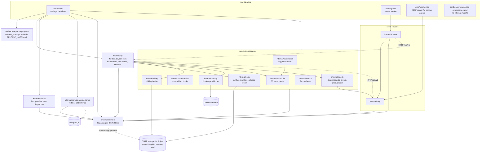

Solid arrows are Go imports; dotted arrows are runtime traffic. Edge counts
between the layers are in §4.2.

| Layer | Packages | Non-test lines | Role | Detail |
|---|---|---|---|---|
| Composition root | `cmd/server` | 983 (one file) | Reads configuration, builds repositories and services, runs boot tasks, starts background loops, serves HTTP | §4.1 |
| HTTP | `internal/api` | 19,187 in 47 files | Middleware, 340 route registrations, authorization guards, error envelope, rate limits, SSE | §4.3 |
| Domain | `internal/domain/*`, 43 packages | 27,960 in 84 files | Entities, `Service` and `Repository` interfaces, most rules | §4.4 |
| Persistence | `internal/persistence/postgres` | 12,582 in 46 files | Repository implementations and the migration ledger | §4.5 |
| Application services | `notify` 2,247; `billing` 1,286 and `billing/stripe` 526; `seeds` 771; `orchestration` 543; `hosting` 367; `metrics` 284; `scheduler` 170; `automation` 159 | 6,353 | Background delivery, automations, billing, provisioning | §4.6 |
| Event bus | `internal/events` | 106 | Persists every domain event, then dispatches it in process | §4.6, §5.9 |
| Client libraries | `internal/runner` 4,979; `internal/mcp` 1,355 | 6,334 | Code behind `cmd/agentd` and `cmd/openv-mcp` | §4.7 |
| Other binaries | `cmd/agentd` 149; `cmd/openv-mcp` 41; `cmd/openv-connector` 708 in 8 files; `cmd/openv-vapid` 36 | 934 | `main` packages; the connector is a stand-alone installer | §2, §4.7 |

Three name collisions trip newcomers. `internal/events` is the bus
implementation and `internal/domain/events` holds the `Event` type and the
`Bus` and `Repository` interfaces (main.go imports the former as `eventbus`,
`cmd/server/main.go:63`). `internal/automation` (trigger matcher) and
`internal/scheduler` (cron poller) are the runtime of the automations whose
records live in `internal/domain/automations`. And the `teams` domain package
is what the UI calls crews (served at `/api/v1/crews` and the deprecated
`/api/v1/teams`), which is unrelated to the people-teams in
`internal/domain/orgs/teams.go`. Appendix B lists the vocabulary.

### 4.1 Composition root

`cmd/server/main.go` is the only place where the server's parts meet. It
exists so that no package has to construct its own dependencies: every
repository, service, policy and background loop is created here and handed
to its consumers explicitly, with no dependency-injection framework or
reflection. The file is 983 lines. Five small helpers sit around one
`main()` that runs from line 118 to 970 (853 lines): `envOr` (:73), `envInt`
(:82-89), `initLogging` (:94-110), `fatal` (:113-116) and
`maxRequestBodyBytes` (:975-983). Inside `main()` there are 38
`postgres.New*Repository` calls, 40 domain-service constructor calls, about
15 notify and infrastructure components, 27 plain setter calls plus 14
fluent notify setters, 4 `go` statements, 7 `Start(...)` calls, 10 `fatal`
exits and reads of 42 distinct environment variables (Appendix A).

The order of the stages is the order of the source lines, and parts of it
are load-bearing (see the editing notes). The flowchart follows the file
top to bottom.

```mermaid
flowchart TD
  subgraph sg_cfg["Configuration and storage, main.go:119-235"]
    s1["1. initLogging, signal context<br/>119-124"]
    s2["2. DSN, PORT, upload and data dirs,<br/>WORKER_API_KEY, 127-145"]
    s3["3. orgs package globals<br/>SetSelfHosted, SetDefaultPlan, SetDeploymentLimits<br/>150-172, bad OPENV_LIMITS is fatal"]
    s4["4. MkdirAll uploads, postgres.Connect,<br/>MigrateAndBackfill under advisory lock, 174-190"]
    s5["5. 33 repositories, 192-225<br/>5 more built inline later"]
    s6["6. event bus with raw-SQL org resolver<br/>229-235, starts dispatch goroutine"]
  end
  subgraph sg_svc["Services and boot tasks, main.go:237-516"]
    s7["7. requirements core services and setters<br/>237-264"]
    s8["8. templates SeedDefaults, 265"]
    s9["9. users, members, orgs<br/>GrandfatherBefore then SetTiersEnforced, 270-294"]
    s10["10. people-teams, invitations, worker keys,<br/>hosted workers, runner pool if RUNNER_POOL_KEY<br/>295-315"]
    s11["11. hosted-runner reconcile against Docker<br/>317-347"]
    s12["12. legacy WORKER_API_KEY registered as org key<br/>349-371"]
    s13["13. products, settings, attributes, shared pool seed,<br/>vv and download sources, evidence, work items,<br/>guided, interviews, share links, 372-435"]
    s14["14. agents FileService and SyncAllFromDisk<br/>441-448"]
    s15["15. agentruns with routing and retry policy,<br/>automations, providers, crews, proposals<br/>449-505"]
    s16["16. EnsureOrgDefaults for every workspace<br/>507-516"]
  end
  subgraph sg_bg["Delivery and background, main.go:521-729"]
    s17["17. metrics, SSE hub, orchestration hooks,<br/>run subscribers, bus subscription, 521-530"]
    s18["18. mailer, verification, session, registration,<br/>push; Notifier and BudgetMonitor Start, 536-609"]
    s19["19. release service; announcer goroutine,<br/>stable scheduler, support-window watcher, 615-650"]
    s20["20. budget guard if OPENV_BUDGET_ENFORCE<br/>656-672"]
    s21["21. TriggerMatcher Start, scheduler Start<br/>with synchronous catch-up, 675-676"]
    s22["22. purge goroutine, reaper goroutine<br/>680-729"]
  end
  subgraph sg_http["Sign-in, billing and HTTP, main.go:731-969"]
    s23["23. Google OAuth and OIDC config<br/>731-764"]
    s24["24. billing config, 5 setters, Start<br/>775-795, bad config is fatal"]
    s25["25. api.NewHandler with 63 HandlerDeps fields<br/>797-863"]
    s26["26. close cycles: SetAppliers,<br/>SetGuidedNudgeLauncher, 868-872"]
    s27["27. router, RegisterRoutes, /metrics,<br/>auth and middleware chain, 875-920"]
    s28["28. http.Server, ListenAndServe goroutine,<br/>signal wait, 15 s drain, 932-969"]
  end
  s1 --> s2 --> s3 --> s4 --> s5 --> s6 --> s7 --> s8 --> s9 --> s10
  s10 --> s11 --> s12 --> s13 --> s14 --> s15 --> s16 --> s17 --> s18
  s18 --> s19 --> s20 --> s21 --> s22 --> s23 --> s24 --> s25 --> s26
  s26 --> s27 --> s28
  classDef io fill:#fff1cc,stroke:#a36b00,color:#000000
  classDef bg fill:#dcebff,stroke:#2f5f9e,color:#000000
  classDef both fill:#e8dcff,stroke:#5b3f9e,color:#000000
  class s4,s8,s9,s11,s12,s13,s14,s16 io
  class s6,s17,s18,s19,s24,s28 bg
  class s21,s22 both
```

Yellow stages write to the database, the filesystem or Docker while the
graph is still being built; blue stages start goroutines or subscriptions;
purple stages do both. Everything above stage 28 finishes before the port
opens.

#### What gets built

| Stage (lines) | Builds | Notes |
|---|---|---|
| Repositories (192-225) | 33 repositories from one `*sql.DB` | Five more are created inline: embeddings (:252), settings (:376), share links (:435), provider logins (:481), release (:629) |
| Event bus (229-235) | `eventbus.NewBus(eventRepo, resolver)` | The resolver is raw SQL (`SELECT COALESCE(org_id::text, '') FROM projects WHERE id = $1::uuid`) that backfills an event's workspace from its project and maps any error to `""` |
| Requirements core (237-265) | artifacts, links, embeddings, projects, attachments, baselines, chatter, exports, reports, downloads, templates | `templates.SeedDefaults` runs immediately (:265) |
| Tenancy and runners (270-371) | users, members, orgs, people-teams, invitations, worker keys, hosted workers, runner sessions (only when `RUNNER_POOL_KEY` is set, :308-315) | Includes the hosted-runner reconcile (:320-345) and the `bootstrapOrgID` raw-SQL closure (:351-363) |
| Product, V&V and suite (372-435) | products, settings, attributes, shared products, vv, evidence, work items, guided, interviews, share links | `downloads` gets two closures: an evidence source over vv (:401-411) and a workspace source that reads the logo file with `os.ReadFile` (:412-430) |
| Agent engine (441-505) | agents (file-backed), agent runs, automations, repo connections, providers, provider logins, crews, proposals | Run routing, retry and later budget policies are closures set on `agentruns` |
| Delivery (521-650) | metrics collector, `api.SSEHub`, orchestration hooks, mailer, email and push dispatchers, notifications, Notifier, BudgetMonitor, MinutesMonitor (pool only), release service and its three notify components | The SSE hub is created in main and handed to notify and orchestration through their own interfaces |
| Sign-in and billing (731-795) | `*api.GoogleOAuthConfig`, `*api.OIDCConfig` (OpenID Connect single sign-on), `*billing.Service` | Each is nil unless its environment is set; billing also stays nil on a self-hosted deployment |
| HTTP (797-969) | `api.Handler`, the router, the auth middleware, the middleware chain, `http.Server` | §4.3 describes the chain |

#### Setter wiring

Constructors take the required repository and a few services; everything
else is attached afterwards. The table lists the setter calls in `main()`.

| Target | Call (main.go line) | Why it is a setter |
|---|---|---|
| `orgs` package | `SetSelfHosted` (153), `SetDefaultPlan` (161), `SetDeploymentLimits` (170), `SetTiersEnforced(true)` (292) | Process-wide globals, see below |
| links and artifacts | `linkService.SetArtifactService` (240), `artifactService.SetLinkSuspector` (243) | Genuine cycle: each needs the other |
| artifacts and embeddings | `artifactService.SetEmbeddingIndexer` (254) | Genuine cycle: embeddings reads artifacts (:253) |
| worker keys | `SetPairingRepository(workerKeyRepo)` (301) | Passes the same repository a second time |
| exports | `SetProductService` (373), `SetAttributeService` (397) | Construction order only: exports is built at :259, products at :372 |
| downloads | `SetEvidenceSource` (401), `SetWorkspaceSource` (412) | Closures over vv, projects and orgs |
| agent runs | `SetRoutingPolicy` (452), `SetRetryPolicy` (477), `SetBudgetGuard` (657) | Policy closures; each setter is documented "call during wiring only", and `AddSubscriber` also as not concurrency-safe (`internal/domain/agentruns/agentruns.go:537-564`) |
| crews | `teamService.SetMemberValidator` (484) | Closure over `orgService.IsMember` |
| users | `SetEmailVerificationPolicy` (546), `SetSessionPolicy` (550) | The same policies also go to the handler and the auth middleware |
| billing | `SetUsers`, `SetPortalConfig`, `SetTrialDays`, `SetMaxSeats` (786-789), `SetReturnURL` (791) | Optional configuration |
| proposals, hooks | `SetAppliers` (868), `SetGuidedNudgeLauncher` (872) | Cycles through the HTTP handler |
| auth middleware | `SetPoolKey` (886), `SetEmailVerificationPolicy` (887) | Optional configuration |

On top of these, six notify components each take `SetEmailDispatcher` and
`SetPushDispatcher`, and the Notifier also takes `SetOrgService` and
`SetUserNamer` (14 fluent calls between :576 and :647). Run-lifecycle
subscribers are added with `runService.AddSubscriber` for metrics (:522),
the SSE hub (:526) and the orchestration hooks (:529);
`hooks.SubscribeBus(bus)` follows at :530, and
`proposalService.OnResolved(runService.FinalizeIfResolved)` at :501-505.

#### Construction cycles

Three dependencies point from lower layers back to the HTTP handler, and
three more are wired late between domain services (two of them genuine
cycles). All are closed by a setter after both ends exist.

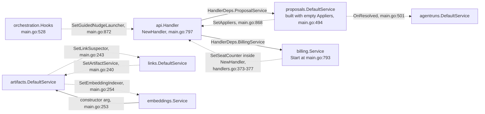

Solid arrows are constructor dependencies; dotted arrows are attached after
construction.

- **Proposal appliers.** `proposals.NewDefaultService(proposalRepo,
  proposals.Appliers{})` starts with no appliers (:494). When a person
  approves an agent's proposed write, the proposals service calls
  `Handler.ProposalAppliers()` (`internal/api/proposal_appliers.go:22`),
  which repeats the handlers' own artifact, link and test-result writes. The
  nil checks in `internal/domain/proposals/proposals.go:297-328` turn a
  missing applier into `ErrUnsupportedOp`.
- **Guided nudge launcher.** A wizard nudge (a wizard action, such as saving
  a step, that the guided session's copilot agent owes a reply to; Appendix
  B, guided session) parked while a copilot run was in flight is launched by
  `Handler.LaunchGuidedNudge`
  (`internal/api/suite_handlers.go:1302`) when the hooks see that run finish
  (`internal/orchestration/hooks.go:29`, :74).
- **Billing seat counter.** `NewHandler` itself calls
  `h.billing.SetSeatCounter(h.countOrgSeats)` and
  `h.billing.DefaultReturnURL(h.frontendURL)` (`internal/api/handlers.go:373-377`).
  The seat rule (members plus pending invitations) lives in
  `internal/api/limits.go:271`, and the default Stripe return URL takes
  effect only when `SetReturnURL` (:791) was not called. `billing.Start`
  (:793) has already launched its goroutines when this happens.

#### Package globals

Four process-wide variables in `internal/domain/orgs` decide plan and limit
behavior for every workspace.

| Variable | Declared | Set in main | Read by (examples) |
|---|---|---|---|
| `selfHosted` | `orgs/limiterror.go:23` | :153 from `OPENV_SELF_HOSTED == "true"` | `Org.EffectiveLimits`, refusal remedy text, `api/limits.go`, `api/billing_handlers.go` |
| `defaultPlan` | `orgs/limits.go:511` | :161 from `OPENV_PLAN_DEFAULT` (an unknown name is silently ignored, :516-521) | `CreateOrg` |
| `deploymentLimits` | `orgs/limits.go:540` | :170 from `OPENV_LIMITS` (malformed is fatal) | `Org.EffectiveLimits` |
| `tiersEnforced` | `orgs/limits.go:379` | :292, only after `GrandfatherBefore` succeeds and only when not self-hosted | plan defaults (`limits.go:405`) |

Tests set and reset these globals through the same setters (42 calls in
`internal/api/limits_test.go`, `plan_gates_test.go`,
`internal/domain/orgs/limits_test.go` and `entitlements_test.go`), so those
tests cannot run in parallel.

#### Boot-time side effects

Building the graph is not side-effect free. Before the server listens,
`main()` creates the uploads directory (:174), runs migrations and the org
backfill (:188), seeds default templates (:265), writes grandfathered limits
into older workspaces (:288), inspects hosted-runner containers and updates
their status (:320-345), registers `WORKER_API_KEY` as an `env-bootstrap` org
key for the personal workspace of the earliest-created user (:351-371),
seeds the shared product pool (:393), syncs agent definitions from disk
(:446), seeds default agents and crews into every workspace (:508-516) and runs
the scheduler's synchronous catch-up, which can launch automation runs
(:676; `internal/scheduler/scheduler.go:29-30`). It also starts the
one-time release announcement (:633) and the workspace purge (first run at
once, :688) in goroutines that may still be running when the port opens. The Railway health check
that `docs/railway.md:29` prescribes for `/health` allows 120 s for all of this.

#### Background loops

| Component | Started at | Style | Cadence | First run |
|---|---|---|---|---|
| Event bus dispatch | `NewBus`, :229 (`internal/events/bus.go:44`) | goroutine, never stopped | per event | not applicable |
| Orchestration hooks | :529-530 | `AddSubscriber` + `SubscribeBus` | per run change and event | not applicable |
| Notifier | :590 | `Start(bus)`, no context | per event | not applicable |
| BudgetMonitor | :598 | `Start(bus)`, no context | per event | not applicable |
| Release announcer | :633 | `go announcer.Announce(cur)` | once per boot | at boot |
| StableScheduler | :640 | `Start(ctx, time.Hour)` | hourly | immediately (`internal/notify/stable.go:70`) |
| SupportWindowWatcher | :648, only when `OPENV_DEPLOYMENT=dedicated` | `Start(ctx, 24*time.Hour)` | daily | immediately (`internal/notify/dedicated.go:91`) |
| TriggerMatcher | :675 | `Start(bus)`, no context | per event | not applicable |
| Scheduler | :676 | `Start(ctx)` | 30 s (`scheduler.go:25`) | synchronous catch-up on main's goroutine |
| Workspace purge | :680-699 | inline goroutine | 24 h | at boot |
| Reaper | :700-729 | inline goroutine | 30 s | after the first tick |
| Billing | :793, only when billing is enabled | `Start(ctx, ReconcileInterval)` | default 5 min | seat sync and reconcile immediately (`internal/billing/reconcile.go:18-20`) |
| HTTP server | :944 | goroutine | not applicable | not applicable |

The reaper bundles four jobs on one cadence: `runService.FailStale(2 *
time.Minute)`, `userRepo.DeleteExpiredSessions` (a repository called
directly), `invitationService.PurgeExpired` and, when the runner pool is on,
`runnerSessionService.Sweep`. The session and invitation errors are
discarded with `_ =` (:713, :716). On SIGINT or SIGTERM the signal context is
cancelled, the context-aware loops return, `stop()` restores default signal
handling, and `srv.Shutdown` drains for up to 15 s before `srv.Close`
(:953-969). The bus, Notifier and announcer goroutines are not joined, and
`fatal()` calls `os.Exit`, which skips the deferred `db.Close`.

#### Editing notes

- **Adding a service the HTTP layer uses** takes four edits: construct it in
  `main()` after its dependencies, add a field to `api.HandlerDeps`
  (`internal/api/handlers.go:65-170`), add a field to `api.Handler`
  (:173-284), copy it in `NewHandler` (:287-379), and fill it in the
  `main.go:797` literal. §9.1 has the full recipes.
- **Every setter and cycle closure should run before any background start.**
  Today several do not: `SetAppliers` and `SetGuidedNudgeLauncher`
  (:868-872) run after the trigger matcher and scheduler can already launch
  runs (:675-676), and `billing.Start` (:793) runs before `NewHandler`
  mutates the billing service. `SetBudgetGuard` (:657) happens to precede
  the scheduler's catch-up (:676); moving the catch-up earlier would let boot
  launches bypass `OPENV_BUDGET_ENFORCE`. A split of `main()` must move
  starts later, never earlier.
- **Registration order is dispatch order.** `DefaultBus` runs subscribers
  one after another in subscription order (`internal/events/bus.go:88-106`):
  hooks (:530), Notifier (:590), BudgetMonitor (:598), TriggerMatcher (:675).
  Run subscribers fire in the order metrics, SSE hub, hooks (:522-529).
- **Ordering rules held only by position:** `SetTiersEnforced` after a
  successful `GrandfatherBefore`; `SyncAllFromDisk` before
  `EnsureOrgDefaults` (comment at :437-440); each job's first-run behavior in
  the table above.
- **Configuration quirks are per variable.** An empty string means unset
  everywhere (docker-compose passes many variables as `""`); `envOr` does not
  trim; `OPENV_SELF_HOSTED`, `OPENV_BUDGET_ENFORCE`, `SECURE_COOKIES` and
  `CROSS_SITE_COOKIES` must be exactly `true`; `OPENV_RUN_AUTO_RETRY` is
  switched off by a trimmed, case-insensitive `false` (:476). Three frontend
  URL chains differ on purpose or by accident and are user-visible: email
  links and `HandlerDeps.FrontendURL` use `FRONTEND_URL`, then `PUBLIC_URL`,
  then `http://localhost:3000` (:539, :825); Google and OIDC post-login
  redirects use `FRONTEND_URL`, then `http://localhost:3000` (:739, :761);
  OAuth callbacks and `PublicAPIURL` use `PUBLIC_URL`, then
  `http://localhost:$PORT` (:734, :748, :853). `UPLOADS_DIR` defaults to
  `./uploads` here (:139) but `internal/domain/reports/report.go:733` reads
  the raw variable.
- **The raw-SQL closures carry exact semantics:** the bus resolver maps any
  error to an empty workspace id, and `bootstrapOrgID` picks the personal
  workspace of the earliest-created user (`ORDER BY u.created_at LIMIT 1`).
- **The build compiles the file, not the package.** `Dockerfile.api:28` runs
  `go build ... -o server cmd/server/main.go` and `README.md:106` documents
  `go run cmd/server/main.go`, so splitting `main.go` into several files
  breaks the image until both use `./cmd/server`. Besides `go.mod` and
  `go.sum`, the image copies only `cmd`, `internal`, `examples`,
  `release_notes.go` and `RELEASE_NOTES.md` (`Dockerfile.api:17-22`), so new
  Go packages belong under `internal/`.
- **Nothing tests this file.** `cmd/server` has no `_test.go`; only the
  docker-compose Playwright job and the staging smoke boot the real wiring
  (§9.5). Pain points: §9.3.

### 4.2 Package layering and the import graph

This subsection answers "which package may depend on which" from the code
rather than from the documentation. The graph was built at `d11dee8` with
`go list -f '{{.ImportPath}}: {{join .Imports " "}}' . ./cmd/... ./internal/...`
and counts production imports only. It has 63 packages: five `cmd/`
binaries, the module root (`release_notes.go`) and 57 `internal/` packages,
43 of them under `internal/domain`. They are joined by 227 internal import
edges. Test files add six more (`baselines`, `quality` and `vv` to `links`;
`links` to `artifacts`; `release` to the module root; `postgres` to
`seeds`).

#### Fan-out and fan-in

| Package | Fan-out (internal packages it imports) |
|---|---|
| `cmd/server` | 51 |
| `internal/api` | 47: every domain package except `reports/doc`, plus `billing`, `hosting`, `notify`, `scheduler`, `seeds` |
| `internal/persistence/postgres` | 36 |
| `internal/notify` | 9 |
| `internal/orchestration`, `internal/domain/reports` | 8 each |
| `internal/domain/exports`, `internal/runner` | 6 each |

| Package | Fan-in (packages importing it) | Importers besides `cmd/server`, `api` and `postgres` |
|---|---|---|
| `domain/artifacts` | 14 | baselines, downloads, embeddings, exports, guided, quality, reports, templates, vv, mcp, notify |
| `domain/events` | 10 | agentruns, guided, vv, workitems, automation, internal/events, notify, orchestration |
| `domain/exports` | 9 | baselines, downloads, quality, reports, templates, vv |
| `domain/agentruns`, `domain/teams`, `domain/users` | 8 each | |
| `domain/agents`, `attachments`, `links`, `orgs` | 7 each | |

The longest chain is seven packages deep: `cmd/server -> api ->
domain/downloads -> domain/reports -> domain/baselines -> domain/exports ->
domain/artifacts`. 25 of the 43 domain packages import no other internal
package.

#### Intended layering and what the compiler sees

`docs/architecture.md` describes Frontend, then an API layer with "No
business logic" (:76), then pure domain services, then repositories, with
composition in `main.go`. The compile-time graph honors the direction of
that design. No domain package imports `internal/api`,
`internal/persistence/postgres`, `notify`, `billing` or `orchestration`;
`internal/api` does not import `postgres`; `notify` does not import `api`;
`postgres` imports only domain packages. This holds for test files too.
Nothing enforces it: CI's Go job runs `gofmt`, `go vet` and `go test`
(`.github/workflows/ci.yml:58-75`), and there is no import-rule linter
(such as depguard, usually run through golangci-lint) and no architecture
test.

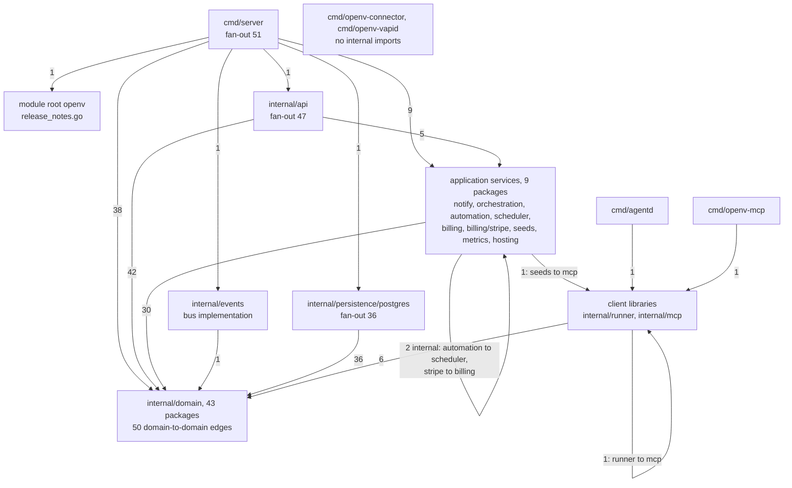

The edge labels sum to 227. There is no edge from `dom` or `pg` upward, and
none from `api` to `pg`.

#### Where the layering is violated

The violations are semantic: they are closed at runtime through setters,
callbacks, raw SQL or reflection, so the compiler does not see them.

```mermaid
flowchart TD
  srv["cmd/server main()"]
  apiH["api.Handler<br/>link auto-versioning, usage counting,<br/>artifact and link event publishing"]
  sse["api.SSEHub<br/>realtime infrastructure inside api"]
  props["domain/proposals"]
  orch["orchestration.Hooks"]
  bill["billing.Service"]
  notif["internal/notify<br/>plus release rollout writes"]
  autos["internal/automation and internal/scheduler"]
  autorepo["automations.Repository"]
  evrepo["events.Repository"]
  userrepo["users repository"]
  sqlq["raw SQL on sql.DB"]
  orgsg["orgs package globals"]
  links["domain/links"]
  arts["domain/artifacts"]
  domio["domain packages doing IO<br/>embeddings, reports, users, agents, templates"]
  envfs["env vars, filesystem, outbound HTTP"]
  runner["internal/runner, for cmd/agentd"]
  srvdom["8 server domain packages<br/>agentruns, agents, providers, repoconns,<br/>runnersessions, users, events, artifacts"]
  seeds["internal/seeds"]
  mcp["internal/mcp client"]
  snap["exports.ProjectExport<br/>snapshot type in the heavy exports package"]
  vvq["vv, quality, baselines, templates"]
  props -.->|"SetAppliers main.go:868"| apiH
  orch -.->|"SetGuidedNudgeLauncher main.go:872"| apiH
  bill -.->|"SetSeatCounter handlers.go:375"| apiH
  notif -.->|"Broadcaster port"| sse
  orch -.->|"SessionBroadcaster port"| sse
  apiH ==>|"agent_handlers.go:2230"| evrepo
  autos ==>|"main.go:675-676"| autorepo
  srv ==>|"reaper main.go:713"| userrepo
  srv ==>|"main.go:229, 351"| sqlq
  srv ==>|"4 setters"| orgsg
  links -.->|"reflection, link.go:171"| arts
  domio ==> envfs
  runner ==>|"wire types"| srvdom
  seeds ==>|"seeds.go:38"| mcp
  vvq ==>|"snapshot type only"| snap
  classDef bad fill:#ffe0e0,stroke:#c00000,color:#000000
  class apiH,sse,sqlq,orgsg,domio,srvdom,snap bad
```

Dotted arrows are runtime back-edges through a setter or a consumer-declared
port; thick arrows are direct violations; red nodes hold a responsibility
that belongs elsewhere.

| # | Violation | Evidence |
|---|---|---|
| V1 | Approving a proposal runs API handler code | `main.go:494`, :868; `internal/api/proposal_appliers.go:22` |
| V2 | The rule "every link change re-versions both artifacts" lives in the API | `internal/api/handlers.go:3117` `autoVersionLinkedArtifacts`, called from `handlers.go` and `proposal_appliers.go` |
| V3 | Plan-usage and seat counting live in the API, and billing calls back into it | `internal/api/limits.go:271-499`; `handlers.go:373-377` |
| V4 | Orchestration calls back into the API to launch guided nudges | `internal/orchestration/hooks.go:29`; `internal/api/suite_handlers.go:1302`; `main.go:872` |
| V5 | Event publishing is split: artifact, link, baseline and membership events come from handlers; test results, work items and finished runs from domain services | `handlers.go:384-418`; `domain/vv/vv.go:344`; `domain/workitems/workitems.go:388`; `domain/agentruns/agentruns.go:1049` |
| V6 | Repositories used around their services | `h.eventRepo.List` (`agent_handlers.go:2230`); `automation.NewTriggerMatcher(automationRepo, ...)` and `scheduler.New(automationRepo, ...)` (`main.go:675-676`); `userRepo.DeleteExpiredSessions` (`main.go:713`) |
| V7 | Raw SQL in the composition root | `main.go:229-235`, :351-363 |
| V8 | Environment, filesystem or network access inside domain packages | `embeddings/provider.go:42-47` (env and HTTP client); `reports/report.go:733` (`UPLOADS_DIR`, figure files); `users/session_policy.go:74`; `agents/loader.go` (definition files); `templates/defaults.go` (examples directory) |
| V9 | Mutable package globals in a domain package | `orgs/limiterror.go:23`; `orgs/limits.go:379`, :511, :540 |
| V10 | `links` calls `artifacts` through an `interface{}` field, reflection and a JSON round-trip, although a direct import would be acyclic | `domain/links/link.go:135`, :171-199 |
| V11 | Client binaries link server domain code: `go list -deps ./cmd/agentd` includes eight domain packages; the server links `internal/mcp` through `seeds` | `internal/seeds/seeds.go:38` |
| V12 | Realtime infrastructure (`SSEHub`) lives in the HTTP package, and `notify` performs release rollout writes | `internal/api/sse.go`; `internal/notify/stable.go:155` |
| V13 | Bounded-context cycles through the snapshot type (next section) | `domain/exports/export.go:43` |

#### Domain-to-domain coupling

There are 50 import edges between domain packages. Three packages act as
accidental shared kernels (packages that many otherwise unrelated areas
depend on for common types):

- `exports.ProjectExport` (`internal/domain/exports/export.go:43`) is the
  project snapshot used by `baselines`, `quality`, `vv`, `templates`,
  `reports` and `downloads`. The same package also owns the CSV, Excel
  (the excelize library) and ReqIF (Requirements Interchange Format, an XML
  exchange standard) code, so `settings` depends on excelize through
  `settings -> quality -> exports`.
- `users.HashToken` and `users.NewToken` are the only reason `agentruns`,
  `sharelinks` and `workerkeys` import `users` (`invitations` also uses
  `NormalizeEmail`).
- `domain/events` (the `Event` type and the `Bus` port) is imported by
  `agentruns`, `guided`, `vv` and `workitems`; `guided` only stores the bus
  and never publishes.

Grouped into the bounded contexts of §4.4, the snapshot type creates two
context-level cycles (requirements core and documents; verification and
documents). The per-package importer table and the context diagram are in
§4.4.

#### Editing notes

- A new domain package must import only the standard library, third-party
  libraries and other domain packages; declare an interface on the consumer
  side when you need something from a higher layer, as `notify` does with
  its narrow ports and `artifacts` does with `LinkSuspector` and
  `EmbeddingIndexer`.
- Changing a type in `agentruns`, `agents`, `providers`, `repoconns`,
  `runnersessions`, `users`, `events` or `artifacts` can change what
  `cmd/agentd` sends or accepts, and deployed runners are not rebuilt with
  the server (§4.7).
- A change to `exports` recompiles, and can break, V&V, the quality linter,
  baselines, templates, reports, downloads and settings.
- Because nothing checks the layering, a refactor can regress it silently;
  the pain points and their remedies are in §9.3.

### 4.3 API layer

`internal/api` is the only HTTP surface of the server: the React app, the
MCP server, runner workers, the Agent Connector and `scripts/openv/sync.py`
all go through it. It is one Go package of 47 production files (19,187
lines) and 73 test files (16,439 lines). It owns the middleware that every
request passes through, the route table, identity resolution, authorization
and plan gates, rate limiting, the JSON error envelope and server-sent
events. Everything hangs off one `Handler` struct; there are no
per-feature handler types and no subpackages.

#### Middleware chain

`main.go:875-920` assembles the chain inside out:
`SecurityHeaders(BodyLimit(CORS(Compression(RequestLog(metrics(Auth(router)))))))`.
A request therefore meets the layers in the order below.

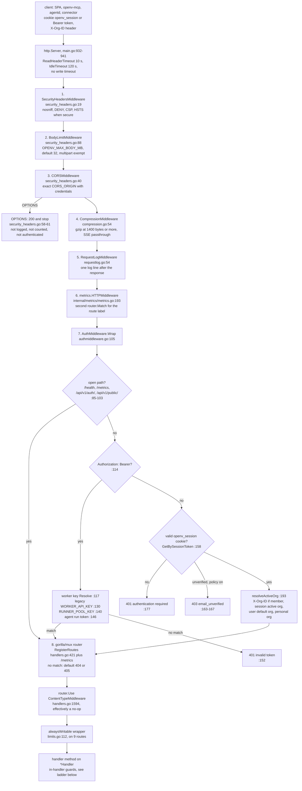

| # | Layer | What a caller can observe |
|---|---|---|
| 1 | `SecurityHeadersMiddleware(hsts)` | `X-Content-Type-Options: nosniff`, `X-Frame-Options: DENY`, `Referrer-Policy: strict-origin-when-cross-origin`, `Content-Security-Policy` (CSP) `default-src 'none'; frame-ancestors 'none'` on every response, including preflights and rejections; `Strict-Transport-Security` (HSTS, tells browsers to use HTTPS only) only when `SECURE_COOKIES` or `CROSS_SITE_COOKIES` is exactly `true` (`main.go:917`) |
| 2 | `BodyLimitMiddleware` | Non-multipart bodies wrapped in `http.MaxBytesReader` (`OPENV_MAX_BODY_MB`, default 32 MiB, `main.go:975-983`); the JSON decoders answer an over-cap body with 400. Multipart uploads are exempt and each upload handler sets its own cap |
| 3 | `CORSMiddleware` | Credentialed CORS headers only when `Origin` equals `CORS_ORIGIN` (unset or empty falls back to `http://localhost:3000`; `*` and `null` make the server refuse to start); exposes `X-Total-Count`, `X-Next-Cursor`, `Content-Disposition`; answers every `OPTIONS` with 200 itself |
| 4 | `CompressionMiddleware` | gzip when the client accepts it and the body reaches 1,400 bytes (`compression.go:43`); never for `text/event-stream`, 204, 304, pre-encoded or already-flushed responses; adds `Vary: Accept-Encoding` |
| 5 | `RequestLogMiddleware` | One `slog` line per request: method, path with share and interview tokens redacted, status, duration, org, user, credential kind; ERROR for 5xx, WARN for 4xx, DEBUG for `/health` |
| 6 | `metrics.HTTPMiddleware(router)` | `http_requests_total` and `http_request_duration_seconds` labelled by the mux path template, or `unmatched` for 404 and 405 |
| 7 | `AuthMiddleware.Wrap` | Identity in the request context, or a 401/403 JSON answer. Because it runs before routing, an unknown path without credentials gets 401, not 404 |
| 8 | `mux.Router` | Route dispatch; gorilla's default text 404 and empty 405. `router.Use(ContentTypeMiddleware)` sets no content type and its `OPTIONS` branch never runs, because CORS answered first |

Identity resolution in `Wrap` has a fixed precedence. A `Bearer` token is
tried as a worker key (`workerService.Resolve`), then the legacy
`WORKER_API_KEY` (constant-time compare, resolved to the bootstrap
workspace), then `RUNNER_POOL_KEY`, then an agent-run token; any unknown
Bearer token is refused with 401 `invalid token` even when a valid session
cookie is also present. A session cookie is checked against the
email-verification wall before the active workspace is resolved, and
`resolveActiveOrg` may create the user's personal workspace
(`EnsurePersonalOrg`, `authmiddleware.go:215`). Handlers read identity
through exported accessors (`CurrentUser`, `CurrentRun`, `WorkerOrg`,
`ActiveOrg`, `Actor` and others, :222-314); the context keys stay private.
Handlers under the open prefixes get no context identity and must call
`h.sessionUser` (`auth_handlers.go:378`) themselves.

#### Route registration

`Handler.RegisterRoutes` (`internal/api/handlers.go:421-512`) registers 51
routes inline plus `/health`, and makes 22 `h.registerXRoutes(router)`
calls: four interleaved with the project routes (download, share, admin,
billing) and 18 after the search route. `registerAuthRoutes` calls
`registerOIDCRoutes` (`auth_handlers.go:59`), so 23 registration functions
exist, one per feature file. `main.go:883` adds `GET /metrics` to the same
router.

| File | Routes | | File | Routes |
|---|---|---|---|---|
| `agent_handlers.go` | 81 | | `download_handlers.go` | 7 |
| `suite_handlers.go` | 54 | | `billing_handlers.go` | 6 |
| `handlers.go` (inline, incl. `/health`) | 52 | | `shared_product_handlers.go` | 6 |
| `org_handlers.go` | 43 | | `attribute_definition_handlers.go` | 5 |
| `auth_handlers.go` | 18 | | `push_handlers.go` | 4 |
| `evidence_handlers.go` | 12 | | `admin_`, `avatar_`, `invitation_`, `password_reset_`, `release_handlers.go` | 3 each |
| `share_handlers.go` | 11 | | `default_workspace_`, `feature_`, `meta_`, `oidc_handlers.go` | 2 each |
| `notification_handlers.go` | 9 | | `password_handlers.go` | 1 |
| `runner_session_handlers.go` | 8 | | **Total** | **340** |

`internal/api/route_inventory_test.go` walks the router and compares the
sorted, de-duplicated `METHOD PATH` lines with `testdata/routes.txt` (341
lines; `/api/v1/public/connector/download` answers both GET and HEAD,
`org_handlers.go:71`). The inventory pins which routes exist, not which
handler serves them, which wrappers they carry, their registration order, or
`/metrics`.

Registration order matters in exactly one place today. Three GET templates
overlap: `/api/v1/agent-runs/delegate/{id}` and
`/api/v1/agent-runs/{id}/tree`, `/logs` and `/stream`
(`agent_handlers.go:50-55`). gorilla/mux takes the first match, so
`GET /api/v1/agent-runs/delegate/tree` reaches `DelegateStatus` only because
the delegate route is registered first. File names do not predict where a
route lives: `/api/v1/projects/*` routes come from eight files, and
`registerAgentRoutes` alone covers about sixteen resource families (§9.2).

#### Handler, HandlerDeps and how handlers reach services

`HandlerDeps` (`handlers.go:65-170`) is the constructor argument that `main`
fills: 63 fields, of which 41 are services (39 interfaces plus the concrete
`*embeddings.Service` and `*billing.Service`), 4 other concrete pointers
(`*SSEHub`, `*GoogleOAuthConfig`, `*OIDCConfig`, `*notify.MinutesMonitor`),
7 other interfaces or values (`Bus`, `EventRepo` (a raw repository),
`Mailer`, `Provisioner`, `VAPID`, `EmailVerification`, `SessionPolicy`), 10
scalars and one function (`OrgSeeder`). `Handler` (:173-284) has 76 private
fields: the copied dependencies plus 13 `*rateLimiter` buckets and derived
cookie settings. `NewHandler` (:287-379, 93 lines) copies the fields, derives
`SameSite` and `Secure` (`CROSS_SITE_COOKIES` forces `SameSite=None` and
`Secure`, :288-293), trims the trailing slash from `FrontendURL`, builds the
13 limiters from environment variables and wires billing (:373-377).

Handlers are methods on `*Handler`: 498 of them across the package, 325 with
the plain `(w http.ResponseWriter, r *http.Request)` signature and 173
route registrars, guards and helpers. A handler reaches a service by field
access (`h.artifactService.CreateArtifact(...)`), usually decodes a domain
request struct straight from the body and encodes domain structs straight
back, so domain JSON tags are the wire contract. Optional dependencies are
not marked in the types; 109 `h.x == nil` or `!= nil` checks cover 29
fields, partly because 60 of the 73 test files build `&Handler{...}`
literals (137 of them) instead of calling `NewHandler`.

Authorization, plan gates, feature gates, rate limiting and proposal
diversion are not middleware: each handler opts in by calling helpers, in an
order it chooses. `CreateArtifact` (`handlers.go:535-603`) shows the usual
ladder.

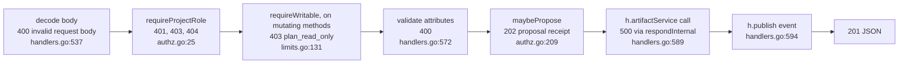

Because the order is per handler, it decides which status a malformed or
unauthorized request gets; some handlers load the resource and answer 404
before checking the role.

#### Authorization helpers (authz.go)

| Helper | Line | Behavior |
|---|---|---|
| `requireProjectRole` | :25 | `projectAccess`, then `requireWritable` for POST, PUT, PATCH and DELETE |
| `projectAccess` | :38 | Worker key: project must belong to the worker's workspace (404 or 403). Agent run: only its own project, as editor. Session user: platform admin passes; workspace admin acts as owner; otherwise the effective project role (direct or people-team grant) must reach `minRole`. A missing project gives users 403 "you do not have access to this project", not 404 |
| `requireOrgRole` / `orgAccess` | :97 / :104 | Workspace access; `requireOrgRole` always adds `requireWritable` |
| `hasProjectRole` / `isOrgAdmin` | :143 / :149 | Boolean variants; `hasProjectRole` runs `requireProjectRole` into a discarded response, so on a POST it also applies the plan gate |
| `requireRunAccess`, `requireTeamWrite`, `requireAutomationWrite` | :168, :180, :190 | Access to a run, a crew, an automation |
| `maybePropose` | :209 | For an agent run whose agent has write mode `proposal`, stores the request as a proposal and answers 202 `{proposed, proposal_id, note}` |

Other guards live in feature files: `requireUser` and `requireWorker`
(`agent_handlers.go:136`, :144), `requirePoolNode`
(`runner_session_handlers.go:35`), `requireHumanUser`
(`notification_handlers.go:107`), `requirePlatformAdmin`
(`admin_handlers.go:28`) and `requireJSONBody`
(`email_verification_handlers.go:30`).

#### Errors, plan gates, feature gates and rate limits

- **Error envelope** (`httperr.go`): `errorBody{error, code}` (:11-16) with
  18 machine-readable `ErrCode*` constants (:19-60) that the frontend
  branches on. `writeJSONError` and `writeJSONErrorCode` set
  `application/json`. `respondError` logs the real error with method, path,
  workspace and user and returns only the public message; `respondInternal`
  is its 500 form (:85-112). Two refusals use a wider body written with
  `respondJSON`: 403 `plan_read_only` adds `over` and `remedy`
  (`limits.go:150-157`), and 403 `limit_reached` adds `limit`, `label`,
  `used`, `allowed` and `remedy` (`writeLimitError`, `limits.go:222-236`).
  Success responses have no single writer: 249 `json.NewEncoder(w).Encode`
  calls against 92 explicit `Content-Type: application/json` headers, so
  many endpoints are served as `text/plain` or, when gzipped, with no
  content type (§9.3).
- **Plan read-only gate** (`limits.go`): `requireWritable` (:131) refuses
  writes to a workspace over its plan, deciding with `orgs.OverPlan` on usage
  counts the API gathers itself; a workspace that cannot be read is treated
  as writable. `alwaysWritable` (:112) marks nine routes that must work even
  then: deleting a project (`handlers.go:427`) or workspace
  (`org_handlers.go:29`), removing a member (`org_handlers.go:44`), revoking
  an invitation (`invitation_handlers.go:48`), importing a project
  (`handlers.go:429`), and the four billing POSTs
  (`billing_handlers.go:29-34`).
- **Feature gates** (`feature_handlers.go`): `featureEnabled`,
  `memberFeatureEnabled` and `projectFeatureEnabled` (:74, :90, :104) apply
  release-channel gating decided by `release.FeaturesFor`
  (`internal/domain/release/features.go:141`).
- **Rate limits** (`ratelimit.go`): 13 in-memory token buckets built in
  `NewHandler` (`handlers.go:350-364`) from 26 `OPENV_*_BURST` and
  `OPENV_*_REFILL_PER_HOUR` variables; the client IP honors
  `OPENV_TRUSTED_PROXY_HOPS`, `OPENV_CLIENT_IP_HEADER` and
  `OPENV_TRUST_PROXY`, read on every call (:355-371). `writeRateLimited`
  answers 429 with `Retry-After` (:422). Some buckets are shared across
  endpoints: the sign-in IP bucket also covers email verification and both
  password-reset calls, the per-account bucket covers sign-in and password
  change, and the invite-preview bucket covers every share-link lookup.

#### Events, SSE and compression

Handlers publish domain events with `h.publish` (`handlers.go:384-398`),
which resolves the project's workspace (falling back to the active one) and
stamps `Actor(r)` (`user:<id>`, `agent:<run>`, `worker:<org>[:user:<id>]` or
`system`); `publishOrgEvent` and `publishOrgEventAs` (:404, :413) cover
workspace events. The bus persists every event before dispatching it
(`internal/events/bus.go:49-60`).

`SSEHub` (`sse.go`) is the fan-out for live streams. It implements the
agent-run subscriber interface (log, partial and status events keyed by run
id, :38-62) and `BroadcastSession` (:77), which `notify` uses for
`notify:<user>` and orchestration for `guided:<id>` and `interview:<id>`.
Four routes stream: `/api/v1/agent-runs/{id}/stream`,
`/api/v1/notifications/stream`, `/api/v1/guided-sessions/{id}/chat/stream`
and `/api/v1/public/interviews/{token}/stream`. `ServeStream` (:120)
subscribes before replaying history, drops events for a client whose
64-event buffer is full (:95), and sends a keepalive comment every 25 s
(:17). Streaming works only because every response-writer wrapper in the
chain (`compressingWriter`, the request log's `statusRecorder`, the metrics
recorder) forwards `http.Flusher`, and because compression decides from the
`text/event-stream` content type on the first write.

#### Files by area

| Area | File | Lines | Responsibility |
|---|---|---|---|
| Hub | `handlers.go` | 3,369 | `HandlerDeps`, `Handler`, `NewHandler`, publish helpers, `RegisterRoutes`, `/health`, `ContentTypeMiddleware`, and the project, artifact, link, template, baseline, attachment and chatter handlers with their change-summary and link auto-versioning helpers |
| Middleware and transport (1,012) | `authmiddleware.go` | 314 | Credential ladder, active workspace, identity accessors |
| | `compression.go` | 270 | gzip writer with SSE passthrough and `Flusher` support |
| | `sse.go` | 172 | `SSEHub` fan-out and `ServeStream` |
| | `requestlog.go` | 110 | Access log with token redaction |
| | `security_headers.go` | 107 | Security headers, CORS and body limit (three middlewares) |
| | `registration_policy.go` | 39 | `OPENV_REGISTRATION` open or closed |
| Cross-cutting helpers (1,967) | `limits.go` | 499 | Plan read-only gate, `alwaysWritable`, usage and seat counting, limits response |
| | `ratelimit.go` | 431 | Token buckets, client IP, 429 writer |
| | `authz.go` | 288 | Project, workspace, run, crew and automation guards; `maybePropose` |
| | `event_names.go` | 274 | Activity-log decoration from actor strings and event families |
| | `proposal_appliers.go` | 197 | Writes the proposals service runs on approval |
| | `feature_handlers.go` | 166 | Feature gates and the features endpoint |
| | `httperr.go` | 112 | Error envelope, codes, sanitized logging |
| Requirements features (3,338) | `share_handlers.go` | 566 | Share links, public previews, open-source showcase |
| | `evidence_handlers.go` | 547 | Evidence bundles, files, citations; hosts `respondJSON` |
| | `search_handlers.go` | 325 | Keyword, semantic and hybrid search |
| | `attachment_safety.go` | 258 | Upload limits, content sniffing, serving policy |
| | `shared_product_handlers.go` | 237 | Community demo-product pool |
| | `attribute_definition_handlers.go` | 228 | Typed attribute definitions |
| | `download_handlers.go` | 194 | Unified download surface, one route per format |
| | `quality_rules_handlers.go` | 165 | Quality rule sets; hosts `orgIDForProject` |
| | `ai_map.go` | 146 | Markdown project outline for coding agents |
| | `embedding_handlers.go` | 140 | Reindex and duplicate detection |
| | `share_preview.go` | 137 | 1200x630 PNG social preview |
| | `review_round_handlers.go` | 106 | Project review rounds |
| | `guided_project_outline.go` | 95 | Outline for the V&V Assistant prompt |
| | `baseline_diff_handlers.go` | 80 | Baseline diff against another baseline or live |
| | `ai_map_handlers.go` | 66 | AI map endpoint |
| | `meta_handlers.go` | 48 | Artifact-type and link-type catalogues |
| Agent and product suite (4,365) | `agent_handlers.go` | 2,270 | Agents, runs and the worker protocol, delegation, automations, proposals, repo connections, providers, crews, the event audit list |
| | `suite_handlers.go` | 2,095 | Product profile, parties, V&V runs and coverage with flow-down, impact, quality, work items, guided wizard and copilot, interviews |
| Workspaces and identity (3,779) | `org_handlers.go` | 1,411 | Workspaces, members, people-teams, keys, hosted runner, usage, connector pairing and download |
| | `auth_handlers.go` | 634 | Register, sign-in, session cookie, Google SSO, all `/api/v1/auth` routes, project members |
| | `invitation_handlers.go` | 619 | Add-or-invite, preview, accept |
| | `oidc_handlers.go` | 276 | Generic OIDC sign-in |
| | `email_verification_handlers.go` | 185 | Verify, resend, change address |
| | `avatar_handlers.go` | 175 | Profile pictures |
| | `password_reset_handlers.go` | 168 | Reset request, confirm, admin link |
| | `admin_handlers.go` | 147 | Platform admin |
| | `default_workspace_handlers.go` | 95 | Default workspace |
| | `password_handlers.go` | 69 | Change password |
| Account and platform (1,357) | `notification_handlers.go` | 339 | Inbox, stream, preferences |
| | `runner_session_handlers.go` | 320 | Runner pool nodes and cloud-runner leases |
| | `push_handlers.go` | 296 | Web push configuration and subscriptions |
| | `billing_handlers.go` | 285 | Plans, checkout, portal, billing state |
| | `release_handlers.go` | 117 | Release feed and build endpoint |

#### Editing notes

- **A new endpoint** goes in the feature file whose `registerXRoutes` owns
  its resource, as a `*Handler` method; add its line to
  `testdata/routes.txt` (run the inventory test with `UPDATE_ROUTES=1`).
  Choose the guard deliberately: `requireProjectRole` and `requireOrgRole`
  include the plan read-only gate, `projectAccess` and `orgAccess` do not.
- **Keep what the route inventory cannot see:** the nine `alwaysWritable`
  wrappers, the delegate-before-`{id}` registration order, path-variable
  names and their casing (`{userId}`, `{invId}`, `{projectID}`,
  `{artifactID}`), which are also the Prometheus route labels, and the exact
  router instance passed to `metrics.HTTPMiddleware`.
- **Do not reorder the chain casually.** Moving the request log or metrics
  outside CORS starts logging and counting preflights; a new response-writer
  wrapper that does not forward `Flush` breaks all four streams; replacing
  gorilla/mux or disabling its path cleaning changes 404, 405 and 301
  answers and would let `isOpenPath` see uncleaned paths.
- **Keep status codes and bodies byte-for-byte:** the frontend pins HTTP 403
  together with `email_unverified`, `limit_reached` and `plan_read_only`;
  `json.Encoder` appends a newline that a `json.Marshal`-based helper would
  drop; the decode, authorize, validate, propose order decides which error
  wins.
- **Preserve shared state:** rate-limit buckets are shared across the
  endpoints listed above, and the credential precedence in `Wrap` is
  observable. Pain points for this area are in §9.3.

### 4.4 Domain layer

`internal/domain` is where OpenV's vocabulary lives: artifacts and their
versions, traceability links, projects, baselines, test runs and evidence,
workspaces and plans, users and sessions, agents, runs, crews and
automations. It exists so that these rules can be expressed without HTTP or
SQL: each package owns plain JSON-tagged structs, the interfaces its
storage must satisfy, and a service that applies the rules. It holds 43 Go
packages (42 directories plus `reports/doc`), 27,960 non-test lines in 84
files, and 15,519 lines of tests. The directory is flat; the grouping below
into bounded contexts is the one the import and table-ownership analysis
suggests, not a structure the code declares.

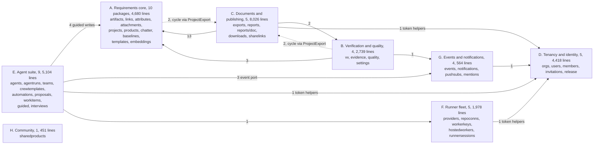

Edge labels are package-level import counts between contexts (35 of the 50
domain-to-domain edges; the other 15 stay inside a context). Dotted edges
close the two context-level cycles that `exports.ProjectExport` creates:
`baselines` and `templates` (A) and `vv` and `quality` (B) import `exports`
(C) for the snapshot type, while `exports`, `reports` and `downloads` import
A, and `reports` and `downloads` also import `vv` (B). `sharedproducts` (H)
imports no other domain package.

#### The package pattern

Most packages follow one shape: an entity struct with JSON tags, a
`Repository` interface that `internal/persistence/postgres` implements, a
`Service` interface, and a `DefaultService` that holds the repository and
implements the service. `artifacts` is the reference example.

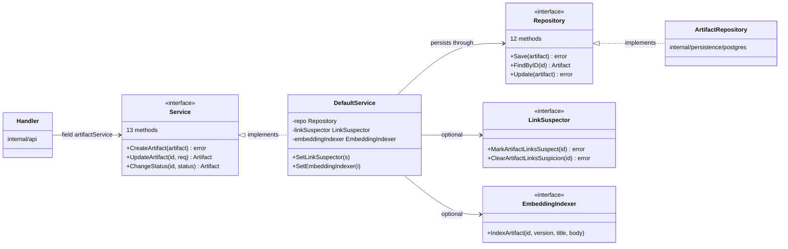

`LinkSuspector` and `EmbeddingIndexer` (`artifacts/artifact.go:293`, :307)
are ports the consumer declares so that `artifacts` never imports `links` or
`embeddings`; `links.DefaultService` and `embeddings.Service` satisfy them
and are attached by setters in `main.go` (§4.1).

31 of the 43 packages have all three pieces (`Service`, `Repository`,
`DefaultService`). The rest diverge:

| Divergence | Packages |
|---|---|
| Composes other services, no `Repository` | `exports` (declares a narrow `ProjectRepository` port, `export.go:156`), `reports`, `downloads` |
| Different storage port | `settings` (`Store`, `settings.go:24`), `embeddings` (concrete `*Service` over a `Store` and an HTTP `Provider`) |
| No storage at all | `release` (parses the embedded `RELEASE_NOTES.md`; `NewService` returns `(*DefaultService, error)`, `release.go:324`) |
| File-backed service | `agents` (`NewFileService` over `AGENTS_DIR` with a registry `Repository`, `loader.go`) |
| No service; pure functions or types | `quality` (linter), `reports/doc` (markdown parser), `mentions` (handle resolution), `crewtemplates` (free functions over `AgentDirectory` and `CrewWriter` ports), `events` (event type plus `Bus` and `Repository` interfaces) |
| Constructor name | `NewDefaultService` in 27 packages; `NewService` in 10 (`projects`, `baselines`, `templates`, `reports`, `exports`, `downloads`, `sharelinks`, `embeddings`, `release`, `settings`); `NewFileService` in `agents`; second services `orgs.NewTeamService` and `providers.NewLoginService` |
| Constructor returns the interface | `projects.NewService` (`project.go:109`), `attachments.NewDefaultService` (`attachment.go:289`); the others return a concrete pointer |
| Repository verbs | `Save`/`FindByID` (artifacts, links, chatter, proposals), `Create`/`GetByID` (projects, baselines, templates), `Get`/`Upsert` (products), `Create`/`Get`/`ListByProject` (sharelinks) |
| Late wiring | setters (`artifacts`, `links`, `exports`, `downloads`, `agentruns`, `teams`, `users`, `workerkeys`), functional options (`agents`), reflection (`links`), package globals (`orgs`) |

Service interfaces vary widely in width: `orgs.Service` has 38 methods
(its `Repository` 37), `users.Service` 24, `agentruns.Service` 22,
`artifacts.Service` 13. Callers that need two or three methods still depend
on the whole interface, which is why API test fakes embed full interfaces
(§9.5).

#### Cross-domain imports

Eighteen domain packages import other domain packages; the other 25 import
none.

| Importer | Imports |
|---|---|
| `reports` | artifacts, attachments, baselines, exports, links, products, reports/doc, vv |
| `exports` | artifacts, attachments, attributes, links, products, projects |
| `guided` | artifacts, chatter, events, links, products |
| `downloads` | artifacts, attachments, exports, reports, vv |
| `vv` | artifacts, chatter, events, exports |
| `templates` | artifacts, attachments, exports, links |
| `agentruns` | agents, events, users |
| `baselines`, `quality` | artifacts, exports |
| `invitations` | orgs, users |
| `crewtemplates` | agents, teams |
| `agents` | providers |
| `embeddings` | artifacts |
| `mentions` | members |
| `settings` | quality |
| `sharelinks`, `workerkeys` | users |
| `workitems` | events |

Several further dependencies exist only at runtime and do not appear as
imports: `links` calls `artifacts` by reflection (`links/link.go:135`,
:171); `artifacts` drives `links` and `embeddings` through its two ports;
`attributes` receives `artifacts.ValidType` as a `TypeValidator` function
(`attributes.go:103`, `main.go:379`); `downloads` receives evidence and
workspace sources as functions (`download.go:122-126`); `runnersessions`
mints keys through a `KeyMinter` port that `workerkeys` satisfies
(`runnersessions.go:321`); `invitations` reaches workspaces through a
three-method `Workspaces` port (`invitations.go:147`); crews validate human
members through a closure over `orgs` (`main.go:484`); and `proposals`
applies approved writes through the `Appliers` function struct
(`proposals.go:80`) that the API fills.

#### Where validation and business rules live

Rules are split between the domain, the API and the composition root. The
newer packages keep their validation inside the domain; the older write
paths are orchestrated in handlers.

| Rule | Where it is decided | Notes |
|---|---|---|
| Artifact status machine (draft, in review, approved, superseded) | `artifacts/status.go` | Sentinel errors map to 400 and 409 in the API |
| Stable refs, versioning, update merge semantics | `artifacts` (`ref.go`, `artifact.go:413` `UpdateArtifact`) | Presence-aware request fields |
| Artifact type | nowhere on write | `ValidType` (`types.go:50`) is called only by review rounds (`review_round.go:96`) and as the attributes `TypeValidator` |
| Attribute values against definitions | `attributes.ValidateAttributes` (`attributes.go:311`) | Invoked from the API before the service call (`handlers.go:572`, :780-789) |
| Link-type rules | `links.ValidateLinkType` (`validation.go:108`) | Invoked from `CreateLink`, the managed link edits in `UpdateArtifact` and the proposal appliers, which enforce it differently |
| Link snapshots, auto-versioning, change-summary notes | `internal/api/handlers.go:2866-3194` | Not in any domain package (§9.3) |
| V&V coverage, matrix, gaps, impact | pure functions in `vv/coverage.go` and `vv/impact.go` | The child-project flow-down recursion (a parent project's coverage also counting its child projects) is in `internal/api/suite_handlers.go:553-583` |
| Evidence bounds, project hierarchy, crew graph, shared-product sanitising | `evidence.Validate` (`evidence.go:239`), `projects` `checkParent` (`project.go:185`), `teams.ValidateGraph` (`teams.go:209`), `sharedproducts.Sanitize` (`sharedproducts.go:376`) | Validated inside the domain package |
| Plan ceilings and over-plan decision | `orgs.OverPlan` (`limits.go:450`), `orgs.CheckCeiling` and `CheckFlag` (`limiterror.go:142`, :67) | The usage counts they judge are gathered in `internal/api/limits.go` |
| Release-channel feature gates | `release.FeaturesFor` (`features.go:141`) | Preview selection in `internal/api/feature_handlers.go:44-71` |
| Budget soft-block | closure with the refusal text in `main.go:656-671` | Executed inside `agentruns.Launch` (`agentruns.go:581-584`), so it gates every launcher |
| Personal-runner routing and retry policy | closures in `main.go:452-477` | Read `runner_grace_seconds` from the raw limits map (:462) |
| Proposal diversion | `internal/api/authz.go:209` | The per-run cap and ref tokens are in `proposals` |

Event publication follows the same split: `vv`, `workitems` and
`agentruns` publish their own events, while artifact, link, baseline and
membership events are published by handlers (§4.2, V5).

#### Largest domain files

| File | Lines | Content |
|---|---|---|
| `reports/pdf_report.go` | 1,330 | gofpdf specification renderer |
| `agentruns/agentruns.go` | 1,224 | Run queue and lifecycle, retries, budget guard, subscribers |
| `reports/docx_report.go` | 1,085 | Hand-written OOXML (Word `.docx`) renderer |
| `reports/report.go` | 1,004 | Snapshot loading and the shared report model |
| `users/users.go` | 924 | Accounts, sessions, verification, reset, token helpers |
| `exports/reqif.go` | 871 | ReqIF export |
| `orgs/orgs.go` | 779 | Workspaces, membership, billing snapshot, channels |
| `exports/export.go` | 728 | `ProjectExport`, prepare and render, JSON import |
| `teams/teams.go` | 715 | Crew graph, validation, delegation |
| `orgs/limits.go` | 694 | Plan catalogue, limit resolution, package globals |
| `runnersessions/runnersessions.go` | 683 | Transient runner pool and leases |
| `artifacts/artifact.go` | 630 | Artifact entity, requests, service |

By package, `reports` (3,802 lines) and `exports` (3,155) are the largest,
followed by `orgs` (2,054), `artifacts` (1,338), `agentruns` (1,224), `vv`
(1,114) and `users` (1,012).

#### Editing notes

- **A new domain concept** gets its own package with an entity, a
  `Repository`, a `Service` and a `NewDefaultService` returning
  `*DefaultService`; declare narrow interfaces for what it needs from
  sibling packages, implement the repository in
  `internal/persistence/postgres` (§4.5) and wire it in `main.go` (§4.1).
- **Domain structs are the wire format.** Handlers encode them directly and
  `cmd/agentd` decodes some of them, so renaming a JSON tag changes the API.
  Tags inside stored data are persisted formats: `ProjectExport` (baselines
  and templates store it), `links.Link` values inside the `links_snapshot`
  attribute of every artifact version, and the request DTOs that
  `maybePropose` stores as proposal payloads (including the camelCase
  `pendingLinkAdds`, `pendingLinkRemoves` and `linksSnapshot`).
- **Moving a rule into the domain can change behavior.** No write path
  validates the artifact type today and imports accept any link type, so
  adding validation would reject payloads MCP clients and imports send. The
  budget guard must stay inside `agentruns.Launch` to keep gating retries,
  hooks, automations and suite launches. Event payload value types (not only
  keys) are read by automations and notifications.
- **Error mapping is per call site.** Older repositories return plain
  `errors.New("... not found")` rather than the domain sentinels, so some
  handler branches for `artifacts.ErrNotFound` never match; record today's
  status codes before changing error plumbing.
- **Hidden state:** `orgs` limits depend on the four package globals set at
  boot, and `reports` reads `UPLOADS_DIR` itself. Pain points for this layer
  are in §9.3; the plan is in [the refactor plan](../../plans/codebase-refactor.md).

### 4.5 Persistence

`internal/persistence/postgres` is the only package that talks to
PostgreSQL. It exists so that the domain packages can declare what they need
to store as Go interfaces and stay free of SQL. It holds three kinds of code:
connection and boot (`db.go`, `migrations.go`, `org_backfill.go`), the
schema (a frozen baseline plus a ledger of numbered migrations), and 38
repository files that implement the domain interfaces with hand-written SQL.
It is one flat package of 46 non-test files (12,582 lines) and 42 test files
(8,726 lines). Only `cmd/server/main.go` imports it, and no other package
imports `database/sql`.

The schema is built at every boot, before any repository exists. The diagram
follows `postgres.MigrateAndBackfill` from the call in `main()` to the moment
the repositories are constructed.

```mermaid
flowchart TD
  dsn["main.go:126-136<br/>DSN: DATABASE_URL as given, else DB_HOST,<br/>DB_PORT, DB_USER, DB_PASSWORD, DB_NAME, sslmode=disable"]
  connect["db.go:10 Connect<br/>lib/pq, 50 open, 10 idle, 30 min lifetime, Ping"]
  mab["migrations.go:1587 MigrateAndBackfill<br/>called at main.go:188"]
  bootlock["withBootLock, migrations.go:1547<br/>session pg_advisory_lock 0x6f70656e7601"]
  ledger["createLedgerSQL, migrations.go:1564<br/>CREATE TABLE IF NOT EXISTS schema_migrations"]
  validate["runMigrations, migrations.go:1707<br/>versions ascending, exactly one of Run or RunDB"]
  v1["version 1 baseline, applyEveryBoot :1736<br/>runs on every boot"]
  initchain["db.go:35 InitSchema, then InitUserSchema,<br/>InitSuiteSchema, InitAgentSchema, InitOrgSchema<br/>db.go:254-266"]
  v1rec["ledger INSERT ... ON CONFLICT DO NOTHING"]
  vn["versions 2 to 47, applyOnce :1751"]
  applied{"already in ledger?<br/>migrationApplied :1794"}
  tx["BEGIN, pg_advisory_xact_lock 0x6f70656e76,<br/>re-check, m.Run(tx), ledger INSERT, COMMIT"]
  reconcile["reconcileGuardedExtensions :1628<br/>trigram indexes and artifact_embeddings<br/>if pg_trgm or vector appeared later"]
  backfill["org_backfill.go:35 BackfillOrgs<br/>step 1: personal org per user"]
  boot{"bootstrap org found?<br/>org_backfill.go:87-96"}
  steps["steps 3-6: org_id on projects,<br/>5 derived and 3 global tables,<br/>move agent .md files under AGENTS_DIR"]
  promote["schema_orgs.go:254 PromoteOrgColumns<br/>org_id NOT NULL on 9 tables where no NULLs"]
  unlock["pg_advisory_unlock, connection released"]
  repos["main.go:193-225<br/>New*Repository(db) for 33 repositories"]
  dsn --> connect --> mab --> bootlock --> ledger --> validate
  validate --> v1 --> initchain --> v1rec --> vn --> applied
  applied -->|"yes"| reconcile
  applied -->|"no"| tx --> reconcile
  reconcile --> backfill --> boot
  boot -->|"no: fresh database"| unlock
  boot -->|"yes"| steps --> promote --> unlock
  unlock --> repos
```

`applyOnce` loops over versions 2 to 47; the diagram shows one iteration. A
failure anywhere returns an error, and `main()` exits through `fatal`
(`main.go:189`).

#### Connection and pool

| Setting | Value | Where |
|---|---|---|
| Driver | `lib/pq`, registered by the package's own imports of `github.com/lib/pq` in 10 repository files and by the blank import in `cmd/server/main.go` | `db.go:11` |
| Pool | `SetMaxOpenConns(50)`, `SetMaxIdleConns(10)`, `SetConnMaxLifetime(30 * time.Minute)` | `db.go:18-20` |
| Statement timeout | 5 s through `stmtCtx`, used only by the artifact and embedding repositories (15 call sites) | `artifact_repository.go:19-25` |
| Test database | `OPENV_TEST_DATABASE_URL`; each test creates and drops its own database | `testdb_test.go:19-23` |

#### The migration ledger and the frozen baseline

The schema has two layers, and the difference matters to anyone adding a
column.

| Layer | Files | Runs | Rule |
|---|---|---|---|
| 0001 baseline | `db.go` (271 lines, of which `InitSchema` is 237), `schema_users.go` (88), `schema_suite.go` (243), `schema_agents.go` (370), `schema_orgs.go` (277) | On every boot, as `CREATE TABLE IF NOT EXISTS` statements and guarded `DO $$` blocks (31 `information_schema.columns` probes in the baseline functions; a 32nd in these files belongs to `PromoteOrgColumns`) | Frozen: "do not add DDL to InitSchema or the schema_*.go files anymore" (`migrations.go:29-30`) |
| Numbered migrations 0002-0047 | `migrations.go:63-1458`, one slice literal of 47 `Migration` entries with inline closures | Once each, in its own transaction, recorded in `schema_migrations` | Append only; "never renumber, reorder, or edit an entry that has shipped" (`migrations.go:59-62`) |

`Migration` (`migrations.go:39`) has `Version`, `Name`, and exactly one of
`Run func(*sql.Tx) error` (every numbered migration) or `RunDB func(*sql.DB)
error` (only the baseline, `migrations.go:64`). Two PostgreSQL advisory lock
keys (application-chosen numbers that sessions or transactions lock to
exclude each other) are in play and must stay different: the session lock `bootLockKey = 0x6f70656e7601`
serializes the whole boot sequence across replicas, and the transaction lock
`migrationLockKey = 0x6f70656e76` serializes each numbered migration
(`migrations.go:1524-1540`, which documents why they share one lock space).

The baseline re-runs on every boot so that databases older than the ledger
upgrade through the same path as fresh ones (`migrations.go:19-28`).
"Frozen" is therefore a convention, and it has been broken twice:
`schema_suite.go:95` adds `work_items.source_chatter_id` in the baseline
`CREATE TABLE` (its baseline index crash-looped release 0.8.0 on existing
databases until commit `888dc64` removed it), and `db.go:224-229` stopped
creating `idx_links_active` when migration 0010 dropped it. The baseline also
moves data on every boot (`schema_agents.go:296-316`), and it sends
multi-statement strings in single `db.Exec` calls (for example `db.go:133`),
each of which PostgreSQL runs as one implicit transaction.

Two boot steps sit outside the ledger but under the same boot lock:

- `reconcileGuardedExtensions` (`migrations.go:1628`) creates the trigram
  indexes and the `artifact_embeddings` table and HNSW (approximate
  nearest-neighbour) index once the `pg_trgm` (trigram text search) or
  `vector` (pgvector) extension exists, if migrations 0009 and 0016 had
  skipped them. A failure
  to create them is logged and swallowed; a failed extension probe fails
  boot (`migrations.go:1648-1651`, :1674-1677).
- `BackfillOrgs` (`org_backfill.go:35-167`, 133 lines, no transaction)
  migrates pre-workspace data: a personal workspace "<name or email local
  part>'s Space" per user (:36-83), the bootstrap workspace (the earliest
  user's personal one, :86-99), `org_id` on projects, five derived and three
  global tables (:102-133), agent `.md` files and `.trash` moved under
  `<AGENTS_DIR>/<bootstrap org>/` (:137-163), then `PromoteOrgColumns`
  (`schema_orgs.go:254`), which sets `org_id NOT NULL` on nine tables with no
  NULLs left. With no users there is no bootstrap workspace and the function
  returns before the promotion (:94-96), so nullability depends on boot
  history.

**Embedding dimension check.** Migration 0016 sizes `vector(1536)` from
`embeddingDimensions` (`migrations.go:1522`), a local constant that keeps the
registry stdlib-only; `embedding_dim_check.go:10-11` fails compilation if it
drifts from `embeddings.Dimensions` (two `uint` conversions that overflow in
either direction). `backfillRefPrefix` (`migrations.go:1465`) is a frozen copy
of `artifacts.RefPrefix` for the same reason: a migration must keep producing
what it produced when it shipped.

#### Repositories by bounded context

Each repository is a struct around `*sql.DB` with a `New*Repository(db)`
constructor. 33 are constructed at `main.go:193-225` and five inline:
embeddings (:252), settings (:376), share links (:435), provider logins
(:481) and release (:629). The table groups them by the bounded contexts of
§4.4. "Methods" counts the methods declared on the repository type in that
file (369 in total).

| Context | Repository file | Lines | Methods | Implements |
|---|---|---|---|---|
| A. Requirements core (2,656 lines) | `artifact_repository.go` | 532 | 12 | `artifacts.Repository` |
| | `attachment_repository.go` | 554 | 12 | `attachments.Repository` (constructor returns the interface) |
| | `link_repository.go` | 474 | 13 | `links.Repository` |
| | `embedding_repository.go` | 243 | 4 | `embeddings.Store` |
| | `attribute_definition_repository.go` | 196 | 6 | `attributes.Repository` |
| | `project_repository.go` | 172 | 7 | `projects.Repository` (constructor returns the interface) |
| | `template_repository.go` | 130 | 4 | `templates.Repository` |
| | `product_profile_repository.go` | 127 | 2 | `products.Repository` |
| | `chatter_repository.go` | 123 | 4 | `chatter.Repository` |
| | `baseline_repository.go` | 105 | 4 | `baselines.Repository` |
| B. Verification and quality (772) | `evidence_repository.go` | 399 | 17 | `evidence.Repository` |
| | `vv_repository.go` | 298 | 9 | `vv.Repository` |
| | `settings_repository.go` | 75 | 6 | `settings.Store` (constructor returns the interface) |
| C. Documents and publishing (137) | `sharelink_repository.go` | 93 | 5 | `sharelinks.Repository` |
| | `project_info_repository.go` | 44 | 1 | `exports.ProjectRepository` |
| D. Tenancy and identity (1,595) | `org_repository.go` | 784 | 45 | `orgs.Repository` and `orgs.TeamRepository` |
| | `user_repository.go` | 351 | 25 | `users.Repository` |
| | `invitation_repository.go` | 227 | 11 | `invitations.Repository` |
| | `member_repository.go` | 166 | 9 | `members.Repository` |
| | `release_repository.go` | 67 | 2 | `notify.ReleaseClaimer` and `notify.StableSteps` (no domain import) |
| E. Agent suite (2,548) | `agent_run_repository.go` | 609 | 25 | `agentruns.Repository` (the run queue, §4.7) |
| | `interview_repository.go` | 479 | 18 | `interviews.Repository` |
| | `team_repository.go` | 344 | 17 | `teams.Repository` (crews, not people-teams) |
| | `workitem_repository.go` | 305 | 9 | `workitems.Repository` |
| | `automation_repository.go` | 278 | 9 | `automations.Repository` |
| | `guided_repository.go` | 278 | 8 | `guided.Repository` |
| | `agent_repository.go` | 140 | 6 | `agents.Repository` |
| | `proposal_repository.go` | 115 | 5 | `proposals.Repository` |
| F. Runner fleet (948) | `runner_session_repository.go` | 317 | 16 | `runnersessions.Repository` |
| | `worker_key_repository.go` | 167 | 10 | `workerkeys.Repository` and `workerkeys.PairingRepository` |
| | `repo_connection_repository.go` | 149 | 7 | `repoconns.Repository` |
| | `provider_login_repository.go` | 109 | 5 | `providers.LoginRepository` |
| | `provider_setting_repository.go` | 108 | 3 | `providers.Repository` |
| | `hosted_worker_repository.go` | 98 | 6 | `hostedworkers.Repository` |
| G. Events and notifications (386) | `notification_repository.go` | 190 | 8 | `notifications.Repository` |
| | `push_subscription_repository.go` | 122 | 6 | `pushsubs.Repository` |
| | `event_repository.go` | 74 | 2 | `events.Repository` (used by the bus, §4.6) |
| H. Community (313) | `shared_product_repository.go` | 313 | 11 | `sharedproducts.Repository` |

Most repositories plug into exactly one domain service. The irregular cases
are the ones an editor trips over, so the mapping diagram shows only those.

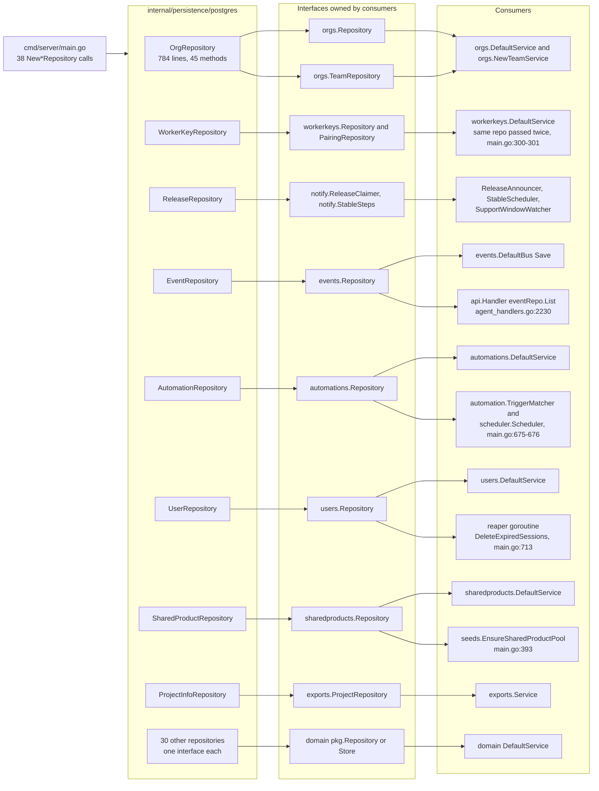

Four consumers reach a repository without going through its service: the
API lists events from `eventRepo` directly, the trigger matcher and scheduler
use `automationRepo`, the reaper calls `userRepo.DeleteExpiredSessions`, and
the shared product seed writes through `sharedProductRepo`. `main.go` also
runs two raw SQL queries of its own: the bus org resolver (:229-235) and
`bootstrapOrgID` (:351-363, the same query as `org_backfill.go:87-93`,
differing only in indentation).

#### SQL patterns in use

All SQL is raw strings with `$n` placeholders; there is no query builder or
ORM.

| Concern | How it is done today | Evidence |
|---|---|---|
| Column lists | 18 files declare an `xColumns` constant and 22 files a `scanX` function. Artifact, link, project, interview and work-item repositories still repeat projections inline (the 15-column artifact list appears 8 times) | `org_repository.go:23-26` (`orgColumns` and `orgColumnsQualified`, 31 columns each); `project_repository.go:16` |
| Scanning | Hand-written; 79 row loops in repository files (77 `for rows.Next()`, plus two over differently named result sets). Scanner parameters take three shapes: `interface{ Scan(...interface{}) error }`, `func(dest ...interface{}) error`, and `*sql.Rows`. Three scanners take a positional `extra ...interface{}` tail | `scanOrg` `org_repository.go:28`; `scanSession`, `scanWorkerKey` |
| Derived fields | Some scanners compute JSON fields: `scanOrg` sets `has_logo`, defaults `limits` to `{}` and calls `ResolveReleaseChannel`; `scanUser` sets `has_avatar` | `org_repository.go:68-72`; `user_repository.go:40` |
| Transactions | 14 hand-rolled `Begin`/`BeginTx` sites, two rollback styles, no shared helper. Constructors take `*sql.DB`, so a repository cannot join a caller's transaction | `agent_run_repository.go:405`, `artifact_repository.go:56`, `org_repository.go:581` |
| Not found | Mixed: `return nil, nil` right after `sql.ErrNoRows` (51 sites in 21 files), plain `errors.New("... not found")` strings, domain sentinels, and an empty map in `SettingsRepository.get`. 70 `err == sql.ErrNoRows` against 9 `errors.Is` in repository files | `artifact_repository.go:165`; `baseline_repository.go:88`; `settings_repository.go:46-50` |
| Writes to missing rows | Most `UPDATE`/`DELETE` succeed silently; 30 `RowsAffected` checks in total | `org_repository.go:104` |
| NULL handling | Nullable UUIDs cross as Go strings through `COALESCE(x::text, '')` (34 sites) and `NULLIF($n, '')::uuid` (39), or as `sql.NullString` to `*string`. `COALESCE` defaults are visible in the API (`plan_status 'none'`, `email_notifications TRUE`) | `orgColumns`, `userColumns` |
| Optional filters | In SQL as `($n = '' OR col = $n)` (events, runs, artifacts) or by string concatenation with computed placeholder numbers (notifications) | `event_repository.go`; `notification_repository.go:65-70` |
| Workspace scoping | 56 of 369 methods take an `orgID` and filter `org_id` in SQL; project-, artifact- and run-scoped finders load by id and the service or API compares the workspace afterwards | `agent_run_repository.go:213` |
| Stable numbering | Atomic counter upserts `INSERT ... ON CONFLICT DO UPDATE SET next_num = next_num + 1 RETURNING next_num - 1`, in the same transaction as the insert: artifact refs and `EVD` refs share `artifact_ref_counters`; figure numbers use `attachment_figure_counters` | `artifact_repository.go:103-110`; `evidence_repository.go:64-71`; `attachment_repository.go:229-234` |
| Exactly-once work | Claim rows decided by `RowsAffected` or a primary-key insert (budget, minutes, release and stable-step claims) and `FOR UPDATE SKIP LOCKED` queue claims (each claimer skips rows another transaction has locked, so two claimers never take the same row: runs, scheduled automations) | `org_repository.go:223-257`; `agent_run_repository.go:206-243`; `automation_repository.go:230` |
| Versioned rows | Artifacts and links are temporal: a new row per version, `valid_to` set on the old one, reads filter `valid_to IS NULL`, deletes tombstone | `artifact_repository.go:333-371`, :399 |
| Postgres errors | Unique violations detected three ways (SQLSTATE `23505` via `pq.Error` with a constraint-name check, the same without one, and a string match on the error text); `42P01` maps to `embeddings.ErrVectorUnavailable` so search degrades | `agent_repository.go:79-80`; `shared_product_repository.go:306-313`; `embedding_repository.go:36-45` |

The workspace purge is the one place that deletes across contexts:
`OrgRepository.PurgeOrg` (`org_repository.go:580-631`) probes
`to_regclass('artifact_embeddings')`, deletes embeddings when the table
exists, then runs a hand-ordered list of 22 `DELETE` statements and relies on
`ON DELETE CASCADE` for the rest. Nothing ties a new table to that list.

#### How a table or column is added today

1. Append `Migration{Version: 48, Name: "...", Run: func(tx *sql.Tx) error
   {...}}` before the closing brace at `migrations.go:1458`. Do not touch the
   baseline. Plain DDL is fine; avoid statements that cannot run in a
   transaction (`docs/DEVELOPMENT.md:72-90`, whose example still says
   `Version: 2`).
2. If a migration drops or renames something the baseline creates, add the
   matching guarded change to the baseline too, or every boot re-creates it
   (the `idx_links_active` precedent, `db.go:224-229`).
3. Add the field to the domain struct in `internal/domain/<pkg>` and, for a
   new query, a method to the domain `Repository` interface.
4. Edit every projection and scan list that returns the entity: the
   `xColumns` constant or the inline copies, the positional `Scan`
   destinations, and the `INSERT`/`UPDATE` statements. For organizations that
   means two 31-column strings plus `scanOrg` ("appended, never inserted").
5. For a new table owned by a workspace, project or artifact without `ON
   DELETE CASCADE` to its owner, add a `DELETE` to `PurgeOrg`.
6. For a new repository, add a `New*Repository` constructor and wire it in
   `cmd/server/main.go`.
7. Add a test gated on `OPENV_TEST_DATABASE_URL` (`testDB`,
   `testdb_test.go:23`) and update `docs/data-model.md` by hand (it omits 16
   of the 65 tables today).

§9.1 counts the files such a change touches end to end.

#### Editing notes

- **Migration history is immutable.** Versions 1-47, their names (including
  the duplicate `release_schedule` of 36 and 37, `migrations.go:1241`,
  :1261), their SQL, the baseline's `Exec` grouping and both lock keys must
  not change; old and new replicas share the keys. Migration bodies moved to
  other files must keep their text and stay free of live domain helpers,
  like the frozen `backfillRefPrefix`, `embeddingDimensions` and the
  backfill's `orgSlug` and "'s Space" naming.
- **Test databases are not production-shaped.** `initTestSchema`
  (`testdb_test.go:75`) calls `Migrate`, not `MigrateAndBackfill`, so the nine
  `org_id` columns stay nullable; CI's `postgres:15` has no pgvector (§9.5).
- **Result shapes are API contracts:** `nil` versus empty slices (JSON `null`
  versus `[]`), `COALESCE` defaults, each method's not-found convention, the
  JSON decode policy (some repositories substitute `{}`, others return the
  error) and limits (events and runs reset a limit outside 1-500 to 100
  rather than clamping; proposals stop at 500, run children at 1,000, log
  pages at 2,000). A shared helper must keep each per call site.
- **Artifact refs:** `Update` inserts `NULLIF(ref, '')` while `Save` inserts
  the raw value, and the partial unique index `idx_artifacts_project_ref`
  treats `''` and NULL differently. **Timestamps** are mostly naive
  `TIMESTAMP` and some repositories mint `time.Now()` themselves.
- **Driver registration** for the package's tests depends on repository files
  importing `github.com/lib/pq`; removing every such import breaks them.
- Pain points (the 1,800-line `migrations.go`, `OrgRepository` spanning six
  concerns, the purge list, duplicated projections, 15 repositories without
  tests) are in §9.3; the table-level model is §7.

### 4.6 Background and cross-cutting services

What the server does outside a direct answer to a request lives in nine
packages around the domain layer: the event bus, notification delivery,
billing and its Stripe client, hosted-runner provisioning, metrics, seed data
and the two automation runners. They keep side effects (email, push, Stripe,
Docker, periodic sweeps) out of domain services and handlers. Each is small;
none has a lifecycle manager, and all are built and started by hand in
`main()` (§4.1). `internal/orchestration`, also a bus subscriber, is in §4.7.

| Package | Files | Lines | Test lines | Role |
|---|---|---|---|---|
| `internal/events` | 1 | 106 | 49 | `DefaultBus`: persist every domain event, then dispatch in process |
| `internal/notify` | 11 | 2,247 | 2,195 | Bus fan-out to notifications, usage monitors, email and web push channels, auth mail templates, release announcement and stable-channel rollout |
| `internal/billing` | 6 | 1,286 | 1,062 | Stripe subscriptions to workspace entitlements: reconcile loop, seat sync, checkout, portal, catalogue |
| `internal/billing/stripe` | 2 | 526 | 324 | Hand-written Stripe REST client behind `billing.Provider` |
| `internal/seeds` | 3 | 771 | 1,091 | Default agents and crew per workspace, shared demo product pool |
| `internal/hosting` | 2 | 367 | 271 | One Docker runner container per workspace |
| `internal/metrics` | 1 | 284 | 165 | `/metrics`, HTTP middleware, run gauges, `billing.Metrics` |
| `internal/scheduler` | 1 | 170 | 0 | Cron automations, 30 s poll, plus `ResolveTarget` |
| `internal/automation` | 1 | 159 | 0 | Event-triggered automations (bus subscriber) |

Work reaches them in five ways: timers, bus subscriptions, the synchronous
run subscribers of `agentruns`, direct calls from handlers, and one-shot
jobs in `main()`.

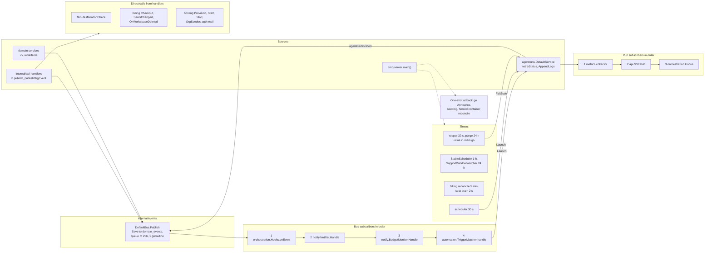

Arrows between subscribers show call order on one goroutine, not data flow.
The SSE hub is a run subscriber and never subscribes to the bus.

#### The event bus and `domain_events`

`internal/events/bus.go` implements the `Bus` interface declared in
`internal/domain/events` (`events.go:114`), which also holds the `Event` type,
24 event-type constants (`events.go:11-66`) and `ActorSystem = "system"`.

| Step | What happens | Where |
|---|---|---|
| Publish | If the event has a project but no workspace, the resolver closure from `main.go:229-235` looks the workspace up with raw SQL; any error yields `""` | `bus.go:50-52` |
| Persist | `repo.Save(e)` on the caller's goroutine into `domain_events`; a failure is logged and the event is still dispatched | `bus.go:53-58` |
| Queue | Non-blocking send into a 256-slot channel; when full the event is dropped for every subscriber, counted in `Dropped()` and logged at most every 10 s | `bus.go:42`, :59-72 |
| Dispatch | One goroutine started by `NewBus` copies the subscriber list and calls each subscriber in registration order, each inside its own `recover` | `bus.go:44`, :88-106 |

Registration order is statement order in `main()`: hooks (:530), Notifier
(:590), BudgetMonitor (:598), TriggerMatcher (:675). `GET /api/v1/events`
pages the persisted rows; triggered automations match the in-memory dispatch,
so a dropped event never fires one. Payloads are untyped maps whose keys user
automations filter and template on; publishers are split between handlers
and services (§4.2, V5).

#### Background loops

This is every periodic or long-lived goroutine in the server process. §4.1
lists the same loops by their start line in `main()`; the runner-side loops
are in §4.7.

| Loop | Owner | Cadence | First run | Stops on shutdown |
|---|---|---|---|---|
| Bus dispatch | `events/bus.go:44`, :88 | per event | not applicable | no (never closed) |
| Web push workers | `notify/push.go:258-279`, 8 workers over a 1,024-slot queue | per notification | started lazily on the first `Dispatch` | no (`Wait` is for tests) |
| Release announcement | `main.go:633`, `notify/release.go:72` | once per boot | at boot, only when a current release section exists | no |
| Stable-release scheduler | `notify/stable.go:68-82`, `main.go:640`, only when a current release exists | 1 h | immediately | yes |
| Support-window watcher | `notify/dedicated.go:89-103`, `main.go:648`, also only when `OPENV_DEPLOYMENT=dedicated` | 24 h | immediately | yes |
| Automation scheduler | `scheduler/scheduler.go:29-43`, `main.go:676` | 30 s, hard-coded (`scheduler.go:25`) | `catchUp` runs synchronously on `main`'s goroutine before the ticker starts | yes |
| Workspace purge | inline, `main.go:680-699` | 24 h | immediately | yes |
| Reaper | inline, `main.go:700-729`: `FailStale(2 min)`, expired sessions, expired invitations, runner-lease sweep | 30 s | after the first tick | yes |
| Billing reconcile | `billing/reconcile.go:19-31`, `main.go:793`, only when billing is enabled | `OPENV_BILLING_RECONCILE_MINUTES`, default 5 min (`billing/service.go:52`) | immediately | yes |
| Billing seat drain | `billing/seats.go:57-70` | 2 s (`service.go:57`), 1,024-slot queue | after the first tick | yes; queued seats are not flushed |
| SSE keepalive | `api/sse.go:157`, per open stream | 25 s | after the first tick | with the request |

Fire-and-forget goroutines per request also exist: auth mail
(`api/invitation_handlers.go:324`, `email_verification_handlers.go:155`,
`password_reset_handlers.go:77`), embedding indexing behind a semaphore
(`domain/embeddings/service.go:88`) and project reindex
(`api/embedding_handlers.go:47`).

#### Notifications (`internal/notify`)

A notification is stored, pushed over SSE, and optionally emailed and
web-pushed. Channels (dispatchers) are separate from producers, which decide
who is told what.

| Channel | File | Enabled when | Timing | Contract to preserve |
|---|---|---|---|---|
| Inbox row | `notifications.Service.Create` | always | synchronous | 12 notification types (`domain/notifications/notifications.go:16-55`) and their `entity_ref` keys |
| SSE | `api.SSEHub.BroadcastSession` through the `Broadcaster` port | always | synchronous | key `notify:<user_id>` (`StreamKey`, `notifier.go:20`), event name `"notification"` (a literal at 7 call sites) |
| Email | `email.go` (297): `SMTPMailer`, `EmailDispatcher` | `OPENV_SMTP_HOST` set, type in `DefaultEmailTypes` or `OPENV_EMAIL_NOTIFICATION_TYPES`, user opted in | synchronous `smtp.SendMail` with no timeout (`email.go:94`), on whatever goroutine delivers | plain-text body, deep link from `notificationPath` (`email.go:253`) |
| Web push | `push.go` (408): `PushDispatcher`, `WebPushSender` | `OPENV_VAPID_*` key pair (the server's web push signing keys) set, type in the push allow-list (`OPENV_PUSH_NOTIFICATION_TYPES`), user opted in | queued to 8 workers, 10 s request timeout | `PushPayload {title, body, url, tag}` read by `frontend/public/sw.js`; 404 or 410 deletes the subscription |
| Auth mail | `verification.go` (117), `invitation.go` (41) | mailer configured | handler goroutines with `SendWithTimeout` | verification, reset and invitation subjects, bodies and links |

| Producer | File | Triggered by | Types | Audience | Once-only guard |
|---|---|---|---|---|---|
| `Notifier` | `notifier.go` (252), `membership.go` (229) | bus: `proposal.created`, failed `agentrun.finished`, `artifact.status_changed` to `in_review`, `chatter.created`, 8 membership events | `proposal_pending`, `run_failed`, `review_requested`, `interview_completed`, `mention`, `access_changed`, `membership_changed` | project editors and above, the launcher, mentioned members, the affected member, workspace admins; never the actor | none |
| `BudgetMonitor` | `budgets.go` (184) | bus: `agentrun.finished` | `budget_threshold` | workspace admins | `ClaimBudgetAlert` per month and threshold (80, 100) |
| `MinutesMonitor` | `minutes.go` (134) | direct call from the lease handlers (`api/runner_session_handlers.go:221`, :253) | `hosted_minutes` | workspace admins | `ClaimMinutesAlert` |
| `ReleaseAnnouncer` | `release.go` (150) | `go Announce` at boot | `release_published` | every account in a nightly-channel workspace | `ClaimReleaseAnnouncement` per version |
| `StableScheduler` | `stable.go` (242) | 1 h timer | `release_scheduled`, then `release_published` | admins at the cut and 24 h before; every member at turn-on | `ClaimStableStep` per workspace, version and step; turn-on also calls `orgs.SetStableRelease` |
| `SupportWindowWatcher` | `dedicated.go` (193) | 24 h timer, dedicated deployments | `release_support_window` | workspace admins | `release_announcements` rows keyed `support-window:<version>:<days or closed>` |

Each producer repeats the store, SSE, email and push sequence with its own
dispatcher setters; §5.9 traces one end to end.

#### Billing (`internal/billing`, `internal/billing/stripe`)

Billing is poll-only: there is no Stripe webhook receiver (§5.10).

| File | Lines | Responsibility |
|---|---|---|
| `billing.go` | 410 | Types, the `Provider`, `Orgs`, `Users` and `Metrics` ports, user-facing errors, `ConfigFromEnv(getenv)` (fatal on a malformed `OPENV_STRIPE_PRICES` or number) |
| `service.go` | 304 | `Reconcile` (disputes, paged subscriptions, apply, stale-seconds metric, seat drift repair, price refresh) and `apply` (bind, cancel orphans, `ApplyBillingState`) |
| `reconcile.go` | 32 | `Start`: seat drain plus reconcile now and every interval |
| `checkout.go` | 259 | `Checkout`, `BindCheckoutSession`, `ChangePlan`, `PortalURL`, post-construction setters |
| `catalog.go` | 114 | `PublicPlans` cache behind `GET /api/v1/public/plans` |
| `seats.go` | 167 | Non-blocking `SeatsChanged` queue, coalescing `FlushSeats`, `OPENV_BILLING_MAX_SEATS` ceiling (default 500) |
| `stripe/client.go` | 445 | Every call through `do` (`client.go:111`): bearer key, `Stripe-Version`, `Idempotency-Key`, up to 3 attempts on 429, 5xx or transport errors, a metric per attempt |
| `stripe/types.go` | 81 | Only the Stripe fields the platform reads |

Billing is off unless `STRIPE_SECRET_KEY` is set, and stays off with a
warning when self-hosted (`main.go:780-782`); `NewHandler` binds the seat
counter after `Start` has launched the goroutines (§4.1).

#### Hosting, metrics and seeds

| Package | Entry points | Behavior |
|---|---|---|
| `hosting` | `NewProvisioner` (`provisioner.go:74`), used by `/api/v1/orgs/{id}/hosted-runner` routes (`api/org_handlers.go:939-1126`) and the boot reconcile (`main.go:320-347`) | Returns a disabled stub when `HOSTED_RUNNERS=off` or Docker is unreachable. Otherwise one container per workspace, `openv-runner-<first 8 characters of the workspace id>` (named in `api/org_handlers.go:913-919`), with a volume `openv-runner-<workspace id>` (`docker.go:130-131`), image `RUNNER_IMAGE` (default `openv-worker:latest`), API URL `RUNNER_API_URL` (default `http://api:8080`), limits from the plan (`ResourceLimitsForOrg`, `provisioner.go:31`) and hardening in `hostConfigFor` (`docker.go:110`). The container runs `agentd` with `OPENV_HOSTED=true` (§4.7) |
| `metrics` | `New` (`metrics.go:61`), `Handler(token)` at `GET /metrics` (`main.go:883`), `HTTPMiddleware` (`main.go:894`) | Private Prometheus registry with 11 metrics (`http_requests_total`, `http_request_duration_seconds`, `agent_runs_total`, `agent_runs_queued`, `agent_runs_running`, `sse_active_connections`, five `billing_*`) plus Go and process collectors. Route labels are mux templates. Optional bearer token `OPENV_METRICS_TOKEN` |
| `seeds` | `EnsureSharedProductPool` (`shared_products.go:30`, boot), `EnsureOrgDefaults` (`seeds.go:421`, boot for every workspace and on workspace creation through `HandlerDeps.OrgSeeder`, `main.go:842-844`), `SeedAllowedTools` (passed to `agents.NewFileService`) | Default agents and the "Founder's Dev Team" crew, adoption of untouched unlocked agents onto newer seed versions, allowlist backfill; the demo product pool is written through the repository directly |

#### Automations (`internal/scheduler`, `internal/automation`)

Both runners read `automations.Repository` directly (`main.go:675-676`)
and end in `agentruns.Service.Launch`. The scheduler claims each due row
with the `SKIP LOCKED` update at `automation_repository.go:230`, so one
replica fires; the trigger matcher lists enabled automations for the event
type across all workspaces (`:248-254`) before its scope, filter and guard
checks. `ResolveTarget` lives in `scheduler` (`scheduler.go:140`) and is also
imported by `automation` and the API. §5.7 compares the four launch paths.

#### Editing notes

- **A new reaction to a domain event** is a bus subscriber registered in
  `main()`; its statement position is its dispatch position, and anything
  slow in it (notification email already is) delays every later subscriber,
  automations included.
- **A new periodic job** means another hand-written ticker loop; each
  existing loop's first-run behavior in the table above is observable.
- **A new notification kind** needs a type constant, copy, an `entity_ref`
  kind, `notificationPath` in `email.go` and `pathForNotification` in
  `NotificationBell.tsx`, which already disagree for several kinds (§9.4).
- **Claim before act.** Once-only producers claim before listing recipients
  or writing state (the stable turn-on claims `turned_on` before
  `SetStableRelease`); reordering changes what a partial failure leaves.
- **Keep strings byte-identical:** event types and payload keys (saved
  automations filter on them), the SSE event name and key, `PushPayload`,
  metric names, the stable-step names shared with
  `release_repository.go:23-33`, and the `ReleaseFeed` JSON dedicated
  instances poll.
- `scheduler`, `automation` and `cmd/server` have no tests, so subscriber
  order, env gating and start order are unpinned (§9.5). Pain points: §9.3.

### 4.7 Agent execution

The server never calls a model. A launch writes a row to `agent_runs`; a
runner process (`agentd`) on a member's machine, in a workspace's Docker
container or on a transient pool node claims it over HTTP, prepares a
working directory, starts a vendor command-line tool (Claude Code, Codex,
Gemini CLI or Antigravity) and streams its output back. The CLI reaches
OpenV through `openv-mcp`, an MCP server that turns tool calls into REST
calls authenticated with the run's token. On the server,
`internal/orchestration` reacts to status changes by moving kanban cards,
launching crew successors and delivering chat replies. Vendor credentials
and CPU stay on the runner host, and the server reasons about one queue.

```mermaid
flowchart LR
  subgraph sg_srv["cmd/server"]
    apiw["api worker endpoints<br/>claim, start, logs, finish, release"]
    auth["AuthMiddleware<br/>worker key, pool key, run token"]
    runsvc["agentruns.DefaultService<br/>Launch, Claim, AppendLogs, Finish"]
    queue[("agent_runs and agent_run_logs")]
    hooks["orchestration.Hooks<br/>hooks.go, 543 lines"]
    sse["api.SSEHub"]
    deleg["DelegateRun and DelegateStatus<br/>agent_handlers.go:886, :963"]
  end
  subgraph sg_host["Runner host"]
    conn["cmd/openv-connector<br/>pairs, launches agentd"]
    agentd["cmd/agentd<br/>fixed worker or pool node"]
    pool["runner.PoolAgent<br/>pool.go, lease per member"]
    worker["runner.Worker<br/>claim loop, execute, pump"]
    login["login broker<br/>login.go, login_headless.go"]
    ws["workspace.go<br/>run dir, git worktree or clone"]
    adapters["Adapter registry<br/>claude-code, codex-cli,<br/>gemini-cli, antigravity-cli"]
    proc["process.go startProc<br/>stdin prompt, stdout parser"]
    cli["vendor CLI subprocess"]
    mcpbin["openv-mcp<br/>stdio JSON-RPC, 31 tools"]
  end
  conn -->|"exec with WORKER_API_KEY"| agentd
  agentd --> worker
  agentd -->|"--pool-key"| pool
  pool -->|"headless Worker per lease"| worker
  worker --> login
  worker --> ws
  worker --> adapters --> proc --> cli
  cli -->|"spawn with OPENV_RUN_TOKEN,<br/>OPENV_MCP_TOOLS"| mcpbin
  worker -->|"HTTP, worker or pool key"| auth
  mcpbin -->|"REST, Bearer run token"| auth
  auth --> apiw --> runsvc --> queue
  auth --> deleg --> runsvc
  runsvc -->|"sync RunStatusChanged,<br/>RunPartialText"| hooks
  runsvc --> sse
  hooks -->|"Launch successors"| runsvc
  hooks -->|"message, assistant_partial"| sse
```

§5.6 traces a run from launch to review as a sequence; §5.7 covers crews,
delegation and automations; §5.8 covers pool leases and hosted runners.

#### Processes and packages

| Unit | Files | Lines | Role |
|---|---|---|---|
| `cmd/agentd` | `main.go` | 149 | Flags and environment; pool-node mode when `RUNNER_POOL_KEY` is set, fixed worker mode otherwise (`WORKER_API_KEY` required) |
| `internal/runner` | 18 | 4,979 | Worker loop, HTTP client, adapters, process harness, login broker, workspaces, pool node |
| `cmd/openv-mcp` | `main.go` | 41 | `OPENV_RUN_TOKEN` wins over `OPENV_API_TOKEN`; `OPENV_API_URL` defaults to `http://localhost:8080`; runs `mcp.ServeStdio` |
| `internal/mcp` | `tools.go`, `context_bundle.go` | 1,355 | JSON-RPC 2.0 stdio loop, tool table, REST client |
| `internal/orchestration` | `hooks.go` | 543 | Run and bus subscriber: kanban sync, crew successors, chat delivery, nudges, board trigger |
| `cmd/openv-connector` | 8 | 708 | Desktop launcher for `openv-connector://` links |
| `scripts/openv/mcp-server.sh` | 1 | 38 | Starts `bin/openv-mcp` for sessions in this repository (`.mcp.json`), rebuilding it when sources are newer |

`go list -deps ./cmd/agentd` shows the runner links eight server domain
packages (`agentruns`, `agents`, `providers`, `repoconns`, `runnersessions`,
`users`, `events`, `artifacts`) and `internal/mcp`, which `toolallow.go`
imports for three constants. The worker decodes domain structs straight off
the wire, so their JSON tags are the worker protocol (§4.2).

#### The run queue and the claim protocol

The queue is the `agent_runs` table, owned by `agentruns.DefaultService`
(`internal/domain/agentruns/agentruns.go`, 1,224 lines) and
`AgentRunRepository` (609 lines). Priorities are `PriorityNormal = 0`,
`PriorityChild = 10` and `PriorityInterview = 20` (`agentruns.go:30-32`).

| Step | Server side | Evidence |
|---|---|---|
| Enqueue | `Launch` applies the optional budget guard, mints a token, may reserve the run for the launcher's personal runner for a grace period, and inserts it as `queued` | `agentruns.go:569-663` |
| Claim | One statement: `UPDATE agent_runs SET status='claimed', worker_id, heartbeat_at=NOW() WHERE id = (SELECT ... WHERE status='queued' AND org_id=$4 AND provider = ANY($2) AND priority >= $3 AND backoff elapsed AND personal or pool routing AND optional repo-access exclusion ORDER BY priority DESC, created_at LIMIT 1 FOR UPDATE OF r SKIP LOCKED) RETURNING id`. No row means 204 to the worker | `agent_run_repository.go:206-243` |
| Handshake | The handler loads the agent, issues a fresh run token (`ReissueToken`) and resolves provider auth; on failure it releases the claim | `agent_handlers.go:634-698`; `agentruns.go:789` |
| Start | `MarkRunning` is a conditional `claimed -> running` update | `agentruns.go:809`; `agent_run_repository.go:332-335` |
| Heartbeat | Every log push refreshes `heartbeat_at` while the run is `claimed` or `running`; the response carries `cancel_requested` | `agentruns.go:832`; `agent_run_repository.go:347-350` |
| Finish | Only terminal statuses are accepted; a success with pending proposals becomes `awaiting_approval`; the write is conditional on a non-terminal status and revokes the run token; then subscribers, `RunFinished` and auto-retry | `agentruns.go:901-956`; `agent_run_repository.go:297-306` |
| Reap | Every 30 s runs silent for 2 minutes fail with `worker lost (heartbeat timeout)` and class `worker_error`, then publish and may retry | `main.go:708`; `agent_run_repository.go:381-384`; `agentruns.go:1107` |

The statuses and every transition the code performs:

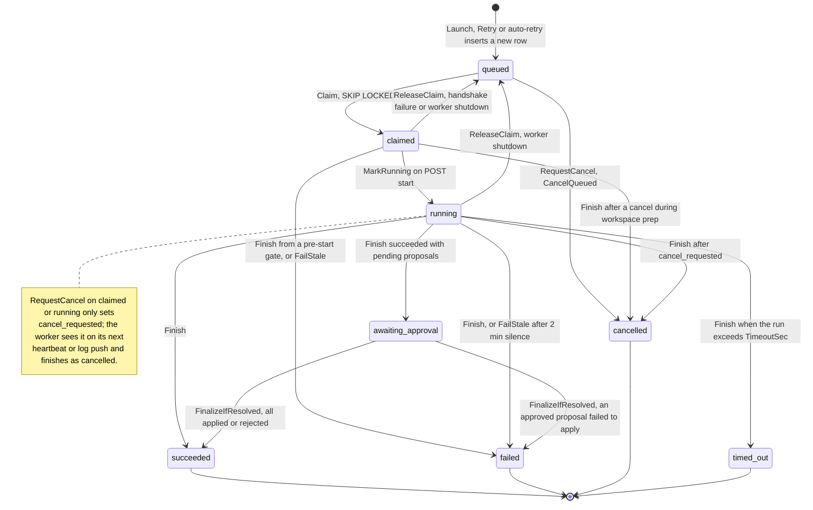

Kanban columns follow the status through `statusToColumn`
(`hooks.go:177-186`): `queued` to To Do, `claimed` and `running` to In
Progress, `awaiting_approval` to Review, `succeeded` to Done, and the three
failure statuses back to To Do. `Finish` accepts any non-terminal row
(`agent_run_repository.go:306`), so the diagram shows the transitions the
worker actually drives. `RunFinished` is published twice for a run that goes
through approval and not at all for a queued run that is cancelled (§5.6).

#### The worker loop (`cmd/agentd`, `internal/runner`)

With `--pool-key` (`RUNNER_POOL_KEY`) `agentd` runs a `PoolAgent` and
handles SIGINT and SIGTERM (`cmd/agentd/main.go:83`); otherwise it runs a
fixed `Worker` and handles SIGINT only (:141). Its flags default from the
environment (`main.go:94-105`): `OPENV_API_URL`, `WORKER_API_KEY`,
`AGENT_CONCURRENCY` (1), `AGENT_CHILD_CONCURRENCY` (2), `OPENV_HOSTED`,
`AGENT_WORKSPACE_RETENTION` (24 h) and the `RUNNER_*` pool settings.

| Loop or timer | Cadence | Where |
|---|---|---|
| Claim poll, normal slots then child slots (`min_priority` 10) | 2 s | `worker.go:184-200` |
| Provider sign-in poll (not on hosted runners) | 3 s | `login.go:99-100` |
| Prep heartbeat while the workspace is prepared | 30 s | `worker.go:294`, :531 |
| Log and partial-text push, also heartbeat and cancel poll | 750 ms | `worker.go:571-620` |
| Workspace retention sweep | at start, then hourly | `worker.go:73`, :162-165 |
| Pool node heartbeat | 5 s (`runnersessions.NodeHeartbeatInterval`) | `pool.go:103` |
| Shutdown drain for in-flight runs | up to 30 s | `worker.go:206-219` |

`Worker.Run` (`worker.go:135-202`) detects every adapter, reports the
result to `POST /api/v1/provider-settings/detect`, and then claims. The two
slot pools exist so that a parent run blocked on a delegated child cannot
starve its own children. `execute` (`worker.go:266-526`) then runs these
stages, each failure finishing the run with a class from the single table
in `classify.go:14-82`:

| Stage | Lines | Failure class |
|---|---|---|
| Panic recovery | 268-278 | `worker_error` |
| No adapter for the provider | 309-318 | `provider_unavailable` |
| Empty tool allowlist; repository access on a provider other than claude-code | 324-348 | `agent_error` |
| List repository connections, `PrepareWorkspace` | 350-377 | `workspace` |
| `POST /start` | 379-386 | `worker_error` |
| Environment `OPENV_API_URL`, `OPENV_RUN_TOKEN`, plus the provider API key when the project uses `api-key` auth | 388-427 | `auth` |
| Build `RunSpec` (system prompt plus answer-length rule; `Untrusted` from the run origin or the agent) and `adapter.Start` | 428-461 | `provider_unavailable` or `agent_error` |
| Pump, wait, `FinishWorkspace`, map the result: cancelled, released on shutdown, `timed_out`, `failed` (classified from the CLI's text) or `succeeded` | 469-526 | `timeout`, `auth`, `provider_unavailable` or `agent_error` |

The worker's HTTP client (`client.go`, 407 lines) retries `start`, `logs`,
`finish` and the pool register and release calls up to three more times on
network errors and 5xx, 250 ms apart and growing linearly (`client.go:83-119`);
`claim` and the other calls do not retry. After a 400 on `logs` it latches to
the legacy bare-array body for older servers (`client.go:164-189`).

#### Process and pseudo-terminal handling

`startProc` (`process.go:93-260`) is the one place a vendor CLI runs. It
inherits `os.Environ()` plus the run's variables, pipes the prompt to stdin
when the adapter supplies one, and runs four goroutines: a 40-line stderr
tail, a stdout scanner feeding the adapter's `streamParser` into a 256-event
channel (an event blocked for 5 s is dropped and an `events_dropped` marker
emitted, `process.go:37-46`), a watchdog that kills on cancel, context end or
`TimeoutSec`, and a reaper that builds the `Result`. `killTree`
(`process.go:287-301`) uses `taskkill /T` on Windows but elsewhere signals
only the CLI's own process (interrupt, kill after 5 s); no process group is
created. Pseudo-terminals are used only for sign-in (`pty_unix.go` wraps
`github.com/creack/pty`; `pty_other.go` is the Windows stub, and
`login_windows.go` opens a console window). The build-tag file names are
inverted: `login_other.go` is `!windows`, `pty_other.go` is `windows`.

#### Vendor CLI adapters

`Adapter` has three methods, `Name`, `Detect` and `Start`
(`adapter.go:176-180`); `Registry()` returns the four adapters in the order
below (`adapter.go:308-315`). Each `Start` first calls `withOpenVToolFilter`
(`toolallow.go:90`), which puts the agent's `mcp__openv__*` allowlist into
`OPENV_MCP_TOOLS` for `openv-mcp`.

| | claude-code | codex-cli | gemini-cli | antigravity-cli |
|---|---|---|---|---|
| File | `claudecode.go` (460) | `codexcli.go` (346) | `geminicli.go` (433) | `antigravity.go` (329) |
| Binary | `claude` | `codex` | `gemini` | `agy` |
| Signed in when | `ANTHROPIC_API_KEY`, else `claude auth status --json`, else `~/.claude` or `~/.claude.json` | `OPENAI_API_KEY`, else `auth.json` under `CODEX_HOME` or `~/.codex` | `GEMINI_API_KEY` or `GOOGLE_API_KEY`, else `~/.gemini/oauth_creds.json` or `google_accounts.json` | `GEMINI_API_KEY` only (its OAuth store is the OS keyring) |
| Invocation | `-p --output-format stream-json --verbose --mcp-config .openv/mcp.json --permission-mode default --allowedTools <csv>`, prompt on stdin | `exec --json --cd <dir> -c mcp_servers.openv.* --sandbox read-only or workspace-write --skip-git-repo-check -`, prompt on stdin | `--output-format json --approval-mode auto_edit or default`, prompt on stdin, settings file via `GEMINI_CLI_SYSTEM_SETTINGS_PATH` | `-p <prompt> --output-format json [--print-timeout Ns]` |
| MCP configuration | `.openv/mcp.json` written 0600, token inside | passed with `-c`, environment forwarded by name | `.openv/gemini-settings.json` with `${VAR}` references | `.agents/mcp_config.json` without environment; token in the process environment |
| Tool allowlist | `--allowedTools` plus MCP filter | no CLI allowlist: sandbox choice plus MCP filter | `tools.core` and `includeTools` plus MCP filter | MCP filter only |
| Untrusted input | no widening | `--sandbox read-only` | `--approval-mode default` | no widening; never `--dangerously-skip-permissions` |
| System prompt | `--append-system-prompt` | prefixed "System instructions: ... Task:" | prefixed | prefixed |
| Max turns, effort | both honored | max turns logged as unenforced; effort capped at `high` | both logged as unenforced | max turns unenforced; effort capped at `high` |
| Partial text | token deltas with `--include-partial-messages` (probed once), else whole messages | current agent message | none (one JSON blob at exit) | none (one JSON envelope at exit) |
| Repository access | allowed | refused by `refuseRepoAccess` | refused by `refuseRepoAccess` | refused with its own wording |
| Sign-in flow | `claude auth login`, interactive TUI (full-screen terminal UI) | `codex login`, loopback redirect | bare `gemini` with `geminiLoginEnv`, interactive TUI | none |

The capability comment at `adapter.go:118-140` and the tables in
`docs/agents.md` cover only the first three columns.

| Concern | How it works | Where |
|---|---|---|
| Sign-in | `loginLoop` claims a sign-in the member requested in the UI; `handleLogin` runs an interactive flow in a console window on a desktop (`handleInteractiveLogin`) or a pseudo-terminal that scrapes the URL and types the pasted code on a headless host (`handlePTYLogin`); a loopback flow runs over pipes on a desktop or, headless, replays the pasted redirect against `127.0.0.1:<port>` (`handleLoopbackLogin`). Each driver polls `GET /api/v1/provider-logins/{id}/full` every 2 s, reports `POST .../progress`, times out after 10 minutes and re-runs detection on success | `login.go:99-317`; `login_headless.go:106`, :302 |
| Tool allowlists | Agent definitions use Claude Code tool names. `openvToolNames` reads `mcp__openv__*` and bare `mcp__openv` as "all" and writes `*` or the named tools into `OPENV_MCP_TOOLS`; `geminiBuiltinTools` maps built-ins to `tools.core`; `allowsFileOrShellWork` picks the Codex sandbox. `mcp.FilterTools` parses the same grammar again (`tools.go:125`) | `toolallow.go:45`, :110, :237 |
| Workspaces | `<workspaces>/<runID>` (default base `~/.openv/workspaces`); for repository access, a `git worktree` of the member's checkout at `repo/` on branch `openv/agent-<first 8 characters of the run id>`, else a clone; an auto-commit `openv agent run <id>` that is never pushed; removal after the retention period | `workspace.go:44`, :99, :123 |
| Pool nodes | Wipe the session root, register with the pool key, heartbeat; on a lease create `<session-root>/<sessionID>`, set the process's `HOME` to it with `os.Setenv` and run a headless `Worker` with the lease's personal key; at the end cancel, wait up to 30 s, restore `HOME`, delete the directories and release the node | `pool.go:93`, :202, :213, :264 |

#### Orchestration: crews, delegation and run trees

`orchestration.Hooks` implements `agentruns.Subscriber` and subscribes to
the bus. It is registered third among the run subscribers
(`main.go:522-529`), so its database work runs inside the worker's `/finish`
or `/logs` request.

| Reaction | Trigger | Lines |
|---|---|---|
| Kanban sync: auto-create a card "Agent run: <name>" for a queued root project run, move the card by `statusToColumn`, record activity | every status change | `hooks.go:188-237` |
| Crew successors: follow `hands-off-to` and `reviews` edges, launch the next agent with `PriorityChild` and `ParentRunID`, or create a card for a human target | `succeeded` only (after approval for proposal-mode runs) | `hooks.go:241-358` |
| Interview and guided replies, or failure messages, on SSE keys `interview:<id>` and `guided:<id>` (event `message`) | `succeeded`, `awaiting_approval`, `failed`, `timed_out` | `hooks.go:362-426` |
| `assistant_partial` on the same keys, at most every 500 ms per run | partial text from the log push | `hooks.go:36`, :89-126 |
| Launch a wizard nudge parked while the run held the session | run no longer live | `hooks.go:431-467` |
| Board trigger: a user moves a card into To Do with an agent assignee and no live run | bus `workitem.moved` | `hooks.go:471-543` |

Delegation is the synchronous edge type: the `delegate_to_agent` tool posts
to `DelegateRun` (`agent_handlers.go:886`, run token only), which resolves the
parent node's `delegates-to` children (`teams.go:574`) and launches one with
child priority and `ParentRunID`; the tool polls every 5 s for up to 30
minutes (`tools.go:971-1028`). Runs linked by `parent_run_id` form a run tree
that `Tree` (`agentruns.go:736-758`) walks breadth first, at most 1,000
children per node (`agent_run_repository.go:173`). Delegation depth is
checked only when the crew graph is edited (§5.7).

#### The MCP server (`internal/mcp`, `cmd/openv-mcp`)

`serve` (`tools.go:1063-1165`) reads newline-delimited JSON-RPC 2.0 and
answers `initialize` (protocol `2024-11-05`, server `openv-mcp 0.1.0`),
`ping`, `tools/list` and `tools/call`, the last in its own goroutine.
`Tools()` (`tools.go:314-1031`) is one 718-line slice literal of 31 tools,
each a thin REST call through `Client.request` (`tools.go:40-75`) with the
token as Bearer; a 202 from a proposal-mode write becomes "Proposal created
(pending human review, not yet applied)". `OPENV_MCP_TOOLS` filters the
table (unset: all; set but empty: none; `EnvFilteredTools`, `tools.go:153`).
The 17 read-only tools (`tools.go:168-187`) plus `record_candidate_need` are
what the seeded interviewer agent is granted (`internal/seeds/seeds.go:37-39`).

| Area | Tools | REST endpoints |
|---|---|---|
| Orientation | `list_projects`, `get_project_map`, `get_context`, `get_project_tree` | `GET /api/v1/projects`, `/projects/{id}/ai-map`, `/artifacts` (the context bundle is composed client-side in `context_bundle.go`) |
| Artifacts | `list_artifacts`, `get_artifact`, `search_artifacts`, `create_artifact`, `update_artifact`, `record_candidate_need` | `GET`, `POST /api/v1/artifacts`, `PUT /api/v1/artifacts/{id}` |
| Links | `create_link`, `delete_link`, `confirm_link`, `list_links_for_artifact` | `/api/v1/links`, `/links/{id}`, `/links/{id}/confirm` |
| Comments | `add_comment` | `POST /api/v1/chatter` |
| Baselines and review | `list_baselines`, `get_baseline`, `create_baseline`, `start_project_review` | `/projects/{id}/baselines`, `/baselines/{id}`, `/projects/{id}/review-round` |
| V&V | `create_test_run`, `record_test_result`, `close_test_run`, `get_vv_coverage`, `get_vv_gaps` | `/projects/{id}/test-runs`, `/test-runs/{id}/results`, `PUT /test-runs/{id}`, `/projects/{id}/vv/coverage`, `/vv/gaps` |
| Quality | `get_quality_rules`, `get_quality_findings` | `/projects/{id}/quality-rules`, `/artifacts/{id}/quality` |
| Work items | `list_work_items`, `get_work_item`, `get_work_item_history`, `update_work_item` | `/projects/{id}/work-items`, `/work-items/{id}`, `POST /work-items/{id}/comments` |
| Delegation | `delegate_to_agent` | `POST /api/v1/agent-runs/delegate`, then polling |

`tools/list` returns the declaration order in `Tools()` (`tools.go:314-1031`),
which interleaves these areas. The same binary serves sessions in this
repository with a workspace runner key in `OPENV_API_TOKEN`.

#### The Agent Connector (`cmd/openv-connector`)

A stand-alone installer and launcher that imports no `internal/` package.
`main` (`main.go:174`) handles `install` and `uninstall` (the Windows `HKCU`
protocol registration is in `protocol_windows.go`) and the deep links
`pair?code&api`, `start?org` and `open?org&code&api` (`handleDeepLink`,
`main.go:225`). Pairing exchanges the one-time code at `POST
/api/v1/public/connector/pair` (`main.go:283-334`), chooses the API URL with
a `/health` probe (`apiurl.go:39`), warns about cleartext
(`pairingwarn.go`) and keeps one pairing per workspace in
`<UserConfigDir>/OpenV/connector.json` (mode 0600). `start` (`main.go:339`)
unpacks the embedded binaries in release builds and runs `agentd --api <url>
--mcp-binary <path>` with `WORKER_API_KEY` in the child's environment
(`main.go:368-369`). The deep-link grammar is written again in
`internal/api/org_handlers.go` and `frontend/src/api/client.ts`.

#### Editing notes

- **Installed binaries observe the worker protocol.** Paths, bodies, the
  claim response keys (`run`, `agent`, `run_token`, `auth`), 204 on an empty
  queue, the `logs` response (`cancel_requested`, `status`), the legacy log
  body and the JSON tags of `agentruns.Run`, `FinishRequest`, `agents.Agent`,
  `providers.LoginRequest` and `repoconns.RepoConnection` must stay
  compatible; there is no shared type or golden fixture on either side.
- **A new provider** touches its adapter file, `Registry()`, `flowFor` and
  `signInFailure` in `login.go`, the repository-access gate (`worker.go:340`,
  mirrored in `agents.Definition.Validate`), `toolallow.go` for a new tool vocabulary,
  the frontend provider lists and `docs/agents.md`.
- **Keep secret placement.** Prompts go over stdin (or `-p` for `agy`),
  tokens never go into argv, configuration files are 0600 in 0700
  directories; the pure argv builders are tested for this.
- **Finish sites carry user-visible text and classes** that decide retry
  eligibility; extracted helpers must keep both.
- **Process-global state:** pool leases rewrite `HOME` for the whole process,
  adapters read it implicitly, and the Claude probe caches are package
  globals that outlive a lease.
- **Orchestration runs inside the worker's request and mutates the shared
  `*Run`** (`hooks.go:216`); keep the subscriber order and the synchronous
  call.
- **MCP output is text agents depend on** (tool names, order, descriptions,
  schemas, proposal wording, the `get_context` layout); there is no golden
  snapshot of `tools/list`, and `TestToolTableIntegrity` checks only for at
  least 21 tools and their schema shape.
- **Signals differ by mode.** A fixed worker installs no SIGTERM handler, so
  `docker stop` on a hosted runner ends it without releasing its runs;
  changing that is a behavior change.
- `internal/mcp` and `internal/orchestration` are well tested; `pool.go`,
  the claim loop, the login drivers and `cmd/agentd` are not (§9.5). Pain
  points: §9.3; refactor steps: [the refactor plan](../../plans/codebase-refactor.md).

[Index](README.md) · [4 Backend](backend.md) · [5 Key flows](flows.md) · [6–8 Frontend, data, tooling](frontend-data-tooling.md) · [9–10 Assessment](assessment.md) · [Pain-point register](pain-points.md) · [Refactor plan](../../plans/codebase-refactor.md)
