# OpenV codebase architecture analysis — 5. Key flows

Part of the [2026-09-25 codebase architecture analysis](README.md) (commit `d11dee8`).

[Index](README.md) · [4 Backend](backend.md) · [5 Key flows](flows.md) · [6–8 Frontend, data, tooling](frontend-data-tooling.md) · [9–10 Assessment](assessment.md) · [Pain-point register](pain-points.md) · [Refactor plan](../../plans/codebase-refactor.md)

## 5. Key flows

This section follows ten things a workspace member (or an agent acting for
one) does, from the React view that starts them to the tables they write and
back to the screen. §4 describes the parts; this section shows how they
cooperate at run time, and where the same concern is handled differently from
one flow to the next. Those differences matter for a refactor: code that
looks duplicated is often not equivalent, and folding two copies together
changes what a user sees.

Each subsection has the same shape: what the user does, a sequence diagram,
a numbered hop list with `file:line` references (repo-relative, at
`d11dee8`), a **What varies** note, and **Editing notes** with the traps a
change in that flow must respect. Pain points are only named here; §9.3
discusses them, and the [refactor plan](../../plans/codebase-refactor.md)
sequences the work. Several "What varies" items are user-visible today
(status codes, headers, which events fire); a behavior-preserving refactor
keeps them, and changing one is a separate, release-noted fix. Product and
code terms used without explanation here (workspace, artifact, suspect link,
chatter, proposal, crew, runner, worker key, route inventory, SSE, MCP and
others) are defined in [Appendix B](assessment.md#appendix-b-glossary).

**Hops every browser request shares.** The SPA calls the API through one
axios instance (`frontend/src/api/client.ts:15`, `withCredentials: true`,
60 s timeout). Its request interceptor adds `X-Org-ID` from
`sessionStorage`, then `localStorage`, key `openv_active_org`
(`client.ts:26-39`). Its response interceptor sends the browser to `/login`
on a 401 (except on public pages and for `/api/v1/auth/` calls) and to
`/verify-email` on a 403 with code `email_unverified`
(`client.ts:79-111`). On the server the request passes the chain built in
`cmd/server/main.go:874-919` (see §4.3): security headers, body limit, CORS
(which answers every `OPTIONS` itself), gzip compression for bodies of
1,400 bytes or more, request log, metrics, then `AuthMiddleware.Wrap`, then
the gorilla/mux router. The diagrams draw that chain as one participant,
"Middleware chain". `AuthMiddleware` lets `/health`, `/metrics`,
`/api/v1/auth/*` and `/api/v1/public/*` through untouched. For everything
else it tries, in this order: a Bearer worker key, the legacy
`WORKER_API_KEY`, `RUNNER_POOL_KEY`, an agent-run token, then the
`openv_session` cookie (`internal/api/authmiddleware.go:85-178`).

| § | What the user does | Starts in | Routes | Handlers | Tables written | Side effects |
|---|---|---|---|---|---|---|
| 5.1 | Signs in, picks a workspace | `Login.tsx`, `App.tsx`, `OrgSwitcher.tsx` | `POST /api/v1/auth/login`, `GET /api/v1/orgs`, `POST /api/v1/orgs/{id}/activate` | `Login`, `ListOrgs`, `ActivateOrg` | `sessions` | session cookie, workspace id in browser storage |
| 5.2 | Edits an artifact, changes its status, links it | `ModuleView.tsx`, `ArtifactHeader.tsx` | `PUT /api/v1/artifacts/{id}`, `PUT /api/v1/artifacts/{id}/status`, `POST /api/v1/links` | `UpdateArtifact`, `ChangeArtifactStatus`, `CreateLink` | `artifacts`, `links`, `link_artifacts`, `chatter`, `domain_events`, `artifact_embeddings` | suspect flags, counterpart re-versioning, review notifications |
| 5.3 | Records a test result, reads coverage | `VVDashboard.tsx`, `TestRunView.tsx` | `POST /api/v1/projects/{id}/test-runs`, `POST /api/v1/test-runs/{id}/results`, `GET /api/v1/projects/{id}/vv/coverage` and `/vv/gaps` | `CreateTestRun`, `UpsertTestResult`, `GetCoverage`, `GetGaps` | `test_runs`, `test_results`, `chatter`, `domain_events` | coverage recomputed on every read |
| 5.4 | Downloads or imports a project | `DownloadWizard.tsx`, `ProjectList.tsx` | `GET /api/v1/projects/{id}/download/{format}`, `/download/options`, `POST /api/v1/projects/import` | `serveDownload`, `DownloadOptions`, `ImportProject` | import: `projects`, `artifacts`, `links`, `project_members` | none (no event on import) |
| 5.5 | Invites a member, who accepts | `OrgMembersTab.tsx`, `Login.tsx` | `POST /api/v1/orgs/{id}/members`, `POST /api/v1/auth/invitations/preview` and `/accept`, `POST /api/v1/auth/register` | `AddOrgMember`, `PreviewInvitation`, `AcceptInvitation`, `Register` | `org_invitations`, `org_members` | invitation mail, admin notifications, seat sync |
| 5.6 | Launches an agent, reviews its proposals | `AgentsPage.tsx`, `RunDetailPanel.tsx`, `ProposalReviewPanel.tsx` | `POST /api/v1/agents/{slug}/runs`, worker `/api/v1/agent-runs/*`, `POST /api/v1/proposals/{id}/approve` | `LaunchAgentRun`, `ClaimAgentRun`, `StartAgentRun`, `AppendAgentRunLogs`, `FinishAgentRun`, `ApproveProposal` | `agent_runs`, `agent_run_logs`, `agent_proposals`, `work_items` | run SSE stream, `agentrun.finished`, `proposal.created` |
| 5.7 | Runs a crew, delegates, automates | `CrewBuilder.tsx`, `AutomationsPage.tsx`, `KanbanBoard.tsx` | `POST /api/v1/crews/{id}/runs`, `POST /api/v1/agent-runs/delegate`, `POST /api/v1/automations/{id}/run-now`, `POST /api/v1/work-items/{id}/move` | `LaunchTeamRun`, `DelegateRun`, `RunAutomationNow`, `MoveWorkItem`, plus the scheduler and trigger matcher | `agent_runs`, `automations` | successor launches inside the finishing request |
| 5.8 | Leases a cloud runner, enables a hosted one | `CloudRunnerCard.tsx`, `HostedRunnerCard.tsx` | `POST /api/v1/orgs/{id}/runner-session`, `/api/v1/runner-pool/nodes*`, `POST /api/v1/orgs/{id}/hosted-runner` | `StartRunnerSession`, `RegisterPoolNode`, `PoolNodeHeartbeat`, `ReleasePoolNode`, `CreateHostedRunner` | `runner_sessions`, `runner_pool_nodes`, `worker_keys`, `hosted_workers` | in-memory key hand-off, minutes alerts, Docker container |
| 5.9 | Receives a notification | `NotificationBell.tsx` | `GET /api/v1/notifications/stream` | `StreamNotifications` | `notifications` | SSE, email, web push |
| 5.10 | Buys a plan, meets a limit | `OrgBillingTab.tsx` | `POST /api/v1/orgs/{id}/billing/checkout`, `/billing/refresh` | `CheckoutOrgBilling`, `RefreshOrgBilling` | `organizations` | Stripe calls, 403 `plan_read_only` or `limit_reached` |

### 5.1 Sign-in and workspace selection

The member types an email and password on the login page. The server checks
them, creates a session row and sets the `openv_session` cookie. The shell
then loads the member's workspaces and decides which one is active. From then
on every request carries that choice in the `X-Org-ID` header.

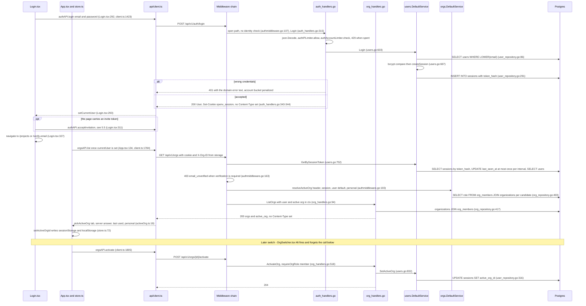

Hops:

1. `Login.tsx:292` calls `authAPI.login` (`client.ts:1423`), a `POST` to
   `/api/v1/auth/login` (registered at `auth_handlers.go:42`). The path is
   open, so `AuthMiddleware` passes it through (`authmiddleware.go:107`).
2. `Handler.Login` (`auth_handlers.go:315`) decodes, charges the per-IP and
   per-account sign-in buckets and answers 429 with `Retry-After` when either
   is spent.
3. `users.DefaultService.Login` (`users.go:603`) reads the user
   (`user_repository.go:86`), compares the bcrypt hash, and `createSession`
   (`users.go:697`) inserts a `sessions` row keyed by the SHA-256 of the
   token (`user_repository.go:291`).
4. `setSessionCookie` (`auth_handlers.go:87-104`) sets `openv_session` with
   `HttpOnly`, `Path=/`, both `Expires` and `MaxAge`, `Secure` and
   `SameSite` from configuration, and `Partitioned` only when `SameSite=None`
   (`auth_handlers.go:124`). The body is the `User` JSON
   (`auth_handlers.go:344`).
5. The view stores the user, takes up a pending invitation if the URL carried
   one (§5.5), and navigates (`Login.tsx:293-327`).
6. `App.tsx:134` calls `orgsAPI.list` once `currentUser` is set. Like every
   request after sign-in (the project list the new page mounts goes out
   alongside it), it passes the middleware's session check:
   `GetBySessionToken` (`users.go:752`) reads the session, touches
   `last_seen_at` at most once per `SessionTouchInterval` (one minute), and
   reads the user.
7. `resolveActiveOrg` (`authmiddleware.go:193-219`) validates the `X-Org-ID`
   header with `IsMember` (`orgs.go:776`, SQL at `org_repository.go:493`),
   then tries the session's `active_org_id` through a second session lookup
   (`SessionByToken`, `authmiddleware.go:201`), then the user's default
   workspace, then `EnsurePersonalOrg` (`authmiddleware.go:215`), which can
   write.
8. `ListOrgs` (`org_handlers.go:94`) returns `{orgs, active_org}` from
   `ListOrgsForUser` (`org_repository.go:417`).
9. `pickActiveOrg` (`frontend/src/utils/activeOrg.ts:19`) chooses, and
   `setActiveOrgId` (`frontend/src/state/store.ts:72`) writes both storages,
   so every later request carries `X-Org-ID`.
10. A later switch: `OrgSwitcher.tsx:46` posts `/api/v1/orgs/{id}/activate`
    without waiting; `ActivateOrg` (`org_handlers.go:518`) stores the
    choice on the session row (`users.go:832`, `user_repository.go:316`) and
    answers 204.

**What varies.**

- *Authentication.* Handlers under `/api/v1/auth/*` sit behind no identity
  check and read the cookie themselves with `h.sessionUser`
  (`auth_handlers.go:378`), answering 401 `not authenticated` (`Me`,
  `auth_handlers.go:391`). The middleware answers 401 `authentication
  required`, and `Login` answers 401 with the domain error text. `ListOrgs`
  makes its own `CurrentUser(r) == nil` check (`org_handlers.go:95`); it is
  what turns away Bearer callers (worker keys, run tokens) that the
  middleware accepted without a user.
- *Workspace scoping.* The precedence is written three times, in three
  orders: server header, session, user default, personal
  (`authmiddleware.go:193-219`); client tab, server answer, last used,
  personal, first (`activeOrg.ts:19-30`); header source sessionStorage then
  localStorage (`client.ts:28-31`).
- *Plan gate on a read-like write.* `ActivateOrg` authorizes with
  `requireOrgRole`, which also runs the plan read-only check on every
  mutating method (`authz.go:97-102`, `limits.go:131`). Reading the code,
  activating an over-plan workspace is refused with 403 `plan_read_only`;
  `OrgSwitcher` swallows the error, so the tab still switches through the
  header while the session default stays as it was.
- *Response headers.* `Login`, `Me` and `ListOrgs` never set
  `Content-Type`, so the header depends on body size (§9.3).

**Editing notes.**

- The open-path decision is a URL prefix test (`authmiddleware.go:85-101`).
  A handler moved under `/api/v1/auth/` loses the middleware's identity, and
  one moved out of it gains the email-verification wall. Replacing
  `h.sessionUser` with `requireUser` on an open path makes every call 401.
- The sign-in buckets are shared: `authIPLimiter` is also spent by email
  verification and both password-reset calls, `authAccountLimiter` by
  change-password. Splitting `Handler` into per-feature types must keep one
  instance of each.
- The personal-workspace fallback in the middleware (`EnsurePersonalOrg`,
  `authmiddleware.go:215`) creates a workspace but does not seed default
  agents; on the request path only `provisionPersonalWorkspace`
  (`auth_handlers.go:71-84`) does, and a workspace created by the fallback
  gets them at the next server boot (`seeds.EnsureOrgDefaults`,
  `main.go:508-517`).
- The frontend reacts to status and code together: 403 plus
  `email_unverified` redirects (`client.ts:100-106`, `errors.ts:13`).
  Changing either breaks the verification wall.

### 5.2 Editing an artifact and linking it

A member edits a requirement in the module view, optionally adding or
removing links in the same dialog, then moves it through review and creates
a traceability link from the link panel. Each save writes a new version row
rather than updating in place, and a content change marks the artifact's
links suspect so reviewers re-check them. Three routes carry these actions,
and each orchestrates its own side effects in the HTTP handler.

**Edit (`PUT /api/v1/artifacts/{id}`).**

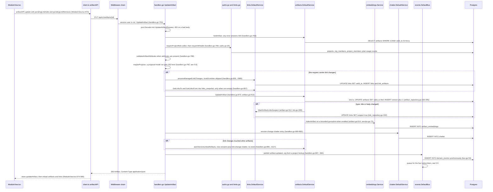

**Status change (`PUT /api/v1/artifacts/{id}/status`).**

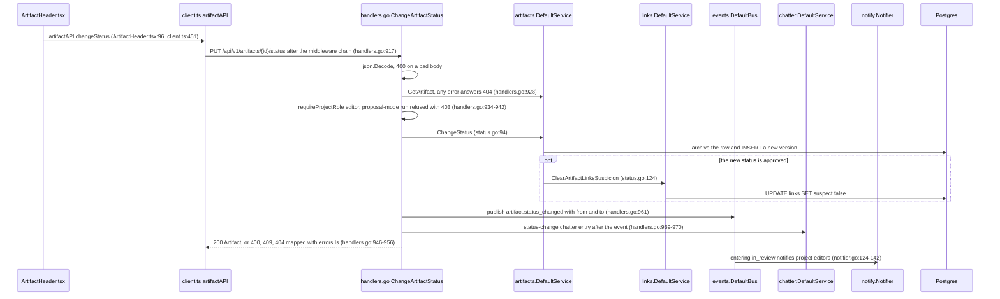

**Create a link (`POST /api/v1/links`).**

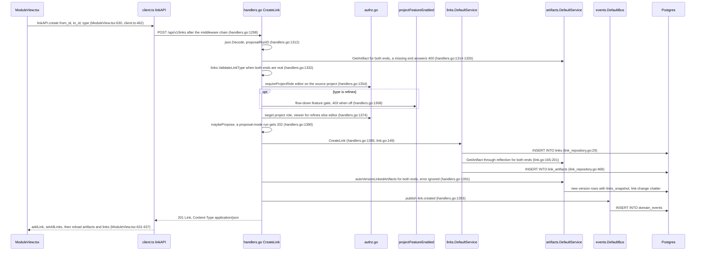

Hops:

1. **Edit.** `ArtifactEditor.handleSubmit` adds camelCase `pendingLinkAdds`
   and `pendingLinkRemoves` to the form data (`ArtifactEditor.tsx:303-316`),
   and `ModuleView.tsx:573` sends it with `artifactAPI.update`
   (`client.ts:447`) to `PUT /api/v1/artifacts/{id}` (`handlers.go:456`).
2. `UpdateArtifact` (`handlers.go:753`) decodes, loads the current version
   (`:763`), authorizes editor plus the plan gate (`:769`), validates typed
   attributes (`:786`) and offers the write to `maybePropose` (`:792`).
3. With link changes, `processManagedLinkChanges` (`handlers.go:2985`)
   soft-deletes removed links (`UPDATE links SET valid_to`,
   `link_repository.go:347`) and creates added ones, skipping any entry that
   fails lookup, type validation or cross-project authorization with a
   `slog.Warn` (`handlers.go:3056-3083`). The handler then rebuilds
   `links_snapshot` into the attributes (`:832-869`).
4. `artifacts.DefaultService.UpdateArtifact` (`artifact.go:413`) demotes
   approved content to draft on a content change, bumps `Version`, and the
   repository archives the old row and inserts the new one in one
   transaction (`artifact_repository.go:332-395`).
5. A change to type, title or body marks every live link touching the
   artifact suspect (`artifact.go:512` → `link.go:289` →
   `link_repository.go:332`). `indexEmbedding` hands the content to the
   embedding service, which drops the job when its worker slots are full
   (`embeddings/service.go:72-94`).
6. The handler writes the `version-change` chatter entry (`handlers.go:882`),
   re-versions the counterpart artifacts with `autoVersionLinkedArtifacts`
   (`handlers.go:890` → `:3117`), and publishes `artifact.updated`
   (`handlers.go:897`).
7. The view updates the store and reloads everything
   (`ModuleView.tsx:574-580`).
8. **Status.** `ArtifactHeader.tsx:96` → `PUT /api/v1/artifacts/{id}/status`
   → `ChangeArtifactStatus` (`handlers.go:917`) → `ChangeStatus`
   (`status.go:94`), which writes a new version and, on approval, clears
   suspicion on the artifact's links (`status.go:124`). The handler publishes
   `artifact.status_changed` (`:961`) and then writes chatter (`:969`).
9. **Link.** `ModuleView.tsx:630` → `POST /api/v1/links` → `CreateLink`
   (`handlers.go:1298`): both ends loaded, type validated, source editor
   checked, `refines` feature gate and target role checked
   (`:1354-1379`), `maybePropose` (`:1380`), `linkService.CreateLink`
   (`link.go:149`), which records `link_artifacts` through reflection
   (`link.go:165-201`), counterpart re-versioning (`:1391`) and
   `link.created` (`:1393`).

**What varies.**

- *Two ways to change links, two rule sets.* `POST /api/v1/links` answers
  400 for an invalid type or a missing end, applies the `refines` feature
  gate and publishes `link.created` or `link.deleted`. The same change made
  through `pendingLinkAdds` on `PUT /api/v1/artifacts/{id}` answers 200 and
  skips the bad entry silently, requires editor (not viewer) on a `refines`
  target, applies no feature gate (`handlers.go:3076-3083`) and publishes
  no link event.
- *Error mapping of "artifact not found".* 500 in `UpdateArtifact`
  (`handlers.go:763`), 404 in `GetArtifact` and `ChangeArtifactStatus`
  (`:671`, `:928`), 400 in `CreateLink` (`:1316-1326`). The repository
  returns `errors.New("artifact not found")` rather than a sentinel
  (`artifact_repository.go:165`), so no handler can tell not-found from a
  database failure.
- *Proposal-mode agents.* Edit and link writes are diverted to a proposal
  by `maybePropose`; a status change by the same agent is refused outright
  with 403 (`handlers.go:937-942`).
- *Event and chatter order.* Edit writes chatter before publishing
  (`:882`, `:897`); status publishes before chatter (`:961`, `:969`).
  Counterpart re-versioning writes chatter but publishes no
  `artifact.updated`.
- *Side-effect placement.* Suspect marking and embeddings run inside the
  domain service, through small interfaces that `main.go` hands it with
  setter calls after construction (`main.go:243`, `:254`); chatter,
  snapshots and events run in the HTTP handler; `link_artifacts` is written
  through reflection on an `interface{}` field (`main.go:240`,
  `link.go:165`).

**Editing notes.**

- `links_snapshot` is written on the edited artifact only when at least one
  link remains (`handlers.go:857`), so removing the last link keeps the old
  snapshot on the new version, while `autoVersionLinkedArtifacts` always
  writes the current list, even when empty (`handlers.go:3162`).
  `GET /api/v1/artifacts/{id}/links?version=N` serves those snapshots.
- The `version-change` note lists the links the request asked for, not the
  ones that were created (`linksFromPendingAdds`, `handlers.go:824`).
  Building it from results changes feed text.
- Proposal payloads are the JSON of these request DTOs, stored in
  `agent_proposals.payload` and decoded later by the appliers
  (`authz.go:223-230`, `proposal_appliers.go:50-58`). Renaming a JSON tag
  such as `pendingLinkAdds` breaks proposals already pending.
- `CreateLink` dereferences `fromArtifact.ProjectID` at `handlers.go:1393`.
  That is safe only because `maybePropose` returns earlier whenever an end
  is a pending-proposal reference; keep the order.
- Event payload values are consumed by automation filters through
  `fmt.Sprintf("%v")` (`internal/automation/triggers.go:55-62`). Keep plain
  string, int and bool values when typing payloads.

### 5.3 Recording a test run and V&V coverage

A member opens the V&V dashboard, creates a test run, records pass, fail,
blocked or not-run for each test case, and returns to the dashboard to see
which requirements are verified. Results are written directly; coverage is
never stored or pushed but recomputed from a full project export every time
the dashboard asks.

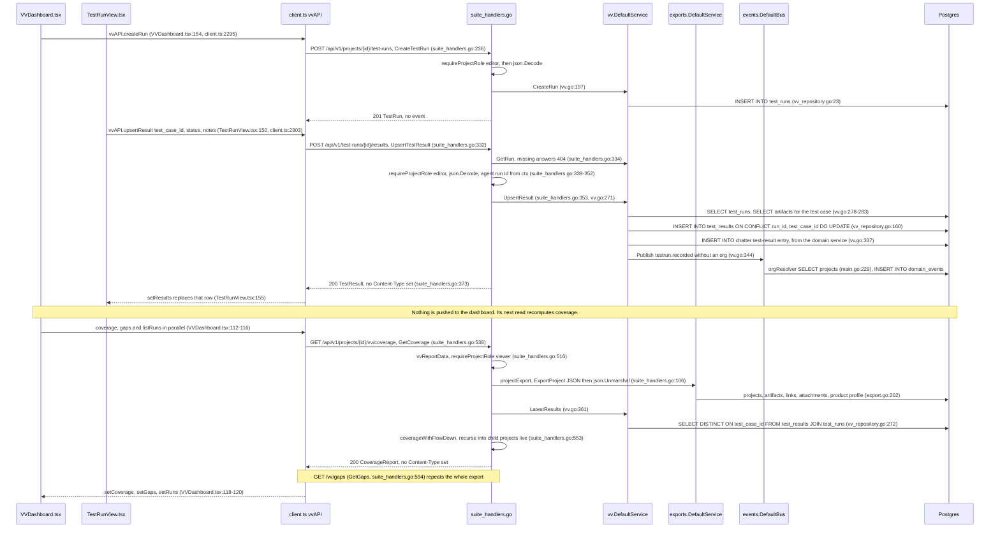

Hops:

1. `VVDashboard.tsx:154` → `POST /api/v1/projects/{id}/test-runs`
   (`suite_handlers.go:37`) → `CreateTestRun` (`suite_handlers.go:236`),
   which authorizes before decoding, then `vv.CreateRun` (`vv.go:197`)
   inserts into `test_runs`. No event is published.
2. `TestRunView.tsx:150` → `vvAPI.upsertResult` (`client.ts:2303`) →
   `POST /api/v1/test-runs/{id}/results` (`suite_handlers.go:42`) →
   `UpsertTestResult` (`suite_handlers.go:332`): run lookup (404), editor
   check, decode, and the agent-run id when a run token made the call.
3. `vv.DefaultService.UpsertResult` (`vv.go:271`) validates the status,
   loads the run and the test case (`:278-283`), refuses a case that is not
   agent-executable when an agent records it, keeps existing evidence when
   the request omits it (`:302-306`), and upserts the row
   (`vv_repository.go:149-160`).
4. The domain service writes the `test-result` chatter entry itself
   (`vv.go:337`, failures printed with `fmt.Printf` at `:340`) and publishes
   `testrun.recorded` with no org id (`vv.go:344`); the bus fills the org in
   with raw SQL (`cmd/server/main.go:229-235`).
5. The handler returns the result; the view replaces that row in place
   (`TestRunView.tsx:155`).
6. `VVDashboard.tsx:112` loads coverage, gaps and runs in parallel.
   `GetCoverage` (`suite_handlers.go:538`) → `vvReportData` (`:516`) →
   `projectExport` (`:106`), which renders the project to JSON with
   `ExportProject` (`export.go:190`) and parses it back.
7. `LatestResults` (`vv.go:361` → `vv_repository.go:272`) takes the latest
   executed result per test case from in-progress and completed runs.
8. `coverageWithFlowDown` (`suite_handlers.go:553-584`) computes coverage
   and recurses into child projects that refine this one, always reading
   children live.
9. `GetGaps` (`suite_handlers.go:594`) repeats steps 6-8, so one dashboard
   load renders the project to JSON at least twice.

**What varies.**

- *Where side effects live.* Here the domain service writes chatter and
  publishes the event; in §5.2 the HTTP handler does both. The event is
  published without an org, so the bus resolves it with SQL in `main.go`,
  where `h.publish` resolves it with a `GetProject` call (`handlers.go:384`).
- *Decode versus authorize order.* `CreateTestRun` and `UpsertTestResult`
  authorize before decoding; `UpdateArtifact` (§5.2) decodes first. For a
  malformed request from an unauthorized caller the two give different
  status codes.
- *Error mapping.* `UpsertTestResult` maps domain sentinel errors (package
  error values such as `vv.ErrInvalidStatus`) with `errors.Is`
  (`suite_handlers.go:359-369`), but the Postgres artifact repository never
  returns `artifacts.ErrNotFound` (`artifact_repository.go:165`), so an
  unknown `test_case_id` answers 500 against the real database. The unit
  test passes because its fake returns the sentinel.
- *Proposal mode.* Results from a proposal-mode agent are written directly.
  An applier for `record_test_result` exists (`proposal_appliers.go:180`)
  but no handler proposes that operation.
- *Response headers.* `suite_handlers.go` sets `Content-Type` on 4 of its 45
  JSON encodes; artifact and link handlers set it.
- *Events.* Creating and closing a run (`CreateTestRun`, `UpdateTestRun`)
  publish nothing; recording a result does.

**Editing notes.**

- Flow-down always reads child projects live, and uses live latest results,
  even when `baseline_id` pins the parent to a snapshot
  (`suite_handlers.go:530`, `:568`). `GET /vv/matrix` and the V&V PDF have
  no flow-down. An extracted coverage service must keep both behaviors.
- Each live export calls `products.GetProfile`, which inserts an empty
  `product_profiles` row when none exists
  (`internal/domain/products/product.go:61-85`), so a coverage read, and a
  download, can write.
- `evidence` omitted means "keep", `[]` means "clear" (`vv.go:296-306`). A
  shared decoder that normalizes nil slices would erase evidence.
- Coverage freshness is "as of this request". Caching or pushing it is a
  behavior change, not a refactor.

### 5.4 Reports, export and import

A member opens the download wizard, picks a format (JSON, CSV, Excel, ReqIF
— the OMG Requirements Interchange Format, an XML format other
requirements tools read — PDF or Word), narrows the selection, and saves a
file, optionally from a baseline instead of the live project. Elsewhere, a member imports a JSON or
ReqIF file as a new project. Downloads read a snapshot, narrow it and render
it; import creates a project from a file.

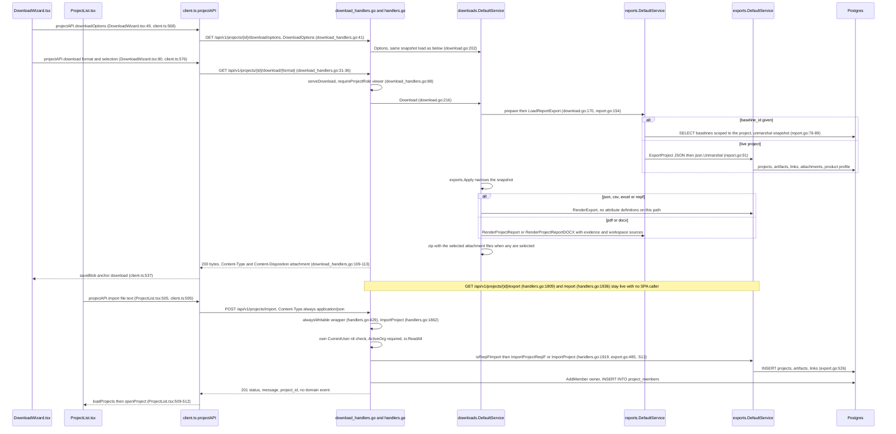

Hops:

1. `DownloadWizard.tsx:49` loads the chooser's options from
   `GET /api/v1/projects/{id}/download/options` (`DownloadOptions`,
   `download_handlers.go:41`).
2. `DownloadWizard.tsx:80` → `projectAPI.download` (`client.ts:576`) →
   `GET /api/v1/projects/{id}/download/{json|csv|excel|reqif|pdf|docx}`
   (one route per format, `download_handlers.go:31-36`) → `serveDownload`
   (`:88`), viewer role.
3. `downloads.DefaultService.Download` (`download.go:216`) → `prepare`
   (`:170`) → `reports.LoadReportExport` (`report.go:154`) →
   `loadReportExport` (`:72`): a baseline snapshot, or the live project
   rendered to JSON and parsed back (`report.go:91`).
4. `exports.Apply` narrows the snapshot to the selection; the renderer is
   chosen by format (`download.go:231-257`). PDF and Word get evidence and
   workspace data from closures wired in `cmd/server/main.go:401-420`.
5. Selected attachment files turn the response into a zip
   (`download.go:260-274`). The handler sets `Content-Type` and a quoted
   `Content-Disposition` filename (`download_handlers.go:109-113`); the
   client reads the filename from the header and saves the blob
   (`client.ts:588-592`, `saveBlob` at `:537`).
6. **Import.** `ProjectList.tsx:505` → `projectAPI.import`
   (`client.ts:595-607`), which sends the file text with
   `Content-Type: application/json` whatever the format.
7. `POST /api/v1/projects/import` is wrapped in `alwaysWritable`
   (`handlers.go:429`). `ImportProject` (`handlers.go:1862`) checks for a
   session user itself, requires an active workspace, reads the body, and
   sniffs ReqIF (`isReqIFImport`, `handlers.go:1919`).
8. `exports.ImportProject` or `ImportProjectReqIF` (`export.go:485`,
   `:513`) → `createProjectFromExport` (`:526`) creates the project and its
   content; the handler adds the caller as owner and answers 201.

**What varies.**

- *Three export surfaces.* `/export?format=` (`handlers.go:1809`),
  `/report?format=pdf|docx` (`handlers.go:1936`) and `/download/*` each
  carry their own format-to-media-type mapping. Only `/download/*` has an
  SPA caller; all three are pinned by the route inventory.
- *Snapshot contents differ by route.* `ExportProject` loads attribute
  definitions only when the format is ReqIF (`export.go:191`). Downloads
  always load through the JSON format, so `/download/reqif` has no enum
  datatypes while `/export?format=reqif` does, and download field labels
  never use definition labels.
- *Baseline errors.* `/download/*` answers 500 for a missing or foreign
  `baseline_id`; `/report`, `/vv/*` and `/impact` answer 404.
- *Workspace scoping on import.* Import takes the workspace from
  `ActiveOrg(r)`, not from a path or project, performs no role check beyond
  the middleware's membership test of `X-Org-ID`, skips the max-projects
  limit that `POST /api/v1/projects` enforces, and publishes no event where
  artifact creation publishes `artifact.created`.
- *Frontend.* `client.ts` holds two copies of the blob-save routine,
  `saveBlob` (`:537`) and `downloadBlob` (`:2178`, used by the V&V PDF and
  the crew export).

**Editing notes.**

- The live-or-baseline loader with its JSON round-trip also exists in
  `suite_handlers.go:106`, `reports/vv_report.go:46` and
  `baseline_diff_handlers.go:50`. A shared loader that loads attribute
  definitions would change download field order and labels and document
  captions, not only ReqIF; keep an option that reproduces today's
  omission.
- Losing the `alwaysWritable` wrapper on import passes the route inventory
  test and turns import into 403 `plan_read_only` for over-plan workspaces.
- The `links.Link` and `artifacts.Artifact` JSON tags are a persisted format
  (baselines, exports, `links_snapshot` inside every stored version).

### 5.5 Inviting a member

A workspace admin enters an email address on the members tab. An address
that already belongs to a verified account is added at once; any other
address gets an invitation and a one-time link. The invitee opens the link,
sees a preview, and joins by registering, by signing in, or through single
sign-on (Google, or an OpenID Connect provider; "OIDC" below covers both,
`auth_handlers.go:495`, `oidc_handlers.go:242`).

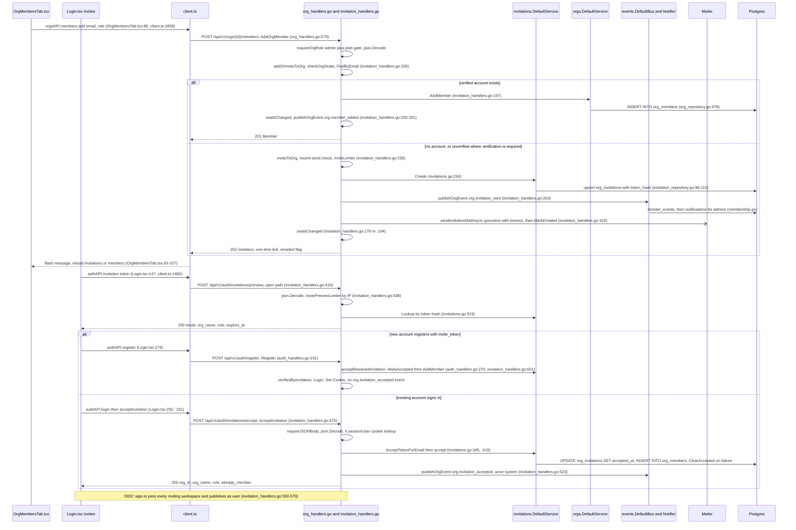

Hops:

1. `OrgMembersTab.tsx:86` → `orgsAPI.members.add` (`client.ts:1838`) →
   `POST /api/v1/orgs/{id}/members` (`org_handlers.go:42`) →
   `AddOrgMember` (`org_handlers.go:579`). The same body sits in
   `CreateOrgInvitation` (`invitation_handlers.go:93-112`) on
   `POST /api/v1/orgs/{id}/invitations`, which the UI does not call.
2. `addOrInviteToOrg` (`invitation_handlers.go:156`) checks seats once for
   both branches, looks the address up and returns 409 for an existing
   member.
3. A verified account is added (`orgs.AddMember`,
   `org_repository.go:478`), seats are re-synced (`seatsChanged`,
   `billing_handlers.go:167`) and `org.member_added` is published; the
   answer is 201 (`writeAddOrInviteOutcome`, `invitation_handlers.go:119`).
4. Otherwise `inviteToOrg` (`invitation_handlers.go:236`), when SMTP is
   configured, first hands back an unchanged pending invitation whose link
   was mailed within the last hour, with no new link, mail or event
   (`:240-244`, `:296-307`; window at `:72`). It then charges the per-inviter
   budget (`inviteBudgetKey`, `:275`), upserts the invitation
   (`invitations.go:234`, `invitation_repository.go:96-110`), publishes
   `org.invitation_sent` (`:263`) and starts the mail goroutine
   (`sendInvitationMailAsync`, `:319`), which uses `notify.SendWithTimeout`
   and stamps `last_emailed_at` only on success. The answer is 202.
5. The invitee's page previews the token (`Login.tsx:147` →
   `PreviewInvitation`, `invitation_handlers.go:419`), rate-limited per IP
   in a bucket shared with share-link lookups.
6. **Register path.** `Register` (`auth_handlers.go:231`) creates the
   account, provisions the personal workspace, takes up the invitation
   (`acceptResolvedInvitation`, `invitation_handlers.go:601`), marks the
   address verified, signs in and sets the cookie.
7. **Sign-in path.** `AcceptInvitation` (`invitation_handlers.go:475`)
   requires a JSON body, resolves the cookie itself, and calls
   `AcceptTokenForEmail` (`invitations.go:345`) → `accept` (`:410`):
   `MarkAccepted`, then `AddMember`, with `ClearAccepted` as compensation
   rather than a transaction. It publishes `org.invitation_accepted`
   (`:523`).
8. **OIDC path.** `acceptInvitationsForProviderVerifiedEmail`
   (`invitation_handlers.go:550`) accepts every pending invitation for the
   provider-verified address and publishes as `user:<id>` (`:563`).

**What varies.**

- *Three accept paths, three event behaviors.* Register-with-invite
  publishes no `org.invitation_accepted`, so admins are not told who
  joined. The sign-in path publishes with actor `system`, because `Actor(r)`
  finds no context user on an open path (`authmiddleware.go:291-305`). The
  OIDC path publishes with actor `user:<id>`. The notifier skips the actor
  when delivering (`notifier.go:214`), so the actor decides who is told.
- *Authentication on open paths.* Preview needs no session; accept resolves
  the cookie inside the handler (`h.sessionUser`) and answers 401 `not
  authenticated`. Accept checks for a JSON media type
  (`requireJSONBody`); preview does not.
- *Outbound mail.* Invitations and verification mails go out from handler
  goroutines with a timeout; notification mail goes out synchronously on the
  event-bus goroutine with no timeout (§5.9).
- *Seat sync and billing* are direct handler calls to `seatsChanged`, not
  bus subscribers (`invitation_handlers.go:176`, `:194`, `:200`, `:404`,
  `org_handlers.go:651`).
- *Error mapping.* This flow has its own mapper, `writeInvitationError`
  (`invitation_handlers.go:342`), including 429 for the invite budget.

**Editing notes.**

- `AddOrgMember` and `CreateOrgInvitation` must keep returning the same
  status pair (201 member, 202 invitation, 409 already a member); the
  comment at `invitation_handlers.go:114-118` records that they once
  drifted.
- The member-removal and invitation-revocation routes are wrapped in
  `alwaysWritable` (`org_handlers.go:44`, `invitation_handlers.go:48`); the
  add routes are not. Keep the wrappers when reorganizing registrations.
- Changing the event actor on any accept path changes who receives the
  "joined" notification.
- Token hashing is SHA-256 hex of the raw token (`users.HashToken`,
  `users.go:363`) for sessions, invitations, run tokens and worker keys
  alike; moving the helper must not change it, or every stored hash stops
  matching.

### 5.6 Agent run lifecycle and proposals

A member launches an agent on a project with a prompt. The run is queued in
`agent_runs`; a runner process (`agentd`, §4.7) claims it, starts the
vendor CLI with an `openv-mcp` tool server, and streams logs back. The CLI's
writes reach the API through MCP tools that authenticate with the run's
token. If the agent is in proposal mode those writes become proposals, and
the run ends in `awaiting_approval` until a human reviews them.

**Launch, claim, execute, stream.**

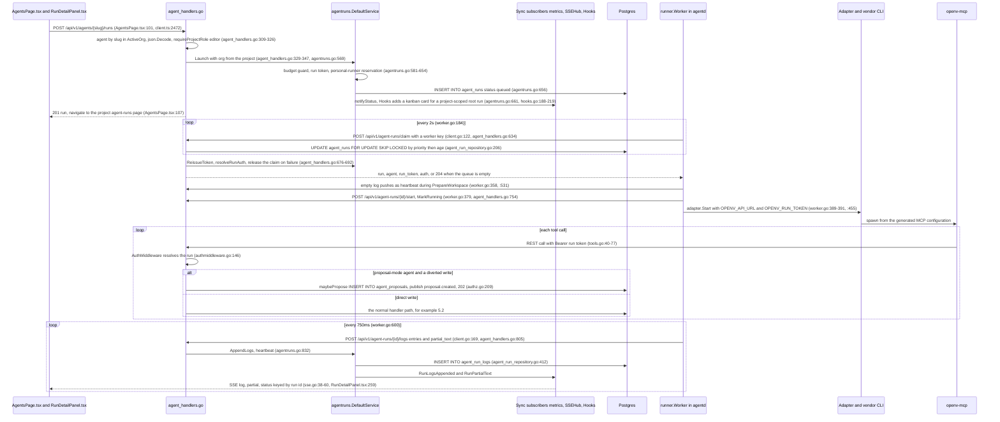

**Finish, review, finalize.**

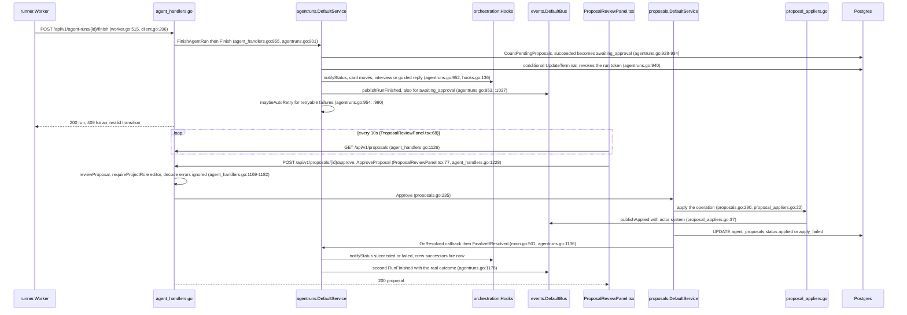

Hops:

1. `AgentsPage.tsx:101` (or `ProjectList.tsx:235`) → `agentsAPI.launchRun`
   (`client.ts:2472`) → `POST /api/v1/agents/{slug}/runs`
   (`agent_handlers.go:43`) → `LaunchAgentRun` (`agent_handlers.go:309`).
   The agent is looked up in the active workspace; the run belongs to the
   project's workspace when a project is given (`:329-333`).
2. `agentruns.DefaultService.Launch` (`agentruns.go:569`) applies the
   optional budget guard (`:581`), mints a token whose plaintext every
   caller discards (`:594`), reserves the run for the launcher's personal
   runner for a grace period (`:644-654`), saves it (`:656`) and calls the
   synchronous subscribers (`:661`, `notifyStatus` at `:1220`).
3. `runner.Worker.Run` polls every 2 s (`worker.go:184`) with a normal slot
   and a child slot (`:198-199`). `ClaimAgentRun` (`agent_handlers.go:634`)
   touches a transient lease (`:650`), gates hosted claims on the
   `hosted_automation` flag (`:656`) and claims with
   `UPDATE … FOR UPDATE OF r SKIP LOCKED` (`agent_run_repository.go:206-243`),
   the Postgres row-lock clause that makes a concurrent claimer skip a row
   another transaction holds instead of waiting for it, so two workers never
   take the same run.
4. The claim handshake loads the agent, issues a fresh run token
   (`ReissueToken`, `agentruns.go:789`) and resolves provider auth; on
   failure it releases the claim (`releaseFailedClaim`,
   `agent_handlers.go:698`).
5. The worker prepares the workspace while pushing empty log batches as a
   heartbeat (`worker.go:358`, `:531`), calls `/start` (`:379` →
   `StartAgentRun`, `agent_handlers.go:754` → `MarkRunning`,
   `agentruns.go:809`), and starts the adapter with `OPENV_API_URL` and
   `OPENV_RUN_TOKEN` in the environment (`worker.go:389-391`, `:455`).
6. Each MCP tool is a thin REST call with the run token
   (`internal/mcp/tools.go:40-77`). `AuthMiddleware` puts the run in the
   context (`authmiddleware.go:146`); `projectAccess` treats a run as an
   editor inside its own project only (`authz.go:57-63`); `maybePropose`
   (`authz.go:209-251`) diverts five write operations
   (`handlers.go:584`, `:792`, `:986`, `:1380`, `:1569`) into
   `agent_proposals` and answers 202.
7. The log pump posts every 750 ms (`worker.go:571-620`) →
   `AppendAgentRunLogs` (`agent_handlers.go:805`, which also accepts the
   legacy bare-array body, `:832`) → `AppendLogs` (`agentruns.go:832`). The
   SSE hub broadcasts `log`, `partial` and `status` on the bare run id
   (`sse.go:38-60`), read by `RunDetailPanel.tsx:259`, which falls back to a
   3 s poll after failed reconnects (`:249`). The run list polls every 5 s
   (`AgentRunsPage.tsx:90`).
8. `/finish` → `Finish` (`agentruns.go:901`): pending proposals turn success
   into `awaiting_approval` (`:928-934`), the terminal write is conditional
   (`:940`), then `notifyStatus`, `publishRunFinished` and `maybeAutoRetry`
   (`:952-954`).
9. The reaper in `main.go:700-729` fails runs silent for 2 minutes every
   30 s (`FailStale`, `agentruns.go:1107`), publishing `RunFinished` and
   possibly retrying.
10. Review: `ProposalReviewPanel.tsx:77` → `ApproveProposal`
    (`agent_handlers.go:1228`) → `reviewProposal` (`:1169`) →
    `proposals.Approve` (`proposals.go:235`) → `apply` (`:290`) → appliers
    (`proposal_appliers.go:22-197`). `OnResolved` (`main.go:501`) calls
    `FinalizeIfResolved` (`agentruns.go:1136`), which publishes the second
    `RunFinished` (`:1178`).

**What varies.**

- *Two fan-out mechanisms.* Run status and logs go to synchronous
  subscribers inside the worker's HTTP request (metrics, SSE hub,
  orchestration hooks, in that order, `main.go:522-529`). `RunFinished`
  goes through the asynchronous bus (§5.9). The SSE hub never subscribes
  to the bus.
- *`RunFinished` emission.* Published twice for a run that ends in `awaiting_approval` (at
  that point and again at finalize) and not at all when a queued run is
  cancelled: `RequestCancel` calls only `notifyStatus`
  (`agentruns.go:1069-1081`), although the comment at `:1031-1036` says
  every terminal transition must publish.
- *Proposal-mode handling.* Five operations are diverted; three handlers
  refuse proposal-mode runs with 403 instead (`handlers.go:938`, `:1541`,
  `review_round_handlers.go:46`); test results are written directly (§5.3).
  `maybePropose` compares with the literal `"proposal"` (`authz.go:219`);
  the others use `agents.WriteModeProposal`.
- *Events from appliers.* Approved proposals publish with actor `system`
  through `publishApplied`, which looks up the org itself; the HTTP path
  uses `h.publish` with the request's actor. Payloads differ:
  `artifact.deleted` carries `nil` over HTTP (`handlers.go:996`) and
  `{artifact_type, title}` from the applier.
- *Launch error mapping.* The same budget refusal answers 402 from
  `LaunchAgentRun` and `DraftTestCases` (`agent_handlers.go:352`, `:439`),
  400 from crew, automation and test-run launches (`:1117`, `:2196`,
  `suite_handlers.go:458`) and 500 from delegation (`agent_handlers.go:950`).

**Editing notes.**

- The worker protocol is observable to deployed `agentd` and connector
  builds: the claim response keys `run`, `agent`, `run_token`, `auth`
  (a map literal, `agent_handlers.go:688-693`), 204 on an empty queue, the
  `/logs` response keys `cancel_requested` and `status`, the legacy log body,
  and `/start` posted with no body. A shared JSON-body guard must not be
  applied to these routes.
- SSE event names (`log`, `partial`, `status`) and the order of the
  synchronous subscribers decide what the run panel shows.
- `GET /api/v1/agent-runs/delegate/{id}` must stay registered before
  `/api/v1/agent-runs/{id}/tree`, `/logs` and `/stream`
  (`agent_handlers.go:50-55`); the route inventory test sorts routes and
  cannot see order.
- The budget guard lives in `Launch`, so it gates every launcher, including
  auto-retry, hooks, the scheduler and triggers. Moving it to a handler
  would stop it gating those.
- Automations filtered on `agentrun.finished` currently see approval runs
  twice. Unifying terminal transitions must keep today's emission set.

### 5.7 Crews, delegation and automations

Beyond a single launch, runs are started by crews (a graph of agent and
human nodes), by one agent delegating to another, and by automations that
fire on demand, on a schedule, on a domain event, or when a card moves on
the kanban board. All of them end in `agentruns.Launch` (§5.6); what differs
is who calls it, from which process context, and with which guards.

**Crews and delegation.**

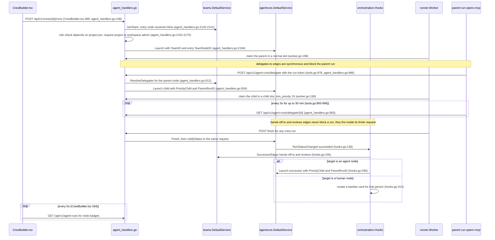

**Automations: four launch paths.**

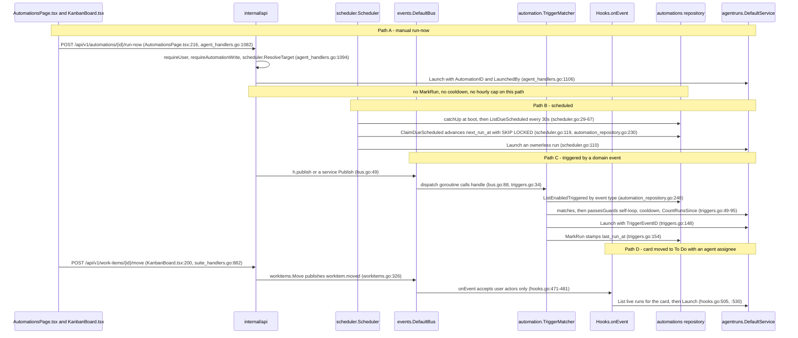

Hops:

1. **Crew launch.** `CrewBuilder.tsx:388` → `POST /api/v1/crews/{id}/runs`
   (`agent_handlers.go:108`; the deprecated `/api/v1/teams/{id}/runs` alias
   at `:125` reaches the same handler) → `LaunchTeamRun`
   (`agent_handlers.go:2124`), which resolves the entry node inline
   (`:2130-2141`) and launches the entry agent (`:2194`).
2. **Delegation.** The `delegate_to_agent` MCP tool (`tools.go:971`) posts
   to `/api/v1/agent-runs/delegate` (`:978`). `DelegateRun`
   (`agent_handlers.go:886`) accepts only a run token, resolves the
   parent node's `delegates-to` children (`:912`) and launches the chosen
   child with child priority (`:934`). The tool then polls
   `GET /api/v1/agent-runs/delegate/{id}` every 5 s for up to 30 minutes
   (`tools.go:993-996`).
3. **Successors.** When any crew run reaches `succeeded`, the synchronous
   hook (`hooks.go:136`) calls `enqueueSuccessors` (`:241`), which reads
   `hands-off-to` and `reviews` edges (`:246`) and either launches the
   next agent (`:295`) or creates a card for a human (`:313`). This runs
   inside the finishing worker's `/finish` request (or, for a run that
   waited for approval, inside the review request that finalizes it), and
   recursively, because `Launch` calls `notifyStatus` again.
4. **Run now.** `AutomationsPage.tsx:216` → `RunAutomationNow`
   (`agent_handlers.go:1082`) → `scheduler.ResolveTarget` (`:1094`) →
   `Launch` (`:1106`).
5. **Scheduled.** `scheduler.Start` (`scheduler.go:29`) runs `catchUp`
   synchronously before the server listens, then ticks every 30 s; `fire`
   (`:81`) claims the row first (`:119` → `automation_repository.go:230`,
   safe across replicas), resolves the target and launches (`:110`).
6. **Triggered.** `TriggerMatcher.handle` (`triggers.go:34`) lists enabled
   automations for the event type, applies `matches` (`:49`) and
   `passesGuards` (`:67`: no self-trigger from the automation's own runs,
   cooldown, hourly cap), launches (`:148`) and stamps `last_run_at`
   (`:154`).
7. **Board.** `KanbanBoard.tsx:200` → `POST /api/v1/work-items/{id}/move`
   (`suite_handlers.go:66`, `MoveWorkItem` at `:882`) → `workitems.Move`
   (`workitems.go:296`) publishes `workitem.moved` (`:326`) →
   `Hooks.onEvent` (`hooks.go:471`) launches when a user moved the card to
   To Do, the assignee is an agent and no run is live for it (`:505-530`).

**What varies.**

- *Process context.* Crew successors run synchronously inside a worker's
  HTTP request; triggers and the board path run on the single bus dispatch
  goroutine; the scheduler runs on its own ticker goroutine; run-now and
  delegation run in their own HTTP requests.
- *Guards and bookkeeping.* Only the trigger path applies cooldown and the
  hourly cap and calls `MarkRun`; the scheduler stamps inside its claim
  SQL; run-now does neither.
- *Target resolution.* `ResolveTarget` lives in `internal/scheduler`
  (`scheduler.go:140`) and is imported by `internal/automation` and the API;
  `LaunchTeamRun` re-implements entry-node resolution inline.
- *Data access.* The scheduler and trigger matcher use the automations
  repository directly (`main.go:675-676`); the API goes through
  `automations.Service`.
- *Launch-site count.* There are 14 `Launch` call sites: 5 in
  `agent_handlers.go`, 3 in `suite_handlers.go`, 2 in `hooks.go`, 1 each in
  `triggers.go` and `scheduler.go`, and 2 inside `agentruns` (retry and
  auto-retry), each building `LaunchRequest` by hand.

**Editing notes.**

- `internal/automation` and `internal/scheduler` have no tests. Add
  characterization tests for all four paths before moving code.
- The trigger path treats a whitespace-only prompt as empty
  (`triggers.go:127`); the scheduler checks only `== ""` (`scheduler.go:96`).
  Triggered runs inherit the event's project when the automation has none.
- The board trigger ignores any actor that is not `user:`, which is why the
  hook's own card moves (actor `agent:<run>`, `hooks.go:189`) never
  re-trigger it.
- Delegation depth is capped only when the crew graph is edited
  (`teams.go:255`), not at run time.
- The deprecated `/api/v1/teams*` routes are public surface and pinned by
  the route inventory.

### 5.8 Runner pool leases and hosted workers

There are two ways to get compute without installing the Agent Connector.
A member can lease a transient runner from a shared pool for a limited time;
the pool node runs a personal worker under a key minted for that lease and
wiped when it ends. A workspace admin can instead enable a hosted runner: a
Docker container per workspace, provisioned by the API host.

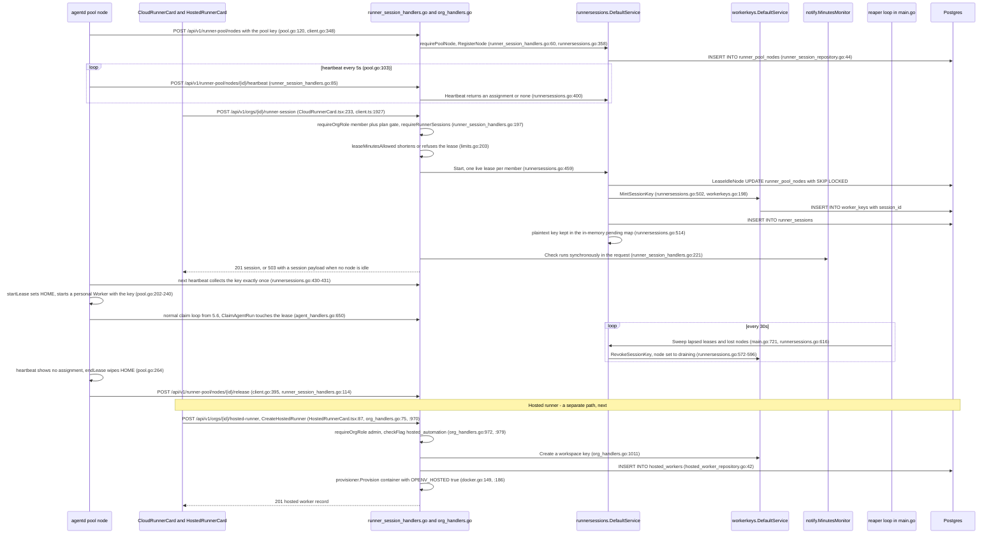

Hops:

1. **Node registration.** `agentd --pool-key` builds a `runner.PoolAgent`
   (`NewPoolAgent`, `internal/runner/pool.go:71`) whose `Run` (`pool.go:93`)
   wipes its session root, registers
   (`pool.go:120` → `client.go:348` → `RegisterPoolNode`,
   `runner_session_handlers.go:60` → `runnersessions.go:358`) and beats
   every 5 s (`NodeHeartbeatInterval`, `runnersessions.go:76`).
2. **Lease start.** `CloudRunnerCard.tsx:233` → `cloudRunnerAPI.start`
   (`client.ts:1927`) → `StartRunnerSession`
   (`runner_session_handlers.go:195`): member role plus plan gate, 400 when
   `RUNNER_POOL_KEY` is unset (`requireRunnerSessions`, `:49`), minutes
   allowance (`limits.go:203`).
3. `runnersessions.Start` (`runnersessions.go:459`) returns an existing live
   lease, or leases an idle node, mints a session-bound personal worker key
   (`workerkeys.go:198`), saves the session and keeps the plaintext key in
   an in-memory map (`:514`). The minutes monitor runs inside the request
   (`runner_session_handlers.go:221`, `notify/minutes.go:60`).
4. **Hand-off.** The node's next heartbeat receives the key once and the
   session becomes active (`runnersessions.go:428-437`). `startLease`
   (`pool.go:202`) points `HOME` at a per-lease directory and runs a
   headless personal `Worker` (`pool.go:229-240`), which claims like any
   runner (§5.6).
5. **End.** The reaper calls `Sweep` every 30 s (`main.go:721`,
   `runnersessions.go:616`): lapsed or idle leases and lost nodes are ended,
   the key revoked and the node set to draining (`:572-596`). The node sees
   no assignment, `endLease` (`pool.go:264`) wipes `HOME`, and it releases
   itself (`client.go:395` → `ReleasePoolNode`,
   `runner_session_handlers.go:114`).
6. **Hosted runner.** `HostedRunnerCard.tsx:87` → `CreateHostedRunner`
   (`org_handlers.go:970`): admin role, `hosted_automation` flag, a
   workspace worker key, a `hosted_workers` row and a Docker container
   whose environment sets `OPENV_HOSTED=true`
   (`internal/hosting/docker.go:145-186`). The flag is checked again when
   the container's `agentd` claims (`agent_handlers.go:656`).

**What varies.**

- *Credentials.* Pool nodes authenticate with the deployment-wide
  `RUNNER_POOL_KEY`, checked by `requirePoolNode`; the leased worker uses a
  per-session personal key; the hosted container uses a workspace key.
  `AuthMiddleware` tries these in a fixed order (worker key, legacy key,
  pool key, run token).
- *Refusal shapes.* No idle node answers 503 with the normal session
  payload, not an error envelope; a spent allowance answers 403
  `limit_reached` through `writeLimitError`; a deployment without a pool
  answers 400 `transient runners are not enabled on this deployment`.
- *Process-local state.* The pending key map lives in one API process,
  as do the SSE hub and the bus; the scheduler, by contrast, is written to
  be safe across replicas.
- *Side effects outside the bus.* Minutes alerts are a direct call from the
  lease handlers, not an event subscriber.

**Editing notes.**

- The single-replica assumption for the pending key is invisible in code;
  keep it behind one interface if the service is split.
- With `RUNNER_POOL_KEY` unset, `runnerSessionService` is nil and several
  limits outputs change (`limits.go:187`, `:478`). Always constructing the
  service would silently enable the feature.
- The hosted container name is derived from the org id
  (`hostedContainerName`, `org_handlers.go:913-919`), and the worker key
  name `hosted-runner` marks a worker as hosted in the status view
  (`org_handlers.go:898`, read at `:1155`). Both reach stored data.
- Boot reconciles hosted container state inline in `main.go:320-347`.

### 5.9 Notification fan-out

A member sees the bell badge increase, and may also get an email or a
browser push, when something that concerns them happens: a proposal awaits
review, a run they launched failed, an artifact entered review, they were
mentioned, their access changed, a budget or minutes threshold was crossed,
or a release was announced. Most of these start as domain events on the
bus; some are called directly by timers or handlers.

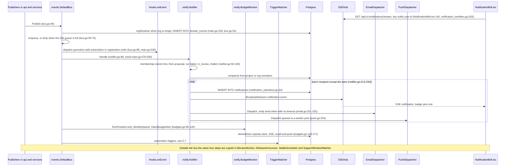

Hops:

1. `NotificationBell.tsx:146` opens an `EventSource` on
   `GET /api/v1/notifications/stream` (`notification_handlers.go:34`,
   `StreamNotifications` at `:333`), keyed `notify:<user_id>`
   (`notify.StreamKey`, `notifier.go:20`). There is no replay; the bell
   loads the inbox separately.
2. A publisher calls `DefaultBus.Publish` (`internal/events/bus.go:49`). An
   event without an org is resolved from its project with raw SQL
   (`cmd/server/main.go:229-235`). The event is saved synchronously
   (`bus.go:53`), then queued in a 256-slot channel and dropped with a
   rate-limited warning when the channel is full (`:59-72`).
3. One `dispatchLoop` goroutine (`bus.go:88`) calls the subscribers in
   series, each wrapped in a panic guard: `Hooks.onEvent` (`main.go:530`),
   `Notifier.Handle` (`:590`), `BudgetMonitor.Handle` (`:598`),
   `TriggerMatcher.handle` (`:675`).
4. `Notifier.Handle` (`notifier.go:88`) gives membership events to
   `handleMembership` (`membership.go:62`), then routes `proposal.created`,
   failed `agentrun.finished`, `artifact.status_changed` to `in_review`,
   and `chatter.created` (interview completion, @mentions in comments).
5. `deliver` (`notifier.go:213-230`) skips the actor, inserts the
   notification, broadcasts it on the user's SSE key, sends email through
   `EmailDispatcher.Dispatch` (synchronous `smtp.SendMail` with no timeout,
   `email.go:201-220`, `:94`) and hands web push to a bounded queue
   (`push.go:254-279`).
6. `BudgetMonitor` (`budgets.go:85`) reacts to `RunFinished`, computes the
   month's spend and claims each 80 % and 100 % alert once per month before
   alerting admins (`:143-171`).
7. Direct callers repeat the same store, SSE, email, push sequence:
   `MinutesMonitor.Check` from the lease handlers (`minutes.go:113-121`),
   the release announcer once at boot (`main.go:630-633`, `release.go:94-103`),
   the stable scheduler hourly (`main.go:637`, `stable.go:170-179`,
   `:196-204`) and the support-window watcher on dedicated deployments
   (`main.go:645`, `dedicated.go:182-189`).

**What varies.**

- *Seven copies of delivery.* `notifier.go`, `budgets.go`, `minutes.go`,
  `release.go`, `stable.go` (twice) and `dedicated.go` each implement store,
  broadcast, email and push, and each type has its own
  `SetEmailDispatcher` and `SetPushDispatcher` builders.
- *Email timing.* Notification email is synchronous on the bus goroutine;
  invitation and verification mail run in handler goroutines with a timeout
  (§5.5). A slow SMTP server therefore delays every later bus subscriber,
  including automation triggers, and can fill the queue until events are
  dropped.
- *Org stamping.* Events arrive with the org set by `h.publish` (project
  lookup, falling back to `ActiveOrg`), by `publishOrgEvent` (path id), by
  `publishApplied` (own project lookup) or empty from domain services
  (`vv.go:344`, `workitems.go:388`), resolved by the bus.
- *Live updates.* Only run detail, guided chat, interview chat and
  notifications use SSE. Domain events never reach the browser directly;
  run lists, the kanban board, the crew builder and proposals poll.

**Editing notes.**

- Recipient rules are user-facing: the actor never notifies themselves;
  budget, minutes, stable-cut and support-window alerts go to admins only;
  a membership change goes to the affected person and, as "who joined or
  left", to the admins (`membership.go:62-93`); budget and minutes
  thresholds fire once per month.
- Notification types, `entity_ref` keys and all title and body copy are
  consumed by the bell, email templates and `frontend/public/sw.js`.
- `payloadString` and `payloadBool` in the notifier read payload values by
  Go type; a typed-event refactor must keep string and bool values.
- Subscriber order and the panic guard per subscriber are wiring details in
  `main.go` with no test.

### 5.10 Billing webhook to plan limits

A workspace admin chooses a plan and pays on Stripe's hosted checkout;
afterwards the workspace's limits follow the paid plan, and a workspace over
its plan becomes read-only. **There is no Stripe webhook receiver.** Billing
state reaches the database by polling: a reconcile loop every 5 minutes, and
a synchronous refresh when the checkout return page loads. The design
document records this as deliberate (`docs/plans/billing-stripe.md:69`:
"Poll-only at launch … No webhook receiver until the staleness metric says
the poll cannot keep up"). The flow below is therefore "checkout and poll
to plan limits"; the heading keeps the document-wide name.

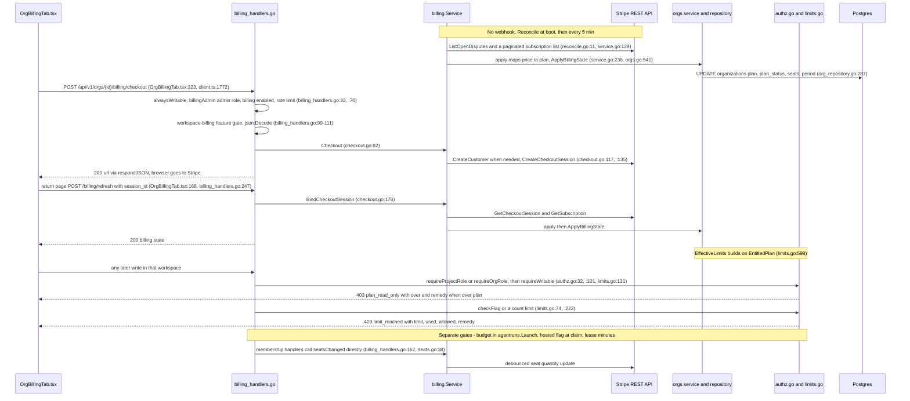

Hops:

1. **Boot.** `billing.ConfigFromEnv` (`cmd/server/main.go:775`) and the
   switch after it leave billing off when `STRIPE_SECRET_KEY` is unset or
   the deployment is self-hosted (`OPENV_SELF_HOSTED=true`, `main.go:780-782`);
   otherwise `billing.New` and `Start` (`main.go:783-793`,
   `reconcile.go:11`) run `Reconcile` once immediately and then on the
   interval (`OPENV_BILLING_RECONCILE_MINUTES`, default 5).
2. `Reconcile` (`internal/billing/service.go:129`) lists open disputes and
   subscriptions; `apply` (`:236`) maps each to a plan and calls
   `orgs.ApplyBillingState` (`orgs.go:541`), whose SQL also holds the
   granted-plan rule and the nightly-channel rule on upgrade
   (`org_repository.go:287-310`).
3. **Purchase.** `OrgBillingTab.tsx:323` → `billingAPI.checkout`
   (`client.ts:1772`) → `POST /api/v1/orgs/{id}/billing/checkout`
   (`billing_handlers.go:32`, wrapped in `alwaysWritable`) →
   `CheckoutOrgBilling` (`:94`): admin role, billing enabled and a
   per-workspace rate limit (`billingAdmin`, `:70`), then the
   workspace-billing feature gate. `Service.Checkout` (`checkout.go:82`)
   creates the Stripe customer if needed (`:117`) and the checkout session
   (`:135`).
4. **Return.** The return page posts the `session_id` to
   `POST /api/v1/orgs/{id}/billing/refresh` (`OrgBillingTab.tsx:168`,
   `billing_handlers.go:247`) → `BindCheckoutSession` (`checkout.go:176`),
   which reads the session and subscription and applies them at once.
5. **Enforcement.** Limits are read through `Org.EffectiveLimits`
   (`internal/domain/orgs/limits.go:598`), which starts from
   `EntitledPlan`: the billed plan while the subscription is in good
   standing, the free tier otherwise. That is the only point where billing
   touches enforcement.
6. The read-only gate runs inside `requireProjectRole` and `requireOrgRole`
   for mutating methods (`authz.go:32-34`, `:101`) → `requireWritable`
   (`limits.go:131`), except on the nine routes wrapped in
   `alwaysWritable`. Count limits and feature flags answer through
   `writeLimitError` (`limits.go:222`).
7. Seat counts reach Stripe through direct calls to `seatsChanged`
   (`billing_handlers.go:167` → `billing/seats.go:38`), debounced there.

**What varies.**

- *Five enforcement mechanisms with different answers.* Plan read-only
  (403 `plan_read_only`, body `{error, code, over, remedy}`), count limits
  and flags (403 `limit_reached` with numbers), the hosted flag at claim
  time (§5.6), lease minutes (§5.8), and the budget soft-block in
  `agentruns.Launch` (402 on two endpoints, 400 or 500 on others, §5.6).
- *Where the gate hides.* The plan gate is part of the role checks rather
  than a separate step, so any mutating route that authorizes through them
  is gated, including `ActivateOrg` (§5.1) and lease start (§5.8), unless
  it is registered with `alwaysWritable`.
- *Response encoding.* Billing handlers use `respondJSON`, which sets
  `application/json`; most other handlers encode directly (§9.3).
- *Month arithmetic.* The start-of-month computation is repeated in six
  places (`budgets.go:104`, `minutes.go:73`, `limits.go:191`, `:482`,
  `org_handlers.go:1219`, `main.go:663`).

**Editing notes.**

- The frontend requires status 403 together with the codes `limit_reached`
  and `plan_read_only` (`frontend/src/api/errors.ts:38`, `:53`); remapping
  either to another status breaks the limit and read-only banners.
- The nine `alwaysWritable` wrappers (billing refresh, checkout, change and
  portal; project and workspace delete; import; member removal; invitation
  revocation) are not visible to the route inventory test. Dropping one
  makes that route fail for over-plan workspaces, which is exactly when it
  is needed.
- `*billing.Service` is nil-safe through pointer receivers and is mostly
  called without nil checks (for example `billing_handlers.go:204`,
  `org_handlers.go:137`); replacing the field with an interface makes a nil
  interface panic on deployments without billing.
- `NewHandler` wires `SetSeatCounter` and `DefaultReturnURL` into the
  billing service (`internal/api/handlers.go:372-377`); `DefaultReturnURL`
  applies only when `main.go` has not called `SetReturnURL`. Keep that
  order when moving wiring.

[Index](README.md) · [4 Backend](backend.md) · [5 Key flows](flows.md) · [6–8 Frontend, data, tooling](frontend-data-tooling.md) · [9–10 Assessment](assessment.md) · [Pain-point register](pain-points.md) · [Refactor plan](../../plans/codebase-refactor.md)
