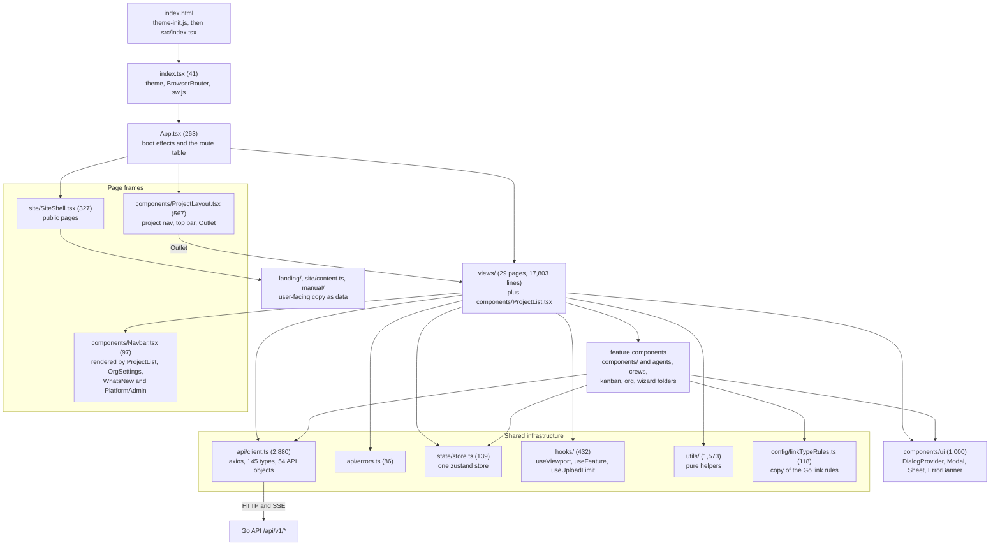
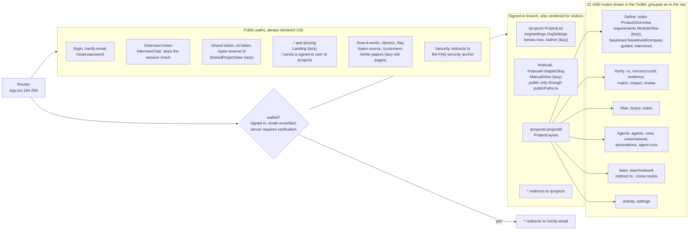
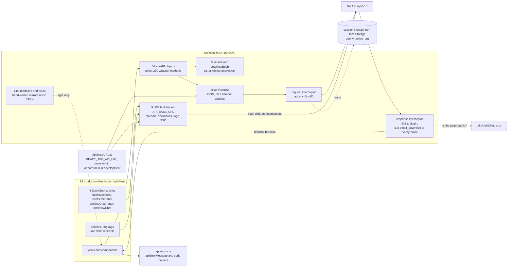
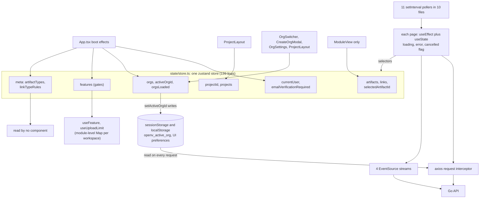
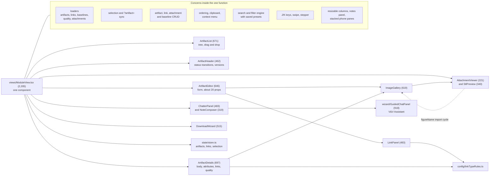
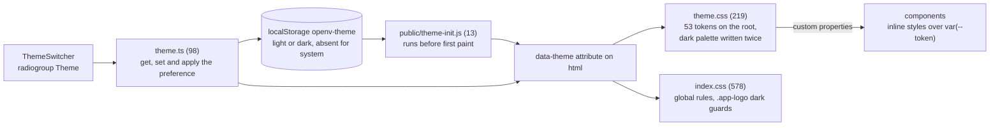
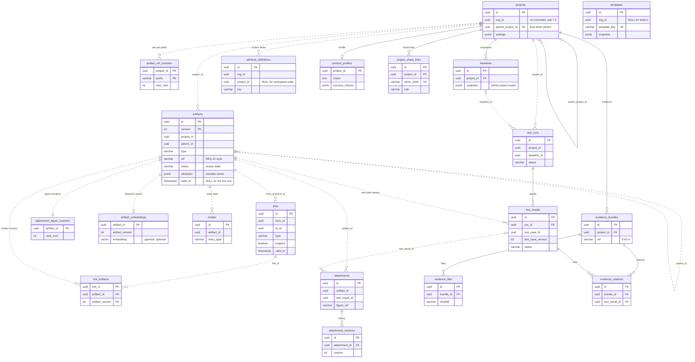
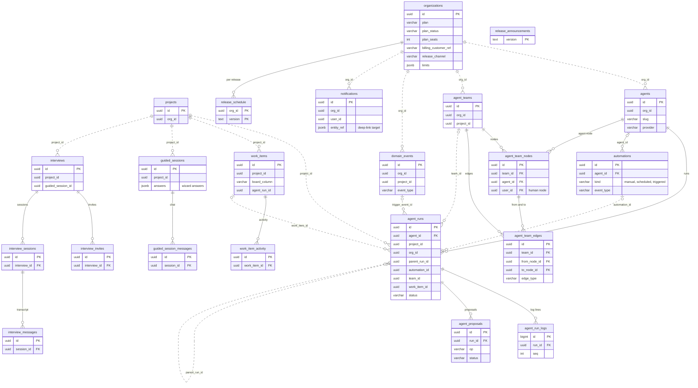
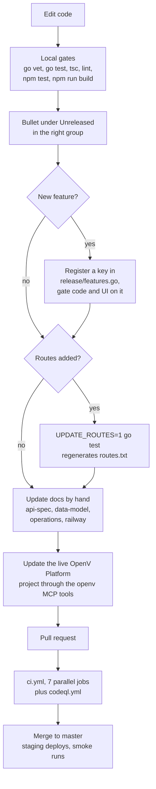

# OpenV codebase architecture analysis — 6–8. Frontend, data model and tooling

Part of the [2026-09-25 codebase architecture analysis](README.md) (commit `d11dee8`).

[Index](README.md) · [4 Backend](backend.md) · [5 Key flows](flows.md) · [6–8 Frontend, data, tooling](frontend-data-tooling.md) · [9–10 Assessment](assessment.md) · [Pain-point register](pain-points.md) · [Refactor plan](../../plans/codebase-refactor.md)

## 6. Frontend architecture

The web app is one React 18 single-page application in `frontend/src`,
written in TypeScript and built with Vite 8. It serves every audience from
one bundle: visitors (landing page, pricing, storefront pages, the manual,
share links), signed-out interview participants, and signed-in workspace
members. The server renders nothing; the Go API only answers JSON and
server-sent events under `/api/v1/*`. In the production frontend image
(`frontend/Dockerfile.prod`), nginx serves the built files and proxies
`/api/` to the API, so the browser sees one origin ([§2.1](README.md)).

At `d11dee8` the app is 172 non-test `.ts`/`.tsx` files (49,559 lines) plus
7 CSS files (1,753 lines), and 67 test files (10,306 lines).
[§3.1](README.md) breaks the lines down by folder. The code is organised by
page: each route renders one large function component that fetches its own
data through a single hand-written API module built on axios (a promise-based
HTTP client library), keeps most of its state in `useState`, and styles
itself with inline style objects. A small layer of shared infrastructure sits
underneath: one zustand store (zustand is a small React state library), a few
hooks, pure helpers in `utils/`, and a kit of dialog and layout primitives in
`components/ui`. Identifiers in backticks such as `fe-shell-1` name entries
in the [pain-point register](pain-points.md). Product and code terms used
here (workspace, crew, V&V, SSE, SPA, feature key, MCP) are defined in
[Appendix B](assessment.md#appendix-b-glossary).

| Folder | Files | Lines | Holds |
|---|---:|---:|---|
| `views/` | 31 | 17,803 | 29 page components plus `reviewArtifacts.ts` and `vvGapLabels.ts` |
| `components/` (top level) | 45 | 12,875 | shell widgets, the requirements-module components, the project list, pure helpers such as `helpTopics.ts` and `artifactReferences.ts` |
| `components/org`, `wizard`, `agents`, `crews`, `kanban` | 30 | 8,395 | workspace-settings tabs and runner cards, the guided wizard and V&V Assistant, the agent suite |
| `components/ui` | 11 | 1,000 | shared dialog and layout primitives behind a barrel (an `index.ts` that re-exports the folder's modules) |
| `api/` | 4 | 3,046 | `client.ts`, `errors.ts`, `baseURL.ts`, `contentDisposition.ts` |
| `state/`, `hooks/`, `utils/`, `config/`, `push/` | 21 | 2,530 | the store, React hooks and their pure cores, helpers, the link-rule mirror, web push |
| `site/`, `landing/`, `manual/` | 26 | 3,443 | storefront pages, landing copy, the 16 manual chapters as Markdown in TypeScript |
| root | 4 | 467 | `App.tsx`, `index.tsx`, `appShortcuts.ts`, `theme.ts` |

Build and test configuration is small: `vite.config.ts` (52 lines) pins the
deployment contract (the `REACT_APP_` environment prefix, output to
`build/`, dev server on port 3000 with `strictPort`, `assetsInlineLimit: 0`
so the content security policy can forbid inline scripts) and holds the
vitest block; `tsconfig.json` is `strict` with `isolatedModules`;
`eslint.config.js` enforces only `react-hooks/rules-of-hooks`,
`react-hooks/exhaustive-deps` and `@typescript-eslint/no-unused-vars`, all as
errors. Runtime dependencies are react, react-dom, react-router-dom 7,
axios 1, zustand 4, react-markdown with remark-gfm, ag-grid, and cytoscape;
`ajv` and `cytoscape-react` are declared but imported nowhere
(`fe-shell-v7`).

### 6.1 Shell and routing

The shell decides who is signed in, which workspace is active, which feature
gates are on, and which page to draw. It lives in two files. `App.tsx` is
both the boot sequence and the whole route table. `ProjectLayout.tsx` is the
frame around every project page: the grouped side navigation, the compact
top bar on phones, search, notifications, workspace switcher, account menu,
help panel, and an `<Outlet/>` where the page renders. Pages outside a
project draw their own chrome: four signed-in pages (`ProjectList`,
`OrgSettings`, `WhatsNew`, `PlatformAdmin`) render `Navbar` themselves, the
landing and storefront pages wrap themselves in `SiteShell`, and the manual,
sign-in, share-link and interview pages each draw their own.

#### Boot: `index.tsx` and `App.tsx`

| Step | Where | What happens |
|---|---|---|
| Pre-paint theme | `index.html:27`, `public/theme-init.js` | Reads `openv-theme` from `localStorage` and sets `data-theme` on `<html>` before React loads (an external file because the CSP allows only same-origin scripts) |
| Mount | `index.tsx:12-23` | Re-applies the theme, imports `theme.css` and `index.css`, renders `<React.StrictMode><BrowserRouter><App/>` |
| Service worker | `index.tsx:31-41` | Registers `${BASE_URL}sw.js` on `load`, in development too; the worker caches nothing and exists for installability and web push |
| Session | `App.tsx:107-123` | Unless the path starts with `/interview/`, `Promise.allSettled([authAPI.me(), authAPI.config()])` sets `currentUser` and `emailVerificationRequired`; nothing renders until `authChecked` (`:185-187`) |
| Wall | `App.tsx:129` | `walled` is true only for a signed-in, unverified account on a server that requires verification |
| Workspaces | `App.tsx:132-155` | `orgsAPI.list()`, then `pickActiveOrg` (`utils/activeOrg.ts`) chooses tab value, server `active_org`, last used, personal, first; the store persists the choice |
| Feature gates | `App.tsx:159-174` | On every `activeOrgId` change, clears then reloads `orgsAPI.features`; `useFeature` answers false until they arrive |
| Metadata | `App.tsx:176-183` | Loads artifact types and link-type rules into `store.meta`, which no component reads (`fe-shell-8`) |
| Frame | `App.tsx:189-261` | `DialogProvider`, then `ReleaseUpdateBanner` for signed-in unwalled users, then `Suspense` with a "Loading…" fallback around `<Routes>` |

[§5.1](flows.md) traces the same boot through the API (sign-in, `GET /orgs`,
`X-Org-ID`).

#### Route table and code splitting

`App.tsx` declares 16 public paths, 6 top-level signed-in paths, the
`/projects/:projectId` layout route with 22 children, and two catch-alls. 19
route components are wrapped in `React.lazy` with an identical `lazy(() =>
import(...).then((m) => ({ default: m.X })))` pattern (`App.tsx:34-83`); 18
are imported eagerly (16 views plus `ProjectList` and `ProjectLayout`). The
comment at `App.tsx:28-33` says the split keeps react-markdown, ag-grid and
cytoscape out of the main bundle. That holds for ag-grid and cytoscape, but
`GuidedWizard` and `InterviewChat` are eager (`App.tsx:13`, `:23`) and both
reach `components/ChatMarkdown.tsx` (`GuidedWizard` through
`wizard/GuidedChatPanel`), which imports react-markdown and remark-gfm, so
react-markdown is in the main bundle anyway.

**There is no route guard.** When nobody is signed in, `walled` is false and
every "signed-in" route renders for the visitor. What keeps them out is the
axios response interceptor: a 401 on a path that `utils/publicPaths.ts` does
not list triggers a full-page `window.location.href = '/login'`
(`api/client.ts:90-97`). `publicPaths.ts:10-26` is consulted only there,
despite its comment claiming the router uses it too. `/manual` is declared
in the signed-in branch (`App.tsx:224-225`) and is public only because
`publicPaths.ts:13` lists it and `ManualView` makes no API call
(`fe-shell-v1`).

Behind the production nginx image, `/share/:token` is first answered by the
API's unfurl page (the link-preview HTML that chat apps read) through nginx
(`frontend/nginx.conf:141-153`), which forwards a browser to `/s/:token`;
the Vite dev server has no such rule and renders the SPA (single-page
application) route directly.

#### `ProjectLayout` and the navigation table

| Part | Lines | Behaviour |
|---|---|---|
| `navSections` table | `ProjectLayout.tsx:46-88` | Hard-coded groups Define (Overview, Guided Definition, Requirements, Interviews), Verify (V&V, Evidence, Traceability, Impact, Review Queue), Plan (Board, To-dos), Agents (Agents, Crew, Automations, Runs) and an unlabelled group (Activity, Settings) |
| Guided-session check | `:131-145` | Re-fetches `guidedAPI.list` on every pathname change; hides "Guided Definition" once a session has progress |
| Project load | `:147-157` | `setProjectId`, `rememberProject` (installed-app shortcut), `projectAPI.get`; on failure navigates to `/projects` |
| Cross-workspace deep link | `:159-175` | Switches `activeOrgId` when the project belongs to another of the member's workspaces; the comment at `:159-169` tells views to list `activeOrgId` in their effect dependencies |
| Nav filter | `:404-409` | Drops Guided Definition when used and items whose `feature` gate is off, reading `features` (selected at `:100`) directly rather than through `useFeature` |
| Panel modes | `components/navSections.ts`, `panelMode.ts` | Group collapse state (`openv-nav-sections`) and pinned, auto-hide or hidden panel (`openv-panel-mode-<panel>`), both pure and tested |
| Widgets | `:273` to `:564` | `NotificationBell` (`:273` in the compact top bar, `:524` in the sidebar), `OrgSwitcher` `:364`, `GlobalSearch` `:397`, `UserMenu` `:496`, `<Outlet/>` `:559`, `HelpSidebar` `:564` |

The component itself is one 476-line function (`:92-567`) with 26 `style`
attributes, 25 of them inline object literals (`fe-shell-7`). On viewports of 900 px or less the compact
top bar renders a second `NotificationBell` (`:273`) while the one inside
the always-mounted sidebar (`:524`) stays mounted, so two bells each fetch
the inbox and open their own SSE stream (`fe-shell-9`).

#### Where route knowledge lives

A project page's path appears in about eight places, none generated from
another (`fe-shell-6`):

| Place | What it encodes |
|---|---|
| `App.tsx:194-256` | the routes and redirects |
| `ProjectLayout.tsx:46-88` | nav labels, order, feature gates |
| `components/helpTopics.ts:235` `helpTopicForPath` | help copy keyed by the first segment after `/projects/:id`; evidence, impact, review and todos have no topic and fall back to the overview |
| `utils/publicPaths.ts:10-26` | which paths are public (the 401 redirect exemption) |
| `site/SiteShell.tsx:131` `SITE_NAV` | storefront navigation |
| `components/NotificationBell.tsx:31-61` `pathForNotification` | where a notification opens; already differs from the Go mapping in `internal/notify/email.go:253-276` (`fe-shell-v2`) |
| `appShortcuts.ts:26-43` | manifest shortcuts `?go=review` and `?go=board` used directly as route segments |
| 28 template literals `` `/projects/${id}/<segment>` `` | hand-built links across views and components |

The backend also builds SPA URLs in emails, push payloads and redirects:
`/login?invite=`, `/verify-email?token=`, `/reset-password?token=`,
`/org/settings?tab=billing&checkout=done`, `/s/:token`, `/interview/:token`
and the notification paths (for example `internal/notify/invitation.go:19`,
`internal/notify/verification.go:51`, `:73`, and
`internal/billing/checkout.go:143`).

#### Editing notes

- **A new project page** needs a route in `App.tsx`, an entry in
  `navSections`, a help topic in `helpTopics.ts` (or it shows the overview
  topic), and a feature key if it ships under *New features* (§8.2). A new
  public page also needs an entry in `utils/publicPaths.ts`, or a signed-out
  visitor's first failed API call bounces them to `/login`.
- **Do not add a `RequireAuth` wrapper or derive `publicPaths` from route
  placement.** Both change who sees `/manual`, which
  `e2e/tests/landing.spec.ts:40-44` requires to be readable signed out.
  Replacing the hard redirect with `navigate()` would also keep a stale
  zustand store after sign-out.
- **Keep every path, query parameter and redirect.** Backend emails and
  pushes, installed-app shortcuts (`public/manifest.json`), and bookmarks
  depend on them, including `team` to `crew`, `/security` to the FAQ anchor,
  `?artifact=`, `?run=`, `?tab=`, `?go=`, `?panel=notifications`,
  `?against=` and `?item=`. The `team` redirects are route-relative
  (`App.tsx:245-246`), so nesting the crew routes under a new parent changes
  where they land.
- **History semantics differ by page and are user-visible.** `ModuleView`
  pushes a history entry per selection (Back walks through artifacts);
  `ProjectSettings` and `OrgSettings` replace on tab change; `AgentRunsPage`
  pushes for `?run=`.
- **The e2e pack selects on the shell's accessible names**, not test ids:
  "Project menu", the complementary region "Project navigation", group
  toggles named by their label, `Account menu for <name>`, "Switch
  workspace", "Search artifacts across projects", radiogroup "Theme", nav
  "Site", and the CSS classes `.card`, `.measure` and `.project-card`
  (`e2e/tests/helpers.ts:8-10` forbids test ids).
- **`frontend/index.html` is rewritten at container start** by
  `frontend/docker-entrypoint.d/50-openv-app-identity.sh` with `sed` patterns that
  assume today's attribute order on the manifest, icon and theme-color tags.
  Reformatting it silently disables the staging app identity.

### 6.2 API client and types

Every call the app makes to the server goes through `api/client.ts`, a
2,880-line module written by hand. It holds four things that would normally
be separate: the axios instance and its interceptors, 145 exported
interfaces and types that mirror the Go JSON, 54 exported `xxxAPI` objects
of thin endpoint wrappers, and a few UI helpers and constants. 92 production
files import it. It is the most-changed file in the repository's history
([§9.2](assessment.md) has the full-history counts); even in the shallow
checkout at `d11dee8` (116 commits from 2026-09-12), 17 of the 30 commits
touching `frontend/src` touch it (`fe-shell-1`).

#### Structure of `client.ts`

| Part | Lines | Notes |
|---|---|---|
| Imports | `:1-11` | Imports a type from `utils/randomProduct` (the joke-product generator) and runtime helpers from `utils/downloadSelection`, which imports types back from `client.ts` (a type-level cycle, `fe-shell-10`); re-exports `getAPIBaseURL` and `resolveAvatarUrl`, which nothing imports from here |
| Axios instance | `:13-22` | `baseURL` computed once at import from `getAPIBaseURL()`; `Content-Type: application/json`; `timeout: 60000`; `withCredentials: true` for the session cookie |
| Request interceptor | `:26-39` | Sets `X-Org-ID` from `sessionStorage`, else `localStorage`, key `openv_active_org`, on every request |
| Upload config | `:62-76` | Multipart uploads use `timeout: 0` and report percent progress, or `null` when the size is unknown |
| Response interceptor | `:79-111` | `console.error`s every failure; 401 on a non-public page and a non-`/api/v1/auth/` URL sets `window.location.href = '/login'`; 403 with code `email_unverified` goes to `/verify-email` (an inline copy of `errors.ts` `isEmailUnverifiedError`) |
| Types and API objects | `:113-2880` | Interleaved by domain: `artifactAPI` `:390`, `linkAPI` `:461`, `projectAPI` `:548`, `authAPI` `:1403`, `orgsAPI` `:1783`, `vvAPI` `:2294`, `agentRunsAPI` `:2483`, `notificationsAPI` `:2755`, `adminAPI` `:2870`, among 54. The banner at `:781-783` ("Multi-agent suite APIs") heads the user and auth types |
| Artifact paging | `:419-446` | `artifactAPI.list` loops `GET /api/v1/artifacts` with `limit=1000`, `doc_numbers=1`, until a short page or `X-Total-Count`, and returns a synthetic `{ data }` rather than an `AxiosResponse` |
| URL builders | `:695`, `:1474-1475`, `:1814`, `:2277`, `:2415`, `:2457`, `:2491`, `:2779` | Nine builders: attachment and evidence downloads, Google and OIDC login, workspace logo, and the four SSE streams, as plain strings on `API_BASE_URL`: no `X-Org-ID`, no 401 redirect, no timeout |
| Downloads | `:537` `saveBlob`, `:2178` `downloadBlob` | Two copies of the anchor-and-revoke routine; file names come from `api/contentDisposition.ts` |
| UI constants | `:987` `EXECUTION_METHODS`, `:1401` `DEFAULT_MIN_PASSWORD_LENGTH`, `:2861` `PLANS` | Presentation data in the transport module; `export default client` sits at `:2782` with ten more exports after it, among them `shareLinkAPI`, `openSourceAPI`, `PLANS` and `adminAPI` |

The wrappers use `client.get` 113 times, `post` 98, `put` 38 and `delete` 34
(`patch` never). 20 wrapper methods have no caller in the app or the tests,
among them `duplicatesAPI` as a whole and `orgsAPI.restore` (`fe-shell-11`).

`api/baseURL.ts` (38 lines) picks the API origin: `REACT_APP_API_URL` when
baked into the build, the page's own origin in a production build (nginx
proxies `/api/`), otherwise port 8080 on the page's host (`:15-27`). It is
separate from `client.ts` so components can resolve avatar URLs without
importing axios.

#### Error handling: `api/errors.ts`

| Helper | Line | Reads |
|---|---|---|
| `isEmailUnverifiedError` | `:11` | 403 with `code: "email_unverified"` |
| `limitRefusal` | `:35` | 403 `limit_reached` body (`limit`, `label`, `used`, `allowed`, `remedy`) |
| `isPlanReadOnlyError` | `:51` | 403 `plan_read_only` |
| `apiErrorCode` | `:57` | the `code` field |
| `retryAfterSeconds` | `:64` | a 429's `Retry-After` header |
| `apiErrorMessage` | `:71` | a plain-string body, then `{error}`, then `{message}`, then the axios message, then a fallback |

41 production files import `errors.ts`. Beside it, 54 inline
`response?.data?.error` expressions in 19 files (51 of them the
`err.response?.data?.error || err.message ||` chain; 11 in
`views/CrewBuilder.tsx` alone) extract the
message differently: for a `text/plain` body, as Go's `http.Error` writes,
`apiErrorMessage` shows the body text while the inline chain shows axios'
"Request failed with status code N" (`fe-shell-4`). The error codes these
helpers read are defined in `internal/api/httperr.go` ([§4.3](backend.md)).

#### How the Go JSON shapes are mirrored

There is no schema, OpenAPI document or code generation. Each interface is
written by hand with the Go struct's snake_case JSON tags as field names
(for example `Artifact` at `:115`, `ArtifactStatus` at `:113`). A tag-by-tag
comparison of 40 name-matched Go struct and TS interface pairs found the TS
side to be a strict subset almost everywhere (`AgentRun` omits 11 Go fields,
`Interview` 5), with no live field drift at `d11dee8`; the only TS-only
fields come from API-layer wrapper types ([§9.4](assessment.md)).
Nothing would catch a future drift. `LinkTypeRule` is declared twice, in
`client.ts:916` and `config/linkTypeRules.ts:2`. The literal paths agree
with the server: 278 of the 282 literal call sites match
`internal/api/testdata/routes.txt`, the 4 misses being template noise
(the safety-net study, [§9.5](assessment.md)). [§9.4](assessment.md) lists
every hand-mirrored constant.

#### Editing notes

- **A new endpoint** today means a type and a wrapper in `client.ts`, placed
  next to its domain's other wrappers; nothing enforces the placement.
- **Splitting `client.ts` must keep `api/client` as a barrel.** 27 test
  files `vi.mock('../api/client', () => ({...}))` with hand-written partial
  factories, and none use `importActual` for it; a consumer that imports
  from a new module escapes those mocks. Under `isolatedModules` type
  re-exports need `export type` or `export *`.
- **Keep the plain URL builders plain.** Routing them through axios or
  `fetch` would add `X-Org-ID` and the 401 redirect to streams, downloads
  and the SSO redirect, and change their authentication. The public
  interview stream opens with `withCredentials: false`
  (`views/InterviewChat.tsx:51`); the other three use `true`.
- **Do not reroute `artifactAPI.list` callers to `listPage`** or drop
  `doc_numbers=1`: its 14 call sites in 12 files rely on section numbers
  and on the full set.
- **Switching an inline error chain to `apiErrorMessage`** changes the text
  shown for plain-text and `{message}` bodies; treat it as a visible change.
- **The active workspace header is read from storage at request time**, not
  from the store, whose `activeOrgId` is `''` until workspaces load. Reading
  the store instead would drop the header on boot-time requests, and the
  server would fall back to its default workspace.

### 6.3 State and data fetching

The app has almost no shared data layer. Cross-cutting session state lives
in one zustand store; everything else is fetched by the component that shows
it, in a `useEffect`, into local `useState`, with its own loading, error and
cancellation handling. Live updates come from four hand-written
`EventSource` consumers (the browser's built-in SSE client) and eleven
`setInterval` pollers. Nothing is cached
between pages except by accident (the store's artifact list) and one
module-level `Map`.

#### The store

| Slice | Written by | Read by | Notes |
|---|---|---|---|
| `currentUser`, `emailVerificationRequired` | `App.tsx:107-123`; login and settings views | the shell and most pages | Logout clears only `currentUser` (`UserMenu.tsx:39-46`); orgs, features and projects stay in memory |
| `orgs`, `activeOrgId`, `orgsLoaded` | `App.tsx`, `OrgSwitcher`, `CreateOrgModal`, `OrgSettings`, `ProjectLayout` | org-scoped views, `useUploadLimit` | `setActiveOrgId` (`store.ts:72-84`) writes both storages and clears `projects` unless told not to |
| `features` | `App.tsx:159-174` | `useFeature` (12 files), `ProjectLayout.tsx:100` | `null` until loaded, so gated UI never flashes on |
| `projectId`, `projects` | `ProjectLayout`, `ProjectList` | 16 views repeat `params.projectId \|\| storeProjectId` | Every one of the 16 is mounted under `/projects/:projectId` |
| `artifacts`, `links`, `selectedArtifactId` | `ModuleView` (15 call sites) | `ModuleView` | `links` is written only through `addLink` on a path users cannot reach, and never read (`fe-shell-8`, `fe-requirements-v1`) |
| `meta` | `App.tsx:176-183` | nobody | Two boot requests whose result is unused |

32 production files import the store. 32 reads use a selector
(`useAppStore((s) => s.x)`); 14 destructure the whole store, which
subscribes the component to every write. `App` is one of them, so its whole
route tree re-renders whenever `ModuleView` updates `artifacts`
(`fe-shell-v6`).

#### Fetching in pages

| Signal (non-test code) | Count |
|---|---:|
| `useEffect(` | 159 |
| `const [loading, setLoading]` | 26 |
| `const [error, setError]` | 56 |
| `let cancelled = false` | 31 |
| `AbortController` | 0 |
| `eslint-disable` for `react-hooks/exhaustive-deps` | 11 in 9 files |
| shared data hook, query or cache library | none |

The usual shape is a `useCallback` loader that sets loading, calls one or
more `xxxAPI` methods, stores the result or an error, and runs from an
effect keyed on the project id (for example
`views/VVDashboard.tsx:108-130`). The same resource is fetched independently
by several pages: `artifactAPI.list` at 14 sites in 12 files,
`membersAPI.list` in 5 files.
Whether a page refetches after a workspace switch depends on it listing
`activeOrgId` in its effect dependencies, a convention stated in a comment
(`ProjectLayout.tsx:159-169`) and several times enforced by suppressing the
lint rule (`KanbanBoard.tsx:85`, `ActivityLog.tsx:146-150`,
`ProjectList.tsx:316-320`).

**Incidental caching.** Returning to Requirements in the same project draws
the previous tree at once from `store.artifacts`, with parents collapsed
because `ArtifactList`'s default collapse ran against a non-empty hierarchy;
a cold load leaves the tree expanded (`ArtifactList.tsx:110-117`).
`useUploadLimit` caches the upload limit per workspace in a module-level
`Map` (`hooks/useUploadLimit.ts:24`). Nothing else is cached.

#### Server-sent events

| Consumer | Stream | Events | Reconnect |
|---|---|---|---|
| `components/NotificationBell.tsx:146` | `/api/v1/notifications/stream` | `notification` | the browser's native reconnect |
| `components/agents/RunDetailPanel.tsx:259` | `/api/v1/agent-runs/{id}/stream?after_seq=` | `log`, `partial`, `status` | exponential backoff with a maximum attempt count, then polling every 3 s |
| `components/wizard/GuidedChatPanel.tsx:380` | `/api/v1/guided-sessions/{id}/chat/stream` | `message`, `assistant_partial` | close and retry with 2^n backoff capped at 15 s, forever |
| `views/InterviewChat.tsx:51` | `/api/v1/public/interviews/{token}/stream` | `message`, `assistant_partial` | a near-verbatim copy of the guided chat's, with `withCredentials: false` |

The event names are string literals that must match the Go writers
([§4.3](backend.md), [§5.9](flows.md)). [§5.6](flows.md) and
[§5.9](flows.md) trace the run and notification streams end to end.

#### Polling

| Where | Interval | What |
|---|---|---|
| `views/AgentRunsPage.tsx:90` | 5 s | run list (`limit` 200) and worker status |
| `views/KanbanBoard.tsx:134`, `views/CrewBuilder.tsx:184` | 5 s | agent runs for live card and node badges |
| `components/agents/ProposalReviewPanel.tsx:68` | 10 s | pending proposals |
| `components/agents/RunDetailPanel.tsx:249` | 3 s | fallback after the stream gives up |
| `components/agents/ProviderConnectCard.tsx:82` | 2 s | CLI sign-in status until it completes or fails |
| `components/RunnerConnectPrompt.tsx:161` | 3 s | runner coming online, with 300 ms, 3 s and 4 s timeouts around it |
| `components/org/CloudRunnerCard.tsx:128-129` | 20 s and 1 s | lease refresh and countdown |
| `views/VerifyEmail.tsx:123` | 15 s | `/auth/me` until the address is verified |
| `components/ReleaseUpdateBanner.tsx:36` | 10 min | `/api/v1/release`, also on `visibilitychange` |
| `components/ProjectList.tsx:241-243` | 2 s for up to 120 s | the agent "invent a product" run (a `setTimeout` loop) |

`OrgBillingTab.tsx` declares a state setter named `setInterval`, shadowing
the global inside that component (`fe-suite-org-13`).

#### Editing notes

- **A shared fetch hook must reproduce today's timing**: fetch on mount,
  refetch on the same dependencies, no caching, no deduplication. Several
  request patterns are observable: `ProjectLayout` refetches guided sessions
  on every navigation (that is what hides "Guided Definition" right after a
  session gets progress); `ModuleView` refetches every artifact and link
  after each save because the server re-versions linked counterparts (issue
  #169); `ChatterPanel`'s apply-time `artifactAPI.list` must stay uncached
  or duplicate headings get created.
- **Make workspace scoping explicit when you touch a page**: a hook keyed
  only on the project id shows the previous workspace's agents, crews, users
  or events after a cross-workspace deep link.
- **Keep each SSE consumer's reconnect policy and credential mode** when
  consolidating them. Collapsing the two notification bells into one, or
  sharing their state, changes request counts and badge behaviour; call it
  out as a change.
- **`CrewCanvas` rebuilds cytoscape whenever its inputs change by
  reference** (`CrewCanvas.tsx:355`). A data hook that returns new arrays on
  each 5 s poll would reset the user's pan, zoom and selection every 5 s.
- **Crossing the 900 px breakpoint remounts `RunDetailPanel`** between a
  Sheet and a pane (`AgentRunsPage.tsx:342-360`), which reopens its stream
  from sequence 0. Keeping one instance mounted changes log behaviour.
- **Never rename a persisted key.** `openv_active_org` (both storages),
  `openv_last_project`, `openv-theme`, `openv-nav-sections`,
  `openv-panel-mode-<panel>`, `openv-leftColumnWidth`,
  `openv-rightColumnWidth`, `artifactFilterPresets`,
  `openv-invented-products` and `openv-connector-downloaded` hold users'
  preferences and use three naming conventions; centralise them without
  renaming.

### 6.4 Views and components by area

Pages are grouped below by the product area they serve ([§1.2](README.md)).
Line counts are whole files at `d11dee8`; "Unit test" means a vitest file
named after the component exists.

#### Page components

| Area | Page (lines) | Route | Unit test |
|---|---|---|---|
| Home | `components/ProjectList.tsx` (1,093) | `/projects` | `ProjectList.random` only |
| Define | `ProductOverview` (482) | project index | no |
| | `ModuleView` (2,205) | `requirements` | `ModuleView.navigation` |
| | `BaselineCompare` (334) | `baselines/:baselineId/compare` | no |
| | `GuidedWizard` (1,858) | `guided` | no |
| | `InterviewsPage` (456) | `interviews` | no |
| Verify | `VVDashboard` (518) | `vv` | no (`vvGapLabels.ts` is tested) |
| | `TestRunView` (589) | `vv/runs/:runId` | no |
| | `EvidenceView` (588) | `evidence` | no |
| | `TraceabilityMatrix` (388) | `matrix` | no |
| | `ImpactView` (265) | `impact` | no |
| | `ReviewQueue` (910) | `review` | `ReviewQueue.decisions`, `.round` |
| Plan | `KanbanBoard` (645) | `board` | no |
| | `TodoList` (409) | `todos` | `TodoList.group` |
| Agents | `AgentsPage` (318) | `agents` | no |
| | `CrewBuilder` (849) | `crew`, `crew/network` | no |
| | `AutomationsPage` (594) | `automations` | no |
| | `AgentRunsPage` (365) | `agent-runs` | no |
| Project admin | `ProjectSettings` (1,585) | `settings` | no |
| | `ActivityLog` (372) | `activity` | no |
| Workspace and platform | `OrgSettings` (605) | `/org/settings` | no (two tabs are tested) |
| | `PlatformAdmin` (336) | `/admin` | `PlatformAdmin.reset` |
| | `WhatsNew` (171) | `/whats-new` | yes |
| Account | `Login` (708) | `/login` | yes |
| | `VerifyEmail` (267), `ResetPassword` (136) | `/verify-email`, `/reset-password` | yes |
| Public | `Landing` (520) | `/`, `/pricing` | yes |
| | `ManualView` (408) | `/manual`, `/manual/:chapterSlug` | no |
| | `SharedProjectView` (408) | `/share/:token`, `/s/:token`, `/open-source/:id` | no |
| | `InterviewChat` (431) | `/interview/:token` | no |
| | `site/*` (8 files, 1,200) | storefront pages | no |

#### Feature components

| Area | Components (lines) |
|---|---|
| Shell | `ProjectLayout` 567, `NotificationBell` 600, `UserSettingsPanel` 692, `UserMenu` 186, `GlobalSearch` 326, `OrgSwitcher` 200, `CreateOrgModal` 103, `HelpSidebar` 111 with `helpTopics.ts` 244, `ReleaseUpdateBanner` 84, `ThemeSwitcher` 58, `Navbar` 97 |
| Requirements module | `ArtifactDetails` 697, `ArtifactList` 671, `ArtifactEditor` 646, `ArtifactHeader` 462, `LinkPanel` 493, `ChatterPanel` 483, `NoteComposer` 319, `NoteTodo` 311, `NoteText` 109, `ImageGallery` 619, `StlPreview` 340, `AttachmentViewer` 221, `DownloadWizard` 515, `QualityRulesEditor` 321, `QualityBadge` 175, `ArtifactStepper` 113, `ArtifactBody` 78, `EvidencePicker` 118; pure helpers `artifactReferences.ts` 263, `noteMentions.ts` 199, `attachmentKinds.ts` 146 |
| Guided definition (`components/wizard`, 2,149) | `GuidedChatPanel` 918 (the V&V Assistant, also used by `ChatterPanel`), `StepShell` 207, `RepeatingCardList` 87; pure `suggestionDrafts.ts` 332, `applySuggestion.ts` 314, `wizardEntries.ts` 235, `assistantSession.ts` 56 |
| Agents (`components/agents`, `crews`, 2,688) | `RunDetailPanel` 634, `AgentEditor` 434, `ProviderConnectCard` 401, `ProposalReviewPanel` 326, `ModelSelect` 78, `providerCautions` 40; `CrewCanvas` 391, `NodeConfigPanel` 222, `EdgeConfigPanel` 153; `RunnerConnectPrompt` 417 (top level) |
| Plan (`components/kanban`, 388) | `WorkItemDrawer` 333, `columns.ts` 55 (the one shared board vocabulary, also used by `TodoList` and `NoteTodo`) |
| Workspace settings (`components/org`, 3,170) | tabs `OrgBillingTab` 435, `OrgUsageTab` 392, `OrgMembersTab` 345, `OrgTeamsTab` 308, `OrgProvidersTab` 211, `WorkerKeysTab` 206, `OrgLimitsTab` 202; runner cards `HostedRunnerCard` 394, `CloudRunnerCard` 350, `MyRunnerCard` 215, `RunnerKeyModal` 112 |
| Home | `SharedProductVotes` 234, with `utils/randomProduct.ts` 531 |
| Dead | `ImageLightbox.tsx` 52 and `ImageUploadInput.tsx` 100 are imported by nothing; `ImageLightbox.css` is still used by `AttachmentViewer` (`fe-requirements-14`) |

#### The giant components

Eight components hold a fifth of the frontend's source lines (10,110 of
49,559). Each is one function whose state, effects, handlers and JSX share
one scope.

| Component | Lines | Shape | What it mixes | Pain point |
|---|---:|---|---|---|
| `views/ModuleView.tsx` | 2,205 | one function `:43-2203`; 42 `useState`, 9 `useEffect`, 58 inline `style={{` objects (59 `style={` attributes) | seven loaders, `?artifact=` selection sync, artifact, link, attachment and baseline CRUD, drag-and-drop and clipboard ordering, a search and filter engine with saved presets, J/K and swipe stepping, resizable columns, the notes panel, the toolbar, and the desktop and phone layouts | `fe-requirements-1` |
| `views/GuidedWizard.tsx` | 1,858 | one component `:90-1858`; 26 `useState`, a 596-line render switch (`renderStepContent`, `:1117-1712`) | session lifecycle, 8 steps of form state, draft-artifact creation per step (a materialise-and-persist block repeated five times), baseline creation, the assistant dock | `fe-suite-org-1`, `fe-suite-org-2` |
| `views/ProjectSettings.tsx` | 1,585 | one component `:87-1585`; 42 `useState`, 131 inline `style={{` objects (159 `style={` attributes) | seven tabs whose state is shared (the Quality tab's edit right comes from the Access tab's member list); opening it fires about 10 requests | `fe-requirements-2` |
| `components/ProjectList.tsx` | 1,093 | 25 `useState` | the signed-in home page: project CRUD, import and templates, the installed-app shortcut redirect, the random and agent-invented product generator, shared-product voting | `fe-shell-v4`, `fe-requirements-12` |
| `components/wizard/GuidedChatPanel.tsx` | 918 | a 631-line component | transcript, SSE, nudge throttling, quick actions, suggestion-card parsing; wizard or notes mode chosen implicitly by optional props | `fe-suite-org-v2` |
| `views/ReviewQueue.tsx` | 910 | a 660-line component | suspect links and in-review artifacts as two parallel bulk-selection tables, plus the review round | `fe-requirements-v6` |
| `views/CrewBuilder.tsx` | 849 | 25 `useState` | crew CRUD, import and export, node and edge forms, a 5 s run poll, three modals | `fe-suite-org-9` |
| `components/UserSettingsPanel.tsx` | 692 | one function `:55-692`, 20 `useState` | seven unrelated sections: avatar, theme, default workspace, notifications, password, CLI sign-ins, runners | `fe-shell-7` |

`Login` (708), `KanbanBoard` (645), `OrgSettings` (605), `NotificationBell`
(600, a 536-line function) and `ProjectLayout` (567) follow the same shape
at a smaller size.

Other structural points a newcomer meets:

- **Layer inversions.** `ProjectLayout` and `ChatterPanel` import
  `TODO_LIST_FEATURE` from `views/TodoList` (a component depending on a
  page); `AttachmentViewer` and `ImageGallery` import each other
  (`fe-requirements-13`).
- **Pure helpers live in four kinds of place**: `utils/` (10 modules),
  `hooks/` (3 pure cores), `components/*.ts` (for example `helpTopics.ts`,
  `artifactReferences.ts`, `panelMode.ts`) and `views/*.ts`
  (`reviewArtifacts.ts`, `vvGapLabels.ts`) (`fe-shell-15`).
- **Hand-copied Go vocabularies** in page code: link-type rules
  (`config/linkTypeRules.ts`, whose "refines" tooltip text already differs
  from `internal/domain/links/validation.go:61`), artifact types and labels
  (four differently worded copies), the review status machine
  (`ArtifactHeader.tsx:10-29`), event types (`ActivityLog.tsx:9`,
  `AutomationsPage.tsx:15`), plans, feature keys (14 files) and wizard
  answer keys (`fe-requirements-4`, `fe-suite-org-4`,
  [§9.4](assessment.md)).
- **Copy lives in content modules**: `landing/content.ts`,
  `site/content.ts`, `manual/chapters/*` and `helpTopics.ts` hold the words
  the pages render, and tests assert those same strings.

#### Editing notes

- **Extract before you restructure.** The pattern that works here is a pure
  module with its own test next to a thin component:
  `utils/artifactDrag.ts`, `components/panelMode.ts`, the four
  `components/wizard/*.ts` modules. The `ModuleView` filter engine and
  ordering, and `GuidedWizard`'s `handleNext`, are the next candidates
  ([§9](assessment.md) and the [refactor
  plan](../../plans/codebase-refactor.md)).
- **The filter engine's semantics are user-visible byte for byte**: values
  are trimmed and lower-cased, `gt`/`lt` try a number, then a date, then a
  string; exact search is a whole-word regex; the summary text shows raw
  keys; presets are stored under `artifactFilterPresets` as JSON
  (`ModuleView.tsx:1015-1166`, `:1238-1310`).
- **Collapse tokens encode behaviour.** After one "Collapse all", every
  later artifact reload re-collapses the tree because `ArtifactList`'s
  effect depends on the hierarchy (`ArtifactList.tsx:119-123`). An
  imperative ref would drop that.
- **`ChatterPanel` is keyed on artifact id and version**
  (`ModuleView.tsx:2168-2169`), so a save discards an unsent draft; a status
  change does not, because `ModuleView` omits `onStatusChange`.
- **Wizard contracts reach the server and the model.** Applied-suggestion
  keys are `${message.id}:${segmentIndex}` and are persisted in
  `answers.copilot_applied`; the order in which the wizard creates headings
  decides the `REQ-n` refs users see; Skip on steps 6 and 7 must not
  materialise drafts; on phones the assistant stays mounted in a hidden
  sheet so nudges keep working (`fe-suite-org` behaviour risks).
- **`SharedProjectView` is session-less** and reuses `ArtifactList` and
  `ArtifactBody`. Adding a store read or an authenticated fetch inside those
  shared components fires authenticated requests from share links.
- **Tab strips differ on purpose.** The requirements panes use
  `role=tablist`/`role=tab`; the `ProjectSettings` and `OrgSettings` strips
  are `div.tab-strip[role=tablist]` with plain buttons, which e2e clicks as
  buttons and `index.css` styles as `.tab-strip > button`;
  `SegmentedControl` is `role=group` with `aria-pressed`. One shared Tabs
  primitive would break one of them.

### 6.5 Styling, theming and UI primitives

Styling is mostly inline. Components pass `style={{...}}` objects that read
theme tokens (`var(--accent)`, `var(--text-muted)`, ...), so dark mode
works, but the same visual rule is written out wherever it is used. Global
element styles, buttons, forms, tab strips and the app shell live in
`index.css`; five components have their own stylesheet. A small set of
primitives in `components/ui` covers dialogs, modals, sheets and a few
controls.

#### Theme

| File | Lines | Role |
|---|---:|---|
| `public/theme-init.js` | 13 | Pre-paint script: sets `data-theme` from `openv-theme` if it is `light` or `dark` |
| `theme.ts` | 98 | `ThemePreference` `system`, `light` or `dark`; `system` removes the key and the attribute (`:46-56`) |
| `theme.css` | 219 | 53 custom properties on `:root` (`:15-93`), then the 48-variable dark palette twice: under `@media (prefers-color-scheme: dark)` guarded by `:root:not([data-theme="light"])` (`:96-157`) and under `:root[data-theme="dark"]` (`:160-219`). The two blocks are identical today; nothing checks that they stay so |
| `index.css` | 578 | Element rules (`input, textarea, select { width: 100% }` at `:116`), `.button`, forms, `.app-shell`, `.tab-strip`, touch targets, Markdown styles, safe areas; repeats the dual dark guard for `.app-logo` (`:23-35`). Imported twice, by `index.tsx:5` and `App.tsx:26` |

#### Component stylesheets and inline styles

| Measure (`components/` and `views/` `.tsx`; all of `frontend/src` has 2,403 and 590, §9.4) | Value |
|---|---:|
| `style={{` inline objects | 2,322 |
| `className=` attributes | 586 |
| quoted hex colours in TSX | 52 |
| `position: 'fixed'` | 24 in 18 files |
| distinct numeric `zIndex` values | 13 (14 counting `site/`) |
| component CSS files | `ProjectList.css` 347, `HelpSidebar.css` 222, `ImageGallery.css` 208, `ImageLightbox.css` 106, `ImageUploadInput.css` 73 (its component is dead) |

The most repeated inline object is muted small text: `fontSize` 12 or 13
with `color: 'var(--text-muted)'`, in either key order, appears 117 times
([§9.4](assessment.md) ranks its consolidation, rank 10). Two cascade traps sit in the CSS: `.button`
and `.button-secondary` are defined in both `index.css:76-104` and
`components/ProjectList.css:303-330` with different values, and because
`ProjectList` is imported eagerly the `ProjectList.css` rules win app-wide;
`.btn`, `.btn-primary` and `.btn-secondary` are used
(`OrgBillingTab.tsx:310-404`, `ProjectSettings.tsx:822`, `:848`) but defined
in no stylesheet. ag-grid's own CSS is imported by `TestRunView` and
`TraceabilityMatrix`.

Breakpoints are defined twice with different values: JavaScript uses 640 and
900 px (`hooks/viewport.ts`, driving the compact shell through `useViewport`
in 46 files), CSS uses 640, 768 and 1024 px. Between 769 and 900 px the
compact shell renders while CSS still applies desktop rules (`fe-shell-v5`).

#### UI primitives (`components/ui`, 1,000 lines, 49 importing files, 43 of them through the barrel)

| Primitive | Lines | Used |
|---|---:|---|
| `DialogProvider` with `useConfirm`, `usePrompt`, `useAlert` | 189 | `useConfirm` 26 call sites in 25 files, `usePrompt` 7, `useAlert` 5; no `window.confirm`, `alert` or `prompt` anywhere |
| `ConfirmDialog`, `PromptDialog` | 136, 117 | rendered by the provider; queued, StrictMode-safe, tested in `ui/dialogs.test.tsx` |
| `Modal` | 60 | 13 uses in 10 files |
| `Sheet` | 49 | 3 uses; the phone presentation of side panes |
| `ErrorBanner` | 59 | 35 uses in 30 files, beside 14 inline error `
`s |
| `SegmentedControl` | 77 | 10 uses in 7 files |
| `ArtifactPicker`, `TokenMenu` | 177, 88 | multi-select of a project's artifacts; the keyboard menu for `#` references and `@` handles |
| `dialogCard.ts`, `index.ts` | 31, 17 | phone-aware card style; the barrel |

At least eight components still build their own fixed overlay instead of
using `Modal` or `Sheet`: `CreateOrgModal`, `RunnerKeyModal`,
`RunnerConnectPrompt`, `UserSettingsPanel`, `WorkItemDrawer`, `OrgSwitcher`,
`NotificationBell` and `GuidedWizard` (three). Click-outside handling is
duplicated in four shell widgets and there are ten separate Escape handlers
(`fe-shell-13`, `fe-suite-org-10`).

#### Editing notes

- **Moving inline styles into classes changes specificity.** Global element
  rules such as `input { width: 100% }` are what the inline `width: 'auto'`
  overrides counter; a class-based rule can lose to them or beat them where
  the inline style did not. Reproduce the effective cascade, including the
  `ProjectList.css` override of `.button`.
- **Replace a hex literal with a token only where the values already
  match**, or the colour changes in one theme.
- **The theme contract spans four files.** `theme-init.js` and `theme.ts`
  accept only `light` or `dark` under `openv-theme` and set an attribute
  that `theme.css` and `index.css` select on. Switching to a class, or
  storing `system`, breaks the pre-paint script; it must stay an external
  file for the CSP.
- **Overlays feed keyboard and swipe behaviour.** `overlayIsOpen`
  (`hooks/readingKeys.ts:38-43`) disables J/K stepping and document swipe
  whenever any element with `role="dialog"`, `role="alertdialog"`,
  `aria-modal="true"` or class `lightbox-backdrop` is in the DOM. Swapping a
  hand-rolled overlay for `Modal`, or renaming those attributes, changes
  when the requirements view reacts to keys.
- **Keep the breakpoint numbers.** Aligning JS and CSS is a visible layout
  change for widths between 769 and 1024 px.
- **Test ids exist in a few places and are selected by tests**:
  `assistant-partial`, `live-price-<tier>`, `billing-preview`,
  `billing-status`.

### 6.6 Frontend tests

Unit and component tests run with vitest (the Vite-native test runner) in
jsdom (a simulated browser DOM). They are fast (the CI step takes 18 to
30 s) and green at `d11dee8`: 67 files, 673 tests, with `tsc --noEmit` and
eslint clean (the safety-net study, [§9.5](assessment.md)). They are
concentrated on pure helpers and a handful of components; most pages have
none, and routing, the API client's interceptors and the store are exercised
only by the Playwright browser-automation pack (§8.4).

#### Setup

- `vite.config.ts:45-51`: `globals: true`, `environment: 'jsdom'`, `include:
  ['src/**/*.{test,spec}.{ts,tsx}']`, `css: false`, and no `setupFiles`.
- No testing library: components are mounted with `react-dom/client`
  `createRoot` and `act`, and 31 test files set `IS_REACT_ACT_ENVIRONMENT =
  true` themselves.
- API access is replaced per file: 27 test files `vi.mock('../api/client',
  () => ({ ... }))` (relative depth varies) with a hand-written object
  holding only the groups and methods that file needs. None of them uses
  `importActual` for the client, so a missing member fails only at run time.
  `api/client.upload.test.ts` mocks axios instead and pins the upload
  timeout and progress rounding.
- No coverage tooling is installed.

#### What is tested

| Folder | Test files | Covers |
|---|---:|---|
| `api/` | 4 | upload config, `errors.ts`, `baseURL.ts`, `contentDisposition.ts`; not the interceptors |
| `utils/` | 9 | active-workspace choice, public paths, download selection (411-line test), tree order and drag, pending links, baselines, the product generator |
| `hooks/` | 3 | the pure cores `viewport.ts`, `swipe.ts`, `readingKeys.ts`; not the React hooks |
| `components/` (top level) | 27 | pure helpers (`artifactReferences`, `noteMentions`, `attachmentKinds`, `panelMode`, `navSections`, `helpTopics`, `markdownSoftBreaks`) and components such as `NotificationBell`, `ArtifactList.reveal`, `ChatterPanel` (2), `ImageGallery`, `GlobalSearch.ref`, `UserSettingsPanel` (2), `ProjectList.random` |
| `components/wizard` | 5 | the four pure modules and `GuidedChatPanel` (SSE handling with a mock `EventSource`, nudge throttling, apply cards) |
| `components/agents`, `org`, `ui` | 2, 3, 1 | `AgentEditor`, `ProviderConnectCard`, `CloudRunnerCard`, `OrgBillingTab`, `OrgLimitsTab`, the dialog queue |
| `views/` | 11 | `Login` (596 lines), `ModuleView.navigation`, `ReviewQueue` (2), `Landing`, `VerifyEmail`, `ResetPassword`, `WhatsNew`, `PlatformAdmin.reset`, `TodoList.group`, `vvGapLabels` |
| `push/`, root | 1, 1 | `webPush.ts` (a 407-line test), `appShortcuts.ts` |

#### Gaps

- 71 view and component files, about 23,200 lines, have no test file of
  their own (the dialog primitives in `components/ui` are covered together
  by `dialogs.test.tsx`). Among them: `GuidedWizard`, `ProjectSettings`,
  `CrewBuilder`, `KanbanBoard`, `OrgSettings`, `AutomationsPage`,
  `TestRunView`, `EvidenceView`, `VVDashboard`, `SharedProjectView`,
  `ProjectLayout` and `RunnerConnectPrompt`.
- No test of the route table or its redirects, the axios interceptors
  (`X-Org-ID`, 401 and `email_unverified` redirects), the store's actions,
  the boot order in `App.tsx`, the React hooks `useFeature`,
  `useUploadLimit` and `useViewport`, or `pathForNotification`.
- No check of the Go mirrors: feature keys, link rules, plans, error codes,
  or the two dark-palette blocks in `theme.css`. The only cross-language
  parity check found is the mirrored test cases for mention handles
  (`internal/domain/mentions` and `components/noteMentions.test.ts`).
- The `e2e/` TypeScript is never type-checked (§8.4).

#### Editing notes

- **Before splitting `client.ts`, `App.tsx` or the store**, add the
  characterization tests (Appendix B) the safety-net study lists: a
  route-table test under `MemoryRouter` (react-router's in-memory router)
  with mocked APIs, interceptor tests in the style of
  `client.upload.test.ts`, store action tests, and a nav-versus-routes
  consistency test ([§9.5](assessment.md)).
- **A shared `src/test/setup.ts` and a `mount()` helper** would remove the
  per-file act boilerplate; adding `setupFiles` changes nothing the tests
  assert.
- **When you move a symbol out of `client.ts`**, re-export it from
  `client.ts`, or every `vi.mock('../api/client')` factory that relied on
  intercepting it stops intercepting.

## 7. Data model overview

All persistent state is in one PostgreSQL database owned by
`internal/persistence/postgres` ([§4.5](backend.md)). At `d11dee8` the
schema has 65 tables: the frozen, idempotent 0001 baseline in `db.go` and
`schema_users.go`, `schema_suite.go`, `schema_agents.go`, `schema_orgs.go`,
plus 46 numbered migrations in `migrations.go` (0002-0047), and the ledger
table `schema_migrations` (the baseline schema and the migration ledger are
defined in Appendix B). Uploaded files (attachments, evidence, avatars,
logos) are on disk under `UPLOADS_DIR`; the tables hold their paths.

The three diagrams below cover 61 of the 65 tables. The other four are the
ledger `schema_migrations` and the community demo-product pool
(`shared_products`, `shared_product_votes`, `shared_product_reports`), the
one deliberately global data set. Attributes are limited to keys and the
columns that explain a relationship. **Solid lines are foreign keys the
database enforces** (all of them `ON DELETE CASCADE` or `SET NULL`);
**dotted lines are references the code maintains without a constraint.**

### 7.1 Requirements core and V&V

Artifacts are temporal: each save inserts a new `(id, version)` row and
closes the previous one by setting `valid_to`; the live row has `valid_to IS
NULL` (a partial unique index enforces one). Because the key is composite,
nothing references an artifact by foreign key. Links point at artifact ids,
and `link_artifacts` records which artifact versions each link was attached
to, which is how the version view shows the links an older artifact version
had (baselines instead store a whole JSON snapshot). Stable references
(`REQ-12`, and `EVD-n` for evidence bundles) come from counter rows minted
in the same transaction as the insert.

`product_profiles.project_id` is both the primary key and the foreign key to
`projects`. Baseline snapshots are whole `ProjectExport` documents in JSONB
(PostgreSQL's binary JSON column type), so a baseline does not reference
artifact rows at all ([§5.4](flows.md)). `artifact_embeddings` exists only
where the database has the pgvector extension (vector similarity search).

### 7.2 Workspace, identity and access

A workspace is a row in `organizations` (`org` in code). Every user gets a
personal workspace; company workspaces add members, people-teams
(`org_teams`) and per-project grants. A member's role in a project is the
highest of their direct `project_members` role and the roles granted to
their people-teams in `project_team_access`
(`internal/domain/members/members.go:153`). Runner credentials hang off the
workspace: workspace and personal `worker_keys`, connector pairing codes,
the hosted runner, and leased `runner_sessions` on shared
`runner_pool_nodes` ([§4.7](backend.md), [§5.8](flows.md)).

```mermaid
erDiagram
  organizations {
    uuid id PK
    varchar slug
    varchar org_type "personal or company"
    varchar plan
    timestamp deleted_at "soft delete"
  }
  users {
    uuid id PK
    varchar email
    boolean is_admin "platform admin"
    uuid default_org_id FK
  }
  sessions {
    uuid id PK
    uuid user_id FK
    uuid active_org_id
  }
  email_verifications {
    uuid id PK
    uuid user_id FK
  }
  password_resets {
    uuid id PK
    uuid user_id FK
  }
  push_subscriptions {
    uuid id PK
    uuid user_id FK
    text endpoint
  }
  org_members {
    uuid org_id PK
    uuid user_id PK
    varchar role
  }
  org_teams {
    uuid id PK
    uuid org_id FK
  }
  org_team_members {
    uuid org_team_id PK
    uuid user_id PK
  }
  org_invitations {
    uuid id PK
    uuid org_id FK
    varchar email
    uuid invited_by FK
  }
  projects {
    uuid id PK
    uuid org_id "NOT NULL after backfill"
  }
  project_members {
    uuid project_id PK
    uuid user_id PK
    varchar role
  }
  project_team_access {
    uuid project_id PK
    uuid org_team_id PK
    varchar role
  }
  worker_keys {
    uuid id PK
    uuid org_id FK
    uuid user_id FK "NULL for a workspace key"
    varchar key_hash
  }
  connector_pairings {
    uuid id PK
    uuid org_id FK
    uuid user_id FK
  }
  hosted_workers {
    uuid id PK
    uuid org_id FK "unique"
    uuid worker_key_id
  }
  runner_sessions {
    uuid id PK
    uuid org_id FK
    uuid user_id FK
    uuid node_id
    uuid worker_key_id
  }
  runner_pool_nodes {
    uuid id PK
    varchar pool
    uuid session_id
  }
  provider_settings {
    uuid id PK
    uuid org_id
    varchar provider
  }
  provider_logins {
    uuid id PK
    uuid org_id
    varchar provider
  }
  repo_connections {
    uuid id PK
    uuid project_id FK
  }
  user_repo_paths {
    uuid user_id PK
    uuid repo_connection_id PK
    varchar local_path
  }
  organizations ||--o{ org_members : "members"
  users ||--o{ org_members : "belongs to"
  organizations ||--o{ org_teams : "people-teams"
  org_teams ||--o{ org_team_members : "members"
  users ||--o{ org_team_members : "in team"
  organizations ||..o{ projects : "org_id"
  projects ||--o{ project_members : "direct roles"
  users ||--o{ project_members : "member"
  projects ||--o{ project_team_access : "team grants"
  org_teams ||--o{ project_team_access : "granted"
  organizations ||--o{ org_invitations : "invites"
  users |o--o{ org_invitations : "invited_by"
  users ||--o{ sessions : "sessions"
  organizations |o..o{ sessions : "active_org_id"
  organizations |o--o{ users : "default_org_id"
  users ||--o{ email_verifications : "tokens"
  users ||--o{ password_resets : "tokens"
  users ||--o{ push_subscriptions : "devices"
  organizations ||--o{ worker_keys : "runner keys"
  users |o--o{ worker_keys : "personal key"
  organizations ||--o{ connector_pairings : "pairing codes"
  users ||--o{ connector_pairings : "pairs"
  organizations ||--o| hosted_workers : "hosted runner"
  worker_keys |o..o| hosted_workers : "worker_key_id"
  organizations ||--o{ runner_sessions : "leases"
  users ||--o{ runner_sessions : "leases"
  runner_pool_nodes |o..o{ runner_sessions : "node_id"
  worker_keys |o..o| runner_sessions : "lease key"
  organizations ||..o{ provider_settings : "org_id"
  organizations ||..o{ provider_logins : "org_id"
  projects ||--o{ repo_connections : "repositories"
  repo_connections ||--o{ user_repo_paths : "local paths"
  users ||--o{ user_repo_paths : "own paths"
```

The composite primary keys of `org_members`, `org_team_members`,
`project_members`, `project_team_access` and `user_repo_paths` are also
foreign keys to both sides. Soft-deleting a workspace sets `deleted_at`;
purging it runs `OrgRepository.PurgeOrg` (`org_repository.go:580-631`): an
`artifact_embeddings` delete, then a hand-maintained list of 22 delete
statements (`:602-623`) that must be extended for every org-owned table
without a cascading constraint (`persistence-4`).

### 7.3 Agent suite, discovery, notifications and billing

Agents, runs, crews (`agent_teams` in the schema) and automations are scoped
to a workspace; runs also carry the project they work on and link to
whatever launched them (an automation, a triggering domain event, a parent
run, a crew node, a work item, an interview or guided session). Billing has
no tables of its own: the plan, its Stripe references and its status are
columns on `organizations`, reconciled by polling ([§5.10](flows.md)).

`release_announcements` and `release_schedule` are claim rows: the first
server replica to insert one sends the announcement, so a notification goes
out once however many API instances boot ([§4.6](backend.md)). Budget and
minutes alerts use the same idea through columns on `organizations`.

### 7.4 Cross-cutting notes

**Workspace scoping.** 20 tables carry an `org_id` column: 10 created with
it (`org_members`, `org_teams`, `org_invitations`, `worker_keys`,
`connector_pairings`, `hosted_workers`, `runner_sessions`, `notifications`,
`attribute_definitions`, `release_schedule`) and 10 given it later
(`projects`, `agents`, `agent_teams`, `automations`, `agent_runs`,
`guided_sessions`, `domain_events`, `provider_settings`, `provider_logins`,
`templates`). The boot backfill fills the added columns and
`PromoteOrgColumns` (`schema_orgs.go:254-277`) sets nine of them NOT NULL
once no NULLs remain (`templates.org_id` stays nullable: NULL means a
built-in template). The ten added later have no foreign key to
`organizations`; of the ten created with the column, all but `notifications`
and `attribute_definitions` have one. Everything project-owned (artifacts,
links, baselines, attachments, test runs, evidence, work items, interviews)
is scoped only through `project_id` to `projects.org_id`, and most finders
load by id and let the service compare the workspace afterwards: 56 of the
369 repository methods take an `orgID` parameter ([§4.5](backend.md)). The promotion
also depends on boot history: on a database with no users `BackfillOrgs`
returns before it, and the integration tests run `Migrate` without the
backfill, so test databases keep those columns nullable.

**JSONB.** 29 columns are JSONB. The important ones: `artifacts.attributes`
and `links.attributes` (custom fields; the artifact owner is
`attributes.owner`, indexed by migration 0038), `baselines.snapshot` and
`templates.snapshot` (whole project exports), `organizations.limits` and
`settings`, `projects.settings`, `guided_sessions.answers` (the wizard's
answer object, also sent to the model as state), `notifications.entity_ref`
(the deep-link target), `agent_run_logs.payload`, `automations.event_filter`
and `evidence_bundles.conditions`. Decoding differs per repository: some
return `null` for an absent map and fail on bad JSON, others substitute `{}`
or `[]` silently (`persistence-v4`). A shared scanning helper has to keep
each column's current behaviour, because it reaches API responses.

**Timestamps.** Almost every time column is a naive `TIMESTAMP`; only four
are `TIMESTAMPTZ` (`notifications.created_at`,
`attribute_definitions.created_at`, `artifact_embeddings.created_at`,
`schema_migrations.applied_at`). Normalising them changes stored and
serialised values.

**Documentation.** [`docs/data-model.md`](../../data-model.md) (354 lines)
is the only prose description of the schema. It is out of date: it was last
changed on 2026-09-14, says it was generated at commit `200cf4f`, and
describes nothing added by migrations 0042-0047 (password resets, the
work-item source note, attachment restores, the billing-trial column on
`users`, and the billing and minutes-alert columns on `organizations` such
as `plan_status`, `plan_seats` and `billing_customer_ref`). It does not mention 16 of the 65 tables: `artifact_embeddings`,
`artifact_ref_counters`, `attachment_figure_counters`,
`attribute_definitions`, `evidence_bundles`, `evidence_files`,
`evidence_citations`, `notifications`, `org_invitations`, `password_resets`,
`push_subscriptions`, `runner_pool_nodes`, `runner_sessions`,
`shared_products`, `shared_product_votes` and `shared_product_reports`
(`persistence-12`). Nothing checks it against the schema. The code is
authoritative, as the file itself says.

#### Editing notes

- **A new column** is a new migration appended to the `migrations.go`
  ledger, then the domain struct, the repository's column list, its scan
  destinations and its INSERT and UPDATE statements; [§4.5](backend.md)
  walks through it. Never edit the 0001 baseline: it re-runs on every boot
  and has already caused a production crash loop when edited (the 0.8.0
  boot failure, fixed in commit `888dc64`).
- **A new workspace- or project-owned table** needs `ON DELETE CASCADE` to
  its owner, or an entry in `PurgeOrg`, and a row in `docs/data-model.md`.
- **Keep `NULLIF` and `COALESCE` expressions** in repository SQL as they
  are: `''` versus NULL in `artifacts.ref` interacts with the partial unique
  index, and the COALESCE defaults are what legacy NULL rows serialise to.

## 8. Tooling, CI and release process

The repository ships through GitHub Actions and Railway. Every pull request
and every push to `master` runs one CI workflow of seven parallel jobs plus
CodeQL; a merge deploys staging and nothing else; production moves only when
the maintainer runs *Promote to release*. `RELEASE_NOTES.md` is both the
changelog contributors edit and product data the server embeds.
[§2.4](README.md) draws the release pipeline; this section covers the jobs,
the release-notes rules, the smoke and end-to-end tests, the scripts that
maintain the live OpenV Platform project, the local loop, and the state of
the documentation. The flowchart is the contributor's loop for one change.

### 8.1 CI jobs

`ci.yml` (334 lines) runs on every pull request and every push to `master`.
Its seven jobs have no `needs:` between them and run in parallel, so the
slowest (E2E) sets the wall time. A newer `master` push cancels the run it
supersedes; pull-request runs always complete (`ci.yml:8-21`). Durations
below are from runs #497, #499 and #500 (2026-09-21 and 22, all green).

| Job (name in GitHub) | Lines | What it runs | What it gates | Typical duration |
|---|---|---|---|---|
| Backend (go vet + test) | `:24-75` | `gofmt -l ./cmd ./internal`; `go vet . ./cmd/... ./internal/...`; `go test . ./cmd/... ./internal/...` with a `postgres:15` service and `OPENV_TEST_DATABASE_URL` set, so the 145 tests of the Postgres package run (the 4 pgvector tests skip: the image has no `vector` extension) | formatting, vet findings, every Go test including `TestEmbeddedNotesParse` on `RELEASE_NOTES.md` and the route inventory against `routes.txt` | 2.5-2.7 min (`go test` about 1.5 min) |
| Frontend (tsc + test + build) | `:77-108` | Node 24: `npm ci`, `npx tsc --noEmit`, `npm run lint`, `npm test`, `npm run build` | types, hooks lint rules, the 673 vitest tests, a successful Vite build | 40-65 s |
| Release notes | `:133-156` | `release_notes_test.py` (20 cases), `release_notes.py check`, and on pull requests `check-pr` against the base branch's file | a well-formed `RELEASE_NOTES.md`, and a new bullet on every PR not labelled `no-release-notes` | under 10 s |
| Vulnerability scan | `:158-205` | `govulncheck` v1.8.0 over `./cmd/... ./internal/...`; `npm audit --omit=dev --audit-level=high` | known-vulnerable Go and production npm dependencies | 30-40 s |
| Secret scan | `:207-245` | `gitleaks` 8.21.2 over the history and the working tree | committed secrets | 10-15 s |
| Docker builds | `:247-271` | builds `Dockerfile.api`, `frontend/Dockerfile.prod` and `Dockerfile.worker` | that all three images build (the Go jobs do not build the API image, which compiles `cmd/server/main.go` by file path) | 1.8-2.1 min |
| E2E smoke (Playwright) | `:276-334` | `docker compose up -d --build` with `OPENV_REGISTER_IP_BURST=100`, Node 20, installs Chromium and WebKit, waits for `:8080/health` and `:3000`, runs `npx playwright test` | the 40 Playwright tests against the development stack (Vite dev server, not the production nginx image) | 3.6-4.6 min |
| CodeQL (`codeql.yml`, 101 lines) | separate workflow | Go (autobuild) and TypeScript analysis on PRs, `master`, `v*` tags and Mondays 04:27 UTC | static-analysis alerts | 2.3-3.3 min |

The CI runs themselves take 3.7 to 4.7 minutes. *Promote to release* reads
every check on the `master` head before it cuts a release
(`promote-release.yml:54-108`); whether GitHub branch protection also
requires these checks before a merge is a repository setting this analysis
could not see.

### 8.2 Release notes and grouping

Every pull request adds a customer-facing bullet under `## Unreleased` in
`RELEASE_NOTES.md`, under one of `### New features`, `### Maintenance
updates` or `### Bug fixes` (`CLAUDE.md`, "Deployment"; `CONTRIBUTING.md`).
`scripts/release_notes.py` (457 lines, stdlib only) implements the grammar:

| Rule | Where |
|---|---|
| The three group names | `release_notes.py:71-74` |
| `check`: the file parses strictly; a bullet outside a group is refused | `:334`, `:153` |
| `check-pr`: at least one bullet under `## Unreleased` that the base branch did not have | `:339-357` |
| Bump: *New features* means minor, otherwise patch, major only when asked; first release 0.1.0 | `:202-230` |
| `cut-stable`: marker line `Stable channel release since YYYY-MM-DD.` on the newest release that has served the nightly channel for `SOAK_DAYS` (7) days | `:87`, `:291-330` |

The Go server parses the same file a second time: `release_notes.go` embeds
it and `internal/domain/release` serves it at `/api/v1/release`, on What's
new, and in `release_published` notifications. The two parsers disagree on
continuation-line indentation and bullet markers and share no fixtures
(`tooling-2`). A parse failure on the server does not stop boot; What's new
goes silently empty (`cmd/server/main.go:622-626`). A released section may
never contain the words "pull request" (`internal/domain/release/release_test.go:188-191`,
`tooling-v1`).

A *New features* bullet has a second obligation: register a feature key in
`internal/domain/release/features.go` with `ShippedIn` set to the output of
`scripts/release_notes.py next`, and gate the code and UI on it
(`featureEnabled` in `internal/api/feature_handlers.go:74`, `useFeature`
in the SPA), so stable-channel
workspaces receive it only when their stable release does
(`docs/release-policy.md`). Nothing checks that the key's version matches
the release that ships it (`tooling-14`).

### 8.3 Promotion, nightly and stable

[§2.4](README.md) has the diagram and the workflow table; the mechanics that
matter when editing:

- **Promote to release** (`promote-release.yml`, manual, about 16-19 s): a
  green gate over every workflow run and foreign check on the `master` head,
  `release_notes.py cut`, a `Release <version>` commit, fast-forward pushes
  of `master` then `release`, an annotated `v<version>` tag. It is run only
  when the maintainer asks (`CLAUDE.md`, "Deployment").
- **Cut stable release** (`cut-stable.yml`, cron `0 6 1-3 * *`): cuts any
  Unreleased notes, adds the stable marker, pushes `master` and `release`,
  no tag.
- **Nightly promotion** (`nightly-promote.yml`, cron `0 3 * * *`): exits
  early unless the repository variable `STAGING_BASE_URL` is set; setting it
  arms automatic promotion, and `docs/release-policy.md:79` and the
  workflow's header say it is to be left unset while promotion stays a human
  decision.
- The "is `master` green" check is written three ways in the three release
  workflows, and the wait-for-commit probe twice (`tooling-1`, `tooling-3`).
  Workflow file names and job names are used as strings inside other
  workflows (`SELF_PATH`, the dispatch of `promote-release.yml`), so
  renaming a workflow or job silently disables self-exclusion or dispatch
  (`tooling-v3`).
- `release_notes.py version` output becomes the commit title and the tag
  (`promote-release.yml:131`, `:150-167`); any extra line on stdout changes
  tag names.

### 8.4 Staging smoke and end-to-end tests

**Staging smoke** (`staging-smoke.yml`, 158 lines) runs on every push to
`master`; it is a no-op until the repository variable `STAGING_URL` names a
staging environment (`docs/railway.md`, "Staging"). It waits up to 15
minutes until staging's `/api/v1/public/build` and `/build.json` both report
the merged commit, checks the smoke account against the registration policy,
and runs `smoke.spec.ts` on Chromium against the staging deployment (the
production nginx image). It reports and never promotes ([§2.4](README.md)
has its trigger and arming conditions).

**The Playwright pack** (`e2e/`) runs against an already-running stack
(`BASE_URL`, default `http://localhost:3000`):

| Part | Lines | Content |
|---|---:|---|
| `playwright.config.ts` | 90 | serial, one worker, one retry in CI, service workers blocked; projects `chromium` (all but mobile), `webkit` (smoke and landing), `iphone` and `android` (mobile only) |
| `tests/helpers.ts` | 183 | run ids, throwaway users, `registerUser`, `createProject`, `openModule`, `createRequirement`, a no-horizontal-scroll assertion, a synthetic swipe |
| 8 specs | 1,185 | `mobile` 301 (11 tests), `smoke` 257 (8), `desktop` 145 (3), `interviews` 128 (3), `review-queue` 113 (5), `baseline-diff` 92 (4), `proposals` 77 (2, one skipped), `landing` 72 (5): 40 active tests |
| `tools/phone-audit.js` | 609 | a manual layout audit of every screen against a mocked API; not run in CI |

The specs select by role, label and visible text, and also by element ids
(`#type`, `#title`, `#body`, `#pricing`), CSS classes (`.card`,
`.project-card`, `.measure`) and title attributes (`select[title="Select
baseline"]`, `Review status: Draft`). A frontend refactor that renames any
of them fails CI while the product looks the same. The pack's TypeScript is
never type-checked, `smoke.spec.ts` and `mobile.spec.ts` re-implement helper
steps inline, and the pack runs on Node 20 while the frontend builds on Node
24 (`tooling-12`). The wizard, crew builder and board have no e2e journey
(`fe-suite-org-12`).

### 8.5 Maintaining the live requirements project

`CLAUDE.md` makes the live OpenV Platform project on `openv.app` the source
of truth for what the platform does, and requires each change to update it
in the same piece of work. Two tools reach it, both authenticated by a
workspace runner key (a worker key scoped to one workspace, Appendix B) in
`OPENV_API_TOKEN`:

| Tool | What it is | Notes |
|---|---|---|
| `.mcp.json` and `scripts/openv/mcp-server.sh` (38 lines) | Starts the `openv` MCP (Model Context Protocol) server (`bin/openv-mcp`, the same server `agentd` runs beside a vendor CLI) for a Claude Code session; `OPENV_API_URL` defaults to `https://api.openv.app` | Refuses to start without `OPENV_API_TOKEN` or `OPENV_RUN_TOKEN`; rebuilds the binary only when files under `cmd/openv-mcp` or `internal/mcp` are newer, although it also depends on `internal/domain/artifacts` and `go.mod`, so it can serve a stale binary (`tooling-11`). [§4.7](backend.md) describes the server and its 31 tools |
| `scripts/openv/sync.py` (490 lines, stdlib Python 3) | `register`, `bootstrap` (seed load, a 103-line function), `vv` (a hard-coded V&V table), `status`, `export`, and `api METHOD PATH [JSON]` for any endpoint | No tests. `bootstrap` overwrites a live artifact's body, type and seed attributes when they differ from the seed, although `docs/requirements-maintenance.md:144-147` says it never destroys live edits (`tooling-7`, `tooling-10`). A stale compiled copy, `__pycache__/sync.cpython-311.pyc`, is tracked by mistake (§8.7) |

`.claude/settings.json` pre-approves `go test`, `go build`, `go vet`,
`gofmt`, `npx tsc --noEmit`, seven read-only `openv` MCP tools and one
GitHub read tool by name, and the entire Railway MCP server, which includes
deploy, redeploy and variable-setting tools (`tooling-v5`).

### 8.6 The local development loop

| Step | Command | Notes |
|---|---|---|
| Start the stack | `make up` (`docker compose up -d`) | Postgres on 5432, API on 8080, the Vite dev server on 3000; the API migrates on boot. The runner pool is an opt-in compose profile (`make runner-pool-up`) |
| Pick up a Go change | `docker compose build api && docker compose up -d api` | the compose API has no source mount (`docs/DEVELOPMENT.md`, "Backend development") |
| Pick up a frontend change | `docker compose build frontend && docker compose up -d frontend`, or run `npm start` in `frontend/` against the compose API | |
| Backend gates | `go vet . ./cmd/... ./internal/...`, `go test . ./cmd/... ./internal/...` | without `OPENV_TEST_DATABASE_URL`, 144 of the Postgres package's 145 tests skip; `make test` runs a Dockerised `go test ./...` with no database |
| Frontend gates | `npx tsc --noEmit`, `npm run lint`, `npm test`, `npm run build` in `frontend/` | the same four CI runs |
| Release notes | `python3 scripts/release_notes.py check` | CI also runs `check-pr` |
| Security gates | `make vuln`, `make secrets` | pinned to the same tool versions as CI |
| End to end | `cd e2e && npx playwright test` with the stack up | registration throttling needs `OPENV_REGISTER_IP_BURST` raised for more than five sign-ups |
| Route inventory | `UPDATE_ROUTES=1 go test ./internal/api -run TestRouteInventory` | regenerates `internal/api/testdata/routes.txt` after adding routes |

There is no single target that runs all the CI gates (`tooling-13`).

### 8.7 Documentation status

| Document | Lines | Last changed | Status | Evidence |
|---|---:|---|---|---|
| [`CLAUDE.md`](../../../CLAUDE.md) | 95 | 2026-09-16 | current | the working rules this analysis follows; names the release-notes groups, the promotion rule and the MCP workflow |
| `CONTRIBUTING.md` | 91 | 2026-09-14 | current | release-note shape; its `#release-notes` heading is linked from `RELEASE_NOTES.md:7-8` |
| `README.md` | 319 | 2026-09-22 | stale | "MVP (v0.1.0)"; names link types `implements` and `depends-on` that do not exist; lists Web Push as future; 11 of 341 routes; omits `DATABASE_URL` (`tooling-6`) |
| [`docs/railway.md`](../../railway.md) | 571 | 2026-09-21 | current, two errors | authoritative for the release pipeline and Railway services; `:544` tells host workers to set `RUNNER_API_URL` (agentd reads `OPENV_API_URL`); `:353-354` calls `release_notes.py` "the one implementation" |
| [`docs/release-policy.md`](../../release-policy.md) | 80 | 2026-09-18 | current | the channel policy the workflows implement |
| [`docs/requirements-maintenance.md`](../../requirements-maintenance.md) | 161 | 2026-09-18 | current, two errors | `:56` says 26 MCP tools (there are 31); `:144-147` misdescribes `bootstrap` (§8.5) |
| [`docs/api-spec.md`](../../api-spec.md) | 1,151 | 2026-09-22 | mostly current | billing routes added with the feature; 33 of the 253 distinct paths in `routes.txt` do not appear in it literally (`tooling-8`); counted by method and path, 46 of the 341 pairs are missing ([§9.3.11](assessment.md)) |
| [`docs/operations.md`](../../operations.md) | 869 | 2026-09-22 | mostly current | `:467` says `OPENV_MAX_UPLOAD_MB` defaults to 25 (code: 128 or the plan's limit); `:446` ties the nginx body cap to `OPENV_MAX_BODY_MB` (nginx now sets 0); lists four notification types where the code has seven ([§9.3.11](assessment.md)) |
| [`docs/agents.md`](../../agents.md) | 1,052 | 2026-09-15 | current | linked from the sign-in page copy (`Login.tsx:674`) |
| [`docs/reports.md`](../../reports.md), [`sharing.md`](../../sharing.md), [`flow-down.md`](../../flow-down.md) | 113, 96, 88 | 2026-09-14 | current | feature write-ups tied to REQ ids; no contradiction found |
| [`docs/link-type-rules.md`](../../link-type-rules.md) | 127 | 2026-09-14 | current, manual | the nine types match `validation.go`; line 3 says "Generated from" but it is a hand-kept mirror |
| [`docs/QUICKSTART.md`](../../QUICKSTART.md) | 143 | 2026-09-14 | current, public | linked from the landing page (`landing/content.ts:9`); its commands, ports and paths are product copy |
| [`docs/DEVELOPMENT.md`](../../DEVELOPMENT.md) | 258 | 2026-09-16 | partly stale | `:141` says `make connector-dist` writes zips (it writes an `.exe` and a Linux binary); `:256` names the dev `frontend/Dockerfile` for production builds; the migration example uses `Version: 2`; calls `make test` the pre-push check although Postgres tests skip under it |
| [`docs/data-model.md`](../../data-model.md) | 354 | 2026-09-14 | stale | 16 of 65 tables missing; nothing from migrations 0042-0047, including the billing columns (§7.4) |
| [`docs/architecture.md`](../../architecture.md) | 634 | 2026-09-21 | stale | `:103` "V&V Service (future)" and `:126` "ProjectRepository (future)", both implemented; `:272` shows `api.NewHandler(artifactService, linkService)` (the real one takes `HandlerDeps`); `:55-67` lists a "Dashboard" view and "Zustand stores"; the testing example uses testify, which `go.mod` lacks (`tooling-5`, `fe-shell-15`) |
| `docs/billing-odoo.md` | 392 | 2026-09-21 | superseded | marked so in its header; replaced by `docs/plans/billing-stripe.md` |
| `docs/connector-readme.txt` | 32 | 2026-09-14 | orphaned | referenced by nothing |
| `docs/plans/`, `docs/assessments/` | 2 and 5 files | | historical | dated plans and reviews; plans carry status headers |
| `docs/exports/` | 4 JSON files, 64,355 lines | | data | snapshots of the live project; they dominate any text search of `docs/` |
| `.github/instructions/*.instructions.md` | 302 | 2026-09-14 | stale | `initial_brief` describes a single-tenant product and lists "become a multi-tenant SaaS" as a non-goal; `general_behaviors` assumes Windows PowerShell; `CLAUDE.md:12-15` presents these files as the "how to work" rules (`tooling-6`) |

"Last changed" is the newest commit touching the file in the available
history, which starts on 2026-09-12. Only two doc-like files are checked by
a machine: `RELEASE_NOTES.md` and `internal/api/testdata/routes.txt`. Paths
the product links to must not move: `docs/QUICKSTART.md`, `docs/agents.md`,
`.github/ISSUE_TEMPLATE/free-hosting.md` and `alpha-feedback.md`, and the
headings `docs/railway.md#release-pipeline` and "Staging" that workflows
cite.

#### Editing notes

- **Never run *Promote to release* without the maintainer explicitly asking
  for that release.** Each promotion rebuilds both Railway services; merging
  to `master` is the normal end of a piece of work.
- **Keep workflow names, job names, inputs and triggers.** The release
  workflows reference each other and the CI job names by string.
- **Keep `release_notes.py`'s stdout exactly as it is.** Workflows consume
  it as version strings and compare it before and after.
- **Do not rename MCP tools or Make targets casually.**
  `.claude/settings.json` pre-approves tools by name, `CLAUDE.md` names
  them, and docs and the connector download depend on the Make outputs.
- **When a doc disagrees with the code, fix the doc.** Changing code to
  match a stale doc changes behaviour ([§9.3.11](assessment.md)).
- **Refactor-only pull requests still need a release-notes decision**:
  either a *Maintenance updates* bullet describing what a member will
  notice, or the `no-release-notes` label when nothing visible changed.
- **`scripts/openv/__pycache__/sync.cpython-311.pyc` is tracked**
  (`git ls-files scripts/openv`) although `.gitignore:16-17` ignores
  `__pycache__/` and `*.pyc`; nothing reads it, and it was compiled from an
  older `sync.py` (committed 2026-09-14, the script last changed on
  2026-09-16), so untrack it with `git rm --cached` rather than keeping it
  in step.

[Index](README.md) · [4 Backend](backend.md) · [5 Key flows](flows.md) · [6–8 Frontend, data, tooling](frontend-data-tooling.md) · [9–10 Assessment](assessment.md) · [Pain-point register](pain-points.md) · [Refactor plan](../../plans/codebase-refactor.md)
