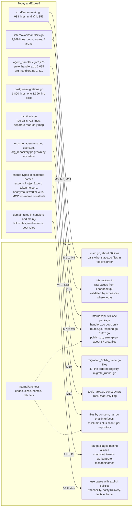
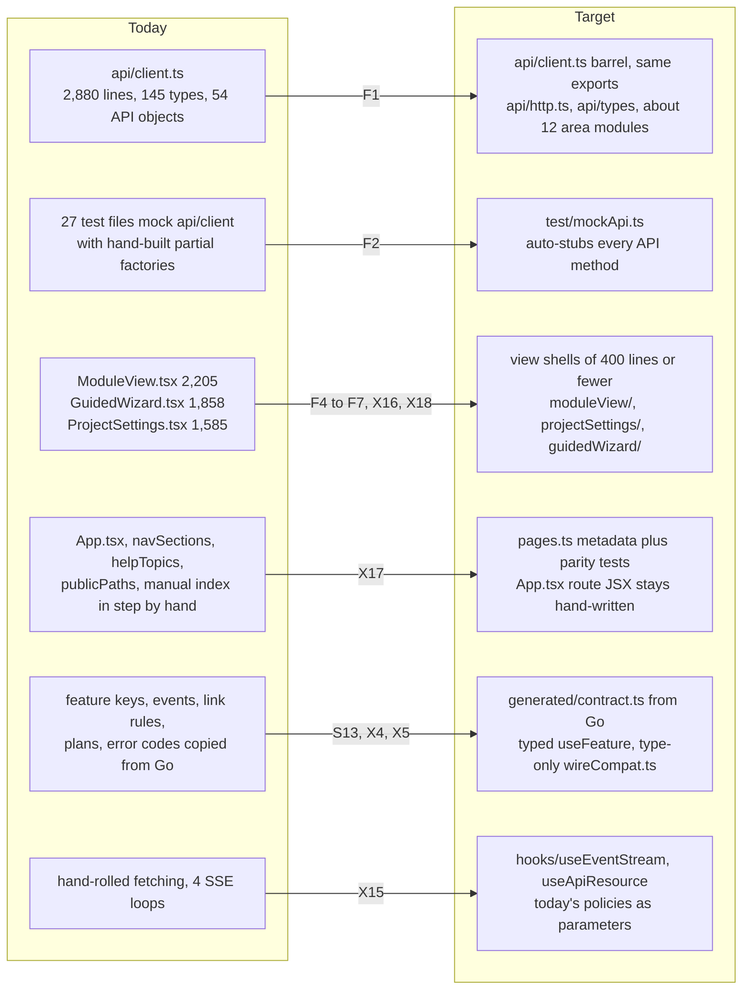
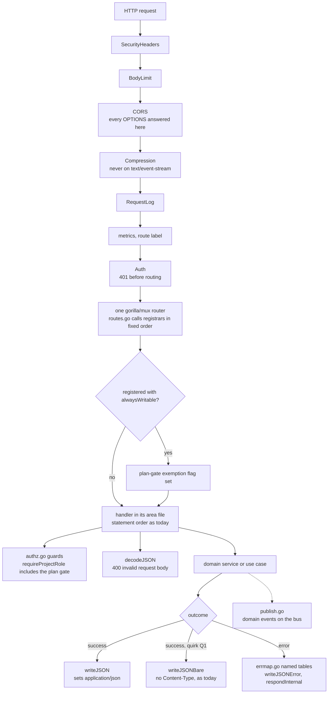
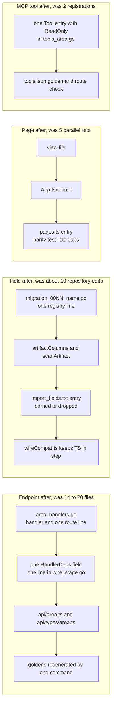
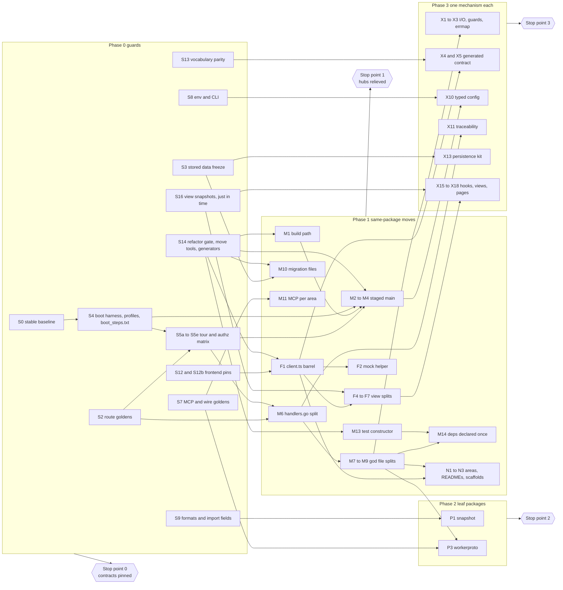
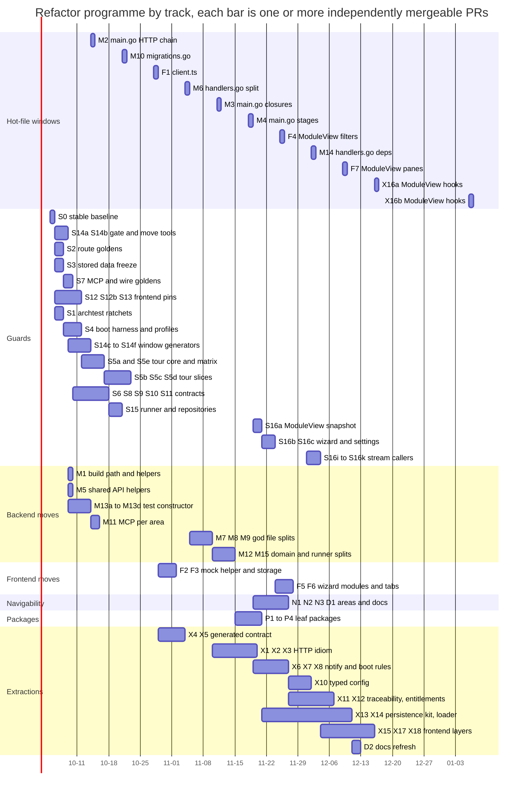

# Codebase refactor: smaller hubs, one way to do each thing, nothing users can see

Status: proposed 2026-09-25, against `master` at `d11dee8` (release 0.15.0).
Evidence base: the architecture analysis in
[`docs/assessments/2026-09-25-codebase-architecture/`](../assessments/2026-09-25-codebase-architecture/README.md).
Section marks prefixed with A (A§4.1, A§9.2, …) point into that analysis; a
bare § (§3, §6.4, …) points into this plan. Pain-point IDs such as
`api-core-1` are rows of the analysis
[register](../assessments/2026-09-25-codebase-architecture/pain-points.md).
The analysis files are [README.md](../assessments/2026-09-25-codebase-architecture/README.md)
(A§1–3), [backend.md](../assessments/2026-09-25-codebase-architecture/backend.md) (A§4),
[flows.md](../assessments/2026-09-25-codebase-architecture/flows.md) (A§5),
[frontend-data-tooling.md](../assessments/2026-09-25-codebase-architecture/frontend-data-tooling.md)
(A§6–8) and [assessment.md](../assessments/2026-09-25-codebase-architecture/assessment.md)
(A§9–10, appendices).
The plan changes nothing a person or an external program can observe. It
changes no requirement in the OpenV Platform project. The new contract
suites are recorded there as verification of existing requirements. Every
step is a pull request to `master`, and no step involves *Promote to release*.

## 1. Summary and how to use this plan

Five hub files take unrelated work:

- `internal/api/handlers.go` (3,369 lines, 80 commits);
- `cmd/server/main.go` (983 lines, 58 commits);
- `internal/persistence/postgres/migrations.go` (1,800 lines, 49 commits);
- `frontend/src/api/client.ts` (2,880 lines, 101 commits);
- `frontend/src/App.tsx` (263 lines, 21 commits).

152 of the 285 commits that change source (53%) edit at least one of them
(A§9.2). A feature-gated endpoint with UI touches 17 to 25 files, and 40 to
50% of those files are plumbing (A§9.1). Meanwhile the repository pins only
one user-facing contract, `internal/api/testdata/routes.txt` (A§9.5).

This plan runs in order:

1. **Pin.** Phase 0 pins every other contract with black-box and golden
   tests. Each guard lands just before the code it protects.
2. **Move.** Phase 1 removes the hubs as shared insertion points. It uses
   moves inside a package that tools prove identical, and it declares
   handler dependencies once.
3. **Extract leaves.** Phase 2 carves a few leaf packages out behind aliases.
4. **Consolidate.** Phase 3 gives each duplicated mechanism one home, behind
   characterization tests that merged earlier.
5. **Optional.** Phase 4 is gated by measurements.

**Risk is set by verification class, not by size.** A 3,000-line move that
`declhash` proves identical is safer than a 40-line semantic extraction.
Large mechanical moves therefore come early, and small clever changes come
late.

The whole plan is about 145 PRs and 120 to 143 dev-days, counted one PR per
sub-ID (§6.1), plus the rolling F8 splits and an optional tail. Phases 0
and 1 cost about half of that and deliver most of the reduction in
conflicts. The programme can stop at the end of any phase (§6.1).

**How to use this plan.**

- **For the maintainer.** Read §2 to §4 once.
  - Create the labels `refactor`, `refactor:move`, `refactor:test`,
    `refactor:tooling`, `refactor:script` and `behavior-change` (§8.1).
  - Create the programme's tracking issue, with one checkbox per step or
    sub-ID in §6.
  - Mark the *Refactor guard* job as required once S14b lands.
  - For the length of the programme, protect `master` and turn on *Require
    branches to be up to date before merging* for the *Backend (go vet +
    test)* check, or use a merge queue. Otherwise two green PRs, one
    tightening `internal/archtest/ratchets.json` and one adding a use of the
    removed edge or the old headroom, can merge into a red `master`.
  - Announce each hot-file window (§6.9) on the tracking issue.
  - Decide at each stop point whether to continue, and record the decision
    on the tracking issue; approving a later phase in advance is allowed.
    Nothing here asks for a release.
- **For an agent picking up the next step:**
  1. Take the first unclaimed step or sub-ID in §6 that is eligible:
     - it is not optional (S17, P5, X19, Phase 4) unless the maintainer
       asked for it;
     - every entry in its **Depends** column, and every guard step its
       **Guard** column names, is merged;
     - the maintainer has approved continuing into its phase on the
       tracking issue (Phase 0 and Phase 1 need no approval);
     - it is not a just-in-time guard (S5a–S5e, S16a–S16k) unless the step
       it guards is the next one eligible;
     - for a window step (§6.9), prepare and post the spec on the tracking
       issue, then wait until the maintainer announces the window.

     Claim it on the tracking issue.
  2. Read the step, the invariant rows it names (§3), and the notes for its
     area (§7).
  3. Branch as §8.1 says. Generate moves from their spec, never by hand.
     Run `make check-fast`, then `make check`. Before S14a lands, run
     `go vet . ./cmd/... ./internal/...` and `go test . ./cmd/... ./internal/...`,
     and in `frontend/` run `npx tsc --noEmit`, `npm run lint`, `npm test`
     and `npm run build`.
  4. Open the PR with the labels from §8.1. In the template, fill in the
     verification class of each commit and the guard step it relies on.
  5. For a guard step, do items 1–4 of §8.5 in the same PR.
  6. If a golden fails, the change is not a refactor. Stop and report; do
     not regenerate the golden. X2b's `route_guards.txt` is the one named
     exception (§8.3).
  7. Merging to `master` ends the step. Do not promote.

## 2. Goals and non-goals

| # | Goal | Measured by (§10) |
|---|---|---|
| G1 | No hub is a shared insertion point. A feature touches its own area files plus one-line registrations. | hub-touch rate falls from 53% to 25% or less |
| G2 | Every user-facing contract is pinned before the code behind it moves. | the golden list rises from 1 entry to the 20 that S14b enumerates; black-box route coverage reaches 90% or more |
| G3 | Every refactor PR is verified mechanically. A reviewer reads a spec or a class check, not a 3,000-line diff. | every refactor PR declares a class (§4.2) |
| G4 | There is one way to do each recurring thing, and a ratchet keeps it that way. | the conventions in §4.3 are each enforced by a test, a lint rule or a CI job |
| G5 | Code can be found without prior knowledge: an area index, recipes next to the code, scaffolds, and failure messages that name the fix. | every non-test file is owned by one area; every area maps to a README section; the 5 scaffolds exist |
| G6 | Domain rules move out of handlers and `main()`, keeping every per-path difference as an explicit policy. | 4 link-write paths become 1 service; 7 snapshot loaders become 1; 7 delivery copies become 1 |
| G7 | Feature work keeps flowing. There are no long-lived branches, and no freeze is longer than one announced window. | at most one hot-file move per week |

**Non-goals.**

- **No behavior change, and no bug fixes.** Quirks are pinned, named and
  kept (§3.1). Each fix is its own release-noted PR (§9.2).
- **No framework or library swap.** gorilla/mux, axios, zustand,
  react-router and Vite stay. There is no OpenAPI toolchain, no generated
  runtime client and no data-fetching library.
- **No schema change.** Migrations are never edited, reordered or
  renumbered. Moving them into files keeps the bodies byte-identical, and
  hashes prove it.
- **No physical re-org of views or components while feature work
  continues.** Frontend files move only when a god component is split. Its
  pieces go into a subfolder named after it (`views/moduleView/`,
  `views/projectSettings/`, `views/guidedWizard/`), and its pure, UI-free
  modules may go to an existing shared folder instead (`utils/`, `state/`,
  `components/wizard/`). Grouping by feature is virtual, through
  `docs/areas.json`.
- **No work on the release pipeline.** `promote-release.yml`,
  `cut-stable.yml`, `nightly-promote.yml` and `staging-smoke.yml` are out of
  scope. Verifying a change to them needs a promotion, and only the
  maintainer asks for one.
- **No timing changes.** SMTP stays on the bus goroutine and the double
  `RunFinished` publish stays. Both are behavior (services-3).

## 3. Invariants: what must not change, and what pins it

A PR labelled `refactor` leaves every row below unchanged. The last column
names the guard: an existing test, or the Phase 0 step that adds one. The
guards marked *frozen* are listed in the *Refactor guard* job (S14b). A
refactor PR may add files to a frozen path, but it may not modify or delete
them. Where an invariant depends on the environment, the guard names the
S4 profile that pins it (S4b boots one profile per setting).

| # | Invariant | Pinned at `d11dee8` | Guard |
|---|---|---|---|
| I1 | HTTP route set: 341 `METHOD PATH` pairs, plus `/metrics`, which is registered outside `RegisterRoutes` (`main.go:883`) | yes: `route_inventory_test.go`, `testdata/routes.txt` | existing (frozen) |
| I2 | Route **registration order** and handler binding. This covers the 3 same-method overlaps (`GET /agent-runs/delegate/{id}` before `{id}/tree`, `{id}/logs` and `{id}/stream`, `agent_handlers.go:49-55`) and the 9 `alwaysWritable` wrappers (`limits.go:112`). There is one router instance | no | S2 (frozen); S1 bans a second router, `Subrouter`, `PathPrefix`, `NotFoundHandler` and `MethodNotAllowedHandler` |
| I3 | Authorization outcome per route and identity: 401, 403 or 404 (existence hiding); the order of guard, lookup and decode; the plan read-only gate inside `requireProjectRole`/`requireOrgRole` | helper unit tests only | S5e matrix; S2 `route_guards.txt` (both frozen) |
| I4 | Status codes and body bytes: key order, trailing newline, HTML escaping, `null` vs `[]`. Whether `Content-Type` is present: about 158 bare encodes answer `text/plain` below 1,400 B and send no type when gzipped | partial, mostly self-referential | S5a–S5d tour, stored as normalised bytes (frozen) |
| I5 | Error envelope `{error, code}`, the 18 codes in `httperr.go`, and every message text, including the `err.Error()` passthroughs | `httperr_test.go` | existing; S5 |
| I6 | Middleware chain, outer to inner: SecurityHeaders, BodyLimit, CORS, Compression, RequestLog, metrics, Auth, router (`main.go:874-920`). Also pinned: gorilla's `404 page not found\n`, the empty 405 and the 301 path cleaning; 401 before routing on unknown protected paths; every OPTIONS answered 200 | per middleware only | S4 (frozen); M2 unit test |
| I7 | Prometheus `route` labels (mux templates, or `unmatched`) | no | S4 |
| I8 | Cookies and headers: the `openv_session` attributes; `CROSS_SITE_COOKIES` implying Secure and SameSite=None; HSTS; the security headers; `Cache-Control`, `Content-Disposition`, `X-Total-Count`, `X-Next-Cursor`, `Retry-After`; Range/206 on downloads | self-referential | S4 profiles default, `SECURE_COOKIES` and `CROSS_SITE_COOKIES` (cookies, HSTS at `main.go:917-919`); S5a; S5c re-run under those profiles |
| I9 | SSE: the 7 event names (`log`, `partial`, `status`, `message`, `assistant_partial`, `notification`, `error`) and the stream keys (bare run id, `guided:`, `interview:`, `notify:`); the stream headers (`Cache-Control: no-cache`, `X-Accel-Buffering: no`, `sse.go:127-130`) and the `: keepalive` comment | 4 of 7 | S6 (frozen) |
| I10 | Domain events: type strings, payload keys **and their Go value types**, actor strings, and the bus subscriber order hooks → notifier → budget monitor → trigger matcher (`main.go:530, 590, 595, 675`) | constants only | S5d events golden (JSON types); S6 payload Go-type golden; S4 `boot_steps.txt` (subscriber order) |
| I11 | MCP: the 31 tools' names, order, descriptions and input schemas; read-only membership and the order of `ReadOnlyToolNames()`, which is stored data (`seeds.go:38`); every request each tool sends: method, path (which id goes where), query and body; the JSON-RPC encoding | self-referential (`stdio_test.go:220-243`) | S7 (frozen) |
| I12 | Worker wire: the claim body has keys `agent`, `auth`, `run`, `run_token` (`agent_handlers.go:688-693`), and `auth` is always an object today, since `resolveRunAuth` returns a map (`:710-733`), though the runner also decodes `null`; an empty claim answers 204; start takes no body, and release sends `{"worker_id"}` (`runner/client.go:221-224`), which the server requires (`agent_handlers.go:791-797`); logs accept both body shapes; finish, logins and pool | no | S5d (server side), S7 (client side) |
| I13 | Env var names, defaults and parsing: `envOr` does not trim but notify's `envDefault` does; booleans are exact `"true"`; `envInt` requires a value above 0; `DATABASE_URL` wins, otherwise `sslmode=disable`. Per-request reads stay per request. **Where fatal checks sit relative to migrations:** `main.go:168` before connect, `:189` migrate, `:286`, `:777`, `:911`. **Cross-variable conditions:** the grandfather date is parsed only when set and not self-hosted (`:283`); the OIDC variables are read only when `OPENV_OIDC_ISSUER` is set (`:747`); billing config is fatal even when self-hosted (`:775-778`); `OPENV_MCP_TOOLS` set but empty means no tools (`mcp/tools.go:154`) | 43 `t.Setenv` spot checks | S8 inventory and parse table (frozen); S4 profiles (self-hosted, tiers on, `OPENV_REGISTRATION=closed`, `OPENV_LIMITS`, `OPENV_BUILD_SHA`, billing on) and misconfigured boots; X10 table test |
| I14 | CLI surface: `agentd`'s 12 flags, `openv-mcp`, the `openv-connector` subcommands, the `openv-vapid` output keys | partial | S8 (frozen) |
| I15 | Export, import and report formats; download filenames and media types; the ReqIF download-vs-export difference; which fields import carries over | structural | S9 (frozen) |
| I16 | Stored data: migration bodies and order; the every-boot baseline SQL; the schema after `Migrate` **and** after `MigrateAndBackfill`; snapshot JSON; proposal payload JSON; `links_snapshot`; guided `answers` keys; upload file naming | order only | S3 (frozen), S9, S5a, S16b (wizard) |
| I17 | Boot and background timing: the order of boot side effects; purge runs at start and then daily; the reaper first ticks after 30 s; `StableScheduler`, `SupportWindowWatcher` and the billing reconcile run at start; the scheduler catch-up runs synchronously before listen; `billing.Start` runs before `NewHandler` rewires billing (`handlers.go:373-379`); the root context's `stop` and `db.Close` are deferred by `main()` (`main.go:124, 183`) | no | S4 `boot_steps.txt` (AST of `main()` and `NewHandler`, frozen); the S4 boot log per profile (the billing profile for `billing.Start`); `movecheck -flatten` |
| I18 | Email and web-push content and deep links, including the bell's divergent links | substring asserts | S10 (frozen) |
| I19 | UI routes: 47 `<Route>` elements, eager vs lazy per route, the relative redirects (`App.tsx:245-246`), the query params in the S12 inventory (13 today, among them the email and Stripe deep-link params `token`, `invite`, `checkout` and `session_id`), backend-built deep links, and public paths | no | S12 (frozen) |
| I20 | CSS cascade and bundle: the eager CSS order from `index.tsx`. `ProjectList.css` defines `.button` at `:303` and is reached eagerly through `App.tsx:6`. Also the emitted CSS bytes and the lazy chunk boundaries | no | S12b |
| I21 | Screens, copy, ARIA roles, and the ids and classes e2e relies on (`#type`, `#title`, `#body`, `.measure`, `.card`, `'Search...'`, tablist roles) | 40 e2e tests (dev server) | e2e; S16 DOM snapshots |
| I22 | Browser storage keys and precedence: `openv_active_org` is read from sessionStorage, then localStorage; `openv_last_project`; `openv-theme` | scattered | S12 (frozen) |
| I23 | Every frontend call is a registered route. The export surface of `api/client` | no | S12 (frozen) |
| I24 | Go/TS vocabularies, **including today's drift** (A§9.4) | 1 of 15 pairs | S13 (frozen) |
| I25 | Release notes and feature gating as served | `TestEmbeddedNotesParse`, release-notes job | refactor PRs never touch `RELEASE_NOTES.md` or `features.go` (S14b) |
| I26 | Images and build contexts. `Dockerfile.api` copies only `go.mod`, `go.sum`, `cmd`, `internal`, `examples`, `release_notes.go` and `RELEASE_NOTES.md`. `frontend/Dockerfile.prod` copies `frontend/` only. Also `frontend/public/**`, `index.html` and `docker-entrypoint.d/**` | CI docker job | S14b protected paths; S1 build-context rule; M1 |
| I27 | Frontend serving: the nginx response headers (CSP, HSTS, `X-Frame-Options` in `frontend/security-headers.conf`); the `/api/` proxy, `gzip_types` and the `no-cache` on `sw.js` and the manifest (`frontend/nginx.conf`, `frontend/openv-nginx/**`, copied by `frontend/Dockerfile.prod:48-60`); the `/health` healthcheck (`frontend/railway.json`); and the Vite settings that shape the output (`envPrefix` `REACT_APP_` and `VITE_`, `outDir: 'build'`, `assetsInlineLimit: 0`, which keeps the CSP valid) | CI docker job (`nginx -t`) | S14b protected paths |

**Black-box guards come first.** S4 and S5 build and execute the real server
binary against a throwaway database, so no internal rewiring can fool them.
S4 boots it under a matrix of environment profiles, because cookies, HSTS,
plan tiers, self-hosted mode and billing only exist under their settings.
White-box guards (S2, S3, S4's `boot_steps.txt`, S6's payload types, S7,
S12b) pin what a black-box test cannot see: binding order, migration
bodies, boot statement order, Go value types, tool order and CSS order.

### 3.1 Quirks preserved deliberately

Each quirk below is pinned and kept. Where code expresses it, the code gives
it an honest name, and `docs/contract-quirks.md` (created in S14) lists
every one. Fixing a quirk is a separate, release-noted PR (§9.2).

| # | Quirk (where) | Pinned by, and named as |
|---|---|---|
| Q1 | About 158 JSON responses set no `Content-Type` (api-core-3, api-suite-org-8) | S5; `writeJSONBare` (X1) |
| Q2 | A mid-request delete answers 500: `artifact_repository.go:165` returns an ad hoc error, so `handlers.go:952` never matches (domain-requirements-11) | documented; X13 keeps each not-found convention |
| Q3 | Managed link edits in `PUT /artifacts/{id}` skip the FeatureFlowDown gate, emit no link events, silently skip invalid adds, and the version note lists the *requested* links (api-requirements-3) | X11a; explicit `Policy` flags in X11b |
| Q4 | `links_snapshot` is written only when at least one link remains; auto-version N is the pre-update version plus 1 | X11a |
| Q5 | `POST /api/v1/orgs` returns `release_channel ""` and `locked false`, unresolved (domain-platform-v2) | S5c |
| Q6 | The `refines` tooltip differs between Go and TS; the TS event-filter lists are subsets (fe-requirements-4) | S13 allowed-diffs; `LINK_RULE_UI_OVERRIDES` (X4) |
| Q7 | Bell deep links differ from email and push links (fe-shell-v2, services-7) | S10; the X4 fixture keeps separate `go`/`ts` expectations |
| Q8 | There are 7 `limit` parsers; events and agent-runs reset an out-of-range value to 100 (persistence-v3) | S5; named `limitPolicy` values (X3) |
| Q9 | `ErrBudgetExceeded` answers 402 on 2 launch routes, 400 on 3 and 500 on delegation (api-suite-org-7) | S5d; `launchErrs402/400/Delegate` (X3) |
| Q10 | Proposal-mode runs publish `RunFinished` twice; a queued cancel never publishes it | S5d events |
| Q11 | `NewHandler` rewires billing after `billing.Start` has launched its goroutines (boot-v1) | S4 `boot_steps.txt` (statement order) and the S4 billing profile's boot log; X12 keeps the point |
| Q12 | `FRONTEND_URL` has two fallback chains (`main.go:539, 825` vs `739, 761`), and reports read the raw `UPLOADS_DIR` (boot-3) | X10 keeps distinct fields |
| Q13 | Only `POST /api/v1/projects` enforces the project maximum (api-requirements-v1) | S5e over-plan pass under the S4 tiers-on profile |
| Q14 | Some list endpoints encode `null` for an empty list (api-suite-org-v6) | S5a |
| Q15 | An unknown protected path answers 401; OPTIONS answers 200 unlogged (boot-v4) | S4 |
| Q16 | The wizard and the notes panel build different artifact text (fe-suite-org-3) | F5 golden strings |
| Q17 | The purge list has gaps not covered by cascade (persistence-4) | S3 purge-catalog allowlist |
| Q18 | Rate-limit buckets are shared across endpoints: `authIPLimiter` is also spent by verify and reset (api-core-v2) | S5c shared-bucket probe, which exercises the real call sites (stronger than a pointer-identity test) |
| Q19 | One site says `"Invalid request body"`; 124 sites pass `err.Error()` through; 58 sites map any error to 404 | S5; `decodeJSONMsg`; untouched call sites |
| Q20 | Inline `err.response?.data?.error \|\| err.message` renders string bodies differently from `apiErrorMessage` (fe-suite-org-7) | `legacyErrorText` (X15) |
| Q21 | Four SSE reconnect policies (fe-shell-9) | S6; named `useEventStream` policies (X15) |
| Q22 | Token redaction applies only to the access log (api-core-v3) | untouched; the security fix is a separate PR |

## 4. Principles and conventions

### 4.1 Rules every refactor PR follows

| Rule | Meaning |
|---|---|
| **R1 Guard before move** | No code moves until the guard that would catch a change to it is on `master`. Guards land *just in time*: the cheap, broad ones in weeks 1–2, and each tour slice or view snapshot right before the PR that moves that area. Each PR names its guard step, and a step's **Depends** always includes every guard step its Guard column names. A characterization test is its own earlier PR, never part of the PR that changes the code. |
| **R2 Declare a class** | Every refactor commit declares one verification class (§4.2) in a `Refactor-Class:` trailer. A step with two classes lands as one commit per class, and the PR carries each class's label (§8.1). Class E is never mixed with another class. The class decides the mechanical check and what the reviewer reads. |
| **R3 Golden freeze** | A `refactor` PR changes no behavior golden, and no guard code outside its class C or T commits. If a golden must change, the PR is not a refactor (X2b's `route_guards.txt` is the one named exception, §8.3): it drops the label and carries a release note or the maintainer's `behavior-change` label. |
| **R4 Regenerate, don't rebase** | A move PR is produced by a committed script from a spec keyed by **declaration name** (`internal/tools/declmove/specs/<step>.json`), or by the S14c–S14f generator for M4, M10, M11a and F1. When `master` moves, the author re-runs the script. Nobody hand-resolves a move conflict. |
| **R5 One move per hot file** | Each hot file is relocated by one generated PR, merged within an announced window of about two hours. There is at most one hot-file move per week (§6.9). |
| **R6 Ratchets with headroom** | Each new convention ships with a counter that may only fall. A grandfathered giant gets a ceiling of today's size plus 10% (at most 150 lines), so feature PRs are never blocked. Refactor PRs may not raise a ceiling. |
| **R7 Name quirks, don't fix them** | See §3.1. A bug found during a refactor gets its own labelled bug-fix PR. |
| **R8 Types keep their names** | A moved or aliased Go type keeps its type name, so `encoding/json`'s field errors (`Go struct field ProjectExport.x of type …`) keep their text. Its top-level error (`Go value of type exports.ProjectExport`) prints the package-qualified `reflect` name, which a move to `snapshot` or `workerproto` does change. That is safe only while those errors reach logs, not responses, as today: `respondInternal` at `baseline_diff_handlers.go:42` and `ai_map_handlers.go:41`; the helper `projectExport` (`suite_handlers.go:106`), whose callers log the error; the export service's `ImportProject` and `ImportProjectWithOverrides`, which decode in `exports` and whose calls at `handlers.go:1892` and `:2168` answer through `respondInternal`; and the report service's `GenerateProjectReport`, `GenerateProjectReportDOCX` and `GenerateVVReport` (`handlers.go:1959, 1962`, `suite_handlers.go:661`), which answer the same way. An S1 rule fails if a handler writes `err.Error()` from a JSON decode into a type on the alias list, directly or through a helper or domain function on its `decodeErrorSources` list (P1 adds `ProjectExport` with those six names, P3 `FinishRequest`, X14a `snapshot.Load`). The rule cannot follow `GenerateReport`, which assigns the error inside a `switch` case and tests it after the switch, so that site keeps its fixed message by review. |
| **R9 Order is behavior** | Route registration, boot side effects, bus subscribers, MCP tools and migrations keep their order. Goldens pin each of them. |
| **R10 Wire-shape rules** | When a map or anonymous body becomes a named type: fields are declared in the map's alphabetical key order; `omitempty` is used only where the key was omitted conditionally; Go value types stay the same (pointers stay pointers, so `null` survives); embedded structs stay embedded; `json.NewEncoder` stays. A `bytes.Equal` old-vs-new test ships with each extraction. |
| **R11 Strictly better after every PR** | Shims (aliases, the barrel, wrappers) are harmless if they stay forever. No PR leaves two conventions without a ratchet. |

### 4.2 Verification classes

| Class | What changes | Mechanical check | Reviewer reads |
|---|---|---|---|
| **A pure move** | Declarations move between files of one Go package, or TS modules move. Only import blocks change. | `declhash` is equal on base and head (every package-level declaration, hashed through `go/printer`), checked per commit. `movecheck` prints the function-to-file map. For TS, `tsmovecheck` allows diffs only in import declarations. | the spec |
| **B extract in place** | A closure becomes a named function, JSX becomes a props-only component, route lines become a registrar, migration closures become named functions (M10), the `Tools()` literal becomes constructors (M11a), or `main()` becomes stages. Each is called at the same position. | `git diff --color-moved=zebra --color-moved-ws=allow-indentation-change` shows only moved blocks and call sites. `movecheck -flatten main` for boot. Ordered goldens are unchanged; for M10 and M11a the S3 hashes and the S7 golden are the proof. | call sites and parameters |
| **C test only** | `*_test.go`, `*.test.ts(x)` and `*_test.py` files, and new files under `testdata/`, `__snapshots__/` or `contracts/` | the job fails if any other file changed (label `refactor:test`) | assertions are unchanged |
| **T tooling** | CI workflows, the `Makefile`, lint config, the PR template, docs, and files under `internal/tools/`, `internal/archtest/`, `internal/contract/`, `scripts/`, `frontend/scripts/` and `frontend/src/generated/`; also TS that the build erases (X5's type-only assertions) | the job fails if any other production file changed; for TS, S12b's base-vs-head build shows identical `build/assets/*.js` and `*.css` (label `refactor:tooling`) | the tool and its test |
| **R scripted rewrite** | A committed script renames identifiers or rewrites statements across files (M14). | the job re-runs the script on base and requires the result to equal head byte for byte; all tests pass (label `refactor:script`) | the script and its rules |
| **D package move** | A declaration moves to a new leaf package, and the old name stays as an alias or wrapper. | compiles; goldens unchanged; `ratchets.json` only shrinks, except the `import_edges` entries of the package the commit creates: edges into it, and edges out of it only to packages its declarations' old package imports (P1's `snapshot` imports five of the packages `exports` imports; a leaf such as P3's `workerproto` imports no package of this module); the new package still passes K7 | the alias list |
| **E semantic extraction** | Logic moves across layers. | Characterization tests for exactly this logic merged in an earlier PR and are unchanged. | everything; two reviewers, one of them the maintainer |

### 4.3 One way to do X, and what enforces it

| # | Convention | Enforced by |
|---|---|---|
| K1 | `internal/api` holds one area per file: `<area>_handlers.go` contains that area's handlers and its `register<Area>Routes`. `routes.go` contains only the ordered registrar list. `HandleFunc` appears only in registrars. | S2 ordered golden; S1 AST rule (count ratchet) |
| K2 | One router instance: one `mux.NewRouter()`, in `cmd/server`, and no `http.NewServeMux`, `Subrouter`, `PathPrefix` or custom 404/405 handlers. | S1 ban, keyed on the package, so M4 may move the call into a `wire_<stage>.go` |
| K3 | Cross-file HTTP helpers each have one home: `respond.go` (JSON in and out), `httperr.go` (error writers), `errmap.go` (per-area error tables), `authz.go` (every `require*`), `publish.go`, `cookies.go`, `middleware_*.go`. | S1 `require*`-outside-`authz.go` ratchet (guards); M5 adds an archtest rule: an unexported function or method declared in a `*_handlers.go` file and referenced from another non-test file in `internal/api` fails, excluding `register*Routes` (K1), with an allowlist that may only shrink |
| K4 | JSON is written through `writeJSON` or `writeJSONBare`, and bodies are read through `decodeJSON`. SSE writes stay as they are. | archtest counters (249 → 0, 106 → 1) |
| K5 | A handler dependency is declared once: one `HandlerDeps` field plus one line in its `wire_*.go` stage. Derived values stay private. | M14 archtest rule forbidding reads of raw `h.FrontendURL`, `h.SecureCookies` and `h.CrossSiteCookies` outside `handlers.go` |
| K6 | Tests build handlers with `newTestHandler` and share fakes from `testkit_test.go`. Fakes embed their interface or a narrow role interface. | `&Handler{` ratchet over test files other than `testkit_test.go`: 137 → 0 (`NewHandler`'s own literal and `newTestHandler`'s are outside the count) |
| K7 | Layering: domain imports only domain packages and the types-only leaves (`internal/workerproto`), never api, persistence or app services; a leaf imports no package of this module; persistence imports domain only; api does not import persistence; client binaries' domain imports only shrink. | S1 layering rule and edge list (227 edges; only shrinks, apart from a class D package's own edges, §4.2) |
| K8 | `main.go` only sequences stages. Env vars are read only in `internal/config` and `cmd/*/config.go`, apart from the exemptions S8 lists with a reason: the per-request reads, `OPENV_MCP_TOOLS` (a set-but-empty value means no tools, so it needs `LookupEnv`), and the runner's per-run reads. | S1 env-placement ratchet; S8 inventory |
| K9 | Migrations: one `migration_00NN_<name>.go` per version plus one line in the explicit, ordered registry. There is no `init()` anywhere. | S3 hashes; `TestRegistryIsOrderedWithoutDB`; S1 `init()` ban |
| K10 | An MCP tool is one `Tool{…, ReadOnly}` entry in `tools_<area>.go`. The read-only list is derived from those entries. | S7 golden |
| K11 | Go is the source of each cross-language vocabulary. TS reads `src/generated/contract.ts` (checked in) plus named UI overrides. | staleness test (`UPDATE_CONTRACTS=1`); S13 parity |
| K12 | Frontend endpoints live in `src/api/<area>.ts`. Code outside `src/api` imports only four entry points: the `api/client` barrel, `api/errors`, `api/baseURL` and `api/contentDisposition`. Tests mock the barrel through `test/mockApi.ts`. | ESLint `no-restricted-imports`; S12 surface snapshot |
| K13 | `App.tsx` route JSX stays hand-written. `pages.ts` carries page metadata, and parity tests keep the two in step. | parity tests; S12 route tree; S12b CSS order |
| K14 | Size budgets: new Go files ≤ 800 lines and functions ≤ 100; new TS files ≤ 600 lines and components ≤ 300. Grandfathered ceilings only fall. | S1 and S12b tests; ESLint `max-lines` |
| K15 | Every file belongs to exactly one area in `docs/areas.json`. The area README holds recipes and guard commands, mapped at glob level with no per-file rows. | N1 ownership test |
| K16 | Goldens regenerate with one command, which the failure message names: `UPDATE_ROUTES=1 go test ./internal/api -count=1 -v -run 'TestRouteInventory\|TestRouteBinding'` for the four route goldens, logging each file it writes; `UPDATE_GOLDEN=1 go test ./internal/mcp ./internal/runner -run <Test>` for S7's, where only the value `1` regenerates and any other compares; `UPDATE_CONTRACTS=1`; `vitest -u`. They are regenerated only in behavior-changing PRs, apart from X2b's `route_guards.txt` (§8.3). Vitest goldens are file snapshots under `__snapshots__/`, never inline snapshots. | S14b guard job |

### 4.4 Decisions where the candidate plans disagreed

Four candidate plans were judged for three things: behavior risk,
editability payoff and feasibility. This plan takes the risk-first
structure, adds the editability and contract steps, and settles the
disagreements as follows.

| Question | Decision | Why |
|---|---|---|
| Vertical module packages, or splits inside the package? | Split inside the package. API subpackages are optional, in Phase 4, behind a go/no-go metric. | Most of the payoff with the least churn. Moving out of `package api` would also need an exported test kit: 48 fake types and about 60 calls to unexported methods live in package-api tests. |
| Split a hot file in several area PRs, or in one? | One generated PR per hot file. | Each move is a conflict event for every in-flight branch. |
| Group `main()` stages by module, or keep contiguous line ranges? | Contiguous ranges in today's order, in files `wire_<stage>.go`. | Regrouping reorders constructors and bus subscribers. |
| A declarative background-job table? | No. Loops become named functions started at the same statement. | A generic runner rewrites first-run timing (I17). |
| Build `newTestHandler` through `NewHandler`, or from `&Handler{}`? | From `&Handler{}` plus options (M13), exactly like today's literals. After M14 the options set the embedded `HandlerDeps`. | Keeps nil limiters and zero derived values, reads no env, and never rewires billing. `NewHandler` would do all three. |
| When is "deps declared once" done? | Phase 1 (M14), right after the splits. | It is the most frequent hub edit. |
| Derive `App.tsx` from `pages.ts`? | No. Metadata plus parity tests only. | Derivation risks the eager/lazy split, the CSS cascade (I20) and the relative redirects. |
| Drive importers of the barrel to zero? | No. Barrel-only imports, enforced by ESLint, plus an auto-stub mock helper. | The 27 whole-module `vi.mock` sites must keep intercepting. |
| Codemod `mux.Vars` to `PathVar`, convert errors to `errRule` tables, and declare routes as data? | None of the three. Use named byte-identical I/O helpers, co-locate the error writers, and name the quirk tables. | Cosmetic, or it rewrites the least-tested error branches. |
| `type ProjectExport = snapshot.Project`? | No. The type keeps the name `ProjectExport` (R8). | It would change the text of JSON error messages. |
| Pin `alwaysWritable` by editing production code in Phase 0? | No. Resolve the wrapped handler from the AST. | Phase 0 changes no production code. |
| Refactor gate on the `no-release-notes` label? | No. The *Refactor guard* job runs on every PR: a diff to a listed golden needs a release-note bullet or the maintainer's `behavior-change` label, and `refactor*` PRs also get the class checks. | Test-only PRs that extend a golden also carry `no-release-notes`, and a mislabelled refactor must not be able to edit goldens. |
| Per-file README maps checked by a test? | No. Glob-level maps from `areas.json`. | Per-file maps would become a new hub that every feature PR edits. |

## 5. Target architecture

The target is deliberately modest. The frameworks, the packages and the
`Handler` type all stay. What changes is where code lives, what may import
what, and how many shared places one change must touch. A§4 of the analysis
describes the backend as it is; A§6 describes the frontend.

### 5.1 Backend: before and after

- **`cmd/server`.** `main()` becomes a sequence of stage calls. Each stage
  is a contiguous range of today's `main()` moved verbatim into its own
  `wire_<stage>.go`, with locals becoming fields of one `app` struct:
  `wire_config.go` (119–177), `wire_storage.go` (178–236), `wire_core.go`,
  `wire_workspace.go`, `wire_projects.go`, `wire_agents.go`,
  `wire_realtime.go`, `wire_notify.go` (532–651), `wire_jobs.go` (652–730),
  `wire_sso.go`, `wire_http.go` (765–941). Each stage function is at most
  100 lines (K14; a new function cannot be grandfathered). A range longer
  than that is split into consecutive stage functions in the same file,
  called in order: `wire_notify.go` (532–651) holds two, and `wire_http.go`
  three, for billing (765–795), handler construction (797–872) and server
  setup (874–941). The listen goroutine and the serve-and-shutdown `select`
  (943–969), with its `defer cancel()` at `:962`, stay in `main()`. New
  wiring lands in the stage that owns its concern. Every `defer` stays in
  `main()`: a stage that opens a resource returns its cleanup function
  (`stop` from `signal.NotifyContext` at `main.go:124`, `db.Close` at
  `:183`), and `main()` defers it at the same point, so nothing is closed or
  cancelled when a stage returns.
- **`internal/api`.** `handlers.go` loses everything but the dependencies:
  - `handlers.go` keeps its name but only `HandlerDeps`, `Handler` (which
    embeds `HandlerDeps` after M14) and `NewHandler`, so in-flight dependency
    edits still apply cleanly.
  - `routes.go` holds `RegisterRoutes` as an ordered list of registrar
    calls, keeping today's interleaving (`handlers.go:421-512`).
  - About 40 new `<area>_handlers.go` files follow the existing section
    markers, for about 67 area handler files in all (30 today).
    `agent_handlers.go` has 10 markers, `suite_handlers.go` 9 and
    `org_handlers.go` 10.
- **Unchanged:** the single gorilla/mux router, the middleware order, the
  `Handler` method set, every exported name and JSON tag, every SQL string
  and the migration ledger.

### 5.2 Frontend: before and after

- **Imports.** Consumers keep importing the barrel `api/client`, and ESLint
  enforces it. The 126 importers do not change, and the whole-module mocks
  keep intercepting.
- **Split views.** A split view keeps its path and export name, so the lazy
  `import('./views/ModuleView')` stays valid. Its pieces live in a subfolder
  named after it.
- **Eager imports.** The eager import graph from `index.tsx` keeps its order,
  so `ProjectList.css` still overrides `.button` app-wide (I20).

### 5.3 The request path through the handler idiom

The diagram shows the target path. Existing handlers keep **their own
statement order**, because that order decides which status wins:
`CreateArtifact` decodes before it authorizes, and `LaunchAgentRun` looks up
before it decodes. The helpers replace statements one for one.

### 5.4 Recipes: files touched before and after

The "today" column comes from the recipes in A§9.1.

| Recipe | Today (A§9.1) | After Phase 1 | After Phase 3 |
|---|---|---|---|
| (a) Gated endpoint and UI | 14–20 files: 4 edits in `handlers.go`, the `main.go` literal, `client.ts`, `routes.txt`, `features.go`, a TS feature const, `phone-audit.js` | the area handler file and 1 route line in its registrar; 1 `HandlerDeps` field and 1 line in `wire_<stage>.go`; `api/<area>.ts` and `api/types/<area>.ts`; goldens regenerated by command; `scaffold api-area` | plus a typed `FeatureKey` from the generated contract, so the phone-audit key is checked |
| (b) Field on an entity | about 10 edits in `artifact_repository.go` (6 SELECTs, 2 INSERTs, 2 Scans), and the import mapper silently drops the new field (`export.go:679-697`) | a migration file plus 1 registry line (`scaffold migration`; the repository edit has no scaffold); S9's `import_fields.txt` fails until the field is marked carried or dropped | `artifactColumns` plus `scanArtifact` (2 edits); `wireCompat.ts` fails `tsc` until the TS type agrees |
| (c) Domain area | 4 edits in `handlers.go`, plus `main.go`, `App.tsx`, `ProjectLayout.tsx` and `client.ts` | new files, plus 1 line each in `routes.go`, a `wire_<stage>.go`, the `client.ts` barrel and `docs/areas.json` | plus 1 `pages.ts` entry for its pages |
| (d) MCP tool | `Tools()` (718 lines), a separate `readOnlyTools` map (`tools.go:168`) and tests; a read tool left out of the map becomes a writer | 1 `Tool` entry with `ReadOnly` in `tools_<area>.go`; the golden and the path check name what is missing; `scaffold mcp-tool` | same |
| (e) UI page | `App.tsx`, `navSections`, `helpTopics`, the `manual/index.ts` entry and `publicPaths` kept in step by memory | unchanged | the `App.tsx` route plus 1 `pages.ts` entry; parity tests list anything missing; `scaffold page` |
| Migration | append a closure inside a 1,396-line slice; at least 9 renumbering merges | `scaffold migration <name>` writes the file and its 1 registry line; a version clash is a 1-line textual conflict | same |

## 6. Roadmap

### 6.1 Phases, effort and stop points

| Phase | Steps | PRs | Dev-days | If the programme stops here, you have |
|---|---|---:|---:|---|
| **0 Safety net** (classes C and T; no production code) | S0–S16 (S17 optional) | about 28, plus 11 just-in-time S16 PRs | 32–38 | **Stop point 0,** a milestone rather than a gate: Phase 1 moves start as soon as their own guards are merged. Reached once S0–S15 are merged. Every contract in §3 is pinned except the per-view DOM snapshots (S16a–S16k), which land right before each view is touched. The golden list grows from 1 entry to the 20 that S14b enumerates. The flaky test is fixed; the pgvector tests run on their own CI leg while the no-vector leg stays. The authorization matrix and the env-profile matrix exist, and the refactor gate, move tools and window generators work. OpenV records verification for the requirements §8.5 maps. The `pre-refactor` baseline is captured earlier, before the first M or F step merges. |
| **1 Same-package moves** (classes A, B, C, R, T; E for M15b) | M1–M15, F1–F7, N1–N3, D1 (F8 rolling) | about 38, plus about 6 rolling F8 PRs | 27–32 | **Stop point 1.** No hub is a shared insertion point: `handlers.go` holds deps only, `main()` is about 60 lines, migrations are one per file, and `client.ts` is a barrel. A dependency is declared in 2 places, not 4. Tests use one constructor and one mock helper. Every non-test file has an area, every area maps to a README section, and 4 of the 5 scaffolds exist (`scaffold page` arrives with X17). The hub-touch rate is expected to fall below 30%. |
| **2 Leaf packages** (class D, with C first for P2a and P4a, and a T commit first in P1 and P3) | P1–P4 (P5 optional) | 6 | 6–8 | **Stop point 2.** The domain context graph has no cycles. The worker wire has named types, and `agentd` links fewer server packages. |
| **3 One mechanism per concern** (mostly class E) | X1–X18, D2 (X19 optional) | about 63 | 55–65 | **Stop point 3.** Domain rules are out of handlers and `main()`. Config is typed. The Go→TS contract is generated and checked. Helpers, delivery, snapshot loading and link writes each exist once. The hot views are shells. |
| **4 Optional, gated** | O1–O3 | about 6 | 10–15 | API subpackages for clean areas, and the remaining sagas. Undertaken only if the §6.8 gate says so. |

That is about 145 PRs and 120 to 143 dev-days before the optional tail and
the rolling F8 splits. The counts take one PR per sub-ID: X1 is one N1 area
per PR (8), X13 one repository per PR (20), X15 one stream caller per PR,
and each class E step's characterization is its own earlier PR. When the
maintainer prefers fewer staging rebuilds, two to four commits of the same
class may share one PR, provided each commit is verifiable on its own
(§8.1). **Most of the conflict reduction arrives at stop point 1, at about
half of the effort.**

### 6.2 What gates what

### 6.3 Indicative schedule

The tracks run in parallel. The dates are illustrative; merge windows and
feature work decide the real cadence. The hot-file windows (§6.9) are
serialised at one a week, so the 11 windows alone span at least 11 weeks.
The schedule assumes the maintainer approves each later phase in advance;
without that, each phase starts at its stop point.

Each step below gives its size (S up to about a day, M two to three days,
L up to five days, split where possible), its verification class (§4.2),
and whether it can run in parallel with feature work. "Window" means that
the step is a hot-file move landed in an announced window (§6.9).

A step that takes several PRs gives each PR a sub-ID (S14a, S16c, X13f),
which is also its branch and checkbox. **Depends** names exact sub-IDs, and
it always includes every guard step named in the **Guard · done when**
column. Every row states a checkable done-when in that column, after the
`·` where the column also lists guards.

### 6.4 Phase 0: safety net

This phase changes no production code. Guards land in the order in which
they unblock moves:

- **Weeks 1–2:** the cheap, broad guards (S0, S1, S2, S3, S7, S14a, S14b).
  With their generators (S14d, S14e) these unblock the early wins M1, M5,
  M10, M11 and M13. Capture the OpenV
  baseline `pre-refactor` once they are merged and before the first M or F
  step merges.
- **Just before their step:** the tour slices, the window generators and
  the view snapshots, each landing right before the step that uses it.
- **Every guard PR:** records its test case and test run in OpenV where §8.5
  maps it.

| Step | Size · class · parallel | What changes (files) | Guard · done when | Depends | Resolves |
|---|---|---|---|---|---|
| **S0** Stable baseline | S · C then T (one commit each) · yes | Fix the flaky `TestReInvitingResendsWhenTheFirstMailNeverLanded` (`registration_invitation_test.go:1569`). It waits on `mailer.sent`, which the test mailer's `Send` signals (`email_verification_handlers_test.go:82-89`) before the sending goroutine calls the fake `MarkEmailed` (`registration_invitation_test.go:84`), and then asserts the stamp; it waits instead on a channel that the fake `MarkEmailed` signals. Keep the `postgres:15` service (`ci.yml:29`), which matches the compose default `postgres:15-alpine` (`docker-compose.yml:3`) with no vector extension, and add a second backend leg on `pgvector/pgvector:pg15` for the Postgres tests. Move the *Release notes* job into its own `release-notes.yml` that also runs on `labeled` and `unlabeled`, so a label added after a PR opens re-runs the check (every refactor PR is labelled after opening). The check reads the base copy of `RELEASE_NOTES.md` from the first parent of the merge commit it checks out (`HEAD^1`), the base GitHub merged the PR onto, not from the event's `base.sha`, which can be older and would count another PR's bullet as this one's; an S0 follow-up reads the labels from the API when the job runs, not from the triggering event | `-count=400 -cpu 1,2` green · two CI runs green without re-runs; on the pgvector leg the 4 vector tests run; on the plain leg the 2 no-vector tests (`TestVectorReconcileNoopWhenExtensionAbsent`, `TestNearestByEmbeddingVectorUnavailable`) and the no-vector branch of `TestMigrateArtifactEmbeddings` still run | – | persistence-11 (vector part) |
| **S1** Go architecture ratchets | M · T · yes | New test-only `internal/archtest`. **Frozen:** the 227 internal import edges (they only shrink, apart from a class D package's own edges, §4.2); K7, with `internal/workerproto` (P3) as a types-only leaf that domain code may import and that imports no package of this module (`typesLeaves` in `graph_test.go`; a further leaf joins it in a class T commit); K14 with R6 headroom; the domain packages each client binary links (`client_domain_deps`), where a new binary under `cmd/` fails until its entry is added by hand in review, an architecture decision for a feature PR, never for a refactor PR. **Bans:** `init()`, side-effecting package vars; a second router: any `http.NewServeMux()`, and `mux.NewRouter()` outside `cmd/server` or more than once in it (keyed on the package, so M4 may move the call into a `wire_<stage>.go`); `Subrouter`, `PathPrefix`, custom 404/405 handlers. **Ratchets:** `HandleFunc` outside registrars (53, counting builder-form routes, a one-argument `.HandlerFunc` or `.Handler` that ends a call chain); `&Handler{` in test files other than `testkit_test.go` (137 in 60 files; `NewHandler`'s literal is outside the count); raw encodes (249); `"invalid request body"` literals (106); `require*` outside `authz.go` (10); direct env reads under `internal/` (every reference, call or function value, to `os.Getenv`, `os.LookupEnv`, `os.ExpandEnv`, `os.Environ`, `syscall.Getenv` or `syscall.Environ`; S1 computes and prints the baseline, 39 `Getenv`/`LookupEnv` calls on 38 lines and 44 calls with `Environ` at `d11dee8`). **Rules:** a handler may not write `err.Error()` from a JSON decode into a type on the alias list, directly or through a helper or domain function named in `decodeErrorSources` (R8; both lists are in `internal/archtest/decode_test.go`, outside `ratchets.json`, so adding to them is not a raised ratchet; P1, P3 and X14a add entries in class T commits). **Build context:** every package linked into a Go target of `Dockerfile.api` or `Dockerfile.worker`, and every `//go:embed` pattern, lies inside that Dockerfile's COPY list; a linked package outside the root package, `cmd/` and `internal/` fails whatever the COPY list says, so adding to COPY is a remedy only for root files and embedded assets. Counts, ceilings, allowlists and the edge list live in one non-frozen file, `internal/archtest/ratchets.json`, which `UPDATE_RATCHETS=1 go test ./internal/archtest` only tightens; in a `refactor*` PR, S14b refuses a raised or added entry, apart from the exceptions it lists, and a file left loose. Failures name the rule, the allowlist, the regenerate command and the README section | itself · a domain → `internal/api` import fails with that message | – | boot-v5, api-suite-org-17 (frozen), tooling-15 (part) |
| **S2** Route binding, overlap and guard goldens | S · C · yes | `internal/api/route_binding_test.go`, with its guard reader in `route_binding_guards_test.go`, writes three frozen goldens. `route_handlers.txt`: routes in **registration order**, as `METHOD PATH -> Name [alwaysWritable]`; short names via `runtime.FuncForPC`; the 9 `alwaysWritable` closures resolved from the registration AST, with no production edit. `route_overlaps.txt`: for each same-method template pair, a synthesised path and the handler `router.Match` picks (3 today). `route_guards.txt`: per route, one entry per `require*` call its handler visibly makes, directly or through one helper, in call order, with roles mapped to canonical guard kinds; a kind called twice appears twice (`POST /api/v1/auth/verify-email/change: json-body, json-body`), and inline checks such as `CurrentUser(r) == nil` are not recorded. The test also fails when a `require*` call's result does not stop the caller: the result must be the condition of an `if` whose body ends in `return` (seen through `!`, parentheses, `\|\|`, `&&` and a comparison with `nil`), a `return` operand, or a name for the helper's last result that such an `if` tests at once. One command regenerates all four route goldens, `routes.txt` included, and logs each file it writes: `UPDATE_ROUTES=1 go test ./internal/api -count=1 -v -run 'TestRouteInventory\|TestRouteBinding'`; every route-golden failure names it. A `route_guards.txt` change is either an authorization change or a change of call shape only; S2 cannot tell the two apart, and the unchanged S5e matrix is the behavior proof (§8.3) | the PR shows these mutations failing: `delegate/{id}` moved below `{id}/tree`; `alwaysWritable` dropped at `handlers.go:427`; the condition at `agent_handlers.go:2168` replaced by `false` (the crews and teams runs lose their trailing `project:editor`); `email_verification_handlers.go:93-95` removed (`verify-email/change` drops to one `json-body`); a bare `h.requireProjectRole(...)` at `handlers.go:983`, and the same `if` without its `return`; the `if !ok` body after `requireHumanUser` at `notification_handlers.go:121` emptied | – | api-core-v7, api-suite-org-15 (part), api-core-13 (part) · OpenV REQ-143 |
| **S3** Stored-data freeze | M · C · yes | `migration_freeze_test.go` has four parts. (a) Append-only per-version `sha256(Version, Name, go/printer(body))`; the body is the closure or the named function, and every package-level declaration it references, functions, consts and vars alike, is hashed transitively (`backfillRefPrefix` at `migrations.go:1465`; `embeddingDimensions` at `:1522`, which migration 0016 uses at `:465`). (b) A hash of the every-boot SQL and the runner, with their references: the baseline in `InitSchema` and `schema_*.go`, `createLedgerSQL` (`:1564`), `reconcileGuardedExtensions` and `reconcileVectorEmbeddings` (`:1628-1700`), `applyOnce` (`:1751`) and `Migrate`/`MigrateAndBackfill`. (c) DB-gated schema goldens after `Migrate` and after `MigrateAndBackfill` with a seeded user, on both S0 CI legs (with and without pgvector). (d) A purge catalogue: every table with an `org_id`, `project_id` or `artifact_id` column is in `PurgeOrg`'s list (`org_repository.go:602-623`), is reached by cascade, or is on a gap allowlist (Q17) | editing one character of a shipped migration fails; appending one passes | S0 | persistence-v1, persistence-4, persistence-2 (frozen), persistence-v2 (part), persistence-1 (guard) · OpenV REQ-89 |
| **S4** Black-box boot and middleware harness | 2×M · C · yes | **S4a:** DB-gated `cmd/server/{harness,boot_smoke}_test.go`. It runs `go build -cover ./cmd/server` and execs the binary on a fresh DB (temporary directories; repo root as cwd; no SMTP, VAPID or SSO). It probes `/health` against `/api/v1/public/build`; an allowed and a refused preflight; security headers on 200, 401 and 413; the body cap and its multipart exemption; gzip at 1,400 B or more but never on `text/event-stream`; 401 before routing; the mux 404 text, empty 405 and 301; `/metrics` with and without its token; the route-label set; the boot log sequence; and a SIGTERM drain. S4a also writes `cmd/server/testdata/boot_steps.txt` from the AST, not from labels: the ordered call statements of `main()` and of `api.NewHandler` (callee and receiver type; every `Subscribe`, `AddSubscriber`, `Set*`, `Start`, `go` and `defer` statement), with `a.<stage>()` calls inlined from `wire_*.go`, so that M4 leaves it byte-identical and any later move of such a call fails it. **S4b:** the same probes under a matrix of env profiles, one golden each: default; `SECURE_COOKIES=true`; `CROSS_SITE_COOKIES=true`; `OPENV_SELF_HOSTED=true`; tiers on (a valid `OPENV_BILLING_GRANDFATHER_BEFORE`); `OPENV_REGISTRATION=closed`; `OPENV_LIMITS` set; `OPENV_BUILD_SHA` set (`/health` then shows `commit`); billing on (a test key, with `HTTPS_PROXY` pointed at a closed local port so that no request leaves the machine). Plus one misconfigured boot per fatal (`OPENV_LIMITS`, grandfather date, billing, `CORS_ORIGIN`), recording the exit message and whether migrations ran first, and one boot that must still come up: self-hosted with a malformed grandfather date | new goldens · each profile green twice in a row; the default profile under 60 s | S0 | boot-10, api-core-9, boot-v4 (pinned), boot-v1 (pinned), services-3 (order pinned) · OpenV REQ-18, REQ-87, REQ-114, REQ-169 |
| **S5a–S5e** API tour and authorization matrix | L + 4×M · C · just in time | Per request, `cmd/server/testdata/tour/<slice>.json` records the status, whether `Content-Type` is present (including the gzip variant), the I8 headers, and the body **as bytes**: UUIDs and timestamps are replaced by regex tokens on the raw body, so key order, the trailing newline and HTML escaping survive, and a parsed view is stored beside it as the readable diff (`null` ≠ `[]`). After each write group it records `GET /api/v1/events` (type, actor, payload key → JSON type). S5c re-runs its cookie, registration and billing requests under the S4b profiles that change them, and S5e runs its over-plan pass under the tiers-on and self-hosted profiles. **S5a** requirements core, before M6: projects, artifacts, links including managed edits, review, baselines, templates, attachments with a Range request, chatter, search, share links, and every export, import, report and `/download/*` format. **S5b** V&V and suite, before M8. **S5c** identity and workspace, before M9, including Q5 and the shared-bucket probe (Q18). **S5d** agents and the worker wire, before M3 and M7: claim bytes (with `auth` as an object, as the server writes it; the client's tolerance of `null` is S7's) and the 204, start, both log shapes, finish, release, delegation, the first SSE events, the run-now copy, the proposal apply order, and the `/teams` aliases. **S5e** matrix, before M6: every route × {anonymous, viewer, editor, owner, other-workspace member, worker key, run token} with phantom UUIDs, recording status and `code`; then a GET pass with real ids, and an over-plan pass that pins the 9 `alwaysWritable` exemptions by behavior and shows export and import still working on a read-only workspace | new goldens · `coverage.txt` ≥ 90% of the 341 routes; two runs identical | S4; S5e also S2 | api-requirements-15, api-suite-org-15, domain-requirements-15 (part), api-suite-org-v1 and domain-platform-11 (pinned), agent-exec-v1 (server), tooling-v4 (part), api-suite-org-v6 (pinned, S5a), domain-platform-v2 (pinned, S5c), api-core-3 (Q1 pinned) · OpenV REQ-143 (every slice); REQ-4, REQ-5, REQ-6 (S5a); REQ-13, REQ-23 (S5b); REQ-18 (S5c, S5e); REQ-21 (S5d); REQ-113, REQ-176 (S5e) |
| **S6** SSE and domain-event contract | M · C · yes | `contracts/sse-events.json`; an AST check of the literals passed to `BroadcastSession`, `emit`, `sseEvent{Event:}` and the `write` closure in `SSEHub.ServeStream`, which sends `error` only when a replay fails (`sse.go:149`; a unit test forces that failure); the stream headers (`sse.go:127-130`) and the `: keepalive` comment; a vitest scan of `EventSource` listeners; a literal list of the 24 event types, in `internal/domain/events`; a `RunDetailPanel` stream test for `log`, `partial` and `status`. **Payload Go types:** a white-box test in package `api` swaps in a recording bus, drives every handler that publishes, and writes `internal/api/testdata/event_payload_types.txt` (event type, payload key, `%T`), because in-process subscribers type-assert (`notify/membership.go:225`, `orchestration/hooks.go:479-480`) and S5d sees only JSON | renaming any name, or changing a payload value's Go type, fails in Go or TS | – | services-10, agent-exec-10, domain-platform-6 (guards) |
| **S7** MCP and agent-client wire goldens | M · C · yes | `internal/mcp/testdata/tools.json` (name, order, description, schema, read-only flag) replaces the self-comparison at `stdio_test.go:220-243`. It also pins the order of `ReadOnlyToolNames()` and, per tool, the recording client's `METHOD PATH` list (`calls`), checked against `routes.txt`, beside each request exactly as sent (`requests`: method, path with the recording's real ids, sorted query, JSON body). A stable ref such as `REQ-7` is not an id, so a path segment that carries an unresolved ref matches no route and fails. `TestMCPToolsGoldenArgsCoverSchemas` has the recording set every property a tool's schema declares and no other, so a new optional tool argument needs a recording argument in the same PR. `internal/runner/testdata/wire/*.json` pins every `runner.Client` request, including the legacy bare-array log body, and the claim and 204 decoding. What a method returned is recorded canonically (sorted keys, null-valued object keys dropped, a top-level `null` kept), so it pins decoded values, not the Go field order or `omitempty` of decode-only types. The openv-mcp JSON-RPC encodings are pinned in `internal/mcp/testdata/jsonrpc.txt`. Only `UPDATE_GOLDEN=1` regenerates, as `UPDATE_GOLDEN=1 go test ./internal/mcp ./internal/runner -run <Test>`, which each failure prints; any other value compares. Each golden directory carries its own `.gitattributes` (`* text eol=lf`) | a rename, schema change or retargeted path fails, and so does a dropped query parameter or a renamed body field | – | agent-exec-v1, agent-exec-7 (guard), agent-exec-6 (client), agent-exec-15 (pinned), agent-exec-1 (guard), tooling-v4 (part) · OpenV REQ-143, REQ-91 |
| **S8** Env var and CLI inventory | M · C · yes | **Inventory:** a go/ast and go/types scan that treats as a getter any function whose string parameter flows into `os.Getenv` or `os.LookupEnv` (today `envOr`, `envInt*`, `envDefault`, `getenv`, `envDuration` at `users/session_policy.go:74`, `typeListFromEnv` at `notify/email.go:175`, and any others it finds), resolves every call site transitively, constants included, and fails on a name it cannot resolve unless the read is on a reasoned exemption list (the runner's provider-key reads at `runner/worker.go:412` and `geminicli.go:150`; `OPENV_MCP_TOOLS`; the per-request reads). The rate-limit constants and their literal defaults are included. Names and exemptions are frozen in `internal/archtest/testdata/env_vars.txt`; `file:line` goes to a non-frozen report. **Parse characterization:** a table test of today's helpers — `envOr` (no trim), notify's `envDefault` (trims), exact `"true"` booleans, `envInt` (above 0) — over unset, empty, whitespace, `TRUE`, invalid and valid values, frozen as `env_parse.txt`, which X10a runs again against `config.Load`. **CLI:** output snapshots of `agentd -h` (12 flags), `openv-connector`, `openv-vapid` and `openv-mcp`, as tests in those `cmd/` packages | renaming or dropping a variable or flag fails; a new getter with an unresolved name fails | – | boot-2, services-14 (guards), tooling-8 (part) |
| **S9** Formats, payloads, import fields | M · C · yes | The 4 `docs/exports/*.json` round-trip. A fixture with a pinned clock yields JSON, CSV and ReqIF bytes, an XLSX cell dump with style ids, each PDF's page count and per-page text, and a normalised DOCX `document.xml`. Also pinned: the V&V report filename and header; the `/download/reqif` vs `?format=reqif` difference; marshal goldens of the DTOs stored in `proposals.payload`. **New:** `import_fields.txt` classifies every field reachable from `exports.ProjectExport` as `carried` or `dropped` | a new field fails until classified, instead of being silently dropped by `export.go:679-697` | – | domain-requirements-15, domain-requirements-5 (guard), tooling-v4 (part) · OpenV REQ-6, REQ-113, REQ-143 |
| **S10** Notification content | M · C · yes | Table-driven over every type constant in `internal/domain/notifications/notifications.go:16-55`: 12 types, 7 of them emailed by default (`notify/email.go:148-160`). For each: the stored row, the SSE `notification` payload, the email subject and body, and the push payload, with the other 5 enabled through `OPENV_EMAIL_NOTIFICATION_TYPES` and `OPENV_PUSH_NOTIFICATION_TYPES`. The release, stable and dedicated deliveries (`release.go:93`, `stable.go:137, 169, 195`, `dedicated.go:181`) are driven directly, since X6 rewrites them. A completeness test in `internal/domain/notifications` fails when a type constant has no golden. A vitest table for `pathForNotification` (`NotificationBell.tsx:31`) covers all 12 and pins its drift from `notificationPath` (`email.go:253`) | one golden per type × {row, SSE, email, push} committed | – | services-7, fe-shell-v2 (pinned), services-2 (guard) · OpenV REQ-78, REQ-109, REQ-122 |
| **S11** Scheduler and automation characterization | M · C · yes | The first tests in `internal/scheduler` and `internal/automation`: catch-up; a lost and a won claim; an invalid cron firing once; string, number and bool filters; cooldown and the hourly cap; the `agent:` self-trigger skip; prompt variables; the run-now copy | new tests · each listed case has a test, and both packages leave the no-tests list | – | services-4 · OpenV REQ-24 |
| **S12** Frontend shell guards and boundary lint | M · C then T (ESLint config) · yes | `frontend/src/arch/`, with file snapshots only: a route-tree snapshot parsed from `App.tsx` with the TypeScript compiler API (eager or lazy per element; import order); backend deep links resolved with `matchRoutes`; every client `METHOD PATH` found in `routes.txt` (278 of 282, 4 normalised); `publicPaths` checked against `isOpenPath`; interceptor tests (the 401 and `email_unverified` redirects, `X-Org-ID` precedence, no redirect away from a public path); a storage-key inventory; a query-param inventory built from every `get`, `has` and `set` on `searchParams` or `URLSearchParams` through the TS AST (13 names today, `SHORTCUT_PARAM` resolved to `go`); an `api/client` export-surface snapshot. ESLint freezes the boundaries: `api/**` imports no UI; components import no views (2 allowlisted); nothing imports outside `frontend/`; no new `EventSource` sites; a ratchet on inline `err.response?.data?.error` chains | a route, param, storage key or client export that changes fails its snapshot; a boundary import fails lint | – | fe-shell-12, fe-shell-10 and fe-requirements-13 (frozen), fe-shell-v1 and fe-shell-2 (guards) · OpenV REQ-114, REQ-143 |
| **S12b** CSS cascade and bundle guards | S · C then T · yes | `cssOrder.test.ts` file-snapshots the ordered eager `.css` list from `src/index.tsx`. `frontend/scripts/bundle-check.mjs` writes `frontend/scripts/testdata/bundle-shape.json` (heavy packages in the entry chunk; which of the 19 lazy pages are dynamic entries). On every PR it checks only these two. **Inside the Refactor guard job,** for a `refactor*` PR that touches a non-test file under `frontend/src`, it also builds base and head and requires byte-identical `build/assets/*.css` for every chunk, lazy ones included (so a reordered import in `ModuleView`'s graph fails); for a type-only PR, `build/assets/*.js` must match as well. `.map` files are excluded, because they embed the TS sources, and the check fails if `build/assets` is missing or empty | an eager import of a lazy view fails; under the refactor label, a reordered CSS import in any chunk fails | – | fe-suite-org-v3 (cascade guard) |
| **S13** Go↔TS vocabulary parity | M · C · yes | A Go test writes `contracts/vocab.json` from the Go catalogues: link rules, types, statuses, feature keys, 24 events, plans, 18 error codes, gap labels (asserting the two Go copies are equal), providers, extensions, public paths, wizard step labels. Vitest compares each TS copy, with today's differences in `contracts/vocab-allowed-diffs.json` | a drifted copy fails | – | fe-requirements-4, domain-requirements-8, domain-platform-3, fe-shell-14 (guards) |
| **S14** Refactor gate, move tools, local gates, window generators | 2×M + 4×S · T · yes | **S14a:** `internal/tools/{declhash,declmove,movecheck}`. `declmove` specs are keyed by declaration name and use a pinned `go run …/goimports@<version>`, so `go.mod` is untouched; `movecheck` prints the function-to-file map, and its `-flatten` mode inlines stage bodies and fails on any `defer`, `recover` or early `return` inside a stage function. Also `frontend/scripts/{tsdeclhash,tsmovecheck}.mjs`; `make check` (mirrors CI) and `make check-fast` (under 60 s, no Docker); `scripts/refactor/classify_commits.py`. **S14b:** the *Refactor guard* job, run on **every** PR and, because it reads labels, also on `labeled` and `unlabeled` events. Like `release-notes.yml` since S0, it reads the labels from the API when it runs, and takes the PR's change, including whether it adds a `RELEASE_NOTES.md` bullet, against the first parent of the merge commit (`HEAD^1`), not the event's `base.sha`. (1) An M or D on the golden list fails unless the PR adds a `RELEASE_NOTES.md` bullet or carries the maintainer's `behavior-change` label, and a `refactor*` PR may have neither. The one named exception, to (1) and (2), is the class E PR X2b: its `route_guards.txt` regeneration, limited to the call-shape lines X2b lists, with the S5e matrix unchanged and two reviewers (§8.3). Every other `route_guards.txt` change counts as an authorization change. The list names each golden: `internal/api/testdata/{routes,route_handlers,route_overlaps,route_guards,event_payload_types}.txt` (5); `internal/persistence/postgres/testdata/{freeze,schema,purge}/**` (3); `cmd/server/testdata/{boot/**,boot_steps.txt,tour/**}` (3); `contracts/**` (1); `internal/mcp/testdata/**` and `internal/runner/testdata/wire/**` (2); `internal/archtest/testdata/env_*.txt` and `cmd/*/testdata/cli/**` (2); the S9 goldens under `testdata/formats/**`, `import_fields.txt` and `testdata/proposal_payloads/**` (1); `internal/notify/testdata/notifications/**` (1); `frontend/src/**/__snapshots__/**` (1); `frontend/scripts/testdata/bundle-shape.json` (1). That is 20 entries; S17 and X4a/X5 each add one. (2) A `refactor*` PR also fails on: M or D under `**/testdata/**`, `**/__snapshots__/**`, `frontend/src/generated/**` or `docs/exports/*.json`; M or D on the protected paths (`RELEASE_NOTES.md`, `internal/domain/release/features.go`, `go.mod`, `go.sum`, `Dockerfile.api` after M1, `frontend/public/**`, `frontend/index.html`, `frontend/docker-entrypoint.d/**`, `frontend/nginx.conf`, `frontend/security-headers.conf`, `frontend/openv-nginx/**`, `frontend/Dockerfile.prod`, `frontend/railway.json`, `frontend/vite.config.ts`); M or D on guard code (the S2, S3, S4, S5 and S6 tests with their normalisers, S7, S12, S12b and S13, and `internal/archtest/**`), except in a class C or T commit that changes no golden and is green against the production code of its parent commit; an entry of `internal/archtest/ratchets.json` raised or added, except a class D commit's `import_edges` for the package it creates (§4.2) and the key of a new rule that the same class T commit adds, holding only what the tree has (M5's K3 allowlist); an inline snapshot in a guard; and the per-commit class checks of §4.2, read from each commit's `Refactor-Class:` trailer. (3) Stale ratchets: the job runs `UPDATE_RATCHETS=1 go test -count=1 -run '^TestArchitecture$' ./internal/archtest`, then a `refactor*` PR fails on `git diff --exit-code -- internal/archtest/ratchets.json`, and any other PR only gets a warning (`git diff --quiet -- internal/archtest/ratchets.json \|\| echo "::warning file=internal/archtest/ratchets.json::ratchets.json can be tightened; run UPDATE_RATCHETS=1 go test ./internal/archtest and commit it"`), since a one-line deletion in a grandfathered file already loosens its entry. S14b also adds the PR template, `.git-blame-ignore-revs`, `docs/contract-quirks.md`, and a "Refactor PRs" section in `CONTRIBUTING.md`. **S14c–S14f,** each merged before its window: the generators `stageextract` (M4: line-range specs; locals become `a.field`; the rewrite rules for `:=`, including multi-value ones, live in the script), `liftmigrations` (M10), `splittools` (M11a) and `frontend/scripts/tsdeclmove.mjs` (F1). Each has a test that runs it on `d11dee8` and gets a result that compiles or typechecks and, for the Go generators, passes `go test ./internal/archtest` with no `ratchets.json` entry added | a throwaway PR editing a golden goes red, and so does a `refactor` PR that edits guard code in a commit of another class or leaves `ratchets.json` loose; the maintainer makes the job required and protects `master` (§1); each generator's test passes | – | tooling-13, tooling-15 (part) |
| **S15** Runner and zero-coverage characterization | 2×M · C · yes | **S15a** `internal/runner`: PoolAgent lease start, supersede and end (`HOME` restored); `Worker.Run` slot accounting across both pools; error-class goldens; a successful sign-in adds the provider to the providers the next claim reports (`worker.go:77-90, 237`). **S15b** Postgres round trips for the repositories at 0% (team, workitem, project, agent, member): not-found shape, ordering, `nil` vs `[]` | new tests · each named behavior has a test; S15b's five repositories have round trips | S0 | agent-exec-6, persistence-11, agent-exec-v3 (pinned), domain-platform-12 (part), agent-exec-2 (guard) · OpenV REQ-84 (S15a), REQ-23 (S15b) |
| **S16** Just-in-time view characterization | 11×S · C · just in time | Each sub-ID merges right before the first PR that touches its view. It renders the view with canned data (`createRoot`, `act`, `vi.mock`), writes `container.innerHTML` per mode to a file snapshot under `__snapshots__/` (no inline snapshots), and asserts the ordered API calls. **S16a** ModuleView (desktop, phone, baseline) before F4, re-run before F7 and X16. **S16b** GuidedWizard (every step, the `answers` JSON) before F5 and X18. **S16c** ProjectSettings (7 tabs, `?tab=`) before F6. **S16d–S16i** the F8 views, one each: ProjectList, CrewBuilder, Login, ReviewQueue, UserSettingsPanel, GuidedChatPanel (S16i also guards its X15 caller). **S16j** InterviewChat and **S16k** NotificationBell, before their X15 callers; RunDetailPanel is covered by S6's stream test | one file snapshot per mode and an ordered API-call list, each green twice | – | fe-requirements-16, fe-suite-org-12 (part) |
| **S17** Release-notes corpus (optional) | S · C · yes | `testdata/release-notes/*.md` with expected JSON, loaded by `scripts/release_notes_test.py` and a Go table test in `internal/domain/release`. No workflow change | both parsers agree | – | tooling-2, domain-platform-14 (guards) |

**Stop point 0** is a milestone, not a gate: Phase 1 moves start as soon as
their own guards are merged. It is reached once S0–S15 are merged; S16 lands
view by view, and S17 is optional. The OpenV baseline `pre-refactor` is
captured earlier, once S0, S1, S2, S3, S7, S14a and S14b are merged and before
the first M or F step merges.

### 6.5 Phase 1: same-package moves, deps declared once, findable code

Move PRs are generated from a spec (R4). Every function keeps its name, so
an in-flight feature PR re-applies its hunk to the same function in its new
file. The PR description carries the `movecheck` map.

| Step | Size · class · parallel | What changes (files) | Guard · done when | Depends | Resolves |
|---|---|---|---|---|---|
| **M1** Build by package path; `main.go` helpers out | S · T then A (one commit each) · yes (week 1) | `Dockerfile.api:28` changes from `go build … cmd/server/main.go` to `./cmd/server`, and `README.md:106` from `go run cmd/server/main.go` to `go run ./cmd/server`: these are the only builds or runs by file path, and both stop compiling once the helpers leave `main.go`. The pointers to `main.go` in `docs/DEVELOPMENT.md:49` and `docs/railway.md:9` name `cmd/server` instead. A new S1 rule fails if a README, doc, script, `Makefile`, Dockerfile or workflow builds or runs a single `.go` file under `cmd/`. `envOr` and `envInt` (`main.go:73-89`) move to `config.go`; `initLogging` and `fatal` (`:94-117`) to `logging.go`; `maxRequestBodyBytes` (`:975`) to `http.go` | CI Docker builds and the e2e compose build; `declhash` · `cmd/server` builds as a multi-file package on every path; the README command starts the server | S1, S14 | boot-11, boot-1 (start) |
| **M2** `buildHTTPHandler` | M · B · window (`main.go`) | `main.go:874-920` (router, `ContentTypeMiddleware`, `/metrics`, auth, log, metrics, compression, CORS, body limit, headers) becomes `buildHTTPHandler(...)` in `http.go`. It returns the CORS error, and `main` calls `fatal` at the same statement. `newServer` is extracted. A new `http_test.go` asserts the layer order in-process | S4 unchanged, `boot_steps.txt` included; the new test; `--color-moved` · `main.go` no longer builds the middleware chain | M1, S4 | boot-10, api-core-9, boot-1 (part) |
| **M3** Name `main()`'s closures and loops | M · B · window (`main.go`) | Named functions, called at the same statements: `projectOrgResolver(db)` (`:229-235`); `reconcileHostedRunners` (`:317-347`); `bootstrapOrgID` (`:351-363`); the download sources (`:401`); the budget guard (`:656-671`). Also `runPurgeLoop` (`:678-699`) and `runReaper` (`:700-729`), started with `go` where they are today: purge runs at once, and the reaper first ticks at 30 s | S4 (`boot_steps.txt` identical), S5a, S5d; `--color-moved` · the seven functions exist and `main()` calls each at today's statement | M2, S4, S5a, S5d | boot-4 (part), services-1 (part), boot-8 (part), boot-1 (part) |
| **M4** Staged composition root | L · B · window (`main.go`) | The S14c `stageextract` script turns the locals into fields of `type app struct` and moves each **contiguous** range of `main()` into a `wire_<stage>.go` (§5.1), called in today's order. **Every `defer` stays in `main()`:** a stage that opens a resource returns its cleanup, and `main()` defers it at today's point. That covers `stop` from `signal.NotifyContext` (`main.go:124`), whose cancel ends every background loop and the server, and `db.Close` (`:183`), which would otherwise close the pool right after `MigrateAndBackfill`. Multi-value `:=` statements (`agentService, err :=` at `:441`, `billingCfg, err :=` at `:775`) follow the script's rewrite rules. Fatal checks stay at their statements | `movecheck -flatten main` against the old body (only local → `a.field` renames and returned cleanups differ; it fails on any `defer`, `recover` or early `return` inside a stage); S4 `boot_steps.txt` byte-identical; S4 profile goldens and misconfigured boots; S5a–S5d · `main()` ≤ 60 lines; every new function is 100 lines or fewer, and `go test ./internal/archtest` passes with `ratchets.json` changed only by lowering or removing the `cmd/server/main.go` and `cmd/server:main` entries | M3, S4, S5a, S5b, S5c, S5d, S14c | boot-1, services-1, boot-5 (order explicit), boot-8, boot-9 (co-located), boot-v2, boot-v3 (pinned) |
| **M5** Shared API helpers to their homes | S · T then A (one commit each) · yes | A first class T commit adds the K3 helper-home archtest rule, with its allowlist in `ratchets.json` (§4.3). Then `respondJSON` (`evidence_handlers.go:51`) → `respond.go`. To `authz.go`: `requireUser` and `requireWorker` (`agent_handlers.go:136-150`), `requireWorkerRun` (`:741`), `requireHumanUser` (`notification_handlers.go:107`), `requirePlatformAdmin` (`admin_handlers.go:28`), `requireJSONBody` (`email_verification_handlers.go:30`), and `requirePoolNode` and `requireRunnerSessions` (`runner_session_handlers.go:35, 49`). `CORSMiddleware` and `BodyLimitMiddleware` leave `security_headers.go`. The session and OIDC cookie helpers go to `cookies.go`. `handlers.go` is not touched | `declhash`; the `require*` ratchet falls · every listed helper is in its home file; the helper-home allowlist holds only the helpers M5 did not move | S1, S14 | api-requirements-5, api-suite-org-13, api-core-12, api-core-v6 (co-located), api-core-1 (part) |
| **M6** Split `handlers.go` (one generated PR) | M · A then B (one commit each) · window | Spec `M6.json`, by declaration name, run through `declmove`. **Stay in `handlers.go`:** `HandlerDeps`, `Handler` and `NewHandler`, so in-flight dependency edits still apply cleanly. **New files:** `routes.go` (`RegisterRoutes`); `publish.go`; `health_handlers.go`; `middleware_content_type.go`; `artifact_handlers.go`; `artifact_history_handlers.go`; `link_handlers.go`; `managed_link_edits.go`; `review_handlers.go`; `project_handlers.go`; `project_io_handlers.go`; `template_handlers.go`; `baseline_handlers.go`; `attachment_handlers.go`; `chatter_handlers.go`. **Registrars:** the inline route blocks become registrars (`registerProjectCoreRoutes`, `registerReviewRoutes` and others), called so that `route_handlers.txt` stays byte-identical. That keeps the `/projects` interleaving with download, share, admin and billing (`handlers.go:423-450`) | `declhash`; `routes.txt`, `route_handlers.txt` and `route_overlaps.txt` identical; S5a; S5e · `handlers.go` ≤ 400 lines | M5, S2, S5a, S5e, S14 | api-core-1, api-requirements-1, api-requirements-12, api-core-v1 (part) |
| **M7** Split `agent_handlers.go` | M · A then B (one commit each) · yes | Split along its 10 `// ---` markers (`:152` … `:2203`) into `agent_definition_`, `agent_run_`, `worker_protocol_`, `automation_`, `proposal_`, `repo_connection_`, `provider_settings_`, `provider_login_`, `crew_` and `domain_event_handlers.go`. `registerAgentRoutes` becomes an ordered list of sub-registrars, and delegation stays before `{id}/…` | `declhash`; route goldens; S5d; S5e · `agent_handlers.go` holds only `registerAgentRoutes` and its ordered sub-registrar calls; `route_handlers.txt` identical | M6, S5d, S5e | api-suite-org-1 (part) |
| **M8** Split `suite_handlers.go` | M · A then B (one commit each) · yes | Split along its 9 markers into `reference_party_`, `product_profile_`, `vv_`, `quality_lint_`, `work_item_`, `guided_`, `guided_copilot_`, `interview_` and `public_interview_handlers.go`, plus `project_snapshot.go` | `declhash`; route goldens; S5b · `suite_handlers.go` holds only its registrar; route goldens identical | M7, S5b | api-suite-org-1 (part) |
| **M9** Split `org_handlers.go` | S · A then B (one commit each) · yes | Split along its 10 markers into `org_`, `org_logo_`, `org_member_`, `org_team_`, `worker_key_`, `runner_key_`, `hosted_runner_`, `worker_status_`, `connector_` and `project_team_access_handlers.go` | `declhash`; route goldens; S5c · each marker section is its own file; route goldens identical | M8, S5c | api-suite-org-1, services-v2 (co-located) |
| **M10** One file per migration | M · B, plus an A commit for the helper and runner moves · window (`migrations.go`) | Generated by S14d `liftmigrations`. Each body for versions 2–47 (`migrations.go:76-1458`) becomes `func m00NN<Name>(tx *sql.Tx) error` in `migration_00NN_<name>.go`, with its comment. The registry stays an **explicit ordered list** of 47 lines: no `init()`, so two branches that take the same version collide textually. `backfillRefPrefix` and `embeddingDimensions` move to `migration_helpers.go`. The runner, `createLedgerSQL`, the reconcile functions and `Migrate`/`MigrateAndBackfill` (`:1547-1800`) move to `migrate_runner.go`. A test checks that each file registers exactly its version | S3 hashes (bodies, runner, ledger, reconcile), the baseline hash and the schema goldens identical on both S0 legs; `TestRegistryIsOrderedWithoutDB`; Postgres tests · `migrations.go` ≤ 150 lines | S3, S14d | persistence-1, persistence-12 (part) |
| **M11** MCP tools per area, one registration each | 2×S · B (M11a adds an A commit for the file moves) · yes | **M11a** (generated by S14e `splittools`): the body of `Tools()` (`tools.go:314-1031`) moves into per-area constructors of at most 100 lines each in `tools_<area>.go`, concatenated in today's order. An area over that, such as `search_artifacts`, `create_artifact` and `update_artifact` at 139 lines, gets several constructors, in order, or one constructor per tool. The client, the serve loop and the schema helpers get their own files. **M11b:** `Tool` gains `ReadOnly bool`. `readOnlyTools` (`tools.go:168`) and `ReadOnlyToolNames()` are derived from it, in `Tools()` order. `tools/list` builds explicit maps (`tools.go:1063-1072`), so the field never reaches the wire | S7 `tools.json` and read-only order; `readonly_test.go`; `internal/seeds/interviewer_test.go` · `tools.go` holds no tool definitions; the `readOnlyTools` map is gone; `tools.json` identical | S7, S14e; M11b also M11a | agent-exec-1 |
| **M12** Domain and repository files by concern | 3×M · A then B for the interfaces (one commit each) · yes | **M12a:** `org_repository.go` (784 lines, 45 methods) splits into billing, release, membership, team and purge files; the purge list becomes a named var in the same order. **M12b:** `orgs.go` and `limits.go` split into workspace, membership, billing, channel, deletion and plans, with narrow interfaces `Workspaces`, `Membership`, `BillingStore`, `ChannelSettings` and `Alerts`; `Service` is redeclared as their embedding, so no caller changes. **M12c:** `agentruns.go` (1,224) splits into types, service, lifecycle and subscribers, and `users.go` (924) into account, session, verification, password and token | `declhash` on the A commits; package and Postgres tests · every split file ≤ 800 lines; `Service` is the embedding of the narrow interfaces | S3, S14 | persistence-3, domain-platform-1, domain-platform-7 (part), domain-platform-8 (part) |
| **M13** One test constructor, shared fakes | 5×S · C · yes | **M13a–M13d:** `internal/api/testkit_test.go` adds `newTestHandler(t, opts ...func(*Handler))`. It builds `&Handler{}` and applies the options, so today's literal semantics hold: nil limiters, zero derived values, no env reads, no billing rewiring. The 137 literals are migrated area by area, before M6 where possible. **M13e:** the shared fakes from `authz_test.go:30-345` move to `testkit_test.go` and embed their interface, or the narrow M12b interfaces, so widening a `Service` stops breaking every fake | same assertions pass · `&Handler{` ratchet at 0 (test files other than `testkit_test.go`) | S1, S14; M13e also M12b | api-core-10 (part), api-suite-org-2 (part), domain-requirements-v6, api-requirements-v6 (part), api-core-2 (part), api-suite-org-15 (part) |
| **M14** Handler dependencies declared once | L (scripted) · R then T (one commit each) · window (`handlers.go`) | `scripts/refactor/embed_deps.sh`: `Handler` embeds `HandlerDeps`. The script drives `internal/tools/embeddeps`, a go/types rewriter that renames a pure-copy field only in selectors whose receiver has type `Handler` or `*Handler`, across production and test code, so same-named fields on other types (`AuthMiddleware.userService`, `authmiddleware.go:46-60`) are untouched. `gofmt -r` is not used, because its single-letter lowercase identifiers are wildcards. `NewHandler`'s copy lines become `h.HandlerDeps = deps` at the same point. Derived values keep private names and positions: cookie SameSite/Secure (`handlers.go:288-293`), trimmed `frontendURL` (`:322`), the 13 limiters, and the billing rewiring at the end (`:373-379`). A class T commit after the script's adds an archtest rule that forbids reading raw `h.FrontendURL`, `h.SecureCookies` or `h.CrossSiteCookies` outside `handlers.go` | the job re-runs the script on base and gets head byte for byte; compiles; all tests; S2; S4 cookie profiles (`SECURE_COOKIES`, `CROSS_SITE_COOKIES`); S5c billing return URL · a new service is 1 field + 1 `wire_*.go` line | M6–M9, M13a–M13d, S4, S5c | api-core-2, boot-7, api-suite-org-2 (step 1), api-requirements-14 (part) |
| **M15** Runner `execute` into named helpers | 2×M · B, then E · yes | **M15a (B):** `Worker.execute` (`worker.go:266-526`) becomes `preflight`, `runEnv`, `buildRunSpec`, `finishRequestFor` and `failRun`. Messages and error classes are unchanged. **M15b (E):** the sign-in methods move from `Worker` to a `loginBroker` in `login*.go`. Their receivers change, and the login path mutates worker state (`redetect` → `addProvider`, which feeds the providers a claim reports), so this is class E with two reviewers | S15a (including its sign-in-to-claim test); S7 wire goldens; `worker_test.go`; the `login_headless` tests; classify goldens · `Worker.execute` only sequences the five helpers; no sign-in method has a `*Worker` receiver | S15a, S7; M15b also M15a | agent-exec-2, agent-exec-v4, agent-exec-5 (co-located) |
| **F1** `client.ts` behind a barrel (one generated PR) | M · A · window (`client.ts`) | Generated by S14f `tsdeclmove`. The 145 types move to `api/types/<area>.ts`. The axios instance, both interceptors, `uploadConfig`, `API_BASE_URL`, `saveBlob` and `downloadBlob` move to `api/http.ts`. The 54 `xxxAPI` objects move to about 12 `api/<area>.ts` modules. `client.ts` becomes a barrel of 60 lines or fewer with the **identical** surface, including `export default`. ESLint: outside `src/api`, only `api/client`, `api/errors`, `api/baseURL` and `api/contentDisposition` may be imported (K12) | S12 surface snapshot identical; interceptor tests; `tsdeclhash` equality; S12b; e2e · `client.ts` ≤ 60 lines and the largest module ≤ 400 | S12, S12b, S14f | fe-shell-1, fe-shell-10 (part), fe-shell-11 (visible) |
| **F2** Auto-stubbing API mock helper | 3×S · C · yes | `frontend/src/test/mockApi.ts`: `vi.mock('../api/client', async (orig) => mockApi(await orig(), overrides))`. Every method of every exported `*API` object becomes a `vi.fn` that records the call and returns a pending promise; non-function exports stay real; `unstubbedCalls()` lets a test assert nothing unexpected ran. **F2a–F2c:** the 27 hand-built factories migrate, about 9 files per PR | same assertions pass; a new client method is stubbed automatically (the d99fc18 failure mode) · hand-built factories 27 → 0 | F1 | fe-requirements-16 (part), fe-shell-12 (part) |
| **F3** One active-workspace storage module | S · B · yes | `state/activeOrgStorage.ts` exports `readActiveOrg`, `writeActiveOrg` and `ORG_HEADER`. The key stays `openv_active_org`, read from sessionStorage and then localStorage at request time. It is used by `store.ts`, `api/http.ts` and `App.tsx`; `pickActiveOrg` keeps `tabOrg` and `lastUsed` separate | S12 interceptor and storage tests; `activeOrg.test.ts`; e2e workspace switch · the key literal appears in one module | F1, S12 | fe-shell-2, fe-suite-org-8 (part) |
| **F4** ModuleView filter engine as pure functions | S · B · window (`ModuleView.tsx`) | `applyComparator` (`ModuleView.tsx:1100`), `matchesSearch` and `matchesFieldFilters` move to `utils/artifactFilter.ts`, with unit tests for trim and lowercase, the gt/lt ordering (Number, then `Date.parse`, then string) and whole-word search | S16a ModuleView; navigation test; e2e `'Search...'` · the three functions live only in `utils/artifactFilter.ts` | S16a | fe-requirements-1 (part) |
| **F5** GuidedWizard pure modules | S · B · yes | `components/wizard/wizardSuggestions.ts` (`matchEntry`, `applySuggestionToDraft`, `buildAnswersFrom`) and `components/wizard/artifactTemplates.ts`, which holds **both** template variants as named exports (Q16), next to the notes-panel path's `suggestionDrafts.ts` | S16b GuidedWizard; golden strings · `GuidedWizard.tsx` no longer defines the moved functions or templates | S16b | fe-suite-org-1 (part), fe-suite-org-3 (co-located) |
| **F6** ProjectSettings, one file per tab | M · B · yes | The JSX of the 7 tabs (`ProjectSettings.tsx:735-1585`) moves to `views/projectSettings/<Name>Tab.tsx`, props-only. All state, the 8 loads and the handlers stay in the shell, so a tab switch keeps unsaved input and the request set is identical. `TABS`, `?tab=` replace semantics and the tablist ARIA are unchanged | S16c per tab; e2e mobile · `ProjectSettings.tsx` holds no tab JSX and is ≤ 900 lines | S16c | fe-requirements-2 |
| **F7** ModuleView props-only panes | M · B · window (`ModuleView.tsx`) | The toolbar, phone sheet, filter panel, tree pane and document header move to `views/moduleView/*.tsx`, props-only. Toolbar items stay native `<button>`s, because the sheet closes through `closest('button')` (`ModuleView.tsx:1500`). State and effects stay in the shell | S16a snapshots and API order; navigation test; e2e (`.measure`, tablist) · the five panes live in `views/moduleView/` | F4, F1, S16a | fe-requirements-1 (part), fe-requirements-10 (co-located) |
| **F8** Other god components, when next touched | M each · B · rolling | `ProjectList` (1,093): the list and the product generator separate, and the `ProjectList.css` import stays in the module `App.tsx` imports eagerly. Also `CrewBuilder`, `Login`, `ReviewQueue`, `UserSettingsPanel` and the two modes of `GuidedChatPanel`. Each gets a props-only first pass | the view's S16 snapshot; S12b CSS order; e2e · each view's first pass is props-only and its snapshot identical | S16d–S16i (one per view) | fe-shell-v4, fe-requirements-12, fe-suite-org-9, fe-requirements-v6, fe-suite-org-v2, fe-shell-7 (part) |
| **N1** Area index and ownership test | S · C · yes | `docs/areas.json` lists 12 areas (requirements-core, verification, documents, tenancy-identity, agent-suite, runner-fleet, events-notifications, community, billing, platform-http, frontend-shell, and tooling for `scripts/`, `.github/`, the `Makefile` and the Dockerfiles), each with globs over Go, api, mcp, `wire_*`, frontend, e2e and docs, plus a glossary (crew = `teams` = `/api/v1/crews`; workspace = org; runner = worker key or `agentd`). `areas_test.go` and `src/arch/areas.test.ts` check that every non-test file matches exactly one area; `go run ./internal/tools/areas which <path>` names the owner | the tests · every non-test file matches exactly one area | M9, F1 | api-suite-org-14, domain-platform-9, fe-suite-org-13 (part), api-core-v1 (part) |
| **N2** Area README and thin CLAUDE.md | 3×S · T (docs) · yes | **N2a–N2c:** one pair per area directory: `cmd/server`, `internal/api`, `postgres`, `internal/domain`, `runner` with `mcp`, `notify` with the background services, `frontend/src`, `frontend/src/api`, `e2e`, and `scripts` with the workflows. `CLAUDE.md` is 15 lines or fewer: `@README.md`, the before-you-finish commands, the don'ts. `README.md` is 150 lines or fewer: a **glob-level** map (no per-file rows), the §3 invariants for the area, recipes with scaffold commands, which guard pins what. The root `CLAUDE.md` gains "Where things live" and "Before you finish"; its process text is unchanged | N1 globs resolve · the 10 directories each have a README of 150 lines or fewer, and every N1 area maps to a README section | N1, M4, M10, M11, F1 | boot-14, fe-shell-15, fe-requirements-18, fe-suite-org-16, domain-platform-16, domain-requirements-16, services-15, services-v3, tooling-5 (part), tooling-15 (part) |
| **N3** Scaffolds and thin repo skills | S · T · yes | `internal/tools/scaffold` and `frontend/scripts/scaffold.mjs`, created here, after the moves whose shapes they copy: `api-area`, `migration`, `mcp-tool` and `api-module`. X17 adds `page`. Recipe (b) uses `scaffold migration` for its schema part; its repository edit has no scaffold. Each scaffold has a test that generates into a temporary directory and compiles or typechecks the result. `.claude/skills/{add-endpoint,add-migration,add-mcp-tool,add-page,pure-move-refactor}/SKILL.md` link to the README recipes and never copy them | scaffold tests · the 4 scaffold tests pass | M6, M9, M10, M11, M13a–M13d, F1 | tooling-15 (part) |
| **D1** Make the docs truthful | M · T (docs) · yes | Rewrite the generic parts of `docs/architecture.md` from the real graph and `areas.json`. Generate `docs/env-vars.md` from S8, with a drift test (54 names are undocumented today). Add an api-spec drift ratchet (46 of 341 routes are missing, and the count may only fall). Fix README links and mark superseded docs (`docs/billing-odoo.md`). Propose `applyTo` scoping for `.github/instructions/*.md` to the maintainer | drift tests · `docs/env-vars.md` lists every S8 name; the api-spec ratchet is in place | S8, N1 | tooling-5, tooling-6, tooling-7, tooling-8, api-core-14, persistence-12 |

**Stop point 1** is reached once M1–M15, F1–F7, N1–N3 and D1 are merged; F8
is rolling and not part of it.
Capture a baseline, and update the OpenV design items whose text names a
moved file (§8.5).

### 6.6 Phase 2: leaf packages behind aliases

These are the only new packages outside the Phase 4 gate. Each one is a small leaf that removes a measured problem: a context cycle, the implicit worker wire, the runner's import of all of `mcp` for three constants. No handler code leaves `package api`.

| Step | Size · class · parallel | What changes (files) | Guard · done when | Depends | Resolves |
|---|---|---|---|---|---|
| **P1** `internal/domain/snapshot` | M · T then D (one commit each) · yes | A first class T commit (R8) adds `internal/domain/exports.ProjectExport` to S1's `decodeAliasTypes` and maps the decode paths that reach handlers to it in `decodeErrorSources`, after checking for others: the helper `projectExport` (`suite_handlers.go:106`), the export service's `ImportProject` and `ImportProjectWithOverrides` (`handlers.go:1892, 2168`), and the report service's `GenerateProjectReport`, `GenerateProjectReportDOCX` and `GenerateVVReport` (`handlers.go:1959, 1962`; `suite_handlers.go:661`). Then `ProjectExport` and `LinkedArtifact` leave `exports/export.go:43` **under the same names** (R8). `exports` keeps `type ProjectExport = snapshot.ProjectExport`. `baselines`, `quality`, `vv` and `templates` import `snapshot`, which imports the five domain packages `exports` imports for these types (§4.2) | S9 goldens; S5; the archtest edge list changes only as class D allows · context cycles 2 → 0 | S9, S5a | domain-requirements-3 (part) |
| **P2** `internal/domain/tokens` | 2×S · C, then D · yes | **P2a (C):** a token-format table test of `NewToken`, `HashToken` and the copy in `interviews` (length, charset, hex hash). **P2b (D):** `NewToken` and `HashToken` move, and `users` delegates. `agentruns`, `sharelinks`, `workerkeys` and `invitations` switch. The copy in `interviews` moves only if P2a shows identical output | P2a · no package outside `tokens` defines a token generator, apart from `interviews` if P2a shows a difference | P2a: S14; P2b: P2a | domain-platform-8 (part) |
| **P3** `internal/workerproto` | M · T then D (one commit each) · yes | A first class T commit adds `internal/domain/agentruns.FinishRequest` to S1's `decodeAliasTypes` (R8). Then named wire types for claim, start, logs (both shapes), finish, release, detection, logins and pool. `ClaimResponse` declares `agent, auth, run, run_token` in that order with `json:"auth"` and **no omitempty**, matching today's map literal, which always writes the key (`agent_handlers.go:688-693`). `runner.ClaimResponse` (`client.go:55`, `auth,omitempty`) is used for decoding only, and aliases the new type only after a grep proves the runner never marshals it. S7 records what a method returned in canonical form (sorted keys, null-valued keys dropped), so that alias, and reordered logins or pool types, leave the wire goldens unchanged while a changed JSON tag fails; dropping `omitempty` from a non-pointer field, such as `RunAuth.api_key_env`, would still change them. `agentruns.FinishRequest` becomes an alias with the same name. Both legacy log decoders stay. S1 already treats `internal/workerproto` as a types-only leaf that domain code may import (K7), so the D commit adds no `layering_exceptions` entry, only `import_edges` into it from `agentruns`, `internal/api` and `internal/runner` | S7 wire goldens; S5d claim bytes; an old-map vs new-struct `bytes.Equal` test (R10); a `go list -deps ./cmd/agentd` ratchet · the worker wire uses only `workerproto` types, and the `agentd` ratchet falls | S7, M7, S5d | agent-exec-7, domain-platform-11 (part) |
| **P4** `internal/mcp/toolnames` | 2×S · C, then D · yes | **P4a (C):** table tests for the three readers of an allowlist: `mcp.FilterTools` (`tools.go:124-146`: bare names, `*` and the server name, trimmed), `runner.openvToolNames` (`toolallow.go:45-67`: unprefixed entries ignored, `(scope)` stripped, duplicates dropped) and `domain/agents/agents.go:313`, over bare, prefixed, wildcard, server-name, scoped, blank, duplicate and set-but-empty inputs. **P4b (D):** only the constants `ToolPrefix`, `ServerTools` and `EnvToolAllowlist` move to `internal/mcp/toolnames`; `seeds` and the runner adapters import it, and `mcp` keeps aliases. The readers stay where they are, byte-identical under `declhash`: they are two grammars, and merging them would change which OpenV tools an agent gets (REQ-91) | P4a; S7; the seeds interviewer test · `internal/runner` no longer imports `internal/mcp`; the readers' `declhash` is unchanged | P4a: M11; P4b: P4a | agent-exec-8 (constants; the two grammars are named and tested, not merged) |
| **P5** One automation runtime (optional) | S · D · yes | `internal/scheduler` merges into `internal/automation`, and `ResolveTarget` moves with it | S11; S5d run-now copy · `internal/scheduler` is an alias package or gone | S11, M4, S5d | domain-platform-13, services-5 (part) |

**Stop point 2** is reached after P1–P4.

### 6.7 Phase 3: one mechanism per concern

Class E steps merge only after the characterization named in their guard
has been on `master` since an earlier PR, and they need two reviewers.

| Step | Size · class · parallel | What changes (files) | Guard · done when | Depends | Resolves |
|---|---|---|---|---|---|
| **X1** Response and decode helpers | 8×S · E (codemod) · yes, one N1 area per PR (X1a–X1h) | `respond.go` gains `writeJSON` (Content-Type, then `WriteHeader`, then `json.NewEncoder`, so the newline and escaping are kept), `writeJSONOK`, `writeJSONBare` and `writeJSONBareStatus` (Q1), `decodeJSON` (exact `"invalid request body"`) and `decodeJSONMsg` (Q19). `scripts/refactor/httpio` swaps exact statement sequences one for one, never reorders, and reports what it does not recognise; in-flight branches re-run it. SSE handlers are not touched. No `mux.Vars` codemod | S5 per-route Content-Type and gzip variants, byte-compared; S2; the S14b freeze · ratchets 249 → 0 and 106 → 1 | M6–M9, S5a–S5d | api-core-3 (structure; Q1 kept), api-requirements-6 (part), api-suite-org-8 |
| **X2** Guard helpers | 2×S · C, then E · yes | **X2a (C):** the S2 test's guard-kind table learns the new names (`requireUserMsg`; `requirePlatformAdmin` keeps its name and kind under its new signature) in its own PR, green against the unchanged production code, so `route_guards.txt` stays identical. S2's result check takes a helper's last result as its go-on signal, so a new helper whose last result is anything else needs a table entry that says which result is. **X2b (E):** `requireUserMsg(w, r, msg)` for the inline nil-user checks, keeping each message. `requirePlatformAdmin(w, r, msg, anonStatus)` covers its 4 variants, including the 403 for an anonymous caller at `shared_product_handlers.go:204`. The plan read-only gate gets a name inside `requireProjectRole` and `requireOrgRole` without moving | S5e matrix identical, including the over-plan pass; `route_guards.txt` differs only on the routes X2b converts, each gaining `session` (`requireUserMsg`) or `platform-admin` (`requirePlatformAdmin`) where an inline refusal was, and on no other line (the named exception of §8.3) · no inline nil-user check remains outside `requireUserMsg` | X2a: S2, S5e; X2b: X2a, M5 | api-suite-org-6, api-core-6 (part), api-suite-org-v1 |
| **X3** Error writers and named quirk tables | 3×S · C, A, E · yes | **X3a (C):** table tests drive each of the 8 bespoke writers with every sentinel it handles plus an unknown error, and each of the 7 limit parsers over its edge values. **X3b (A):** the writers (`writeAttributeDefinitionError`, `writeBillingError`, `writeEvidenceError`, `writeInvitationError`, `writeLimitError`, `writeSharedProductError`, `respondRulesError`, `respondInviteError`) move to `errmap.go` unchanged. **X3c (E):** named values `launchErrs402`, `launchErrs400` and `launchErrsDelegate` (Q9), and 7 `limitPolicy` values with `parseLimit` (Q8). Inline `errors.Is` ladders are not converted | X3a unchanged; S5 · the 8 writers live in `errmap.go`; the 7 parsers call `parseLimit` | X3a: M6–M9; X3b: X3a; X3c: X3b, S5a–S5d | api-suite-org-7 (explicit), domain-platform-10 (part), persistence-v3 (named), api-requirements-6 (part) |
| **X4** Generated cross-language contract | 2×M · T, then E · yes | **X4a (T)** A stdlib generator in `internal/contract` (go/ast constants plus reflect) writes the checked-in `frontend/src/generated/contract.ts` and `testdata/contract.json`: feature keys in registry order, 24 events, SSE names, 18 error codes, link rules with the Go text, types, statuses, plans, gap labels (the two Go tables become one after an equality test), providers. A stale file fails `go test`; `UPDATE_CONTRACTS=1` regenerates. **X4b (E)** Value-identical adoption: `useFeature(key: FeatureKey)`; the 12 `*_FEATURE` consts keep their names; the 8 literals use them; `TODO_LIST_FEATURE` moves to `src/features.ts` and is re-exported; event filters are typed subsets; `LINK_RULE_UI_OVERRIDES.refines` keeps the tooltip (Q6); SSE listeners and error codes use constants. A Go test checks the keys in `e2e/tools/phone-audit.js`. Shared deep-link (separate `go` and `ts` expectations, Q7), mention and citation fixtures replace the mirrored cases | S13 values unchanged; tsc; e2e; S12b · every TS vocabulary S13 checks is read from `generated/contract.ts` or a named override | S6, S13, F1; X4b also X4a | fe-shell-5, fe-requirements-5, fe-requirements-4 (drift kept), domain-requirements-8, fe-shell-14, fe-shell-8 (part), services-10, fe-suite-org-11 (part), fe-requirements-13, domain-requirements-9 (part), agent-exec-10, api-core-7 (part), api-requirements-10 (part), domain-platform-3, tooling-14 (part) |
| **X5** Type-only wire compatibility | M · T (type-only) · yes | The generator gains a struct emitter and a **marshal self-check**: it marshals a sample and compares key sets, which catches `Attachment.MarshalJSON` adding `kind` (`attachment.go:114`, `:167`). It writes `generated/wire.ts` for Artifact, Link, Project, Org, User, Run, Agent, Attachment, Baseline, Notification and Event. `api/wireCompat.ts` holds type-only assertions that each hand-written interface's keys exist in its twin with an assignable type; `COMPAT_EXCEPTIONS` carries reasons | tsc; S12b: `build/assets/*.js` and `*.css` identical, `.map` files excluded · a json-tag rename on a scratch branch fails tsc | X4a, S12b | api-suite-org-v2 (pinned), domain-platform-11 (part), fe-shell-1 (types) |
| **X6** `notify.Channels` and `notify.Delivery` | M · E · yes | `Channels{Email, Push}` is passed once in `wire_notify.go`, replacing the 6 duplicated setter chains; the setters stay for tests. `Delivery.Deliver` replaces the 7 copies of store → SSE → email → push, keeping each site's log message and success counting. `ToOrgAdmins` becomes the one fan-out. Email stays synchronous on the bus goroutine | S10 goldens for all 12 types; S6; notify tests; S4 · the 7 copies call `Delivery.Deliver` | S10, S6, S4, M4 | services-2, boot-9, services-6 (part) |
| **X7** Boot rules to their owners | S + 2×M · C, then E · yes | **X7a (C):** unit table tests, and Postgres tests with a non-UUID input, of today's code for each rule below. **X7b, X7c (E):** `hostedworkers.Reconcile` (no default branch). `OrgRepository.EarliestPersonalOrgID` (same query, `ORDER BY u.created_at LIMIT 1`). `ProjectRepository.OrgIDForProject` (`$1::uuid`, `COALESCE`, any error → `""`). `agentruns.BudgetGuard` (same text) and `RoutingPolicy`. The runner-grace lookup. All are called from the same stage positions | X7a unchanged; S4; S5; `boot_steps.txt` · none of these rules is defined in `cmd/server` | X7a: M4; X7b, X7c: X7a, S5a–S5e | boot-4, domain-platform-4 (part), persistence-8, services-v2 (part) |
| **X8** `orgs.DeploymentPolicy` | S + M · C, then E · yes | **X8a (C):** a characterization test that builds the service, then calls `SetTiersEnforced(true)`, and asserts that the effective limits change, as boot does today (`main.go:272` builds the service; `:288-292` turns the tiers on afterwards). **X8b (E):** `{SelfHosted, TiersEnforced, DefaultPlan, DeploymentLimits}` becomes one `*DeploymentPolicy`. `DefaultService` and the free functions (`tiered` at `orgs/limits.go:379-405`, called from `api/limits.go`, `billing_handlers.go` and `notify/minutes.go`) share the package default instance and read it at call time; nothing holds a copy taken at construction. The package setters write that instance at today's points (`main.go:153, 161, 170, 292`, now in `wire_*.go`). `SetDefaultPlan` still ignores unknown names. The 31 test mutations become per-test policies | X8a unchanged; orgs, limits and `plan_gates` tests; S5c; S5e over-plan pass under the S4 tiers-on and self-hosted profiles · no mutable package-level policy variable remains besides the default instance | X8a: M12b; X8b: X8a, M4, S4, S5c, S5e | domain-platform-2, boot-5 |
| **X9** Typed links port | 2×S · C, then E · yes | **X9a (C):** characterization of the `link_artifacts` rows written on create and delete. **X9b (E):** `SetArtifactService(interface{})` with `reflect` (`link.go:171`) becomes `ArtifactVersions{CurrentVersion}`; skip-on-error is kept | X9a unchanged; Postgres link tests · `reflect` leaves the archtest allowlist | X9a: S14; X9b: X9a | domain-requirements-2 |
| **X10** Typed server config | L (2 PRs) · E · yes | `internal/config.Load(lookup func(string) (string, bool))` records each variable's raw value and whether it is set. Typed accessors parse and validate each one with its exact parser (I13), **under the same condition and at the same statement as today**, so a value ignored today stays ignored: a malformed `OPENV_BILLING_GRANDFATHER_BEFORE` on a self-hosted install still boots (`main.go:283`), the OIDC variables are read only when `OPENV_OIDC_ISSUER` is set (`:747`), and billing's `ConfigFromEnv` stays fatal even when self-hosted (`:775-778`). Each `FRONTEND_URL`/`PUBLIC_URL` call site keeps its own field (Q12); `UploadsDir` and `UploadsDirRaw` are separate; per-request reads stay per request; `OPENV_MCP_TOOLS`, whose set-but-empty value means no tools (`mcp/tools.go:154`), is read by `openv-mcp` and stays on S8's exemption list. **Fatal checks stay at their boot positions**, through accessors: `OPENV_LIMITS` before connect, the grandfather date after migrate, billing in `wire_http.go`, `CORS_ORIGIN` in `buildHTTPHandler`. **X10a** adds the package and a per-variable table test generated from the S8 inventory; it reruns S8's `env_parse.txt` cases against the accessors and adds the dependent pairs: self-hosted × grandfather date, self-hosted × Stripe key, issuer × OIDC fields. **X10b** switches the stages | S8 inventory and `env_parse.txt` unchanged; the table test; S4 profiles and misconfigured boots identical, including self-hosted with a malformed grandfather date; `boot_steps.txt` · no stage reads the environment except through `internal/config` | M4, S4, S8; X10b also X10a | boot-2, boot-3 (explicit), services-14 (part), api-core-8 (part), domain-platform-v4 (part) |
| **X11** Traceability write service | L (3 PRs) · C, E, E · yes | **X11a** Characterize the 4 link-write paths: `POST /links`, managed edits in `PUT /artifacts/{id}`, proposal appliers and guided drafts. Record status, links, `links_snapshot`, auto-version N, chatter text, and events with their payload Go types (Q3, Q4). **X11b** `internal/domain/traceability` over narrow ports: `CreateLink`, `DeleteLink`, `ApplyManagedLinkEdits`, `RefreshLinkSnapshots`, and the change-summary builders, with an explicit per-caller `Policy{OnInvalid, RequireFlowDownFeature, TargetRole, EmitEvents, Actor}`. **X11c** The appliers are built in `wire_agents.go` from services, but `proposalService.SetAppliers` is still called at today's statement, after `NewHandler` (`main.go:868`), so `boot_steps.txt` is unchanged and the appliers no longer need the handler | X11a unchanged; S5a; S5d proposals; S2; `boot_steps.txt` · the 4 paths call `traceability` with their own `Policy` | M4, M6, S5a, S5d; X11b also X11a; X11c also X11b | api-requirements-2, api-requirements-3 (explicit), domain-requirements-1, domain-requirements-v1, boot-6, api-suite-org-4 (part), api-suite-org-3 (part), domain-requirements-v4 (part), api-core-4 (part) |
| **X12** Entitlements out of `api/limits.go` | M · E · yes | Counting and decisions (`countOrgSeats`, `checkProjectCount`, `checkSharedWorkspaceCount`, `overPlan`, `checkFlag`) move to an `orgs` limits enforcer. `writeLimitError`, the codes and fail-open stay in `api`. `SetSeatCounter` and `DefaultReturnURL` stay exactly after `billing.Start` (Q11) | limits and `plan_gates` tests; S5c; S5e over-plan under the S4 tiers-on profile; `boot_steps.txt` (which includes `NewHandler`'s calls) · `api/limits.go` holds no counting or decision logic | X8b, S5c, S5e | api-core-4, domain-platform-4 (part), boot-v1 (kept) |
| **X13** Persistence kit, one repository per PR | 20×S (X13a–X13t) · E (mechanical) · yes | `pgkit.go` adds `rowScanner`, `withTx` (for the 14 hand-rolled repository transactions, with no timeouts added; `migrations.go`, `migrate_runner.go` and `applyOnce` are out of scope), and `nulls.go`. Each entity gets `xColumns` plus `scanX`, starting with `artifactColumns` (`artifact_repository.go:48, 137, 185, 206, 230, 251, 369, 516`). `orgColumnsQualified = qualify("o", orgColumns)`. Each assembled query must equal its old literal. `nil` vs `[]` and not-found conventions stay per method (Q2) | literal-equality tests; Postgres tests; S5; S3 · repositories without a columns const: 20 → 0 | S3, S15, S5a–S5e | persistence-6, persistence-7 (part), persistence-10 (part), persistence-15 |
| **X14** One snapshot loader | S + M · T, then E · yes | **X14a (T):** `Load` joins S1's `decodeErrorSources`, mapped to `ProjectExport` (R8), in its own PR, since class E mixes with no other class (R2). **X14b (E):** `snapshot.Load(projectID, baselineID, opts)` replaces 7 re-implementations (`ai_map_handlers.go:35-59`, `project_snapshot.go`, diff, share, reports, downloads, V&V). It keeps the JSON round trip and the per-caller status codes (download answers 500, report 404), and uses `WithAttributeDefs` for the ReqIF difference | X14a; S9; S5a; S5b · the 7 sites call `snapshot.Load` | X14a: P1; X14b: X14a, P1, S9, S5a, S5b | domain-requirements-4, api-requirements-v5 (part), domain-requirements-13 (part) |
| **X15** Frontend stream, error and data hooks | 5×M · E · one caller per PR | **X15a** adds the hooks and `legacyErrorText`; **X15b–X15e** move one `EventSource` caller each (RunDetailPanel, GuidedChatPanel, InterviewChat, NotificationBell), converting the inline error chains in the files they touch. `hooks/useEventStream` takes today's 4 policies as named parameters (backoff and `after_seq` for `RunDetailPanel`; a capped exponent forever for `GuidedChatPanel` and `InterviewChat`; `withCredentials: false` for the public interview; the bell's policy as is). `legacyErrorText(err, fallback)` reproduces the inline chain exactly (Q20), with a ratchet to 0. `useApiResource` (fetch on mount and on dependency change, a cancelled flag, an explicit `activeOrgId`; no caching) is adopted only in views being split | S6; the caller's S16 snapshot re-run first; the RunDetailPanel stream test; e2e · every `EventSource` site in the S12 inventory uses `useEventStream` | X15a: S6; X15b: X15a; X15c: X15a, S16i; X15d: X15a, S16j; X15e: X15a, S16k | fe-shell-9, fe-suite-org-5, fe-shell-4, fe-requirements-11, fe-suite-org-7, fe-shell-3 (part), fe-requirements-3 (part), fe-suite-org-8 (part) |
| **X16** ModuleView second pass: hooks | 2×M · E · window (X16a, X16b) | Hooks in `views/moduleView/`: `useModuleData`, `useBaselineView`, `useSiblingOrdering` (keeping the 3 comparators), `useColumnResize` and `usePanelMode`. `ChatterPanel` stays keyed on artifact id and version; `?artifact=` push-history and the store cache are unchanged | S16a re-run immediately before: innerHTML per mode **and** the ordered API calls identical; e2e · shell ≤ 400 lines | F7, X15a, S16a | fe-requirements-1, fe-requirements-8 (co-located), fe-requirements-v5, fe-requirements-3 (part) |
| **X17** Page registry | M · E · yes | `src/pages.ts` records segment, nav section, label, order, feature key, help topic or explicit exemption (evidence, review, todos, impact), the public flag and the eager/lazy flag. `navSections` (`ProjectLayout.tsx:46-88`) is derived with identical output. **The `App.tsx` JSX is untouched.** Parity tests: routes ↔ entries, eager/lazy, `PUBLIC_SEGMENTS`, help topics. `projectPath()` is for new code. The `page` template joins N3's scaffold tool | `navSections.test.ts`; S12 route tree; S12b; e2e · `navSections` is derived from `pages.ts`; the parity tests and the `scaffold page` test pass | S12, S12b, X4b, N3 | fe-requirements-17, fe-shell-6 (part), fe-shell-v1 (documented) |
| **X18** Wizard descriptors and typed answers | L (3 PRs: X18a–X18c) · E · yes | A step-descriptor table encodes today's quirks as data: truncation at 120 and 100 characters, or none; `moderate` vs `Medium`; no ids key for hazards; no `step_6_ids`; Skip on steps 6 and 7 does not materialise; the nudge fires before the save. Also a `WizardAnswers` serializer that keeps unknown keys, `useGuidedSession`, and step components in `views/guidedWizard/`, with the assistant still mounted in the hidden sheet | S16b (`answers` JSON, API calls) re-run first; F5 golden strings; e2e · `GuidedWizard.tsx` is a shell of 400 lines or fewer | F5, S16b | fe-suite-org-1, fe-suite-org-2, fe-suite-org-4 |
| **X19** Shared PDF kit (optional) | S + M · C, then E · yes | **X19a (C):** characterize `GenerateVVReport` (page count and per-page text, as S9 does for the other renderers). **X19b (E):** font registration, `ensureSpace` and `truncate` move into `reports/pdfkit.go`, with each renderer's parameters kept | X19a and S9 PDF goldens unchanged · each renderer calls `pdfkit` | X19a: S9; X19b: X19a | domain-requirements-5 (part) |
| **D2** Docs after Phase 3 | S · T (docs) · yes | `docs/architecture.md` from the `go list` graph, the archtest rules and the contract pipeline; a frontend section (api modules, hooks, `pages.ts`) | D1's drift tests · every package in `go list ./internal/...` appears in `docs/architecture.md` | X13, X15, X17 | services-15, domain-platform-16 (rest), domain-requirements-16 (rest), tooling-5 (part) |

**Stop point 3** is reached after X1–X18 and D2 (X19 is optional). Capture a
baseline.

### 6.8 Phase 4: optional, gated by measurement

After stop point 3, run `classify_commits.py` over the next 60 code commits.
Continue only if one of these holds:

- the hub-touch rate is still above 25%;
- 40% or more of the commits that touch one API area also touch another
  area's handler file.

If the gate passes, these steps follow:

- **O1: API subpackages for clean areas** (L, class D). This applies only to
  areas that already have their own registrar and error writer: evidence,
  share links, attribute definitions and shared products. Each moves to
  `internal/api/<area>` over an `api/httpkit` package. First, an exported
  test kit holds the fakes and helpers those tests use. The router stays the
  same instance, and archtest forbids imports between areas. Resolves
  api-requirements-14 and api-suite-org-2 (step 2).
- **O2: guided copilot and hosted-runner services** (M, class E). The prompt
  stays byte-identical under `guided_copilot_prompt_test.go`, and the
  container name stays `openv-runner-<orgID[:8]>`. Resolves api-suite-org-3
  and services-v2.
- **O3: provider adapter capability interfaces** (M, class E). This starts
  only after S15a covers every adapter's `Detect` and `Start` path. Resolves
  agent-exec-3.

### 6.9 Hot-file protocol

| Hot file | Commits (of 395) | Steps that relocate it | Protocol |
|---|---:|---|---|
| `internal/api/handlers.go` | 80 | **M6**, then M14 | One window each. The spec is announced a day ahead, with the function-to-file map, and merged in a window of about 2 hours. The PR is regenerated on the latest `master`, never rebased. `HandlerDeps`, `Handler` and `NewHandler` stay in the file, so dependency edits still apply. |
| `cmd/server/main.go` | 58 | M2, M3, **M4** | One window each. M4 is generated by S14c. After it, wiring lands in the stage file that owns the concern. |
| `internal/persistence/postgres/migrations.go` | 49 | **M10** | Generated by S14d, and proven by S3. An in-flight migration becomes a short `scaffold migration` conversion once N3 lands, or a hand move into its own file before that. |
| `frontend/src/api/client.ts` | 101 | **F1** | Generated by S14f, and proven by the surface snapshot. After it, a method is added to `api/<area>.ts`. |
| `frontend/src/views/ModuleView.tsx` | 54 | F4, **F7**, X16a, X16b | One window each, weeks apart. |
| `frontend/src/App.tsx` | 21 | F3 only (a few lines) | No moves. X17 leaves the JSX alone. |

That is 11 windows (M2, M3, M4, M6, M10, M14, F1, F4, F7, X16a, X16b). Two
rules keep hot-file moves bounded:

- **Cadence.** At most one hot-file window per week. Moves of other files
  (M5, M7–M9, M11, M12) may land any day.
- **Blame.** After each move merges, a class T follow-up PR adds the merged
  commit's SHA to `.git-blame-ignore-revs`. A regenerated commit has a new
  SHA, so only the merged one is listed.

Refactor timing is independent of release cuts: promotion is the
maintainer's call and does not pause feature branches.

## 7. Per-area notes

Each area below gives what is there today (with a pointer into the
analysis), the target, the steps that get there, and the traps to watch.

### 7.1 Composition root (`cmd/server`, A§4.1)

- **Today.** `main()` is 853 of 983 lines. It reads 42 env vars inline,
  makes 33 setter calls after construction, and sets 4 `orgs` globals. The
  image builds `main.go` by file path (boot-1, boot-2, boot-5, boot-11).
- **Target.** A `main()` of about 60 lines calls `wire_<stage>.go` stages in
  today's order. Config is typed. Boot rules live in their packages. The
  order is pinned by S4's AST-derived `boot_steps.txt`.
- **Steps.** S4 → M1 → M2 → M3 → M4, then X7, X8 and X10.
- **Trap.** Never regroup stages by module. Keep every fatal at its
  statement: a misconfigured boot must still migrate first where it does
  today. Keep every `defer` in `main()`, with stages returning their
  cleanups. Validate each variable only under today's condition. The bus
  subscriber order and `billing.Start` before `NewHandler` are behavior.

### 7.2 API layer (`internal/api`, A§4.3)

- **Today.** One package: 47 files, 19,187 lines, one `Handler` with 76
  fields and 498 methods. `handlers.go` mixes deps, routes and 7 areas.
  There are 249 raw encodes, and 213 of 325 handlers are never named in a
  test (api-core-1 to 4, api-suite-org-1, 2).
- **Target.** Still one package and one router. `handlers.go` holds only
  deps, `routes.go` is an ordered list of registrars, and there are about
  67 area handler files (about 40 of them new) plus one home per concern
  (K3). The I/O helpers keep each
  byte, and a dependency is declared once.
- **Steps.** M5 → M6 → M7 → M8 → M9, M13 → M14, then X1, X2, X3, X11 and
  X12. O1 is optional.
- **Trap.** Registration order is behavior only inside the agents block (3
  overlaps), but `route_handlers.txt` pins all of it. Keep each handler's
  own decode, guard and lookup order. Never replace a bare encode with
  `writeJSON` (Q1).

### 7.3 Domain (`internal/domain`, A§4.4)

- **Today.** There are 43 packages with a clean graph, except two context
  cycles through `exports.ProjectExport`. `orgs`, `agentruns` and `users`
  are god files. Link writes are orchestrated in handlers, and the
  snapshot loader is re-implemented 7 times (domain-requirements-1 to 4,
  domain-platform-1, 2).
- **Target.** Files by concern with narrow interfaces. Leaf `snapshot` and
  `tokens` packages. A `traceability` service with explicit per-caller
  policies. One shared `DeploymentPolicy`, read at call time, instead of
  four globals.
- **Steps.** M12, P1, P2, X8, X9, X11, X12, X14.
- **Trap.** Aliases keep type names (R8). Event payloads stay maps, because
  automations and `notify/membership.go` read Go value types.

### 7.4 Persistence (`internal/persistence/postgres`, A§4.5, A§7)

- **Today.** `migrations.go` has one 1,396-line slice, with at least 9
  renumbering merges. The every-boot baseline co-evolves with the ledger.
  `artifact_repository.go` repeats its column list 8 times.
  `org_repository.go` has 45 methods (persistence-1, 3, 4, v1).
- **Target.** One file per migration, an explicit registry and hash-frozen
  bodies. Repositories are split by concern, with `xColumns` and `scanX`,
  plus `withTx`.
- **Steps.** S3 → M10, M12, X13.
- **Trap.** Never edit, reorder or renumber a migration. The S3 hash covers
  bodies, not comments, so after M10 any diff to an existing
  `migration_00NN_*.go` needs the maintainer's review. The schema goldens
  cover both boot paths on both CI legs, with and without pgvector, and the
  migration runner stays out of the X13 `withTx` sweep.

### 7.5 Agent execution (`internal/runner`, `internal/mcp`, `cmd/agentd`, A§4.7)

- **Today.** `Tools()` is 718 lines, with a separate read-only map.
  `Worker.execute` is 261 lines. The worker wire uses anonymous structs on
  both sides, and `agentd` links 8 server domain packages (agent-exec-1, 2,
  6, 7, v1).
- **Target.** Per-area tool constructors with `ReadOnly`, named
  `workerproto` types with today's bytes, pure helpers in the runner, and a
  leaf `toolnames` package for the shared constants.
- **Steps.** S7, S15 → M11, M15, P3, P4. O3 is optional.
- **Trap.** Tool order is stored data (`seeds.go:38`). The claim's `auth`
  has no `omitempty`. Deployed runners send the legacy log body. The
  allowlist readers in `mcp` and `runner` are two grammars; do not merge
  them (REQ-91).

### 7.6 Background and cross-cutting services (`internal/notify`, `scheduler`, `automation`, `billing`, A§4.6)

- **Today.** Five start styles. Delivery is copied 7 times. The scheduler
  and automation have no tests. SMTP runs on the single bus goroutine
  (services-1 to 4).
- **Target.** Named start functions at today's positions. A
  `notify.Delivery` with `Channels` passed once. A characterized scheduler.
  Timing is unchanged.
- **Steps.** S10, S11 → M3, M4, X6, P5.
- **Trap.** There is no generic job runner. The purge runs at once, the
  reaper waits 30 s, and the catch-up runs before listen.

### 7.7 Frontend shell and API client (`frontend/src`, `api/`, A§6.1–6.3)

- **Today.** `client.ts` is 2,880 lines with 145 types, 126 importers and 27
  whole-module mocks. The active workspace travels through a repeated magic
  key. Vocabularies are copied from Go, and 4 SSE loops are hand-rolled
  (fe-shell-1 to 3, fe-requirements-4).
- **Target.** A barrel with the identical surface over `http.ts`, types and
  area modules. `mockApi`. One storage module. A generated contract and
  `wireCompat.ts`. `useEventStream` with named policies.
- **Steps.** S12, S12b, S13 → F1, F2, F3, X4, X5, X15.
- **Trap.** Keep consumers on the barrel. Nothing in `frontend/` may import
  from outside it, because `Dockerfile.prod` copies `frontend/` only.
  Generated files are checked in.

### 7.8 Frontend views (`views/`, `components/`, A§6.4–6.6)

- **Today.** `ModuleView` has 2,205 lines and 54 commits. `GuidedWizard`
  has 1,858 lines and 26 state variables. `ProjectSettings` has 7 tabs and
  8 loads. There are 5 parallel page lists (fe-requirements-1, 2, 16, 17,
  fe-suite-org-1 to 4).
- **Target.** Shells of 400 lines or fewer with props-only panes first and
  hooks second. Wizard steps become descriptor data. `pages.ts` metadata
  with parity tests.
- **Steps.** S16 → F4, F5, F6, F7, F8, X16, X17, X18.
- **Trap.** `ProjectList.css` must stay eager. Keep native `<button>`s in
  the ModuleView toolbar. The e2e selectors and classes are frozen. Tab
  state stays in the shell, so a tab switch keeps unsaved input.

### 7.9 Tooling and docs (A§8)

- **Today.** CI runs vet and test, but no architecture rule. There is no
  `make check`. `docs/architecture.md` describes a skeleton that does not
  exist. 54 env vars and 46 routes are undocumented (tooling-5, 8, 13, 15).
- **Target.** An archtest package, a refactor gate, local gates, scaffolds,
  area READMEs and truthful docs.
- **Steps.** S1, S14, N1, N2, N3, D1, D2, S17.
- **Trap.** The release workflows are out of scope: `promote-release.yml`,
  `nightly-promote.yml`, `cut-stable.yml` and `staging-smoke.yml`.

## 8. Process for each refactor PR

### 8.1 Branch, commits and labels

- **One step or sub-ID per PR.** Branch as `refactor/<step-id>-<slug>` from
  the latest `master`, or use the session-assigned branch when one is
  dictated (Claude Code cloud sessions push to `claude/…`). Either way,
  title the PR `refactor(<area>): <step-id> 
`. Two to four commits
  of the same class may share a PR when the maintainer wants fewer staging
  builds; each commit must stay verifiable on its own.
- **Commits.** Every commit carries a DCO `Signed-off-by` (`git commit -s`,
  `CONTRIBUTING.md`) and a `Refactor-Class:` trailer (R2). A step that
  declares two classes lands as one commit per class.
- **Labels.** Every refactor PR carries `refactor` and `no-release-notes`,
  plus the label of each class its commits declare. Add no
  `RELEASE_NOTES.md` bullet and no feature key.

  | Class | Extra label | What S14b checks |
  |---|---|---|
  | A | `refactor:move` | `declhash` equality per commit |
  | B, D | none | ordered goldens unchanged; `ratchets.json` only shrinks, apart from the new package's own `import_edges` (D, §4.2) |
  | C | `refactor:test` | only test files and new golden files changed |
  | T | `refactor:tooling` | only tooling, CI, docs, generated or type-only files changed; S12b build identity for TS |
  | R | `refactor:script` | re-running the script on base reproduces head |
  | E | none (two reviewers) | the characterization it names is on `master` and unchanged |

- **PR template.** Fill in each commit's class, the guard step that
  protects the change (R1), the `movecheck` or `declhash` output, and the
  OpenV checkbox.
- **Phase 0 PRs** change no production code. The test-only ones are class C
  (`refactor:test`). Those that add tooling, CI legs, lint rules or
  generators are class T (`refactor:tooling`): S0's CI leg, S1, S12's ESLint
  config, S12b's script and S14. All carry `no-release-notes`.
- **`behavior-change`** is applied only by the maintainer, to a PR that
  deliberately changes a golden without a release-note bullet (for example
  a test-only PR that extends a golden). It never goes with `refactor`.

### 8.2 CI gates, all green before merge

| Area | Gates |
|---|---|
| Backend | `gofmt`, `go vet`, `go test` with Postgres on two legs after S0 (`postgres:15`, and `pgvector/pgvector:pg15` for the Postgres tests), including archtest and every golden |
| Frontend | `tsc`, eslint, vitest (including `src/arch`), `vite build`, and the bundle check (S12b) |
| Security | `govulncheck`, npm audit, gitleaks, CodeQL |
| Build and e2e | the Docker builds and the Playwright e2e run |
| Process | the release-notes job, satisfied by the label, and the *Refactor guard* job, which runs on every PR |

Locally, run `make check-fast` while working and `make check` before
pushing. Before S14a lands, run the commands §1 lists.

### 8.3 Reviewing

| Class | What the reviewer does |
|---|---|
| A | Read the spec and the `movecheck` map. Confirm `declhash` equality in the job log. Inspect with `git diff --color-moved=zebra --color-moved-ws=allow-indentation-change -M`, and follow history with `git log --follow`. |
| B | Read only the new function headers and their call sites. |
| C | Assertions are unchanged. |
| T | Read the tool and its test; confirm that no other production file changed. |
| R | Read the script and its rules; confirm that the job's re-run matched head. |
| D | Read the alias list and the archtest edge diff. |
| E | Check that the characterization PR merged earlier and is untouched. Two reviewers read everything. |

In every class, a changed golden means the PR is not a refactor. Close it,
or relabel it as a behavior change with a release note. The one named
exception is the class E PR X2b: a `route_guards.txt` regeneration limited
to the call-shape lines X2b lists, with the S5e matrix unchanged and two
reviewers, is its expected result, not a failure. Every other
`route_guards.txt` change is treated as an authorization change: S2 cannot
tell authorization from call shape, and the unchanged S5e matrix is what
shows a change is call shape only.

### 8.4 Keeping feature work flowing

- **Hot-file moves** follow §6.9:
  - announced a day ahead with the function-to-file map;
  - merged within a short window;
  - regenerated on the latest `master`, never rebased;
  - at most one per week.
- **Other refactor PRs** stay open for a day at most. There are no
  long-lived branches.
- **Idiom codemods** (X1) run only after the file splits, one N1 area per
  PR, as re-runnable scripts. A feature branch that conflicts re-runs the
  script.
- **Ratchet headroom** means a feature PR is never blocked by a size budget.
  Only refactor PRs may not raise one.
- **Tightening races.** A PR that tightens `ratchets.json` merges the latest
  `master` and re-runs archtest just before it merges. If `master` goes red
  anyway, a non-refactor PR restores the removed entry or ceiling by hand;
  that restores `master`'s prior state and is not a raise
  (`internal/archtest/README.md`).
- **Staging cost.** Every merge to `master` rebuilds the three staging
  services (`docs/railway.md:383-386`). Approved refactor PRs are therefore
  batched into merge windows. The post-merge `staging-smoke.yml` is a free
  extra check.

### 8.5 Deployment and the OpenV project

- **Never run *Promote to release*** for this programme. Merging to `master`
  ends each step: say what is merged and waiting, then stop. The schedule is
  not tied to release cuts.
- **Nightly promotion.** `nightly-promote.yml` is unarmed today
  (`STAGING_BASE_URL` is unset). If it is armed later, refactor commits ride
  along with feature notes. Refactors carry no bullets, so a refactor never
  triggers a release on its own.
- **A pure refactor changes no requirement.** Guard PRs are verification
  work, and in the same PR they:
  1. add test cases with `create_artifact`;
  2. link them `verifies` to existing requirements with `create_link`. The
     step rows in §6.4 carry the same mapping:
     - REQ-143 (compatibility of the HTTP API, MCP tools, export formats
       and runner protocol): S2, S5a–S5e, S7, S9, S12;
     - REQ-89 (forward-only migration): S3;
     - REQ-18 (authentication): S4, S5c, S5e;
     - REQ-87 (observability): S4;
     - REQ-114 (public paths reachable without a session): S4, S12;
     - REQ-169 (billing inert without a provider): S4;
     - REQ-4, REQ-5: S5a; REQ-6: S5a, S9;
     - REQ-13: S5b; REQ-23: S5b, S15b;
     - REQ-21 (proposal-gated writes): S5d;
     - REQ-113 (export and import independent of plan): S5e's over-plan
       pass, S9;
     - REQ-176 (tier limits after the grandfather date): S5e;
     - REQ-91 (tool allowlists): S7;
     - REQ-78, REQ-109, REQ-122 (notifications): S10;
     - REQ-24 (automation): S11;
     - REQ-84 (run failure classification): S15a;
     - nothing: S0, S1, S6, S8, S12b, S13, S14, S16 and S17, which pin
       internal structure or contracts no requirement states. The class C
       characterization PRs of later steps (P2a, P4a, X2a, X3a, X7a, X8a,
       X9a, X11a, X19a) record nothing unless they extend a test case
       listed above, in which case they add a run to it;
  3. record a run with `create_test_run`, `record_test_result` and
     `close_test_run`;
  4. check `get_vv_gaps` for new orphans.
- **Baselines** are captured with `create_baseline`:
  - `pre-refactor` once S0, S1, S2, S3, S7, S14a and S14b are merged, before the
    first M or F step merges;
  - `refactor-stop-1`, `-2` and `-3` at the later stop points.
- **At each stop point,** design items whose text names a moved file are
  updated. Find them with `search_artifacts`. Their requirements do not
  change.
- **A bug found during a refactor** becomes its own PR:
  - a `### Bug fixes` bullet;
  - the goldens regenerated deliberately;
  - no `refactor` label;
  - reviewed as a behavior change.

## 9. Risks, and what this plan does not do

### 9.1 Risks and mitigations

| Risk | Likelihood / impact | Mitigation |
|---|---|---|
| A "mechanical" PR hides a behavior change, such as a route reorder, a dropped `alwaysWritable`, a moved `WriteHeader`, a `defer` that now runs early or a reordered eager import | medium / high | Class checks per commit (`declhash`, `movecheck -flatten`, `tsmovecheck`, script re-runs). Ordered route goldens and `boot_steps.txt`. The S5e matrix. Byte-level tour bodies. The CSS-order and bundle guards. A PR whose guard is not on `master` cannot be labelled `refactor` (R1). |
| Conflicts with in-flight feature PRs on hot files | high / medium | One generated move per hot file, regenerated rather than rebased, in announced windows, at most weekly. `handlers.go` keeps the deps, so dependency edits still apply. The function-to-file map is published. |
| Boot order or fatal order changes in M4 or X10 | medium / high | Contiguous stages (M2 → M3 → M4), with every `defer` kept in `main()`. `movecheck -flatten`, which fails on a `defer`, `recover` or early `return` inside a stage. The AST-derived `boot_steps.txt`, pinned in Phase 0 by S4a. S4b's per-profile boot-log and misconfigured-boot goldens. Fatals stay at their statements, and X10 validates each variable only under today's condition. |
| A guard sees only one environment, so an env-dependent path changes unnoticed (cookies, HSTS, tiers, self-hosted, billing) | medium / high | S4b's profile matrix, with S5c and S5e re-run under the profiles that change them; S8's parse table; each §3 row names its profile. |
| Wire JSON or error text changes when a type moves or a map becomes a struct | medium / high | R8 same type names; R10 wire-shape rules with a `bytes.Equal` test; the P3 claim struct in alphabetical key order with no `omitempty`; S5d and S7 byte goldens. |
| The test harness changes test semantics (limiters from env, derived cookie values, billing rewiring) | medium / low | `newTestHandler` builds `&Handler{}`, like today's literals. The same assertions must pass unchanged. |
| The frontend safety net erodes when mocks stop intercepting | medium / medium | Barrel-only imports enforced by ESLint. `mockApi` derives from the real surface. |
| Goldens make feature work heavier, or flake | high / medium | One regenerate command named in each failure. Normalisers shared by S4 and S5. Each harness must pass twice before it merges. Sequential requests. Only main-goroutine log lines are pinned. |
| CI and Railway cost: about 145 PRs, each running e2e and three Docker builds, and every merge rebuilding staging | high / medium | Batched merge windows. Same-class commits may share a PR. S4's profile matrix, S5 and the second Postgres leg add a few minutes to the backend job. Promotion is never involved. |
| The programme stalls halfway | medium / low | Stop points (§6.1). Shims are aliases and barrels that are harmless forever. Ratchets stop regression. |
| Class E extractions accidentally "fix" a quirk (Q3, Q4, Q9, Q11, Q12) | medium / high | The quirk ledger. Per-caller `Policy` flags. Characterization merged first. Two reviewers. |
| Area docs rot, or cost agents context | medium / medium | Glob-level maps checked by N1. Size caps: READMEs ≤ 150 lines, CLAUDE.md ≤ 15. Nested CLAUDE.md files load only in their area. Each invariant is backed by a Phase 0 test. |
| Agents "fix" a golden so a refactor passes | medium / high | The *Refactor guard* job runs on every PR. It refuses a golden diff that has neither a release-note bullet nor the maintainer's `behavior-change` label, and it refuses guard-code edits outside class C and T commits. The root CLAUDE.md "Before you finish" section says so. |

### 9.2 Explicitly not doing

- **No big-bang rewrite and no long-lived branch.** Every step is one
  mergeable PR.
- **No renamed routes, JSON fields, env vars, flags, tool names, CSS
  classes, test ids or storage keys.**
- **No edited, reordered or renumbered migration, and no schema change.**
- **No framework or library swap**, and no generated runtime client.
- **No reformatting of untouched code.** Only moved or rewritten lines
  change. `gofmt` on a moved file must not realign its neighbours.
- **No cosmetic codemods.** That rules out `mux.Vars` → `PathVar`, route
  tables as data, `errRule` conversion of inline ladders, and renaming
  `internal/events` to `eventbus`.
- **No physical re-org of views or components**, and no vertical module
  packages outside the Phase 4 gate.
- **No behavior fix inside a refactor PR.** Each fix below is a separate,
  release-noted PR that regenerates its goldens deliberately:
  - setting `application/json` on the bare encodes (api-core-3);
  - turning the not-found race from 500 into 404 (domain-requirements-11);
  - moving SMTP off the bus goroutine (services-3, services-v1);
  - unifying budget-refusal statuses (api-suite-org-7);
  - separating the shared rate-limit buckets (api-core-v2);
  - redacting tokens in the error log (api-core-v3; security, so do it
    soon);
  - converging bell and email deep links (fe-shell-v2);
  - adding the missing help topics;
  - the `refines` tooltip (fe-requirements-4);
  - limit clamping (persistence-v3);
  - run secrets in the on-disk MCP config (agent-exec-v5; security);
  - MCP EOF dropping in-flight calls (agent-exec-15);
  - restore dropping `Ref` (domain-requirements-v2);
  - removing unused npm dependencies (fe-shell-v7);
  - narrowing the Railway permissions in `.claude/settings.json`
    (tooling-v5, a maintainer decision).

## 10. Success metrics

"Now" values are measured at `d11dee8` (A§3, A§9). The hub-touch rate counts
the five hubs plus their successor registration points: `routes.go`, the
deps in `handlers.go`, the migration registry, the `client.ts` barrel and
`App.tsx`. Stop point 2 moves only two rows, import edges and domain context
cycles (P1–P4; the cycles fall with P1) and the `agentd` link count (P3,
P4b); the table shows them at stop point 3.

| Metric | Now | Stop point 1 | Stop point 3 | Measured by |
|---|---|---|---|---|
| Code commits touching ≥ 1 hub / ≥ 2 hubs | 53% (152 of 285) / 31% | ≤ 30% / ≤ 12% | ≤ 25% / ≤ 10% | `classify_commits.py` over the next 60 code commits |
| Hand-edited files per full-stack gated feature | 17–25, 40–50% plumbing | – | 10–14, ≤ 3 in shared registries | change-amplification method (A§9.1) on the next 10 features |
| Places a new handler dependency is declared | 4, plus the `main` literal | 2 | 2 | recipe audit |
| Non-test Go files > 1,000 / > 800 lines | 10 / 13 | 3 / 4 (report renderers, `reqif.go`) | 3 / 4 | S1 |
| `main()` length | 853 lines | ≤ 60 | ≤ 60 | S1 |
| Migration registry | a 1,396-line slice | 47 one-line entries | same | line count |
| Non-test TS files > 1,000 lines | 5 | 3 (`ModuleView`, `GuidedWizard`, `ProjectList`, after F1 and F6) | ≤ 1 | S12b |
| `client.ts` | 2,880 lines | barrel ≤ 60, largest module ≤ 400 | same | `wc -l` |
| `&Handler{` literals in test files other than `testkit_test.go` / hand-built client mock factories | 137 in 60 files / 27 | 0 / 0 | 0 / 0 | ratchets |
| Raw encodes / `"invalid request body"` literals in `internal/api` | 249 / 106 | same | 0 / 1 | ratchets |
| Entries in the S14b golden list | 1 (`routes.txt`) | 20 (21 with S17) | 21 (X4a and X5 add the generated files; 22 with S17) | S14b list |
| Routes exercised black-box | none (the golden pins only the table) | ≥ 90% of 341 | ≥ 90% of 341 | `coverage.txt` |
| `internal/api` statement coverage | 47.3% | ≥ 65% | ≥ 70% | `go test -cover` plus the covered tour binary |
| Go packages without tests / known flaky tests | 14 / 1 | ≤ 7 / 0 (S4 `cmd/server`; S8 `cmd/agentd`, `cmd/openv-vapid`; S6 `domain/events`; S10 `domain/notifications`; S11 `scheduler`, `automation`) | ≤ 6 / 0 (X7 moves `Reconcile` and its tests into `domain/hostedworkers`) | `go test` |
| Go↔TS vocabularies with an automated check | 1 of 15 | 14 of 15 | 15 of 15, 10 generated | S13, X4 |
| Import edges / domain context cycles | 227 / 2 | frozen / 2 | frozen apart from the P1–P4 packages' own edges (§4.2) / 0 | S1 |
| Server domain packages linked by `agentd` | 8 | 8 | ≤ 4 (P3, P4b) | `go list -deps` |
| Direct env reads under `internal/` / mutable `orgs` globals | 39 `Getenv`/`LookupEnv` calls on 38 lines, 44 calls with `Environ` (S1 prints the baseline) / 4 | same / 4 | only S8's reasoned exemptions remain (X10) / 1, the shared default `DeploymentPolicy` (X8b) | S1, S8 |
| N1 areas mapped to a README section / scaffolds | 0 / 0 | 12 of 12 / 4 of 5 | 12 of 12 / 5 of 5 (X17 adds `page`) | N1, N2; the N3 and X17 scaffold tests |
| Undocumented env vars / routes missing from `api-spec.md` | 54 / 46 | 0 / ratchet falling | 0 / 0 | D1 drift tests |
| Proving "no behavior change" locally | not possible | `make check-fast` under 60 s | same | wall clock |

## 11. Appendix: pain-point traceability

### 11.1 All 58 high-severity pain points

Statuses:

- **Resolved:** the structural problem is gone.
- **Structural:** restructured, with the observable quirk kept by design.
- **Partial:** part of the problem is resolved; the rest is named.
- **Guarded:** pinned but not restructured.
- **Deferred:** not done, and the reason is given.

| ID | Status | Steps |
|---|---|---|
| boot-1 | resolved | M1, M2, M3, M4 |
| boot-10 | resolved | S4, M2 |
| boot-2 | resolved | S8, X10 |
| boot-4 | resolved | M3, X7 |
| boot-5 | resolved: order made explicit, globals removed | M4, X8 |
| api-core-1 | resolved | M5, M6 |
| api-core-2 | resolved: deps declared once, one `Handler` kept | M13, M14 |
| api-core-3 | structural: Q1 named, the fix is a separate release-noted PR | S5, X1 |
| api-core-4 | resolved | X11, X12 |
| api-requirements-1 | resolved | M6 |
| api-requirements-15 | resolved | S5a–S5e |
| api-requirements-2 | resolved | X11 |
| api-requirements-3 | structural: the divergences become explicit `Policy` flags; converging them is a product change | X11 |
| api-suite-org-1 | resolved | M7, M8, M9 |
| api-suite-org-15 | resolved | S2, S5, M13 |
| api-suite-org-2 | structural: one constructor, embedded deps; per-area handler structs optional | M13, M14, O1 |
| api-suite-org-3 | partial: link writes extracted; the copilot and hosted-runner sagas are optional | X11, O2 |
| api-suite-org-v1 | guarded and named | S5e, X2 |
| domain-requirements-1 | resolved | X11 |
| domain-requirements-2 | resolved | X9 |
| domain-requirements-3 | partial: the snapshot type leaves `exports`; the renderers stay | P1 |
| domain-requirements-4 | resolved | X14 |
| domain-requirements-5 | guarded; the shared kit is optional | S9, X19 |
| domain-requirements-v1 | structural: the per-path rules become explicit policies | X11 |
| domain-platform-1 | resolved: files by concern, narrow interfaces | M12 |
| domain-platform-2 | resolved | X8 |
| domain-platform-4 | resolved | X7, X12 |
| persistence-1 | resolved | S3, M10 |
| persistence-11 | resolved | S0, S15 |
| persistence-3 | resolved | M12 |
| persistence-4 | guarded: the gaps are pinned; purging more is a data-deleting behavior change | S3 |
| persistence-v1 | guarded: the baseline is hash-frozen, and both boot paths are pinned | S3 |
| agent-exec-1 | resolved | S7, M11 |
| agent-exec-2 | resolved | S15, M15 |
| agent-exec-3 | deferred to O3: capability interfaces need every adapter characterized first; low payoff for the risk | O3 |
| agent-exec-6 | resolved | S7, S15 |
| agent-exec-7 | resolved | S7, P3 |
| agent-exec-v1 | resolved | S5d, S7 |
| services-1 | resolved | M3, M4 |
| services-2 | resolved | S10, X6 |
| services-3 | deferred: moving SMTP off the bus goroutine changes timing; the order is pinned by `boot_steps.txt` | S4 |
| services-4 | resolved | S11 |
| fe-shell-1 | resolved | F1, X5 |
| fe-shell-2 | resolved | S12, F3 |
| fe-shell-3 | partial: hooks adopted view by view | X15 |
| fe-requirements-1 | resolved | F4, F7, X16 |
| fe-requirements-16 | resolved | S16, F2 |
| fe-requirements-2 | resolved | F6 |
| fe-requirements-3 | partial | X15, X16 |
| fe-requirements-4 | structural: parity, then generation; the drift is kept as a named override | S13, X4 |
| fe-suite-org-1 | resolved | F5, X18 |
| fe-suite-org-2 | resolved | X18 |
| fe-suite-org-3 | structural: co-located; the divergence is kept (Q16) | F5 |
| fe-suite-org-4 | resolved | X18 |
| tooling-1 | deferred: release workflows are out of scope, and verifying a change to them needs a promotion | – |
| tooling-2 | guarded | S17 |
| tooling-5 | resolved | D1, N2, D2 |
| tooling-v4 | resolved | S5, S7, S9 |

Totals:

| Status | Count |
|---|---:|
| Resolved | 40 |
| Structural | 6 |
| Partial | 4 |
| Guarded | 5 |
| Deferred | 3 (agent-exec-3 to optional O3, services-3, tooling-1) |

### 11.2 Medium-severity pain points this plan addresses

| Area | IDs and steps |
|---|---|
| Composition root | boot-11 (M1); boot-3 (X10); boot-6 (X11); boot-7 (M14); boot-8 (M3, M4); boot-9 (M4, X6); boot-v1 (pinned by S4, kept by X12); boot-v2 and boot-v3 (M4) |
| API layer | api-core-10 (M13); api-core-6 (X2); api-core-7 (X4); api-core-8 (X10); api-core-9 (S4, M2); api-core-v1 (M6, N1); api-core-v7 (S2); api-requirements-5 (M5); api-requirements-6 (X1, X3); api-requirements-10 (X4); api-requirements-14 (M14, O1); api-requirements-v5 (X14); api-suite-org-4 (X11); api-suite-org-6 (X2); api-suite-org-7 (X3); api-suite-org-8 (X1); api-suite-org-14 (N1); api-suite-org-v2 (X5) |
| Domain | domain-requirements-8 (S13, X4); domain-requirements-9 (X4); domain-requirements-13 (X14); domain-requirements-15 (S5, S9); domain-requirements-v4 (X11); domain-platform-3 (S13, X4); domain-platform-6 (S6); domain-platform-7 (M12); domain-platform-8 (M12, P2); domain-platform-9 (N1); domain-platform-10 (X3); domain-platform-11 (S5, P3, X5); domain-platform-12 (S15); domain-platform-v2 (S5c) |
| Persistence | persistence-2 (S3); persistence-6 (X13); persistence-7 (X13); persistence-8 (X7); persistence-10 (X13); persistence-v2 (S3); persistence-v3 (X3) |
| Agent execution | agent-exec-5 (M15); agent-exec-8 (P4); agent-exec-10 (S6, X4); agent-exec-v3 (S15); agent-exec-v4 (M15) |
| Services | services-5 (P5); services-6 (X6); services-7 (S10); services-10 (S6, X4); services-v2 (M9, X7, O2); services-v3 (N2) |
| Frontend | fe-shell-4 (X15); fe-shell-5 (X4); fe-shell-6 (X17); fe-shell-7 (F8); fe-shell-8 (X4); fe-shell-9 (X15); fe-shell-10 (S12, F1); fe-shell-12 (S12, F2); fe-shell-v1 (S12, X17); fe-shell-v2 (S10); fe-shell-v4 (F8); fe-requirements-5 (X4); fe-requirements-8 (X16); fe-requirements-10 (F7); fe-requirements-11 (X15); fe-requirements-12 (F8); fe-requirements-v5 (X16); fe-suite-org-5 (X15); fe-suite-org-7 (X15); fe-suite-org-8 (F3, X15); fe-suite-org-9 (F8); fe-suite-org-11 (X4); fe-suite-org-12 (S16); fe-suite-org-v2 (F8); fe-suite-org-v3 (S12b, guard only) |
| Tooling | tooling-6, tooling-7 (D1); tooling-8 (S8, D1); tooling-14 (X4); tooling-15 (S1, S14, N2, N3) |

Low-severity items addressed along the way: agent-exec-15 (S7), api-core-12 and api-core-v6 (M5), api-core-13 (S2), api-core-14 (D1), api-requirements-12 (M6), api-requirements-v6 (M13), api-suite-org-13 (M5), api-suite-org-17 (S1), api-suite-org-v6 (S5a), boot-14 (N2), boot-v5 (S1), boot-v4 (S4), domain-platform-13 (P5), domain-platform-14 (S17), domain-platform-16 and domain-requirements-16 (N2, D2), domain-platform-v4 (X10), domain-requirements-v6 (M13), fe-requirements-13 (S12, X4), fe-requirements-17 (X17), fe-requirements-18 (N2), fe-requirements-v6 (F8), fe-shell-11 (F1), fe-shell-14 (S13, X4), fe-shell-15 (N2), fe-suite-org-13 (N1), fe-suite-org-16 (N2), persistence-12 (M10, D1), persistence-15 (X13), services-14 (S8, X10), services-15 (N2, D2), tooling-13 (S14).

### 11.3 Medium-severity pain points deliberately deferred

| Reason | IDs |
|---|---|
| **Fixing it changes observable behavior.** Each becomes a separate, release-noted PR, after the relevant golden exists | api-core-v2, api-core-v3, api-core-v5, api-requirements-v1, api-requirements-v2, api-requirements-v3, api-requirements-v4, domain-requirements-6, domain-requirements-11, domain-requirements-v2, domain-requirements-v3, persistence-5, persistence-v4, services-11, services-v1, agent-exec-v5, fe-requirements-15, fe-requirements-v2, fe-requirements-v3, fe-requirements-v4, fe-suite-org-v1 |
| **The order or shape is itself the behavior.** It is pinned by S5, S5e or S16 and preserved | api-suite-org-v3, api-suite-org-5, api-requirements-11, agent-exec-v6, domain-platform-5, domain-platform-v3 |
| **Visual or styling risk.** No CSS or inline-style consolidation while the cascade is load-bearing (I20) | fe-requirements-6, fe-requirements-7, fe-suite-org-6, fe-suite-org-10, fe-shell-v3 |
| **Runtime and concurrency code with low payoff for the risk.** Revisit after S15-style characterization | agent-exec-4, agent-exec-9, agent-exec-11, agent-exec-12, agent-exec-v2, api-core-11 |
| **Stored data or security-sensitive flows.** Upload naming is stored data; SSO completion is security code | api-core-v4, api-requirements-7, api-suite-org-9, api-suite-org-10, api-suite-org-v4 |
| **Candidates for a follow-on programme** once the helpers exist | api-core-5, api-requirements-4, api-requirements-9, domain-requirements-7, domain-requirements-10, domain-requirements-12, domain-platform-v1, persistence-9, services-8, services-9, api-suite-org-11, fe-requirements-9, fe-requirements-v1 |
| **Release pipeline and repository tooling outside scope** | tooling-3, tooling-4, tooling-9, tooling-10, tooling-11, tooling-12, tooling-v1, tooling-v2, tooling-v3 |
| **A maintainer decision, not a refactor** | tooling-v5 (narrowing the pre-approved Railway MCP tools in `.claude/settings.json`) |
