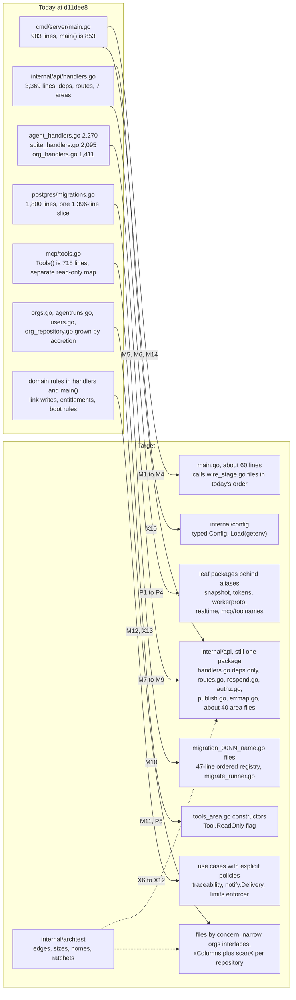
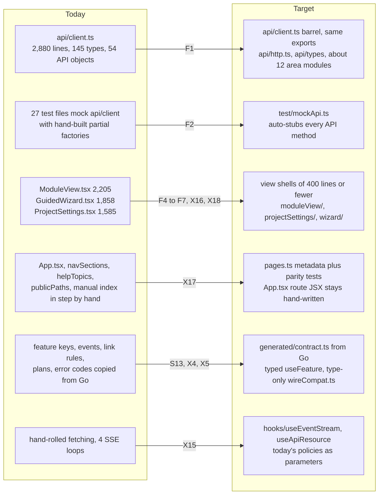
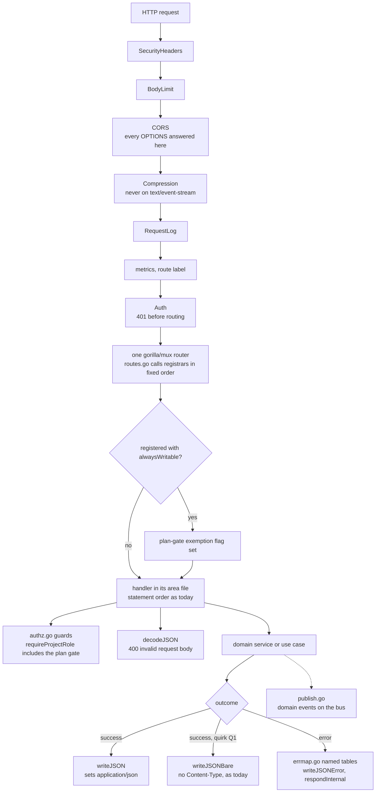
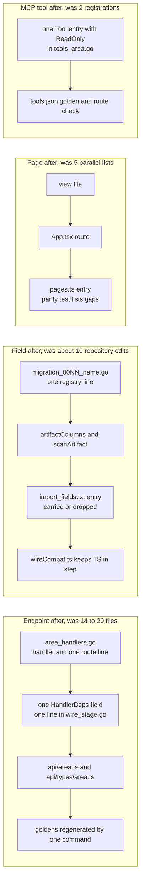
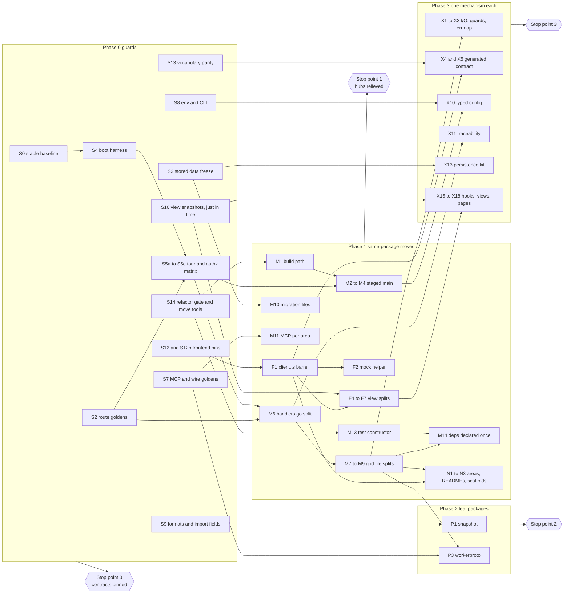
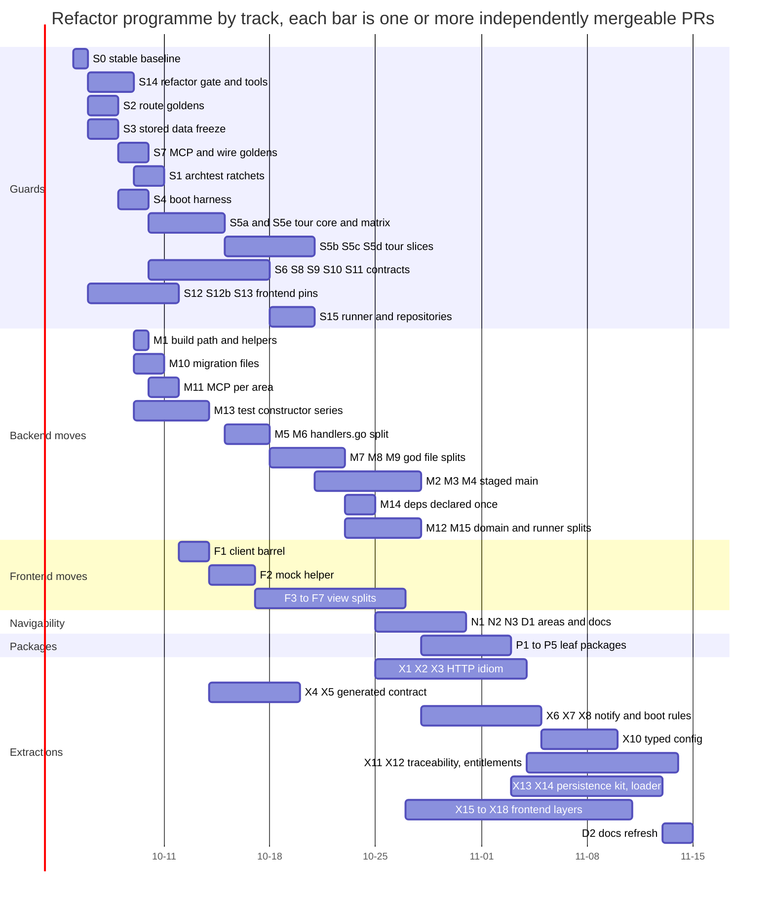

# Codebase refactor: smaller hubs, one way to do each thing, nothing users can see

Status: proposed 2026-09-25, against `master` at `d11dee8` (release 0.15.0).
Evidence base: the architecture analysis in
[`docs/assessments/2026-09-25-codebase-architecture/`](../assessments/2026-09-25-codebase-architecture/README.md).
Section marks (§4.1, §9.2, …) point into that analysis, and pain-point IDs
such as `api-core-1` are rows of its
[register](../assessments/2026-09-25-codebase-architecture/pain-points.md).
The analysis files are [README.md](../assessments/2026-09-25-codebase-architecture/README.md)
(§1–3), [backend.md](../assessments/2026-09-25-codebase-architecture/backend.md) (§4),
[flows.md](../assessments/2026-09-25-codebase-architecture/flows.md) (§5),
[frontend-data-tooling.md](../assessments/2026-09-25-codebase-architecture/frontend-data-tooling.md)
(§6–8) and [assessment.md](../assessments/2026-09-25-codebase-architecture/assessment.md)
(§9–10, appendices).
The plan changes nothing a person or an external program can observe. It
changes no requirement in the OpenV Platform project. The new contract
suites are recorded there as verification of existing requirements. Every
step is a pull request to `master`, and no step involves *Promote to release*.

## 1. Summary and how to use this plan

Five hub files take unrelated work:

- `internal/api/handlers.go` (3,369 lines, 80 commits);
- `cmd/server/main.go` (983 lines, 58 commits);
- `internal/persistence/postgres/migrations.go` (1,800 lines, 49 commits);
- `frontend/src/api/client.ts` (2,880 lines, 101 commits);
- `frontend/src/App.tsx` (263 lines, 21 commits).

152 of the 285 commits that change source (53%) edit at least one of them
(§9.2). A feature-gated endpoint with UI touches 17 to 25 files, and 40 to
50% of those files are plumbing (§9.1). Meanwhile the repository pins only
one user-facing contract, `internal/api/testdata/routes.txt` (§9.5).

This plan runs in order:

1. **Pin.** Phase 0 pins every other contract with black-box and golden
   tests. Each guard lands just before the code it protects.
2. **Move.** Phase 1 removes the hubs as shared insertion points. It uses
   moves inside a package that tools prove identical, and it declares
   handler dependencies once.
3. **Extract leaves.** Phase 2 carves a few leaf packages out behind aliases.
4. **Consolidate.** Phase 3 gives each duplicated mechanism one home, behind
   characterization tests that merged earlier.
5. **Optional.** Phase 4 is gated by measurements.

**Risk is set by verification class, not by size.** A 3,000-line move that
`declhash` proves identical is safer than a 40-line semantic extraction.
Large mechanical moves therefore come early, and small clever changes come
late.

The whole plan is about 110 PRs and 96 to 116 dev-days, plus an optional
tail. Phases 0 and 1 cost about 45% of that and deliver most of the
reduction in conflicts. The programme can stop at the end of any phase
(§6.1).

**How to use this plan.**

- **For the maintainer.** Read §2 to §4 once.
  - Create the labels `refactor`, `refactor:move` and `refactor:test`.
  - Mark the *Refactor guard* job as required once S14 lands.
  - Announce each hot-file window (§6.9).
  - Decide at each stop point whether to continue. Nothing here asks for a
    release.
- **For an agent picking up the next step:**
  1. Take the first unclaimed step in §6 whose **Depends** are all merged.
     Claim it on the programme's tracking issue.
  2. Read the step, the invariant rows it names (§3), and the notes for its
     area (§7).
  3. Branch as `refactor/<step-id>-<slug>`. Generate moves from their spec,
     never by hand. Run `make check-fast`, then `make check`.
  4. Open the PR with the labels from §8. In the template, fill in the
     verification class and the guard step it relies on.
  5. If a golden fails, the change is not a refactor. Stop and report; do
     not regenerate the golden.
  6. Merging to `master` ends the step. Do not promote.

## 2. Goals and non-goals

| # | Goal | Measured by (§10) |
|---|---|---|
| G1 | No hub is a shared insertion point. A feature touches its own area files plus one-line registrations. | hub-touch rate falls from 53% to 25% or less |
| G2 | Every user-facing contract is pinned before the code behind it moves. | contract goldens rise from 1 to about 15; black-box route coverage reaches 90% or more |
| G3 | Every refactor PR is verified mechanically. A reviewer reads a spec or a class check, not a 3,000-line diff. | every refactor PR declares a class (§4.2) |
| G4 | There is one way to do each recurring thing, and a ratchet keeps it that way. | the conventions in §4.3 are each enforced by a test, a lint rule or a CI job |
| G5 | Code can be found without prior knowledge: an area index, recipes next to the code, scaffolds, and failure messages that name the fix. | every file is owned by one area; there is a scaffold per recipe |
| G6 | Domain rules move out of handlers and `main()`, keeping every per-path difference as an explicit policy. | 4 link-write paths become 1 service; 7 snapshot loaders become 1; 7 delivery copies become 1 |
| G7 | Feature work keeps flowing. There are no long-lived branches, and no freeze is longer than one announced window. | at most one hot-file move per week |

**Non-goals.**

- **No behavior change, and no bug fixes.** Quirks are pinned, named and
  kept (§3.1). Each fix is its own release-noted PR (§9.2).
- **No framework or library swap.** gorilla/mux, axios, zustand,
  react-router and Vite stay. There is no OpenAPI toolchain, no generated
  runtime client and no data-fetching library.
- **No schema change.** Migrations are never edited, reordered or
  renumbered. Moving them into files keeps the bodies byte-identical, and
  hashes prove it.
- **No physical re-org of views or components while feature work
  continues.** Frontend files move only when a god component is split, into
  a subfolder named after it. Grouping by feature is virtual, through
  `docs/areas.json`.
- **No work on the release pipeline.** `promote-release.yml`,
  `cut-stable.yml`, `nightly-promote.yml` and `staging-smoke.yml` are out of
  scope. Verifying a change to them needs a promotion, and only the
  maintainer asks for one.
- **No timing changes.** SMTP stays on the bus goroutine and the double
  `RunFinished` publish stays. Both are behavior (services-3).

## 3. Invariants: what must not change, and what pins it

A PR labelled `refactor` leaves every row below unchanged. The last column
names the guard: an existing test, or the Phase 0 step that adds one. The
guards marked *frozen* are listed in the *Refactor guard* job (S14). A
refactor PR may add files to a frozen path, but it may not modify or delete
them.

| # | Invariant | Pinned at `d11dee8` | Guard |
|---|---|---|---|
| I1 | HTTP route set: 341 `METHOD PATH` pairs, plus `/metrics`, which is registered outside `RegisterRoutes` (`main.go:883`) | yes: `route_inventory_test.go`, `testdata/routes.txt` | existing (frozen) |
| I2 | Route **registration order** and handler binding. This covers the 3 same-method overlaps (`GET /agent-runs/delegate/{id}` before `{id}/tree`, `{id}/logs` and `{id}/stream`, `agent_handlers.go:49-55`) and the 9 `alwaysWritable` wrappers (`limits.go:112`). There is one router instance | no | S2 (frozen); S1 bans `Subrouter`, `PathPrefix`, `NotFoundHandler` and `MethodNotAllowedHandler` |
| I3 | Authorization outcome per route and identity: 401, 403 or 404 (existence hiding); the order of guard, lookup and decode; the plan read-only gate inside `requireProjectRole`/`requireOrgRole` | helper unit tests only | S5e matrix; S2 `route_guards.txt` (both frozen) |
| I4 | Status codes and body bytes: key order, trailing newline, HTML escaping, `null` vs `[]`. Whether `Content-Type` is present: about 158 bare encodes answer `text/plain` below 1,400 B and send no type when gzipped | partial, mostly self-referential | S5a–S5d tour (frozen) |
| I5 | Error envelope `{error, code}`, the 18 codes in `httperr.go`, and every message text, including the `err.Error()` passthroughs | `httperr_test.go` | existing; S5 |
| I6 | Middleware chain, outer to inner: SecurityHeaders, BodyLimit, CORS, Compression, RequestLog, metrics, Auth, router (`main.go:874-920`). Also pinned: gorilla's `404 page not found\n`, the empty 405 and the 301 path cleaning; 401 before routing on unknown protected paths; every OPTIONS answered 200 | per middleware only | S4 (frozen); M2 unit test |
| I7 | Prometheus `route` labels (mux templates, or `unmatched`) | no | S4 |
| I8 | Cookies and headers: the `openv_session` attributes; `CROSS_SITE_COOKIES` implying Secure and SameSite=None; HSTS; the security headers; `Cache-Control`, `Content-Disposition`, `X-Total-Count`, `X-Next-Cursor`, `Retry-After`; Range/206 on downloads | self-referential | S4, S5a, S5c |
| I9 | SSE: the 7 event names (`log`, `partial`, `status`, `message`, `assistant_partial`, `notification`, `error`) and the stream keys (bare run id, `guided:`, `interview:`, `notify:`) | 4 of 7 | S6 (frozen) |
| I10 | Domain events: type strings, payload keys **and their Go value types**, actor strings, and the bus subscriber order hooks → notifier → budget monitor → trigger matcher (`main.go:530, 590, 595, 675`) | constants only | S5d events golden, S6, M4 `boot_steps.txt` |
| I11 | MCP: the 31 tools' names, order, descriptions and input schemas; read-only membership and the order of `ReadOnlyToolNames()`, which is stored data (`seeds.go:38`); the method and path each tool calls; the JSON-RPC encoding | self-referential (`stdio_test.go:220-243`) | S7 (frozen) |
| I12 | Worker wire: the claim body has keys `agent`, `auth`, `run`, `run_token`, and `auth` can be `null` (`agent_handlers.go:688-693`); an empty claim answers 204; start and release take no body; logs accept both body shapes; finish, logins and pool | no | S5d (server side), S7 (client side) |
| I13 | Env var names, defaults and parsing: `envOr` does not trim but notify's `envDefault` does; booleans are exact `"true"`; `envInt` requires a value above 0; `DATABASE_URL` wins, otherwise `sslmode=disable`. Per-request reads stay per request. **Where fatal checks sit relative to migrations:** `main.go:168` before connect, `:189` migrate, `:286`, `:777`, `:911` | 43 `t.Setenv` spot checks | S8 (frozen), S4 boot log, X10 table test |
| I14 | CLI surface: `agentd`'s 12 flags, `openv-mcp`, the `openv-connector` subcommands, the `openv-vapid` output keys | partial | S8 (frozen) |
| I15 | Export, import and report formats; download filenames and media types; the ReqIF download-vs-export difference; which fields import carries over | structural | S9 (frozen) |
| I16 | Stored data: migration bodies and order; the every-boot baseline SQL; the schema after `Migrate` **and** after `MigrateAndBackfill`; snapshot JSON; proposal payload JSON; `links_snapshot`; guided `answers` keys; upload file naming | order only | S3 (frozen), S9, S5a, S16 (wizard) |
| I17 | Boot and background timing: the order of boot side effects; purge runs at start and then daily; the reaper first ticks after 30 s; `StableScheduler`, `SupportWindowWatcher` and the billing reconcile run at start; the scheduler catch-up runs synchronously before listen; `billing.Start` runs before `NewHandler` rewires billing (`handlers.go:373-379`) | no | S4 boot log, M4 `boot_steps.txt` and `movecheck -flatten` |
| I18 | Email and web-push content and deep links, including the bell's divergent links | substring asserts | S10 (frozen) |
| I19 | UI routes: 47 `<Route>` elements, eager vs lazy per route, the relative redirects (`App.tsx:245-246`), the query params (`?artifact=`, `?tab=`, `?run=`, `?against=`, `?go=`), backend-built deep links, and public paths | no | S12 (frozen) |
| I20 | CSS cascade and bundle: the eager CSS order from `index.tsx`. `ProjectList.css` defines `.button` at `:303` and is reached eagerly through `App.tsx:6`. Also the emitted CSS bytes and the lazy chunk boundaries | no | S12b |
| I21 | Screens, copy, ARIA roles, and the ids and classes e2e relies on (`#type`, `#title`, `#body`, `.measure`, `.card`, `'Search...'`, tablist roles) | 40 e2e tests (dev server) | e2e; S16 DOM snapshots |
| I22 | Browser storage keys and precedence: `openv_active_org` is read from sessionStorage, then localStorage; `openv_last_project`; `openv-theme` | scattered | S12 (frozen) |
| I23 | Every frontend call is a registered route. The export surface of `api/client` | no | S12 (frozen) |
| I24 | Go/TS vocabularies, **including today's drift** (§9.4) | 1 of 15 pairs | S13 (frozen) |
| I25 | Release notes and feature gating as served | `TestEmbeddedNotesParse`, release-notes job | refactor PRs never touch `RELEASE_NOTES.md` or `features.go` (S14) |
| I26 | Images and build contexts. `Dockerfile.api` copies only `cmd`, `internal`, `examples`, `release_notes.go` and `RELEASE_NOTES.md`. `frontend/Dockerfile.prod` copies `frontend/` only. Also `frontend/public/**`, `index.html` and `docker-entrypoint.d/**` | CI docker job | S14 protected paths; S1 build-context rule; M1 |

**Black-box guards come first.** S4 and S5 build and execute the real server
binary against a throwaway database, so no internal rewiring can fool them.
White-box guards (S2, S3, S7, S12b) pin what a black-box test cannot see:
binding order, migration bodies, tool order and CSS order.

### 3.1 Quirks preserved deliberately

Each quirk below is pinned and kept. Where code expresses it, the code gives
it an honest name, and `docs/contract-quirks.md` (created in S14) lists
every one. Fixing a quirk is a separate, release-noted PR (§9.2).

| # | Quirk (where) | Pinned by, and named as |
|---|---|---|
| Q1 | About 158 JSON responses set no `Content-Type` (api-core-3, api-suite-org-8) | S5; `writeJSONBare` (X1) |
| Q2 | A mid-request delete answers 500: `artifact_repository.go:165` returns an ad hoc error, so `handlers.go:952` never matches (domain-requirements-11) | documented; X13 keeps each not-found convention |
| Q3 | Managed link edits in `PUT /artifacts/{id}` skip the FeatureFlowDown gate, emit no link events, silently skip invalid adds, and the version note lists the *requested* links (api-requirements-3) | X11a; explicit `Policy` flags in X11b |
| Q4 | `links_snapshot` is written only when at least one link remains; auto-version N is the pre-update version plus 1 | X11a |
| Q5 | `POST /api/v1/orgs` returns `release_channel ""` and `locked false`, unresolved (domain-platform-v2) | S5c |
| Q6 | The `refines` tooltip differs between Go and TS; the TS event-filter lists are subsets (fe-requirements-4) | S13 allowed-diffs; `LINK_RULE_UI_OVERRIDES` (X4) |
| Q7 | Bell deep links differ from email and push links (fe-shell-v2, services-7) | S10; the X4 fixture keeps separate `go`/`ts` expectations |
| Q8 | There are 7 `limit` parsers; events and agent-runs reset an out-of-range value to 100 (persistence-v3) | S5; named `limitPolicy` values (X3) |
| Q9 | `ErrBudgetExceeded` answers 402 on 2 launch routes, 400 on 3 and 500 on delegation (api-suite-org-7) | S5d; `launchErrs402/400/Delegate` (X3) |
| Q10 | Proposal-mode runs publish `RunFinished` twice; a queued cancel never publishes it | S5d events |
| Q11 | `NewHandler` rewires billing after `billing.Start` has launched its goroutines (boot-v1) | `boot_steps.txt`; X12 keeps the point |
| Q12 | `FRONTEND_URL` has two fallback chains (`main.go:539, 825` vs `739, 761`), and reports read the raw `UPLOADS_DIR` (boot-3) | X10 keeps distinct fields |
| Q13 | Only `POST /api/v1/projects` enforces the project maximum (api-requirements-v1) | S5e over-plan pass |
| Q14 | Some list endpoints encode `null` for an empty list (api-suite-org-v6) | S5a |
| Q15 | An unknown protected path answers 401; OPTIONS answers 200 unlogged (boot-v4) | S4 |
| Q16 | The wizard and the notes panel build different artifact text (fe-suite-org-3) | F5 golden strings |
| Q17 | The purge list has gaps not covered by cascade (persistence-4) | S3 purge-catalog allowlist |
| Q18 | Rate-limit buckets are shared across endpoints: `authIPLimiter` is also spent by verify and reset (api-core-v2) | S5c shared-bucket probe, which exercises the real call sites (stronger than a pointer-identity test) |
| Q19 | One site says `"Invalid request body"`; 124 sites pass `err.Error()` through; 58 sites map any error to 404 | S5; `decodeJSONMsg`; untouched call sites |
| Q20 | Inline `err.response?.data?.error \|\| err.message` renders string bodies differently from `apiErrorMessage` (fe-suite-org-7) | `legacyErrorText` (X15) |
| Q21 | Four SSE reconnect policies (fe-shell-9) | S6; named `useEventStream` policies (X15) |
| Q22 | Token redaction applies only to the access log (api-core-v3) | untouched; the security fix is a separate PR |

## 4. Principles and conventions

### 4.1 Rules every refactor PR follows

| Rule | Meaning |
|---|---|
| **R1 Guard before move** | No code moves until the guard that would catch a change to it is on `master`. Guards land *just in time*: the cheap, broad ones in weeks 1–2, and each tour slice or view snapshot right before the PR that moves that area. Each PR names its guard step. |
| **R2 Declare a class** | Every refactor PR declares one verification class (§4.2). The class decides the mechanical check and what the reviewer reads. |
| **R3 Golden freeze** | A `refactor` PR changes no behavior golden. If one must change, the PR is not a refactor: it drops the label and carries a release note. |
| **R4 Regenerate, don't rebase** | A move PR is produced by a committed script from a spec keyed by **declaration name** (`internal/tools/declmove/specs/<step>.json`). When `master` moves, the author re-runs the script. Nobody hand-resolves a move conflict. |
| **R5 One move per hot file** | Each hot file is relocated by one generated PR, merged within an announced window of about two hours. There is at most one hot-file move per week (§6.9). |
| **R6 Ratchets with headroom** | Each new convention ships with a counter that may only fall. A grandfathered giant gets a ceiling of today's size plus 10% (at most 150 lines), so feature PRs are never blocked. Refactor PRs may not raise a ceiling. |
| **R7 Name quirks, don't fix them** | See §3.1. A bug found during a refactor gets its own labelled bug-fix PR. |
| **R8 Types keep their names** | A moved or aliased Go type keeps its type name. `encoding/json` errors embed it, and handlers echo `err.Error()`. An example is the logged import decode error at `handlers.go:1892`. |
| **R9 Order is behavior** | Route registration, boot side effects, bus subscribers, MCP tools and migrations keep their order. Goldens pin each of them. |
| **R10 Wire-shape rules** | When a map or anonymous body becomes a named type: fields are declared in the map's alphabetical key order; `omitempty` is used only where the key was omitted conditionally; Go value types stay the same (pointers stay pointers, so `null` survives); embedded structs stay embedded; `json.NewEncoder` stays. A `bytes.Equal` old-vs-new test ships with each extraction. |
| **R11 Strictly better after every PR** | Shims (aliases, the barrel, wrappers) are harmless if they stay forever. No PR leaves two conventions without a ratchet. |

### 4.2 Verification classes

| Class | What changes | Mechanical check | Reviewer reads |
|---|---|---|---|
| **A pure move** | Declarations move between files of one Go package, or TS modules move. Only import blocks change. | `declhash` is equal on base and head (every package-level declaration, hashed through `go/printer`). `movecheck` prints the function-to-file map. For TS, `tsmovecheck` allows diffs only in import declarations. | the spec |
| **B extract in place** | A closure becomes a named function, JSX becomes a props-only component, route lines become a registrar, or `main()` becomes stages. Each is called at the same position. | `git diff --color-moved=zebra --color-moved-ws=allow-indentation-change` shows only moved blocks and call sites. `movecheck -flatten main` for boot. Ordered goldens are unchanged. | call sites and parameters |
| **C test only** | only `*_test.go` and `*.test.ts(x)` files | the job fails if a non-test file changed (label `refactor:test`) | assertions are unchanged |
| **D package move** | A declaration moves to a new leaf package, and the old name stays as an alias or wrapper. | compiles; goldens unchanged; the archtest edge list only shrinks | the alias list |
| **E semantic extraction** | Logic moves across layers. | Characterization tests for exactly this logic merged in an earlier PR and are unchanged. | everything; two reviewers, one of them the maintainer |

### 4.3 One way to do X, and what enforces it

| # | Convention | Enforced by |
|---|---|---|
| K1 | `internal/api` holds one area per file: `<area>_handlers.go` contains that area's handlers and its `register<Area>Routes`. `routes.go` contains only the ordered registrar list. `HandleFunc` appears only in registrars. | S2 ordered golden; S1 AST rule (count ratchet) |
| K2 | One router instance: no `Subrouter`, `PathPrefix` or custom 404/405 handlers. | S1 ban |
| K3 | Cross-file HTTP helpers each have one home: `respond.go` (JSON in and out), `httperr.go` (error writers), `errmap.go` (per-area error tables), `authz.go` (every `require*`), `publish.go`, `cookies.go`, `middleware_*.go`. | S1 rule: an unexported function defined in `*_handlers.go` and used from another file fails, with a shrinking allowlist |
| K4 | JSON is written through `writeJSON` or `writeJSONBare`, and bodies are read through `decodeJSON`. | archtest counters (249 → 0, 106 → 1) |
| K5 | A handler dependency is declared once: one `HandlerDeps` field plus one line in its `wire_*.go` stage. Derived values stay private. | M14 archtest rule forbidding reads of raw `h.FrontendURL`, `h.SecureCookies` and `h.CrossSiteCookies` outside `handlers.go` |
| K6 | Tests build handlers with `newTestHandler` and share fakes from `testkit_test.go`. Fakes embed their interface or a narrow role interface. | `&Handler{` ratchet 137 → 0 |
| K7 | Layering: domain imports no api, persistence or app services; persistence imports domain only; api does not import persistence; client binaries' domain imports only shrink. | S1 edge list (227 edges; may only shrink) |
| K8 | `main.go` only sequences stages. Env vars are read only in `internal/config` and `cmd/*/config.go`, apart from the documented per-request reads. | S1 env-placement ratchet; S8 inventory |
| K9 | Migrations: one `migration_00NN_<name>.go` per version plus one line in the explicit, ordered registry. There is no `init()` anywhere. | S3 hashes; `TestRegistryIsOrderedWithoutDB`; S1 `init()` ban |
| K10 | An MCP tool is one `Tool{…, ReadOnly}` entry in `tools_<area>.go`. The read-only list is derived from those entries. | S7 golden |
| K11 | Go is the source of each cross-language vocabulary. TS reads `src/generated/contract.ts` (checked in) plus named UI overrides. | staleness test (`UPDATE_CONTRACTS=1`); S13 parity |
| K12 | Frontend endpoints live in `src/api/<area>.ts`. Code outside `src/api` imports only the `api/client` barrel. Tests mock it through `test/mockApi.ts`. | ESLint `no-restricted-imports`; S12 surface snapshot |
| K13 | `App.tsx` route JSX stays hand-written. `pages.ts` carries page metadata, and parity tests keep the two in step. | parity tests; S12 route tree; S12b CSS order |
| K14 | Size budgets: new Go files ≤ 800 lines and functions ≤ 100; new TS files ≤ 600 lines and components ≤ 300. Grandfathered ceilings only fall. | S1 and S12b tests; ESLint `max-lines` |
| K15 | Every file belongs to exactly one area in `docs/areas.json`. The area README holds recipes and guard commands, mapped at glob level with no per-file rows. | N1 ownership test |
| K16 | Goldens regenerate with one command, which the failure message names (`UPDATE_ROUTES=1`, `UPDATE_GOLDEN=1`, `UPDATE_CONTRACTS=1`, `vitest -u`). They are regenerated only in behavior-changing PRs. | S14 freeze job |

### 4.4 Decisions where the candidate plans disagreed

Four candidate plans were judged for three things: behavior risk,
editability payoff and feasibility. This plan takes the risk-first
structure, adds the editability and contract steps, and settles the
disagreements as follows.

| Question | Decision | Why |
|---|---|---|
| Vertical module packages, or splits inside the package? | Split inside the package. API subpackages are optional, in Phase 4, behind a go/no-go metric. | Most of the payoff with the least churn. Moving out of `package api` would also need an exported test kit: 48 fake types and about 60 calls to unexported methods live in package-api tests. |
| Split a hot file in several area PRs, or in one? | One generated PR per hot file. | Each move is a conflict event for every in-flight branch. |
| Group `main()` stages by module, or keep contiguous line ranges? | Contiguous ranges in today's order, in files `wire_<stage>.go`. | Regrouping reorders constructors and bus subscribers. |
| A declarative background-job table? | No. Loops become named functions started at the same statement. | A generic runner rewrites first-run timing (I17). |
| Build `newTestHandler` through `NewHandler`, or from `&Handler{}`? | From `&Handler{}` plus options (M13), exactly like today's literals. After M14 the options set the embedded `HandlerDeps`. | Keeps nil limiters and zero derived values, reads no env, and never rewires billing. `NewHandler` would do all three. |
| When is "deps declared once" done? | Phase 1 (M14), right after the splits. | It is the most frequent hub edit. |
| Derive `App.tsx` from `pages.ts`? | No. Metadata plus parity tests only. | Derivation risks the eager/lazy split, the CSS cascade (I20) and the relative redirects. |
| Drive importers of the barrel to zero? | No. Barrel-only imports, enforced by ESLint, plus an auto-stub mock helper. | The 27 whole-module `vi.mock` sites must keep intercepting. |
| Codemod `mux.Vars` to `PathVar`, convert errors to `errRule` tables, and declare routes as data? | None of the three. Use named byte-identical I/O helpers, co-locate the error writers, and name the quirk tables. | Cosmetic, or it rewrites the least-tested error branches. |
| `type ProjectExport = snapshot.Project`? | No. The type keeps the name `ProjectExport` (R8). | It would change the text of JSON error messages. |
| Pin `alwaysWritable` by editing production code in Phase 0? | No. Resolve the wrapped handler from the AST. | Phase 0 changes no production code. |
| Refactor gate on the `no-release-notes` label? | No. Use a dedicated `refactor` label and job. | Test-only PRs that extend a golden also carry `no-release-notes`. |
| Per-file README maps checked by a test? | No. Glob-level maps from `areas.json`. | Per-file maps would become a new hub that every feature PR edits. |

## 5. Target architecture

The target is deliberately modest. The frameworks, the packages and the
`Handler` type all stay. What changes is where code lives, what may import
what, and how many shared places one change must touch. §4 of the analysis
describes the backend as it is; §6 describes the frontend.

### 5.1 Backend: before and after

- **`cmd/server`.** `main()` becomes a sequence of stage calls. Each stage
  is a contiguous range of today's `main()` moved verbatim into its own
  `wire_<stage>.go`, with locals becoming fields of one `app` struct:
  `wire_config.go` (119–177), `wire_storage.go` (178–236), `wire_core.go`,
  `wire_workspace.go`, `wire_projects.go`, `wire_agents.go`,
  `wire_realtime.go`, `wire_notify.go` (532–651), `wire_jobs.go` (652–730),
  `wire_sso.go`, `wire_http.go` (765–970). New wiring lands in the stage that
  owns its concern.
- **`internal/api`.** `handlers.go` loses everything but the dependencies:
  - `handlers.go` keeps its name but only `HandlerDeps`, `Handler` (which
    embeds `HandlerDeps` after M14) and `NewHandler`, so in-flight dependency
    edits still apply cleanly.
  - `routes.go` holds `RegisterRoutes` as an ordered list of registrar
    calls, keeping today's interleaving (`handlers.go:421-512`).
  - About 40 `<area>_handlers.go` files follow the existing section markers.
    `agent_handlers.go` has 10, `suite_handlers.go` 9 and `org_handlers.go`
    10.
- **Unchanged:** the single gorilla/mux router, the middleware order, the
  `Handler` method set, every exported name and JSON tag, every SQL string
  and the migration ledger.

### 5.2 Frontend: before and after

- **Imports.** Consumers keep importing the barrel `api/client`, and ESLint
  enforces it. The 126 importers do not change, and the whole-module mocks
  keep intercepting.
- **Split views.** A split view keeps its path and export name, so the lazy
  `import('./views/ModuleView')` stays valid. Its pieces live in a subfolder
  named after it.
- **Eager imports.** The eager import graph from `index.tsx` keeps its order,
  so `ProjectList.css` still overrides `.button` app-wide (I20).

### 5.3 The request path through the handler idiom

The diagram shows the target path. Existing handlers keep **their own
statement order**, because that order decides which status wins:
`CreateArtifact` decodes before it authorizes, and `LaunchAgentRun` looks up
before it decodes. The helpers replace statements one for one.

### 5.4 Recipes: files touched before and after

The "today" column comes from the recipes in §9.1.

| Recipe | Today (§9.1) | After Phase 1 | After Phase 3 |
|---|---|---|---|
| (a) Gated endpoint and UI | 14–20 files: 4 edits in `handlers.go`, the `main.go` literal, `client.ts`, `routes.txt`, `features.go`, a TS feature const, `phone-audit.js` | the area handler file and 1 route line in its registrar; 1 `HandlerDeps` field and 1 line in `wire_<stage>.go`; `api/<area>.ts` and `api/types/<area>.ts`; goldens regenerated by command; `scaffold api-area` | plus a typed `FeatureKey` from the generated contract, so the phone-audit key is checked |
| (b) Field on an entity | about 10 edits in `artifact_repository.go` (6 SELECTs, 2 INSERTs, 2 Scans), and the import mapper silently drops the new field (`export.go:679-697`) | a migration file plus 1 registry line; S9's `import_fields.txt` fails until the field is marked carried or dropped | `artifactColumns` plus `scanArtifact` (2 edits); `wireCompat.ts` fails `tsc` until the TS type agrees |
| (c) Domain area | 4 edits in `handlers.go`, plus `main.go`, `App.tsx`, `ProjectLayout.tsx` and `client.ts` | new files, plus 1 line each in `routes.go`, a `wire_<stage>.go`, the `client.ts` barrel and `docs/areas.json` | plus 1 `pages.ts` entry for its pages |
| (d) MCP tool | `Tools()` (718 lines), a separate `readOnlyTools` map (`tools.go:168`) and tests; a read tool left out of the map becomes a writer | 1 `Tool` entry with `ReadOnly` in `tools_<area>.go`; the golden and the path check name what is missing; `scaffold mcp-tool` | same |
| (e) UI page | `App.tsx`, `navSections`, `helpTopics`, the `manual/index.ts` entry and `publicPaths` kept in step by memory | unchanged | the `App.tsx` route plus 1 `pages.ts` entry; parity tests list anything missing; `scaffold page` |
| Migration | append a closure inside a 1,396-line slice; at least 9 renumbering merges | `scaffold migration <name>` writes the file and its 1 registry line; a version clash is a 1-line textual conflict | same |

## 6. Roadmap

### 6.1 Phases, effort and stop points

| Phase | Steps | PRs | Dev-days | If the programme stops here, you have |
|---|---|---:|---:|---|
| **0 Safety net** (classes C and CI; no production code) | S0–S17 | about 24 | 20–24 | **Stop point 0.** Every contract in §3 is pinned (1 golden becomes about 15). The flaky test is fixed and the pgvector tests run. The authorization matrix exists, and the refactor gate and move tools work. OpenV records verification for REQ-143, REQ-89, REQ-113, REQ-114, REQ-18, REQ-4, REQ-5, REQ-6, REQ-13, REQ-23 and REQ-24, and a `pre-refactor` baseline. |
| **1 Same-package moves** (classes A, B, C) | M1–M15, F1–F8, N1–N3, D1 | about 38 | 26–30 | **Stop point 1.** No hub is a shared insertion point: `handlers.go` holds deps only, `main()` is about 60 lines, migrations are one per file, and `client.ts` is a barrel. A dependency is declared in 2 places, not 4. Tests use one constructor and one mock helper. Every file has an area, every area has a README, and each recipe has a scaffold. The hub-touch rate is expected to fall below 30%. |
| **2 Leaf packages** (class D) | P1–P5 | 5 | 5–7 | **Stop point 2.** The domain context graph has no cycles. The worker wire has named types, and `agentd` links fewer server packages. |
| **3 One mechanism per concern** (mostly class E) | X1–X19, D2 | about 42 | 45–55 | **Stop point 3.** Domain rules are out of handlers and `main()`. Config is typed. The Go→TS contract is generated and checked. Helpers, delivery, snapshot loading and link writes each exist once. The hot views are shells. |
| **4 Optional, gated** | O1–O3 | about 6 | 10–15 | API subpackages for clean areas, and the remaining sagas. Undertaken only if the §6.8 gate says so. |

That is about 110 PRs and 96 to 116 dev-days before the optional tail. When
the maintainer prefers fewer staging rebuilds, two to four commits of the
same class may share one PR, provided each commit is verifiable on its own
(§8). **Most of the conflict reduction arrives at stop point 1, at about 45%
of the effort.**

### 6.2 What gates what

### 6.3 Indicative schedule

The tracks run in parallel. The dates are illustrative; merge windows and
feature work decide the real cadence.

Each step below gives its size (S up to about a day, M two to three days,
L up to five days, split where possible), its verification class (§4.2),
and whether it can run in parallel with feature work. "Window" means that
the step is a hot-file move landed in an announced window (§6.9).

### 6.4 Phase 0: safety net

This phase changes no production code. Guards land in the order in which
they unblock moves:

- **Weeks 1–2:** the cheap, broad guards (S0, S2, S3, S7, S14). These unblock
  the early wins M1, M10, M11 and M13.
- **Just before their step:** the tour slices and the view snapshots, each
  landing right before the step that moves its area.
- **Every PR:** records its test case and test run in OpenV (§8.5).

| Step | Size · class · parallel | What changes (files) | Guard · done when | Depends | Resolves |
|---|---|---|---|---|---|
| **S0** Stable baseline | S · C · yes | Fix the flaky `TestReInvitingResendsWhenTheFirstMailNeverLanded` (`registration_invitation_test.go:1569`): the fake `MarkEmailed` signals its own channel (`email_verification_handlers_test.go:82-89`). Switch the CI Postgres image to `pgvector/pgvector:pg15` (`ci.yml:29`) so the 4 vector tests run | `-count=400 -cpu 1,2` green · two CI runs green without re-runs, 4 fewer skips | – | persistence-11 (vector part) |
| **S1** Go architecture ratchets | M · C · yes | New test-only `internal/archtest`. **Frozen:** the 227 internal import edges (may only shrink); K7, K14 with R6 headroom; the `agentd`/`openv-mcp` domain-import allowlist. **Bans:** `init()`, side-effecting package vars, `Subrouter`, `PathPrefix`, custom 404/405 handlers. **Ratchets:** `HandleFunc` outside registrars; `&Handler{` (137 in 60 files); raw encodes (249); `"invalid request body"` literals (106); `require*` outside `authz.go`; env reads under `internal/` (39). **Build context:** every package linked into `cmd/server`, and every `//go:embed` pattern, lies inside the `Dockerfile.api` COPY list. Failures name the rule, the allowlist, the regenerate command and the README section | itself · a domain → `internal/api` import fails with that message | – | boot-v5, api-suite-org-17 (frozen), tooling-15 (part) |
| **S2** Route binding, overlap and guard goldens | S · C · yes | `internal/api/route_binding_test.go` writes three frozen goldens. `route_handlers.txt`: routes in **registration order**, as `METHOD PATH -> Name [alwaysWritable]`; short names via `runtime.FuncForPC`; the 9 `alwaysWritable` closures resolved from the registration AST, with no production edit. `route_overlaps.txt`: for each same-method template pair, a synthesised path and the handler `router.Match` picks (3 today). `route_guards.txt`: each handler's `require*` calls and roles, keyed by route and mapped to canonical guard kinds | the PR shows two mutations failing: `delegate/{id}` moved below `{id}/tree`, and `alwaysWritable` dropped at `handlers.go:427` | – | api-core-v7, api-suite-org-15 (part), api-core-13 (part) |
| **S3** Stored-data freeze | M · C · yes | `migration_freeze_test.go` has four parts. (a) Append-only per-version `sha256(Version, Name, go/printer(body))`; the body is the closure or the named function, and referenced helpers such as `backfillRefPrefix` (`migrations.go:1465`) are hashed transitively. (b) A hash of the baseline SQL in `InitSchema` and `schema_*.go`. (c) DB-gated schema goldens after `Migrate` and after `MigrateAndBackfill` with a seeded user. (d) A purge catalogue: every table with an `org_id`, `project_id` or `artifact_id` column is in `PurgeOrg`'s list (`org_repository.go:602-625`), is reached by cascade, or is on a gap allowlist (Q17) | editing one character of a shipped migration fails; appending one passes | S0 | persistence-v1, persistence-4, persistence-2 (frozen), persistence-v2 (part) · OpenV REQ-89 |
| **S4** Black-box boot and middleware harness | M · C · yes | DB-gated `cmd/server/{harness,boot_smoke}_test.go`. It runs `go build -cover ./cmd/server` and execs the binary on a fresh DB with fixed env (temporary directories; repo root as cwd; no SMTP, VAPID, Stripe or SSO). It probes `/health` (no `commit`) against `/api/v1/public/build`; an allowed and a refused preflight; security headers on 200, 401 and 413; the body cap and its multipart exemption; gzip at 1,400 B or more but never on `text/event-stream`; 401 before routing; the mux 404 text, empty 405 and 301; `/metrics` with and without its token; the route-label set; the boot log sequence; and a SIGTERM drain. It also runs one misconfigured boot per fatal (`OPENV_LIMITS`, grandfather date, billing, `CORS_ORIGIN`), recording the exit message and whether migrations ran first | new goldens · green twice in a row, under 60 s | S0 | boot-10, api-core-9 |
| **S5a–S5e** API tour and authorization matrix | L + 4×M · C · just in time | Per request, `cmd/server/testdata/tour/<slice>.json` records the status, whether `Content-Type` is present (including the gzip variant), the I8 headers and the normalised body (`null` ≠ `[]`). After each write group it records `GET /api/v1/events` (type, actor, payload key → JSON type). **S5a** requirements core, before M6: projects, artifacts, links including managed edits, review, baselines, templates, attachments with a Range request, chatter, search, share links, and every export, import, report and `/download/*` format. **S5b** V&V and suite, before M8. **S5c** identity and workspace, before M9, including Q5 and the shared-bucket probe (Q18). **S5d** agents and the worker wire, before M3 and M7: claim bytes including `"auth":null` and the 204, start, both log shapes, finish, release, delegation, the first SSE events, the run-now copy, the proposal apply order, and the `/teams` aliases. **S5e** matrix, before M6: every route × {anonymous, viewer, editor, owner, other-workspace member, worker key, run token} with phantom UUIDs, recording status and `code`; then a GET pass with real ids, and an over-plan pass that pins the 9 `alwaysWritable` exemptions by behavior | new goldens · `coverage.txt` ≥ 90% of the 341 routes; two runs identical | S4; S5e also S2 | api-requirements-15, api-suite-org-15, domain-requirements-15 (part), api-suite-org-v1 and domain-platform-11 (pinned), agent-exec-v1 (server), tooling-v4 (part) · OpenV REQ-143, REQ-18, REQ-4, REQ-5, REQ-6, REQ-13, REQ-23 |
| **S6** SSE and domain-event contract | S · C · yes | `contracts/sse-events.json`; an AST check of the literals passed to `BroadcastSession`, `emit` and `sseEvent{Event:}`; a vitest scan of `EventSource` listeners; a literal list of the 24 event types; a `RunDetailPanel` stream test for `log`, `partial` and `status` | renaming any name fails in Go or TS | – | services-10, agent-exec-10, domain-platform-6 (guards) |
| **S7** MCP and agent-client wire goldens | M · C · yes | `internal/mcp/testdata/tools.json` (name, order, description, schema, read-only flag) replaces the self-comparison at `stdio_test.go:220-243`. It also pins the order of `ReadOnlyToolNames()` and the recording client's `METHOD PATH` list, checked against `routes.txt`. `internal/runner/testdata/wire/*.json` pins every `runner.Client` request, including the legacy bare-array log body, and the claim and 204 decoding. The openv-mcp JSON-RPC encodings are pinned | a rename, schema change or retargeted path fails | – | agent-exec-v1, agent-exec-7 (guard), agent-exec-6 (client), agent-exec-15 (pinned) |
| **S8** Env var and CLI inventory | S · C · yes | A go/ast scan of every name passed to `os.Getenv`, `LookupEnv`, `envOr`, `envInt*`, `envDefault` and `getenv`, plus the rate-limit constants and their literal defaults. Names are frozen in `internal/archtest/testdata/env_vars.txt`; `file:line` goes to a non-frozen report. Output snapshots of `agentd -h` (12 flags), `openv-connector`, `openv-vapid` and `openv-mcp` | renaming or dropping a variable or flag fails | – | boot-2, services-14 (guards), tooling-8 (part) |
| **S9** Formats, payloads, import fields | M · C · yes | The 4 `docs/exports/*.json` round-trip. A fixture with a pinned clock yields JSON, CSV and ReqIF bytes, an XLSX cell dump and PDF/DOCX text markers. Also pinned: the V&V report filename and header; the `/download/reqif` vs `?format=reqif` difference; marshal goldens of the DTOs stored in `proposals.payload`. **New:** `import_fields.txt` classifies every field reachable from `exports.ProjectExport` as `carried` or `dropped` | a new field fails until classified, instead of being silently dropped by `export.go:679-697` | – | domain-requirements-15, domain-requirements-5 (guard), tooling-v4 (part) · OpenV REQ-113, REQ-114, REQ-6 |
| **S10** Notification content | S · C · yes | For each of the 7 types: the stored row, email subject and body, and push payload. A vitest table for `pathForNotification` (`NotificationBell.tsx:31`) pins its drift from `notificationPath` (`email.go:253`) | goldens | – | services-7, fe-shell-v2 (pinned), services-2 (guard) |
| **S11** Scheduler and automation characterization | M · C · yes | The first tests in `internal/scheduler` and `internal/automation`: catch-up; a lost and a won claim; an invalid cron firing once; string, number and bool filters; cooldown and the hourly cap; the `agent:` self-trigger skip; prompt variables; the run-now copy | new tests | – | services-4 · OpenV REQ-24 |
| **S12** Frontend shell guards and boundary lint | M · C · yes | `frontend/src/arch/`: a route-tree snapshot parsed from `App.tsx` with the TypeScript compiler API (eager or lazy per element; import order); backend deep links resolved with `matchRoutes`; every client `METHOD PATH` found in `routes.txt` (278 of 282, 4 normalised); `publicPaths` checked against `isOpenPath`; interceptor tests (the 401 and `email_unverified` redirects, `X-Org-ID` precedence); a storage-key inventory; an `api/client` export-surface snapshot. ESLint freezes the boundaries: `api/**` imports no UI; components import no views (2 allowlisted); nothing imports outside `frontend/`; no new `EventSource` sites; a ratchet on inline `err.response?.data?.error` chains | snapshots and lint | – | fe-shell-12, fe-shell-10 and fe-requirements-13 (frozen), fe-shell-v1 and fe-shell-2 (guards) |
| **S12b** CSS cascade and bundle guards | S · C · yes | `cssOrder.test.ts` snapshots the ordered eager `.css` list from `src/index.tsx`. `frontend/scripts/bundle-check.mjs` writes `bundle-shape.json` (heavy packages in the entry chunk; which of the 19 lazy pages are dynamic entries). For a PR touching `App.tsx`, `index.tsx`, `.css` or an eagerly imported module, it also builds the base and requires byte-identical CSS assets; for a type-only PR, the whole `dist/assets` set must match | an eager import of a lazy view fails | – | fe-suite-org-v3 (cascade guard) |
| **S13** Go↔TS vocabulary parity | M · C · yes | A Go test writes `contracts/vocab.json` from the Go catalogues: link rules, types, statuses, feature keys, 24 events, plans, 18 error codes, gap labels (asserting the two Go copies are equal), providers, extensions, public paths, wizard step labels. Vitest compares each TS copy, with today's differences in `contracts/vocab-allowed-diffs.json` | a drifted copy fails | – | fe-requirements-4, domain-requirements-8, domain-platform-3, fe-shell-14 (guards) |
| **S14** Refactor gate, move tools, local gates | 2×M · C · yes | **PR a:** `internal/tools/{declhash,declmove,movecheck}`. `declmove` specs are keyed by declaration name and use a pinned `go run …/goimports@<version>`, so `go.mod` is untouched; `movecheck` prints the function-to-file map and has `-flatten`. Also `frontend/scripts/{tsdeclhash,tsmovecheck}.mjs`; `make check` (mirrors CI) and `make check-fast` (under 60 s, no Docker); `scripts/refactor/classify_commits.py`. **PR b:** a *Refactor guard* job for `refactor*` labels. It fails on M or D under `**/testdata/**`, `contracts/**`, `**/__snapshots__/**`, `RELEASE_NOTES.md`, `internal/domain/release/features.go`, `frontend/public/**`, `frontend/index.html` and `frontend/docker-entrypoint.d/**`; on any ratchet rise; on missing hash equality under `refactor:move`; and on non-test changes under `refactor:test`. PR b also adds the PR template, `.git-blame-ignore-revs`, `docs/contract-quirks.md`, and a "Refactor PRs" section in `CONTRIBUTING.md` | a throwaway PR editing a golden goes red; the maintainer makes the job required | – | tooling-13, tooling-15 (part) |
| **S15** Runner and zero-coverage characterization | 2×M · C · yes | (a) `internal/runner`: PoolAgent lease start, supersede and end (`HOME` restored); `Worker.Run` slot accounting across both pools; error-class goldens. (b) Postgres round trips for the repositories at 0% (team, workitem, project, agent, member): not-found shape, ordering, `nil` vs `[]` | new tests | S0 | agent-exec-6, persistence-11, agent-exec-v3 (pinned), domain-platform-12 (part) |
| **S16** Just-in-time view characterization | S each · C | Merged right before the PR that touches the view. Renders it with canned data (`createRoot`, `act`, `vi.mock`), snapshots `container.innerHTML` per mode, and asserts the ordered API calls. ModuleView (desktop, phone, baseline) before F4; GuidedWizard (every step, the `answers` JSON) before F5; ProjectSettings (7 tabs, `?tab=`) before F6; re-run before each X15, X16 and F8 step | snapshots | – | fe-requirements-16, fe-suite-org-12 (part) |
| **S17** Release-notes corpus (optional) | S · C · yes | `testdata/release-notes/*.md` with expected JSON, loaded by `scripts/release_notes_test.py` and a Go table test in `internal/domain/release`. No workflow change | both parsers agree | – | tooling-2, domain-platform-14 (guards) |

**Stop point 0** is reached once S0–S14 are merged. At that point, capture
the OpenV baseline `pre-refactor`.

### 6.5 Phase 1: same-package moves, deps declared once, findable code

Move PRs are generated from a spec (R4). Every function keeps its name, so
an in-flight feature PR re-applies its hunk to the same function in its new
file. The PR description carries the `movecheck` map.

| Step | Size · class · parallel | What changes (files) | Guard · done when | Depends | Resolves |
|---|---|---|---|---|---|
| **M1** Build by package path; `main.go` helpers out | S · B then A · yes (week 1) | `Dockerfile.api:28` changes from `go build … cmd/server/main.go` to `./cmd/server`, the only build by file path. `envOr` and `envInt` (`main.go:73-89`) move to `config.go`; `initLogging` and `fatal` (`:94-117`) to `logging.go`; `maxRequestBodyBytes` (`:975`) to `http.go` | CI Docker builds and the e2e compose build; `declhash` · `cmd/server` builds as a multi-file package on every path | S14 | boot-11, boot-1 (start) |
| **M2** `buildHTTPHandler` | M · B · window (`main.go`) | `main.go:874-920` (router, `ContentTypeMiddleware`, `/metrics`, auth, log, metrics, compression, CORS, body limit, headers) becomes `buildHTTPHandler(...)` in `http.go`. It returns the CORS error, and `main` calls `fatal` at the same statement. `newServer` is extracted. A new `http_test.go` asserts the layer order in-process | S4 unchanged; the new test; `--color-moved` | M1, S4 | boot-10, api-core-9 |
| **M3** Name `main()`'s closures and loops | M · B · yes | Named functions, called at the same statements: `projectOrgResolver(db)` (`:229-235`); `reconcileHostedRunners` (`:317-347`); `bootstrapOrgID` (`:351-363`); the download sources (`:401`); the budget guard (`:656-671`). Also `runPurgeLoop` (`:678-699`) and `runReaper` (`:700-729`), started with `go` where they are today: purge runs at once, and the reaper first ticks at 30 s | S4, S5a, S5d; `--color-moved` | M2, S5d | boot-4 (part), services-1 (part), boot-8 (part) |
| **M4** Staged composition root | L · B · window (`main.go`) | A script turns the locals into fields of `type app struct` and moves each **contiguous** range of `main()` into a `wire_<stage>.go` (§5.1), called in today's order. Fatal checks stay at their statements. Order-sensitive calls append labels to an internal `a.bootSteps`: migrate; seed; grandfather → `SetTiersEnforced`; reconcile; `SyncAllFromDisk` → `EnsureOrgDefaults`; run subscribers metrics → SSE → hooks; bus subscribers hooks → notifier → budget → trigger; `SetBudgetGuard` → scheduler catch-up; purge; reaper; `billing.Start` → `NewHandler` (Q11); `SetAppliers`; `SetGuidedNudgeLauncher`; serve. The DB-gated `wiring_test.go` pins `testdata/boot_steps.txt` | `movecheck -flatten main` against the old body (only local → `a.field` renames differ); `boot_steps.txt`; S4 boot log and misconfigured boots; S5a–S5d · `main()` ≤ 60 lines | M3, S5d, S14 | boot-1, services-1, boot-5 (order explicit), boot-8, boot-9 (co-located), boot-v2, boot-v3 (pinned) |
| **M5** Shared API helpers to their homes | S · A · yes | `respondJSON` (`evidence_handlers.go:51`) → `respond.go`. To `authz.go`: `requireUser` and `requireWorker` (`agent_handlers.go:136-150`), `requireWorkerRun` (`:741`), `requireHumanUser` (`notification_handlers.go:107`), `requirePlatformAdmin` (`admin_handlers.go:28`), `requireJSONBody` (`email_verification_handlers.go:30`), and `requirePoolNode` and `requireRunnerSessions` (`runner_session_handlers.go:35, 49`). `CORSMiddleware` and `BodyLimitMiddleware` leave `security_headers.go`. The session and OIDC cookie helpers go to `cookies.go`. `handlers.go` is not touched | `declhash`; the `require*` ratchet falls | S14 | api-requirements-5, api-suite-org-13, api-core-12, api-core-v6 (co-located) |
| **M6** Split `handlers.go` (one generated PR) | M · A + B · window | Spec `M6.json`, by declaration name. **Stay in `handlers.go`:** `HandlerDeps`, `Handler` and `NewHandler`, so in-flight dependency edits still apply cleanly. **New files:** `routes.go` (`RegisterRoutes`); `publish.go`; `health_handlers.go`; `middleware_content_type.go`; `artifact_handlers.go`; `artifact_history_handlers.go`; `link_handlers.go`; `managed_link_edits.go`; `review_handlers.go`; `project_handlers.go`; `project_io_handlers.go`; `template_handlers.go`; `baseline_handlers.go`; `attachment_handlers.go`; `chatter_handlers.go`. **Registrars:** the inline route blocks become registrars (`registerProjectCoreRoutes`, `registerReviewRoutes` and others), called so that `route_handlers.txt` stays byte-identical. That keeps the `/projects` interleaving with download, share, admin and billing (`handlers.go:423-450`). `scaffold api-area` lands here | `declhash`; `routes.txt`, `route_handlers.txt` and `route_overlaps.txt` identical; S5a; S5e · `handlers.go` ≤ 400 lines | M5, S2, S5a, S5e, S14 | api-core-1, api-requirements-1, api-requirements-12, api-core-v1 (part) |
| **M7** Split `agent_handlers.go` | M · A + B · yes | Split along its 10 `// ---` markers (`:152` … `:2203`) into `agent_definition_`, `agent_run_`, `worker_protocol_`, `automation_`, `proposal_`, `repo_connection_`, `provider_settings_`, `provider_login_`, `crew_` and `domain_event_handlers.go`. `registerAgentRoutes` becomes an ordered list of sub-registrars, and delegation stays before `{id}/…` | `declhash`; route goldens; S5d; S5e | M6, S5d | api-suite-org-1 (part) |
| **M8** Split `suite_handlers.go` | M · A + B · yes | Split along its 9 markers into `reference_party_`, `product_profile_`, `vv_`, `quality_lint_`, `work_item_`, `guided_`, `guided_copilot_`, `interview_` and `public_interview_handlers.go`, plus `project_snapshot.go` | `declhash`; route goldens; S5b | M7, S5b | api-suite-org-1 (part) |
| **M9** Split `org_handlers.go` | S · A + B · yes | Split along its 10 markers into `org_`, `org_logo_`, `org_member_`, `org_team_`, `worker_key_`, `runner_key_`, `hosted_runner_`, `worker_status_`, `connector_` and `project_team_access_handlers.go` | `declhash`; route goldens; S5c | M8, S5c | api-suite-org-1, services-v2 (co-located) |
| **M10** One file per migration | M · A · window (`migrations.go`) | Each body for versions 2–47 (`migrations.go:76-1458`) becomes `func m00NN<Name>(tx *sql.Tx) error` in `migration_00NN_<name>.go`, with its comment. The registry stays an **explicit ordered list** of 47 lines: no `init()`, so two branches that take the same version collide textually. The runner and `Migrate`/`MigrateAndBackfill` (`:1547-1800`) move to `migrate_runner.go`. A test checks that each file registers exactly its version. `scaffold migration` lands here | S3 hashes, the baseline hash and the schema goldens identical; `TestRegistryIsOrderedWithoutDB`; Postgres tests · `migrations.go` ≤ 150 lines | S3, S14 | persistence-1, persistence-12 (part) |
| **M11** MCP tools per area, one registration each | 2×S · A, B · yes | **(a)** The body of `Tools()` (`tools.go:314-1031`) moves into per-area constructors in `tools_<area>.go`, concatenated in today's order. The client, the serve loop and the schema helpers get their own files. **(b)** `Tool` gains `ReadOnly bool`. `readOnlyTools` (`tools.go:168`) and `ReadOnlyToolNames()` are derived from it, in `Tools()` order. `tools/list` builds explicit maps (`tools.go:1063-1072`), so the field never reaches the wire. `scaffold mcp-tool` lands here | S7 `tools.json` and read-only order; `readonly_test.go`; `internal/seeds/interviewer_test.go` | S7, S14 | agent-exec-1 |
| **M12** Domain and repository files by concern | 3×M · A (interfaces B) · yes | `org_repository.go` (784 lines, 45 methods) splits into billing, release, membership, team and purge files; the purge list becomes a named var in the same order. `agentruns.go` (1,224) splits into types, service, lifecycle and subscribers. `orgs.go` and `limits.go` split into workspace, membership, billing, channel, deletion and plans, with narrow interfaces `Workspaces`, `Membership`, `BillingStore`, `ChannelSettings` and `Alerts`; `Service` is redeclared as their embedding, so no caller changes. `users.go` (924) splits into account, session, verification, password and token | `declhash`; package and Postgres tests | S3, S14 | persistence-3, domain-platform-1, domain-platform-7 (part), domain-platform-8 (part) |
| **M13** One test constructor, shared fakes | 5×S · C · yes | **(a–d)** `internal/api/testkit_test.go` adds `newTestHandler(t, opts ...func(*Handler))`. It builds `&Handler{}` and applies the options, so today's literal semantics hold: nil limiters, zero derived values, no env reads, no billing rewiring. The 137 literals are migrated area by area, before M6 where possible. **(e)** The shared fakes from `authz_test.go:30-345` move to `testkit_test.go` and embed their interface, or the narrow M12 interfaces, so widening a `Service` stops breaking every fake | same assertions pass · `&Handler{` ratchet at 0 | S14; (e) M12 | api-core-10 (part), api-suite-org-2 (part), domain-requirements-v6, api-requirements-v6 (part) |
| **M14** Handler dependencies declared once | L (scripted) · B · window (`handlers.go`) | `scripts/refactor/embed_deps.sh`: `Handler` embeds `HandlerDeps`. One `gofmt -r 'h.x -> h.X'` rule runs per pure-copy field, across production and test code. `NewHandler`'s copy lines become `h.HandlerDeps = deps` at the same point. Derived values keep private names and positions: cookie SameSite/Secure (`handlers.go:288-293`), trimmed `frontendURL` (`:322`), the 13 limiters, and the billing rewiring at the end (`:373-379`). An archtest rule forbids reading raw `h.FrontendURL`, `h.SecureCookies` or `h.CrossSiteCookies` outside `handlers.go` | compiles; all tests; S2; S4 cookies; S5c billing return URL · a new service is 1 field + 1 `wire_*.go` line | M6–M9, M13 | api-core-2, boot-7, api-suite-org-2 (step 1), api-requirements-14 (part) |
| **M15** Runner `execute` into named helpers | M · B · yes | `Worker.execute` (`worker.go:266-526`) becomes `preflight`, `runEnv`, `buildRunSpec`, `finishRequestFor` and `failRun`. Messages and error classes are unchanged. The sign-in methods move from `Worker` to a `loginBroker` in `login*.go` | S15a; S7 wire goldens; `worker_test.go`; classify goldens | S15, S7 | agent-exec-2, agent-exec-v4, agent-exec-5 (co-located) |
| **F1** `client.ts` behind a barrel (one generated PR) | M · A · window (`client.ts`) | The 145 types move to `api/types/<area>.ts`. The axios instance, both interceptors, `uploadConfig`, `API_BASE_URL`, `saveBlob` and `downloadBlob` move to `api/http.ts`. The 54 `xxxAPI` objects move to about 12 `api/<area>.ts` modules. `client.ts` becomes a barrel of 60 lines or fewer with the **identical** surface, including `export default`. ESLint: outside `src/api`, only `api/client`, `api/errors`, `api/baseURL` and `api/contentDisposition` may be imported. `scaffold api-module` lands here | S12 surface snapshot identical; interceptor tests; `tsdeclhash` equality; S12b; e2e | S12, S12b, S14 | fe-shell-1, fe-shell-10 (part), fe-shell-11 (visible) |
| **F2** Auto-stubbing API mock helper | 3×S · C · yes | `frontend/src/test/mockApi.ts`: `vi.mock('../api/client', async (orig) => mockApi(await orig(), overrides))`. Every method of every exported `*API` object becomes a `vi.fn` that records the call and returns a pending promise; non-function exports stay real; `unstubbedCalls()` lets a test assert nothing unexpected ran. The 27 hand-built factories migrate, about 9 files per PR | same assertions pass; a new client method is stubbed automatically (the d99fc18 failure mode) | F1 | fe-requirements-16 (part), fe-shell-12 (part) |
| **F3** One active-workspace storage module | S · B · yes | `state/activeOrgStorage.ts` exports `readActiveOrg`, `writeActiveOrg` and `ORG_HEADER`. The key stays `openv_active_org`, read from sessionStorage and then localStorage at request time. It is used by `store.ts`, `api/http.ts` and `App.tsx`; `pickActiveOrg` keeps `tabOrg` and `lastUsed` separate | S12 interceptor and storage tests; `activeOrg.test.ts`; e2e workspace switch | F1 | fe-shell-2, fe-suite-org-8 (part) |
| **F4** ModuleView filter engine as pure functions | S · B · window (`ModuleView.tsx`) | `applyComparator` (`ModuleView.tsx:1100`), `matchesSearch` and `matchesFieldFilters` move to `utils/artifactFilter.ts`, with unit tests for trim and lowercase, the gt/lt ordering (Number, then `Date.parse`, then string) and whole-word search | S16 ModuleView; navigation test; e2e `'Search...'` | S16 | fe-requirements-1 (part) |
| **F5** GuidedWizard pure modules | S · B · yes | `components/wizard/wizardSuggestions.ts` (`matchEntry`, `applySuggestionToDraft`, `buildAnswersFrom`) and `artifactTemplates.ts`, which holds **both** template variants as named exports (Q16) | S16 GuidedWizard; golden strings | S16 | fe-suite-org-1 (part), fe-suite-org-3 (co-located) |
| **F6** ProjectSettings, one file per tab | M · B · yes | The JSX of the 7 tabs moves to `views/projectSettings/<Name>Tab.tsx`, props-only. All state, the 8 loads and the handlers stay in the shell, so a tab switch keeps unsaved input and the request set is identical. `TABS`, `?tab=` replace semantics and the tablist ARIA are unchanged | S16 per tab; e2e mobile | S16 | fe-requirements-2 |
| **F7** ModuleView props-only panes | M · B · window (`ModuleView.tsx`) | The toolbar, phone sheet, filter panel, tree pane and document header move to `views/moduleView/*.tsx`, props-only. Toolbar items stay native `<button>`s, because the sheet closes through `closest('button')` (`ModuleView.tsx:1500`). State and effects stay in the shell | S16 snapshots and API order; navigation test; e2e (`.measure`, tablist) | F4, F1 | fe-requirements-1 (part), fe-requirements-10 (co-located) |
| **F8** Other god components, when next touched | M each · B · rolling | `ProjectList` (1,093): the list and the product generator separate, and the `ProjectList.css` import stays in the module `App.tsx` imports eagerly. Also `CrewBuilder`, `Login`, `ReviewQueue`, `UserSettingsPanel` and the two modes of `GuidedChatPanel`. Each gets a props-only first pass | S16 for that view; S12b CSS order; e2e | S16 | fe-shell-v4, fe-requirements-12, fe-suite-org-9, fe-requirements-v6, fe-suite-org-v2, fe-shell-7 (part) |
| **N1** Area index and ownership test | S · C · yes | `docs/areas.json` lists 11 areas (requirements-core, verification, documents, tenancy-identity, agent-suite, runner-fleet, events-notifications, community, billing, platform-http, frontend-shell), each with globs over Go, api, mcp, `wire_*`, frontend, e2e and docs, plus a glossary (crew = `teams` = `/api/v1/crews`; workspace = org; runner = worker key or `agentd`). `areas_test.go` and `src/arch/areas.test.ts` check that every non-test file matches exactly one area; `go run ./internal/tools/areas which <path>` names the owner | the tests | M9, F1 | api-suite-org-14, domain-platform-9, fe-suite-org-13 (part), api-core-v1 (part) |
| **N2** Area README and thin CLAUDE.md | 3×S · docs · yes | One pair per area directory: `cmd/server`, `internal/api`, `postgres`, `internal/domain`, `runner` with `mcp`, `notify` with the background services, `frontend/src`, `frontend/src/api`, `e2e`, and `scripts` with the workflows. `CLAUDE.md` is 15 lines or fewer: `@README.md`, the before-you-finish commands, the don'ts. `README.md` is 150 lines or fewer: a **glob-level** map (no per-file rows), the §3 invariants for the area, recipes with scaffold commands, which guard pins what. The root `CLAUDE.md` gains "Where things live" and "Before you finish"; its process text is unchanged | N1 globs resolve; maintainer review | N1, M4, M10, M11, F1 | boot-14, fe-shell-15, fe-requirements-18, fe-suite-org-16, domain-platform-16, domain-requirements-16, services-15, services-v3 |
| **N3** Scaffolds and thin repo skills | S · C · yes | `internal/tools/scaffold` and `frontend/scripts/scaffold.mjs`. The scaffolds land with M6, M10, M11, F1 and X17, and each has a test that generates into a temporary directory and compiles or typechecks the result. `.claude/skills/{add-endpoint,add-migration,add-mcp-tool,add-page,pure-move-refactor}/SKILL.md` link to the README recipes and never copy them | scaffold tests | M9, M13 | tooling-15 (part) |
| **D1** Make the docs truthful | M · docs · yes | Rewrite the generic parts of `docs/architecture.md` from the real graph and `areas.json`. Generate `docs/env-vars.md` from S8, with a drift test (54 names are undocumented today). Add an api-spec drift ratchet (46 of 341 routes are missing, and the count may only fall). Fix README links and mark superseded docs (`docs/billing-odoo.md`). Propose `applyTo` scoping for `.github/instructions/*.md` to the maintainer | drift tests | S8, N1 | tooling-5, tooling-6, tooling-7, tooling-8, api-core-14, persistence-12 |

**Stop point 1** is reached once M1–M14, F1–F3 and N1–N2 are merged.
Capture a baseline, and update the OpenV design items whose text names a
moved file (§8.5).

### 6.6 Phase 2: leaf packages behind aliases

These are the only new packages outside the Phase 4 gate. Each one is a small leaf that removes a measured problem: a context cycle, the implicit worker wire, a grammar parsed twice. No handler code leaves `package api`.

| Step | Size · class · parallel | What changes (files) | Guard · done when | Depends | Resolves |
|---|---|---|---|---|---|
| **P1** `internal/domain/snapshot` | M · D · yes | `ProjectExport` and `LinkedArtifact` leave `exports/export.go:43` **under the same names** (R8). `exports` keeps `type ProjectExport = snapshot.ProjectExport`. `baselines`, `quality`, `vv` and `templates` import `snapshot` | S9 goldens; S5; archtest edges shrink · context cycles 2 → 0 | S9 | domain-requirements-3 (part) |
| **P2** `internal/domain/tokens` | S · D · yes | `NewToken` and `HashToken` move, and `users` delegates. `agentruns`, `sharelinks`, `workerkeys` and `invitations` switch. The copy in `interviews` moves only if a table test shows identical output | a token-format test (length, charset, hex hash) | S14 | domain-platform-8 (part) |
| **P3** `internal/workerproto` | M · D · yes | Named wire types for claim, start, logs (both shapes), finish, release, detection, logins and pool. `ClaimResponse` declares `agent, auth, run, run_token` in that order with `json:"auth"` and **no omitempty**, because the server emits `null` today (`agent_handlers.go:688-693`). `runner.ClaimResponse` (`client.go:55`, `auth,omitempty`) is used for decoding only, and aliases the new type only after a grep proves the runner never marshals it. `agentruns.FinishRequest` becomes an alias with the same name. Both legacy log decoders stay | S7 wire goldens; S5d claim bytes; an old-map vs new-struct `bytes.Equal` test (R10); a `go list -deps ./cmd/agentd` ratchet | S7, M7 | agent-exec-7, domain-platform-11 (part) |
| **P4** `internal/mcp/toolnames` | S · D · yes | `ToolPrefix`, `EnvToolAllowlist` and the allowlist grammar (parsed twice today). `seeds` and the runner adapters import it, and `mcp` keeps aliases | S7; the seeds interviewer test | M11 | agent-exec-8 |
| **P5** One automation runtime (optional) | S · D · yes | `internal/scheduler` merges into `internal/automation`, and `ResolveTarget` moves with it | S11; S5d run-now copy | S11, M4 | domain-platform-13, services-5 (part) |

**Stop point 2** is reached after P1–P4.

### 6.7 Phase 3: one mechanism per concern

Class E steps merge only after the characterization named in their guard
has been on `master` since an earlier PR, and they need two reviewers.

| Step | Size · class · parallel | What changes (files) | Guard · done when | Depends | Resolves |
|---|---|---|---|---|---|
| **X1** Response and decode helpers | 8×S · E (codemod) · yes, one area file per PR | `respond.go` gains `writeJSON` (Content-Type, then `WriteHeader`, then `json.NewEncoder`, so the newline and escaping are kept), `writeJSONOK`, `writeJSONBare` and `writeJSONBareStatus` (Q1), `decodeJSON` (exact `"invalid request body"`) and `decodeJSONMsg` (Q19). `scripts/refactor/httpio` swaps exact statement sequences one for one, never reorders, and reports what it does not recognise; in-flight branches re-run it. SSE handlers are not touched. No `mux.Vars` codemod | S5 per-route Content-Type and gzip variants; S2; S14 freeze · ratchets 249 → 0 and 106 → 1 | M6–M9, S5a–S5d | api-core-3 (structure; Q1 kept), api-requirements-6 (part), api-suite-org-8 |
| **X2** Guard helpers | S · E · yes | `requireUserMsg(w, r, msg)` for the inline nil-user checks, keeping each message. `requirePlatformAdmin(w, r, msg, anonStatus)` covers its 4 variants, including the 403 for an anonymous caller at `shared_product_handlers.go:204`. The plan read-only gate gets a name inside `requireProjectRole` and `requireOrgRole` without moving. The S2 test's guard-kind table learns the new names, so the golden stays identical | S5e matrix identical, including the over-plan pass; `route_guards.txt` | S5e, M5 | api-suite-org-6, api-core-6 (part), api-suite-org-v1 |
| **X3** Error writers and named quirk tables | S · A + B · yes | The 8 bespoke writers (`writeAttributeDefinitionError`, `writeBillingError`, `writeEvidenceError`, `writeInvitationError`, `writeLimitError`, `writeSharedProductError`, `respondRulesError`, `respondInviteError`) move to `errmap.go` unchanged. Table tests drive each with every sentinel it handles, plus an unknown error, **before** the move. Named values: `launchErrs402`, `launchErrs400` and `launchErrsDelegate` (Q9); 7 `limitPolicy` values with `parseLimit` (Q8), each tested against the old parser first. Inline `errors.Is` ladders are not converted | new table tests; S5 | M6–M9 | api-suite-org-7 (explicit), domain-platform-10 (part), persistence-v3 (named) |
| **X4** Generated cross-language contract | 2×M · D then E · yes | **(a)** A stdlib generator in `internal/contract` (go/ast constants plus reflect) writes the checked-in `frontend/src/generated/contract.ts` and `testdata/contract.json`: feature keys in registry order, 24 events, SSE names, 18 error codes, link rules with the Go text, types, statuses, plans, gap labels (the two Go tables become one after an equality test), providers. A stale file fails `go test`; `UPDATE_CONTRACTS=1` regenerates. **(b)** Value-identical adoption: `useFeature(key: FeatureKey)`; the 12 `*_FEATURE` consts keep their names; the 8 literals use them; `TODO_LIST_FEATURE` moves to `src/features.ts` and is re-exported; event filters are typed subsets; `LINK_RULE_UI_OVERRIDES.refines` keeps the tooltip (Q6); SSE listeners and error codes use constants. A Go test checks the keys in `e2e/tools/phone-audit.js`. Shared deep-link (separate `go` and `ts` expectations, Q7), mention and citation fixtures replace the mirrored cases | S13 values unchanged; tsc; e2e; S12b | S6, S13, F1 | fe-shell-5, fe-requirements-5, fe-requirements-4 (drift kept), domain-requirements-8, fe-shell-14, fe-shell-8 (part), services-10, fe-suite-org-11 (part), fe-requirements-13, domain-requirements-9 (part), agent-exec-10, api-core-7 (part), api-requirements-10 (part), domain-platform-3, tooling-14 (part) |
| **X5** Type-only wire compatibility | M · C-like · yes | The generator gains a struct emitter and a **marshal self-check**: it marshals a sample and compares key sets, which catches `Attachment.MarshalJSON` adding `kind` (`attachment.go:114`, `:167`). It writes `generated/wire.ts` for Artifact, Link, Project, Org, User, Run, Agent, Attachment, Baseline, Notification and Event. `api/wireCompat.ts` holds type-only assertions that each hand-written interface's keys exist in its twin with an assignable type; `COMPAT_EXCEPTIONS` carries reasons | tsc; `dist/assets` identical (type-only) · a json-tag rename on a scratch branch fails tsc | X4 | api-suite-org-v2 (pinned), domain-platform-11 (part), fe-shell-1 (types) |
| **X6** `notify.Channels` and `notify.Delivery` | M · E · yes | `Channels{Email, Push}` is passed once in `wire_notify.go`, replacing the 6 duplicated setter chains; the setters stay for tests. `Delivery.Deliver` replaces the 7 copies of store → SSE → email → push, keeping each site's log message and success counting. `ToOrgAdmins` becomes the one fan-out. Email stays synchronous on the bus goroutine | S10 goldens; S6; notify tests; S4 | S10, S6, M4 | services-2, boot-9, services-6 (part) |
| **X7** Boot rules to their owners | 2×M · E · yes | `hostedworkers.Reconcile` (no default branch). `OrgRepository.EarliestPersonalOrgID` (same query, `ORDER BY u.created_at LIMIT 1`). `ProjectRepository.OrgIDForProject` (`$1::uuid`, `COALESCE`, any error → `""`). `agentruns.BudgetGuard` (same text) and `RoutingPolicy`. The runner-grace lookup. All are called from the same stage positions | unit table tests merged first; Postgres tests with a non-UUID input; S4; S5; `boot_steps.txt` | M4 | boot-4, domain-platform-4 (part), persistence-8, services-v2 (part) |
| **X8** `orgs.DeploymentPolicy` | M · E · yes | `{SelfHosted, TiersEnforced, DefaultPlan, DeploymentLimits}` is held by `DefaultService`. The package setters wrap a default instance and are called at today's points (`main.go:153, 161, 170, 292`, now in `wire_*.go`). `SetDefaultPlan` still ignores unknown names. The 31 test mutations become per-test policies | orgs, limits and `plan_gates` tests; S5c; S5e over-plan pass | M4, M12 | domain-platform-2, boot-5 |
| **X9** Typed links port | S · E · yes | Characterization of the `link_artifacts` rows written on create and delete comes first. Then `SetArtifactService(interface{})` with `reflect` (`link.go:171`) becomes `ArtifactVersions{CurrentVersion}`; skip-on-error is kept | new characterization; Postgres link tests; `reflect` leaves the archtest allowlist | S14 | domain-requirements-2 |
| **X10** Typed server config | L (2 PRs) · E · yes | `internal/config.Load(getenv)` ports every variable with its exact parser (I13). Each `FRONTEND_URL`/`PUBLIC_URL` call site keeps its own field (Q12); `UploadsDir` and `UploadsDirRaw` are separate; billing keeps `ConfigFromEnv`; per-request reads stay per request. **Fatal checks stay at their boot positions**, through accessors: `OPENV_LIMITS` before connect, the grandfather date after migrate, billing in `wire_http.go`, `CORS_ORIGIN` in `buildHTTPHandler`. PR a adds the package and a per-variable table test (unset, empty, whitespace, `TRUE`, invalid, valid). PR b switches the stages | S8 unchanged; the table test; S4 misconfigured boots identical; `boot_steps.txt` | M4, S8 | boot-2, boot-3 (explicit), services-14 (part), api-core-8 (part), domain-platform-v4 (part) |
| **X11** Traceability write service | L (3 PRs) · C, E, E · yes | **(a)** Characterize the 4 link-write paths: `POST /links`, managed edits in `PUT /artifacts/{id}`, proposal appliers and guided drafts. Record status, links, `links_snapshot`, auto-version N, chatter text, and events with their payload Go types (Q3, Q4). **(b)** `internal/domain/traceability` over narrow ports: `CreateLink`, `DeleteLink`, `ApplyManagedLinkEdits`, `RefreshLinkSnapshots`, and the change-summary builders, with an explicit per-caller `Policy{OnInvalid, RequireFlowDownFeature, TargetRole, EmitEvents, Actor}`. **(c)** The appliers are built in `wire_agents.go` from services. Approvals only arrive over HTTP after serve, so construction-time wiring is observably identical, and the `SetAppliers` cycle closes | X11a unchanged; S5a; S5d proposals; S2 | M4, M6, S5a, S5d | api-requirements-2, api-requirements-3 (explicit), domain-requirements-1, domain-requirements-v1, boot-6, api-suite-org-4 (part), api-suite-org-3 (part), domain-requirements-v4 (part) |
| **X12** Entitlements out of `api/limits.go` | M · E · yes | Counting and decisions (`countOrgSeats`, `checkProjectCount`, `checkSharedWorkspaceCount`, `overPlan`, `checkFlag`) move to an `orgs` limits enforcer. `writeLimitError`, the codes and fail-open stay in `api`. `SetSeatCounter` and `DefaultReturnURL` stay exactly after `billing.Start` (Q11) | limits and `plan_gates` tests; S5c; S5e over-plan; `boot_steps.txt` | X8 | api-core-4, domain-platform-4 (part) |
| **X13** Persistence kit, one repository per PR | series of S · E (mechanical) · yes | `pgkit.go` adds `rowScanner`, `withTx` (for 15 hand-rolled transactions, with no timeouts added), and `nulls.go`. Each entity gets `xColumns` plus `scanX`, starting with `artifactColumns` (`artifact_repository.go:48, 137, 185, 206, 230, 251, 369, 516`). `orgColumnsQualified = qualify("o", orgColumns)`. Each assembled query must equal its old literal. `nil` vs `[]` and not-found conventions stay per method (Q2) | literal-equality tests; Postgres tests; S5; S3 · repositories without a columns const: 20 → 0 | S3, S15 | persistence-6, persistence-7 (part), persistence-10 (part), persistence-15 |
| **X14** One snapshot loader | M · E · yes | `snapshot.Load(projectID, baselineID, opts)` replaces 7 re-implementations (`ai_map_handlers.go:35-59`, `project_snapshot.go`, diff, share, reports, downloads, V&V). It keeps the JSON round trip and the per-caller status codes (download answers 500, report 404), and uses `WithAttributeDefs` for the ReqIF difference | S9; S5a; S5b | P1 | domain-requirements-4, api-requirements-v5 (part), domain-requirements-13 (part) |
| **X15** Frontend stream, error and data hooks | series of M · E · one caller per PR | `hooks/useEventStream` takes today's 4 policies as named parameters (backoff and `after_seq` for `RunDetailPanel`; a capped exponent forever for `GuidedChatPanel` and `InterviewChat`; `withCredentials: false` for the public interview; the bell's policy as is). `legacyErrorText(err, fallback)` reproduces the inline chain exactly (Q20), with a ratchet to 0. `useApiResource` (fetch on mount and on dependency change, a cancelled flag, an explicit `activeOrgId`; no caching) is adopted only in views being split | S6; S16 re-run first; the RunDetailPanel stream test; e2e | S6, S16 | fe-shell-9, fe-suite-org-5, fe-shell-4, fe-requirements-11, fe-suite-org-7, fe-shell-3 (part), fe-requirements-3 (part), fe-suite-org-8 (part) |
| **X16** ModuleView second pass: hooks | 2×M · E · window | Hooks in `views/moduleView/`: `useModuleData`, `useBaselineView`, `useSiblingOrdering` (keeping the 3 comparators), `useColumnResize` and `usePanelMode`. `ChatterPanel` stays keyed on artifact id and version; `?artifact=` push-history and the store cache are unchanged | S16 re-run immediately before: innerHTML per mode **and** the ordered API calls identical; e2e · shell ≤ 400 lines | F7, X15 | fe-requirements-1, fe-requirements-8 (co-located), fe-requirements-v5 |
| **X17** Page registry | M · E · yes | `src/pages.ts` records segment, nav section, label, order, feature key, help topic or explicit exemption (evidence, review, todos, impact), the public flag and the eager/lazy flag. `navSections` (`ProjectLayout.tsx:46-88`) is derived with identical output. **The `App.tsx` JSX is untouched.** Parity tests: routes ↔ entries, eager/lazy, `PUBLIC_SEGMENTS`, help topics. `projectPath()` is for new code. `scaffold page` lands here | `navSections.test.ts`; S12 route tree; S12b; e2e | S12, S12b, X4 | fe-requirements-17, fe-shell-6 (part), fe-shell-v1 (documented) |
| **X18** Wizard descriptors and typed answers | L (3 PRs) · E · yes | A step-descriptor table encodes today's quirks as data: truncation at 120 and 100 characters, or none; `moderate` vs `Medium`; no ids key for hazards; no `step_6_ids`; Skip on steps 6 and 7 does not materialise; the nudge fires before the save. Also a `WizardAnswers` serializer that keeps unknown keys, `useGuidedSession`, and step components in `views/guidedWizard/`, with the assistant still mounted in the hidden sheet | S16 (`answers` JSON, API calls); F5 golden strings; e2e | F5 | fe-suite-org-1, fe-suite-org-2, fe-suite-org-4 |
| **X19** Shared PDF kit (optional) | M · E · yes | Characterize `GenerateVVReport` first. Then font registration, `ensureSpace` and `truncate` move into `reports/pdfkit.go`, with each renderer's parameters kept | PDF fidelity tests | S9 | domain-requirements-5 (part) |
| **D2** Docs after Phase 3 | S · docs · yes | `docs/architecture.md` from the `go list` graph, the archtest rules and the contract pipeline; a frontend section (api modules, hooks, `pages.ts`) | review | X13 | services-15, domain-platform-16 (rest) |

**Stop point 3** is reached after X1–X18. Capture a baseline.

### 6.8 Phase 4: optional, gated by measurement

After stop point 3, run `classify_commits.py` over the next 60 code commits.
Continue only if one of these holds:

- the hub-touch rate is still above 25%;
- 40% or more of the commits that touch one API area also touch another
  area's handler file.

If the gate passes, these steps follow:

- **O1: API subpackages for clean areas** (L, class D). This applies only to
  areas that already have their own registrar and error writer: evidence,
  share links, attribute definitions and shared products. Each moves to
  `internal/api/<area>` over an `api/httpkit` package. First, an exported
  test kit holds the fakes and helpers those tests use. The router stays the
  same instance, and archtest forbids imports between areas. Resolves
  api-requirements-14 and api-suite-org-2 (step 2).
- **O2: guided copilot and hosted-runner services** (M, class E). The prompt
  stays byte-identical under `guided_copilot_prompt_test.go`, and the
  container name stays `openv-runner-<orgID[:8]>`. Resolves api-suite-org-3
  and services-v2.
- **O3: provider adapter capability interfaces** (M, class E). This starts
  only after S15a covers every adapter's `Detect` and `Start` path. Resolves
  agent-exec-3.

### 6.9 Hot-file protocol

| Hot file | Commits (of 395) | Steps that relocate it | Protocol |
|---|---:|---|---|
| `internal/api/handlers.go` | 80 | **M6**, then M14 | The spec is announced a day ahead, with the function-to-file map, and merged in a window of about 2 hours. The PR is regenerated on the latest `master`, never rebased. `HandlerDeps`, `Handler` and `NewHandler` stay in the file, so dependency edits still apply. |
| `cmd/server/main.go` | 58 | M2, **M4** | M4 is generated. After it, wiring lands in the stage file that owns the concern. |
| `internal/persistence/postgres/migrations.go` | 49 | **M10** | Generated, and proven by S3. An in-flight migration becomes a one-minute `scaffold migration` conversion. |
| `frontend/src/api/client.ts` | 101 | **F1** | Generated, and proven by the surface snapshot. After it, a method is added to `api/<area>.ts`. |
| `frontend/src/views/ModuleView.tsx` | 54 | F4, **F7**, X16 | One window each, weeks apart. |
| `frontend/src/App.tsx` | 21 | F3 only (a few lines) | No moves. X17 leaves the JSX alone. |

Two rules keep hot-file moves bounded:

- **Cadence.** At most one hot-file move per week. Moves of other files
  (M5, M7–M9, M11, M12) may land any day.
- **Blame.** Every move commit is listed in `.git-blame-ignore-revs`.

Refactor timing is independent of release cuts: promotion is the
maintainer's call and does not pause feature branches.

## 7. Per-area notes

Each area below gives what is there today (with a pointer into the
analysis), the target, the steps that get there, and the traps to watch.

### 7.1 Composition root (`cmd/server`, §4.1)

- **Today.** `main()` is 853 of 983 lines. It reads 42 env vars inline,
  makes 33 setter calls after construction, and sets 4 `orgs` globals. The
  image builds `main.go` by file path (boot-1, boot-2, boot-5, boot-11).
- **Target.** A `main()` of about 60 lines calls `wire_<stage>.go` stages in
  today's order. Config is typed. Boot rules live in their packages. The
  order is pinned by `boot_steps.txt`.
- **Steps.** M1 → M2 → M3 → M4, then X7, X8 and X10.
- **Trap.** Never regroup stages by module. Keep every fatal at its
  statement: a misconfigured boot must still migrate first where it does
  today. The bus subscriber order and `billing.Start` before `NewHandler`
  are behavior.

### 7.2 API layer (`internal/api`, §4.3)

- **Today.** One package: 47 files, 19,187 lines, one `Handler` with 76
  fields and 498 methods. `handlers.go` mixes deps, routes and 7 areas.
  There are 249 raw encodes, and 213 of 325 handlers are never named in a
  test (api-core-1 to 4, api-suite-org-1, 2).
- **Target.** Still one package and one router. `handlers.go` holds only
  deps, `routes.go` is an ordered list of registrars, and there are about
  40 area files plus one home per concern (K3). The I/O helpers keep each
  byte, and a dependency is declared once.
- **Steps.** M5 → M6 → M7 → M8 → M9, M13 → M14, then X1, X2, X3, X11 and
  X12. O1 is optional.
- **Trap.** Registration order is behavior only inside the agents block (3
  overlaps), but `route_handlers.txt` pins all of it. Keep each handler's
  own decode, guard and lookup order. Never replace a bare encode with
  `writeJSON` (Q1).

### 7.3 Domain (`internal/domain`, §4.4)

- **Today.** There are 43 packages with a clean graph, except two context
  cycles through `exports.ProjectExport`. `orgs`, `agentruns` and `users`
  are god files. Link writes are orchestrated in handlers, and the
  snapshot loader is re-implemented 7 times (domain-requirements-1 to 4,
  domain-platform-1, 2).
- **Target.** Files by concern with narrow interfaces. Leaf `snapshot` and
  `tokens` packages. A `traceability` service with explicit per-caller
  policies. A `DeploymentPolicy` value instead of the globals.
- **Steps.** M12, P1, P2, X8, X9, X11, X12, X14.
- **Trap.** Aliases keep type names (R8). Event payloads stay maps, because
  automations and `notify/membership.go` read Go value types.

### 7.4 Persistence (`internal/persistence/postgres`, §4.5, §7)

- **Today.** `migrations.go` has one 1,396-line slice, with at least 9
  renumbering merges. The every-boot baseline co-evolves with the ledger.
  `artifact_repository.go` repeats its column list 8 times.
  `org_repository.go` has 45 methods (persistence-1, 3, 4, v1).
- **Target.** One file per migration, an explicit registry and hash-frozen
  bodies. Repositories are split by concern, with `xColumns` and `scanX`,
  plus `withTx`.
- **Steps.** S3 → M10, M12, X13.
- **Trap.** Never edit, reorder or renumber a migration. The S3 hash covers
  bodies, not comments, so after M10 any diff to an existing
  `migration_00NN_*.go` needs the maintainer's review. The schema goldens
  cover both boot paths.

### 7.5 Agent execution (`internal/runner`, `internal/mcp`, `cmd/agentd`, §4.7)

- **Today.** `Tools()` is 718 lines, with a separate read-only map.
  `Worker.execute` is 261 lines. The worker wire uses anonymous structs on
  both sides, and `agentd` links 8 server domain packages (agent-exec-1, 2,
  6, 7, v1).
- **Target.** Per-area tool constructors with `ReadOnly`, named
  `workerproto` types with today's bytes, pure helpers in the runner, and a
  leaf `toolnames` package.
- **Steps.** S7, S15 → M11, M15, P3, P4. O3 is optional.
- **Trap.** Tool order is stored data (`seeds.go:38`). The claim's `auth`
  has no `omitempty`. Deployed runners send the legacy log body.

### 7.6 Background and cross-cutting services (`internal/notify`, `scheduler`, `automation`, `billing`, §4.6)

- **Today.** Five start styles. Delivery is copied 7 times. The scheduler
  and automation have no tests. SMTP runs on the single bus goroutine
  (services-1 to 4).
- **Target.** Named start functions at today's positions. A
  `notify.Delivery` with `Channels` passed once. A characterized scheduler.
  Timing is unchanged.
- **Steps.** S10, S11 → M3, M4, X6, P5.
- **Trap.** There is no generic job runner. The purge runs at once, the
  reaper waits 30 s, and the catch-up runs before listen.

### 7.7 Frontend shell and API client (`frontend/src`, `api/`, §6.1–6.3)

- **Today.** `client.ts` is 2,880 lines with 145 types, 126 importers and 27
  whole-module mocks. The active workspace travels through a repeated magic
  key. Vocabularies are copied from Go, and 4 SSE loops are hand-rolled
  (fe-shell-1 to 3, fe-requirements-4).
- **Target.** A barrel with the identical surface over `http.ts`, types and
  area modules. `mockApi`. One storage module. A generated contract and
  `wireCompat.ts`. `useEventStream` with named policies.
- **Steps.** S12, S12b, S13 → F1, F2, F3, X4, X5, X15.
- **Trap.** Keep consumers on the barrel. Nothing in `frontend/` may import
  from outside it, because `Dockerfile.prod` copies `frontend/` only.
  Generated files are checked in.

### 7.8 Frontend views (`views/`, `components/`, §6.4–6.6)

- **Today.** `ModuleView` has 2,205 lines and 54 commits. `GuidedWizard`
  has 1,858 lines and 27 state variables. `ProjectSettings` has 7 tabs and
  8 loads. There are 5 parallel page lists (fe-requirements-1, 2, 16, 17,
  fe-suite-org-1 to 4).
- **Target.** Shells of 400 lines or fewer with props-only panes first and
  hooks second. Wizard steps become descriptor data. `pages.ts` metadata
  with parity tests.
- **Steps.** S16 → F4, F5, F6, F7, F8, X16, X17, X18.
- **Trap.** `ProjectList.css` must stay eager. Keep native `<button>`s in
  the ModuleView toolbar. The e2e selectors and classes are frozen. Tab
  state stays in the shell, so a tab switch keeps unsaved input.

### 7.9 Tooling and docs (§8)

- **Today.** CI runs vet and test, but no architecture rule. There is no
  `make check`. `docs/architecture.md` describes a skeleton that does not
  exist. 54 env vars and 46 routes are undocumented (tooling-5, 8, 13, 15).
- **Target.** An archtest package, a refactor gate, local gates, scaffolds,
  area READMEs and truthful docs.
- **Steps.** S1, S14, N1, N2, N3, D1, D2, S17.
- **Trap.** The release workflows are out of scope: `promote-release.yml`,
  `nightly-promote.yml`, `cut-stable.yml` and `staging-smoke.yml`.

## 8. Process for each refactor PR

### 8.1 Branch, commits and labels

- **One step per PR.** Branch as `refactor/<step-id>-<slug>` from the
  latest `master`. Title the PR `refactor(<area>): <step-id> 
`.
  Two to four commits of the same class may share a PR when the maintainer
  wants fewer staging builds; each commit must stay verifiable on its own.
- **Commits.** Every commit carries a DCO `Signed-off-by` (`git commit -s`,
  `CONTRIBUTING.md`).
- **Labels.** `refactor`, plus `refactor:move` or `refactor:test` when they
  apply, plus `no-release-notes`. Add no `RELEASE_NOTES.md` bullet and no
  feature key.
- **PR template.** Fill in the class, the guard step that protects the
  change (R1), the `movecheck` or `declhash` output, and the OpenV checkbox.
- **Phase 0 PRs** add tests only. They carry `refactor:test` and
  `no-release-notes`.

### 8.2 CI gates, all green before merge

| Area | Gates |
|---|---|
| Backend | `gofmt`, `go vet`, `go test` with Postgres (pgvector image after S0), including archtest and every golden |
| Frontend | `tsc`, eslint, vitest (including `src/arch`), `vite build`, and the bundle check where it applies |
| Security | `govulncheck`, npm audit, gitleaks, CodeQL |
| Build and e2e | the Docker builds and the Playwright e2e run |
| Process | the release-notes job, satisfied by the label, and the *Refactor guard* job |

Locally, run `make check-fast` while working and `make check` before
pushing.

### 8.3 Reviewing

| Class | What the reviewer does |
|---|---|
| A | Read the spec and the `movecheck` map. Confirm `declhash` equality in the job log. Inspect with `git diff --color-moved=zebra --color-moved-ws=allow-indentation-change -M`, and follow history with `git log --follow`. |
| B | Read only the new function headers and their call sites. |
| C | Assertions are unchanged. |
| D | Read the alias list and the archtest edge diff. |
| E | Check that the characterization PR merged earlier and is untouched. Two reviewers read everything. |

In every class, a changed golden means the PR is not a refactor. Close it,
or relabel it as a behavior change with a release note.

### 8.4 Keeping feature work flowing

- **Hot-file moves** follow §6.9:
  - announced a day ahead with the function-to-file map;
  - merged within a short window;
  - regenerated on the latest `master`, never rebased;
  - at most one per week.
- **Other refactor PRs** stay open for a day at most. There are no
  long-lived branches.
- **Idiom codemods** (X1) run only after the file splits, one area file per
  PR, as re-runnable scripts. A feature branch that conflicts re-runs the
  script.
- **Ratchet headroom** means a feature PR is never blocked by a size budget.
  Only refactor PRs may not raise one.
- **Staging cost.** Every merge to `master` rebuilds the three staging
  services (`docs/railway.md:383-386`). Approved refactor PRs are therefore
  batched into merge windows. The post-merge `staging-smoke.yml` is a free
  extra check.

### 8.5 Deployment and the OpenV project

- **Never run *Promote to release*** for this programme. Merging to `master`
  ends each step: say what is merged and waiting, then stop. The schedule is
  not tied to release cuts.
- **Nightly promotion.** `nightly-promote.yml` is unarmed today
  (`STAGING_BASE_URL` is unset). If it is armed later, refactor commits ride
  along with feature notes. Refactors carry no bullets, so a refactor never
  triggers a release on its own.
- **A pure refactor changes no requirement.** Guard PRs are verification
  work, and in the same PR they:
  1. add test cases with `create_artifact`;
  2. link them `verifies` to existing requirements with `create_link`:
     - REQ-143: S2, S5, S7, S12;
     - REQ-89: S3;
     - REQ-113, REQ-114 and REQ-6: S9;
     - REQ-18: S4, S5e;
     - REQ-4, REQ-5, REQ-13 and REQ-23: S5a, S5b;
     - REQ-24: S11;
  3. record a run with `create_test_run`, `record_test_result` and
     `close_test_run`;
  4. check `get_vv_gaps` for new orphans.
- **Baselines** are captured with `create_baseline`:
  - `pre-refactor` at stop point 0;
  - `refactor-stop-1`, `-2` and `-3` at the later stop points.
- **At each stop point,** design items whose text names a moved file are
  updated. Find them with `search_artifacts`. Their requirements do not
  change.
- **A bug found during a refactor** becomes its own PR:
  - a `### Bug fixes` bullet;
  - the goldens regenerated deliberately;
  - no `refactor` label;
  - reviewed as a behavior change.

## 9. Risks, and what this plan does not do

### 9.1 Risks and mitigations

| Risk | Likelihood / impact | Mitigation |
|---|---|---|
| A "mechanical" PR hides a behavior change, such as a route reorder, a dropped `alwaysWritable`, a moved `WriteHeader` or a reordered eager import | medium / high | Class checks (`declhash`, `movecheck -flatten`, `tsmovecheck`). Ordered route goldens. The S5e matrix. The CSS-order and bundle guards. A PR whose guard is not on `master` cannot be labelled `refactor` (R1). |
| Conflicts with in-flight feature PRs on hot files | high / medium | One generated move per hot file, regenerated rather than rebased, in announced windows, at most weekly. `handlers.go` keeps the deps, so dependency edits still apply. The function-to-file map is published. |
| Boot order or fatal order changes in M4 or X10 | medium / high | Contiguous stages (M2 → M3 → M4). `movecheck -flatten`. `boot_steps.txt`. S4's boot-log and misconfigured-boot goldens. Fatals stay at their statements. |
| Wire JSON or error text changes when a type moves or a map becomes a struct | medium / high | R8 same type names; R10 wire-shape rules with a `bytes.Equal` test; the P3 claim struct in alphabetical key order with no `omitempty`; S5d and S7 byte goldens. |
| The test harness changes test semantics (limiters from env, derived cookie values, billing rewiring) | medium / low | `newTestHandler` builds `&Handler{}`, like today's literals. The same assertions must pass unchanged. |
| The frontend safety net erodes when mocks stop intercepting | medium / medium | Barrel-only imports enforced by ESLint. `mockApi` derives from the real surface. |
| Goldens make feature work heavier, or flake | high / medium | One regenerate command named in each failure. Normalisers shared by S4 and S5. Each harness must pass twice before it merges. Sequential requests. Only main-goroutine log lines are pinned. |
| CI and Railway cost: about 110 PRs, each running e2e and three Docker builds, and every merge rebuilding staging | high / medium | Batched merge windows. Same-class commits may share a PR. S4 and S5 add about 2–3 minutes to the backend job. Promotion is never involved. |
| The programme stalls halfway | medium / low | Stop points (§6.1). Shims are aliases and barrels that are harmless forever. Ratchets stop regression. |
| Class E extractions accidentally "fix" a quirk (Q3, Q4, Q9, Q11, Q12) | medium / high | The quirk ledger. Per-caller `Policy` flags. Characterization merged first. Two reviewers. |
| Area docs rot, or cost agents context | medium / medium | Glob-level maps checked by N1. Size caps: READMEs ≤ 150 lines, CLAUDE.md ≤ 15. Nested CLAUDE.md files load only in their area. Each invariant is backed by a Phase 0 test. |
| Agents "fix" a golden so a refactor passes | medium / high | The *Refactor guard* job refuses any golden diff. The root CLAUDE.md "Before you finish" section says so. |

### 9.2 Explicitly not doing

- **No big-bang rewrite and no long-lived branch.** Every step is one
  mergeable PR.
- **No renamed routes, JSON fields, env vars, flags, tool names, CSS
  classes, test ids or storage keys.**
- **No edited, reordered or renumbered migration, and no schema change.**
- **No framework or library swap**, and no generated runtime client.
- **No reformatting of untouched code.** Only moved or rewritten lines
  change. `gofmt` on a moved file must not realign its neighbours.
- **No cosmetic codemods.** That rules out `mux.Vars` → `PathVar`, route
  tables as data, `errRule` conversion of inline ladders, and renaming
  `internal/events` to `eventbus`.
- **No physical re-org of views or components**, and no vertical module
  packages outside the Phase 4 gate.
- **No behavior fix inside a refactor PR.** Each fix below is a separate,
  release-noted PR that regenerates its goldens deliberately:
  - setting `application/json` on the bare encodes (api-core-3);
  - turning the not-found race from 500 into 404 (domain-requirements-11);
  - moving SMTP off the bus goroutine (services-3, services-v1);
  - unifying budget-refusal statuses (api-suite-org-7);
  - separating the shared rate-limit buckets (api-core-v2);
  - redacting tokens in the error log (api-core-v3; security, so do it
    soon);
  - converging bell and email deep links (fe-shell-v2);
  - adding the missing help topics;
  - the `refines` tooltip (fe-requirements-4);
  - limit clamping (persistence-v3);
  - run secrets in the on-disk MCP config (agent-exec-v5; security);
  - MCP EOF dropping in-flight calls (agent-exec-15);
  - restore dropping `Ref` (domain-requirements-v2);
  - removing unused npm dependencies (fe-shell-v7);
  - narrowing the Railway permissions in `.claude/settings.json`
    (tooling-v5, a maintainer decision).

## 10. Success metrics

"Now" values are measured at `d11dee8` (§3, §9). The hub-touch rate counts
the five hubs plus their successor registration points: `routes.go`, the
deps in `handlers.go`, the migration registry, the `client.ts` barrel and
`App.tsx`.

| Metric | Now | Stop point 1 | Stop point 3 | Measured by |
|---|---|---|---|---|
| Code commits touching ≥ 1 hub / ≥ 2 hubs | 53% (152 of 285) / 31% | ≤ 30% / ≤ 12% | ≤ 25% / ≤ 10% | `classify_commits.py` over the next 60 code commits |
| Hand-edited files per full-stack gated feature | 17–25, 40–50% plumbing | – | 10–14, ≤ 3 in shared registries | change-amplification method (§9.1) on the next 10 features |
| Places a new handler dependency is declared | 4, plus the `main` literal | 2 | 2 | recipe audit |
| Non-test Go files > 1,000 / > 800 lines | 10 / 13 | 3 / 4 (report renderers, `reqif.go`) | 3 / 4 | S1 |
| `main()` length | 853 lines | ≤ 60 | ≤ 60 | S1 |
| Migration registry | a 1,396-line slice | 47 one-line entries | same | line count |
| Non-test TS files > 1,000 lines | 5 | 3 | ≤ 1 | S12b |
| `client.ts` | 2,880 lines | barrel ≤ 60, largest module ≤ 400 | same | `wc -l` |
| `&Handler{` literals / hand-built client mock factories | 137 in 60 files / 27 | 0 / 0 | 0 / 0 | ratchets |
| Raw encodes / `"invalid request body"` literals in `internal/api` | 249 / 106 | same | 0 / 1 | ratchets |
| Behavior goldens | 1 (`routes.txt`) | about 15 | about 15 | count |
| Routes exercised black-box | none (the golden pins only the table) | ≥ 90% of 341 | 100% | `coverage.txt` |
| `internal/api` statement coverage | 47.3% | ≥ 65% | ≥ 70% | `go test -cover` plus the covered tour binary |
| Go packages without tests / known flaky tests | 14 / 1 | ≤ 10 / 0 | ≤ 6 / 0 | `go test` |
| Go↔TS vocabularies with an automated check | 1 of 15 | 14 of 15 | 15 of 15, 10 generated | S13, X4 |
| Import edges / domain context cycles | 227 / 2 | frozen / 2 | fewer / 0 | S1 |
| Server domain packages linked by `agentd` | 8 | 8 | ≤ 4 | `go list -deps` |
| Env reads under `internal/` / mutable `orgs` globals | 39 / 4 | 39 / 4 | ≤ 10 / 0 | S1 |
| Areas with README, recipes and scaffold | 0 | 11 of 11 | same | N1 |
| Undocumented env vars / routes missing from `api-spec.md` | 54 / 46 | 0 / ratchet falling | 0 / 0 | D1 drift tests |
| Proving "no behavior change" locally | not possible | `make check-fast` under 60 s | same | wall clock |

## 11. Appendix: pain-point traceability

### 11.1 All 58 high-severity pain points

Statuses:

- **Resolved:** the structural problem is gone.
- **Structural:** restructured, with the observable quirk kept by design.
- **Partial:** part of the problem is resolved; the rest is named.
- **Guarded:** pinned but not restructured.
- **Deferred:** not done, and the reason is given.

| ID | Status | Steps |
|---|---|---|
| boot-1 | resolved | M1, M2, M3, M4 |
| boot-10 | resolved | S4, M2 |
| boot-2 | resolved | S8, X10 |
| boot-4 | resolved | M3, X7 |
| boot-5 | resolved: order made explicit, globals removed | M4, X8 |
| api-core-1 | resolved | M5, M6 |
| api-core-2 | resolved: deps declared once, one `Handler` kept | M13, M14 |
| api-core-3 | structural: Q1 named, the fix is a separate release-noted PR | S5, X1 |
| api-core-4 | resolved | X11, X12 |
| api-requirements-1 | resolved | M6 |
| api-requirements-15 | resolved | S5a–S5e |
| api-requirements-2 | resolved | X11 |
| api-requirements-3 | structural: the divergences become explicit `Policy` flags; converging them is a product change | X11 |
| api-suite-org-1 | resolved | M7, M8, M9 |
| api-suite-org-15 | resolved | S2, S5, M13 |
| api-suite-org-2 | structural: one constructor, embedded deps; per-area handler structs optional | M13, M14, O1 |
| api-suite-org-3 | partial: link writes extracted; the copilot and hosted-runner sagas are optional | X11, O2 |
| api-suite-org-v1 | guarded and named | S5e, X2 |
| domain-requirements-1 | resolved | X11 |
| domain-requirements-2 | resolved | X9 |
| domain-requirements-3 | partial: the snapshot type leaves `exports`; the renderers stay | P1 |
| domain-requirements-4 | resolved | X14 |
| domain-requirements-5 | guarded; the shared kit is optional | S9, X19 |
| domain-requirements-v1 | structural: the per-path rules become explicit policies | X11 |
| domain-platform-1 | resolved: files by concern, narrow interfaces | M12 |
| domain-platform-2 | resolved | X8 |
| domain-platform-4 | resolved | X7, X12 |
| persistence-1 | resolved | S3, M10 |
| persistence-11 | resolved | S0, S15 |
| persistence-3 | resolved | M12 |
| persistence-4 | guarded: the gaps are pinned; purging more is a data-deleting behavior change | S3 |
| persistence-v1 | guarded: the baseline is hash-frozen, and both boot paths are pinned | S3 |
| agent-exec-1 | resolved | S7, M11 |
| agent-exec-2 | resolved | S15, M15 |
| agent-exec-3 | deferred to O3: capability interfaces need every adapter characterized first; low payoff for the risk | O3 |
| agent-exec-6 | resolved | S7, S15 |
| agent-exec-7 | resolved | S7, P3 |
| agent-exec-v1 | resolved | S5d, S7 |
| services-1 | resolved | M3, M4 |
| services-2 | resolved | S10, X6 |
| services-3 | deferred: moving SMTP off the bus goroutine changes timing; the order is pinned | M4 |
| services-4 | resolved | S11 |
| fe-shell-1 | resolved | F1, X5 |
| fe-shell-2 | resolved | S12, F3 |
| fe-shell-3 | partial: hooks adopted view by view | X15 |
| fe-requirements-1 | resolved | F4, F7, X16 |
| fe-requirements-16 | resolved | S16, F2 |
| fe-requirements-2 | resolved | F6 |
| fe-requirements-3 | partial | X15, X16 |
| fe-requirements-4 | structural: parity, then generation; the drift is kept as a named override | S13, X4 |
| fe-suite-org-1 | resolved | F5, X18 |
| fe-suite-org-2 | resolved | X18 |
| fe-suite-org-3 | structural: co-located; the divergence is kept (Q16) | F5 |
| fe-suite-org-4 | resolved | X18 |
| tooling-1 | deferred: release workflows are out of scope, and verifying a change to them needs a promotion | – |
| tooling-2 | guarded | S17 |
| tooling-5 | resolved | D1, N2, D2 |
| tooling-v4 | resolved | S5, S7, S9 |

Totals:

| Status | Count |
|---|---:|
| Resolved | 40 |
| Structural | 6 |
| Partial | 4 |
| Guarded | 5 |
| Deferred | 3 (agent-exec-3 to optional O3, services-3, tooling-1) |

### 11.2 Medium-severity pain points this plan addresses

| Area | IDs and steps |
|---|---|
| Composition root | boot-11 (M1); boot-3 (X10); boot-6 (X11); boot-7 (M14); boot-8 (M3, M4); boot-9 (M4, X6); boot-v1 (pinned by M4, kept by X12); boot-v2 and boot-v3 (M4) |
| API layer | api-core-10 (M13); api-core-6 (X2); api-core-7 (X4); api-core-8 (X10); api-core-9 (S4, M2); api-core-v1 (M6, N1); api-core-v7 (S2); api-requirements-5 (M5); api-requirements-6 (X1, X3); api-requirements-10 (X4); api-requirements-14 (M14, O1); api-requirements-v5 (X14); api-suite-org-4 (X11); api-suite-org-6 (X2); api-suite-org-7 (X3); api-suite-org-8 (X1); api-suite-org-14 (N1); api-suite-org-v2 (X5) |
| Domain | domain-requirements-8 (S13, X4); domain-requirements-9 (X4); domain-requirements-13 (X14); domain-requirements-15 (S5, S9); domain-requirements-v4 (X11); domain-platform-3 (S13, X4); domain-platform-6 (S6); domain-platform-7 (M12); domain-platform-8 (M12, P2); domain-platform-9 (N1); domain-platform-10 (X3); domain-platform-11 (S5, P3, X5); domain-platform-12 (S15); domain-platform-v2 (S5c) |
| Persistence | persistence-2 (S3); persistence-6 (X13); persistence-7 (X13); persistence-8 (X7); persistence-10 (X13); persistence-v2 (S3); persistence-v3 (X3) |
| Agent execution | agent-exec-5 (M15); agent-exec-8 (P4); agent-exec-10 (S6, X4); agent-exec-v3 (S15); agent-exec-v4 (M15) |
| Services | services-5 (P5); services-6 (X6); services-7 (S10); services-10 (S6, X4); services-v2 (M9, X7, O2); services-v3 (N2) |
| Frontend | fe-shell-4 (X15); fe-shell-5 (X4); fe-shell-6 (X17); fe-shell-7 (F8); fe-shell-8 (X4); fe-shell-9 (X15); fe-shell-10 (S12, F1); fe-shell-12 (S12, F2); fe-shell-v1 (S12, X17); fe-shell-v2 (S10); fe-shell-v4 (F8); fe-requirements-5 (X4); fe-requirements-8 (X16); fe-requirements-10 (F7); fe-requirements-11 (X15); fe-requirements-12 (F8); fe-requirements-v5 (X16); fe-suite-org-5 (X15); fe-suite-org-7 (X15); fe-suite-org-8 (F3, X15); fe-suite-org-9 (F8); fe-suite-org-11 (X4); fe-suite-org-12 (S16); fe-suite-org-v2 (F8); fe-suite-org-v3 (S12b, guard only) |
| Tooling | tooling-6, tooling-7 (D1); tooling-8 (S8, D1); tooling-14 (X4); tooling-15 (S1, S14, N2, N3) |

Low-severity items addressed along the way: agent-exec-15 (S7), api-core-12 and api-core-v6 (M5), api-core-13 (S2), api-core-14 (D1), api-requirements-12 (M6), api-requirements-v6 (M13), api-suite-org-13 (M5), api-suite-org-17 (S1), api-suite-org-v6 (S5a), boot-14 and boot-v5 (S1, N2), boot-v4 (S4), domain-platform-13 (P5), domain-platform-14 (S17), domain-platform-16 and domain-requirements-16 (N2, D2), domain-platform-v4 (X10), domain-requirements-v6 (M13), fe-requirements-13 (S12, X4), fe-requirements-17 (X17), fe-requirements-18 (N2), fe-requirements-v6 (F8), fe-shell-11 (F1), fe-shell-14 (S13, X4), fe-shell-15 (N2), fe-suite-org-13 (N1), fe-suite-org-16 (N2), persistence-12 (M10, D1), persistence-15 (X13), services-14 (S8, X10), services-15 (N2, D2), tooling-13 (S14).

### 11.3 Medium-severity pain points deliberately deferred

| Reason | IDs |
|---|---|
| **Fixing it changes observable behavior.** Each becomes a separate, release-noted PR, after the relevant golden exists | api-core-v2, api-core-v3, api-core-v5, api-requirements-v1, api-requirements-v2, api-requirements-v3, api-requirements-v4, domain-requirements-6, domain-requirements-11, domain-requirements-v2, domain-requirements-v3, persistence-5, persistence-v4, services-11, services-v1, agent-exec-v5, fe-requirements-15, fe-requirements-v2, fe-requirements-v3, fe-requirements-v4, fe-suite-org-v1 |
| **The order or shape is itself the behavior.** It is pinned by S5, S5e or S16 and preserved | api-suite-org-v3, api-suite-org-5, api-requirements-11, agent-exec-v6, domain-platform-5, domain-platform-v3 |
| **Visual or styling risk.** No CSS or inline-style consolidation while the cascade is load-bearing (I20) | fe-requirements-6, fe-requirements-7, fe-suite-org-6, fe-suite-org-10, fe-shell-v3 |
| **Runtime and concurrency code with low payoff for the risk.** Revisit after S15-style characterization | agent-exec-4, agent-exec-9, agent-exec-11, agent-exec-12, agent-exec-v2, api-core-11 |
| **Stored data or security-sensitive flows.** Upload naming is stored data; SSO completion is security code | api-core-v4, api-requirements-7, api-suite-org-9, api-suite-org-10, api-suite-org-v4 |
| **Candidates for a follow-on programme** once the helpers exist | api-core-5, api-requirements-4, api-requirements-9, domain-requirements-7, domain-requirements-10, domain-requirements-12, domain-platform-v1, persistence-9, services-8, services-9, api-suite-org-11, fe-requirements-9, fe-requirements-v1 |
| **Release pipeline and repository tooling outside scope** | tooling-3, tooling-4, tooling-9, tooling-10, tooling-11, tooling-12, tooling-v1, tooling-v2, tooling-v3 |
| **A maintainer decision, not a refactor** | tooling-v5 (narrowing the pre-approved Railway MCP tools in `.claude/settings.json`) |
