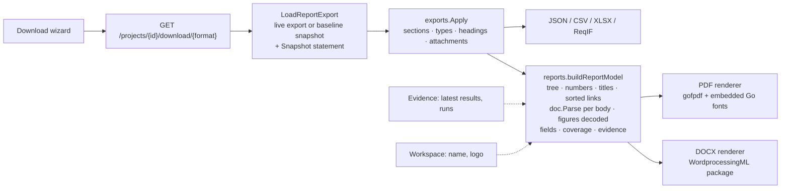

# Document downloads: the PDF specification and the Word document

How a project becomes a document, what a reader can choose, and what the
document says about itself. Companion to the route table in
`api-spec.md` and to the 2026-09-12 assessment in `assessments/`, which is
why the pipeline looks the way it does.

## The pipeline

Every download format is rendered from **one snapshot narrowed once**. The
two documents additionally share a **document model**: each artifact body is
parsed from markdown into blocks and inline runs before either renderer sees
it, so the PDF and the Word file show the same tables, lists, code, emphasis,
links and citations the editor shows.

| Package | Role |
|---|---|
| `internal/domain/reports/doc` | The document model: `Parse(markdown) []Block` with paragraphs, headings, ordered/bulleted/task lists, GFM tables, code, quotes, rules; inline runs carry bold, italic, code, strikethrough, an external URL or a `#REQ-12` / `#REQ-12-FIG-1` citation. Soft line breaks are kept, as the editor keeps them. |
| `internal/domain/reports` | `buildReportModel` (shared), `pdf_report.go`, `docx_report.go`, `vv_report.go` (the separate V&V status PDF), `options.go` (`Snapshot`, `Workspace`, `RenderOptions`). |
| `internal/domain/exports` | `Selection` and its `Content`, the template presets (`content.go`), `Fields` (the attribute keys a project holds). |
| `internal/domain/downloads` | Prepares the snapshot, applies the selection, gathers evidence and the workspace logo, hands `RenderOptions` to the renderer, zips attachments alongside. |

## What the cover says

The first page carries the **workspace logo** (Settings → Workspace logo;
PNG, JPG, GIF or WebP up to 2 MB) and name, the project title and
description, and a boxed **source statement** that is one of exactly two
sentences:

- `Snapshot: baseline "<name>" (id <uuid>) captured <date> UTC.`
- `Live project state as of <date> UTC. This is not a baseline: the project
  may have changed since.`

Under it: the generation time, the template the reader started from, a
count of what the document holds by type, and what it includes (fields,
traceability, figures, V&V status, test results). The footer of every page
repeats the project name, the baseline name or "Live <date>", and
"Page n of N". The same facts are written into the file's metadata (title,
author, subject).

## What a reader can choose

The wizard's Content step, for the PDF and Word formats:

| Choice | Query parameter | Default |
|---|---|---|
| Template preset | `template=standard\|requirements-review\|test-planning\|vv` | none |
| Sections, artifact types, headings, attachment files | `sections`, `types`, `headings=0`, `attachments` | everything, headings in, no files |
| Table of contents | `toc=0\|1` | on |
| Traceability rows under each artifact | `traceability=0\|1` | on |
| Figures embedded with captions | `figures=0\|1` | on |
| V&V status: rollup per requirement, coverage summary and gaps | `vv=0\|1` | off |
| Test results: latest result per test case, test-run appendix | `results=0\|1` | off |
| Fields (attributes) shown per artifact | `fields=all\|none\|key,key` | all |

A template sets the types and the switches; any parameter given explicitly
wins over it, and the wizard sends the switches it shows so the cover
records the starting point while the document does what the reader chose.
`GET /projects/{id}/download/options` lists the presets, the fields the
project holds (standard keys first, custom definitions and discovered keys
after, each with a count) and the defaults, so the wizard offers only what
exists.

The presets:

| Key | Keeps | Carries |
|---|---|---|
| `standard` — Specification | every type | all fields, traceability, figures, contents |
| `requirements-review` | user needs, requirements | priority, status, verification method; traceability; figures |
| `test-planning` | requirements, test cases | priority, status, verification and execution method; traceability; no figures |
| `vv` — Verification & Validation | needs, requirements, test cases, hazards | all fields, traceability, V&V rollup per requirement, latest results, coverage summary, gaps, test-run appendix |

Test evidence is live state rather than part of a baseline's snapshot: a
baseline document with results shows the results as they stand at export
time, and says so on its cover date.

## Layout rules

Both renderers keep to the rules the assessment found broken:

- nothing is measured ahead and drawn as one box; a table row is measured and
  drawn on its own, a row never splits across pages, and a table's header
  row repeats on every page it continues onto;
- a body flows across pages, so no description is dropped for its length;
- a figure is scaled to the text column (at most half a page tall) and
  captioned `Figure REQ-17-FIG-1 — original.png`; a figure that cannot be
  embedded (an SVG, an unreadable file, a corrupt upload) becomes one
  sentence, never an error;
- traceability rows, `#REF` citations in bodies and contents entries are
  links to the artifact within the document; a markdown link keeps its URL;
- links are sorted before rendering, so two renders of one snapshot are the
  same document;
- the PDF embeds the Go TrueType family (Latin, Greek, Cyrillic); text
  outside those scripts renders as a placeholder glyph. The Word document
  leaves font choice to Word and shows every script Word can.

The Word document opens with a table-of-contents field that Word fills in
on first open (`settings.xml` asks it to update fields); the PDF's contents
page is computed by rendering twice.
